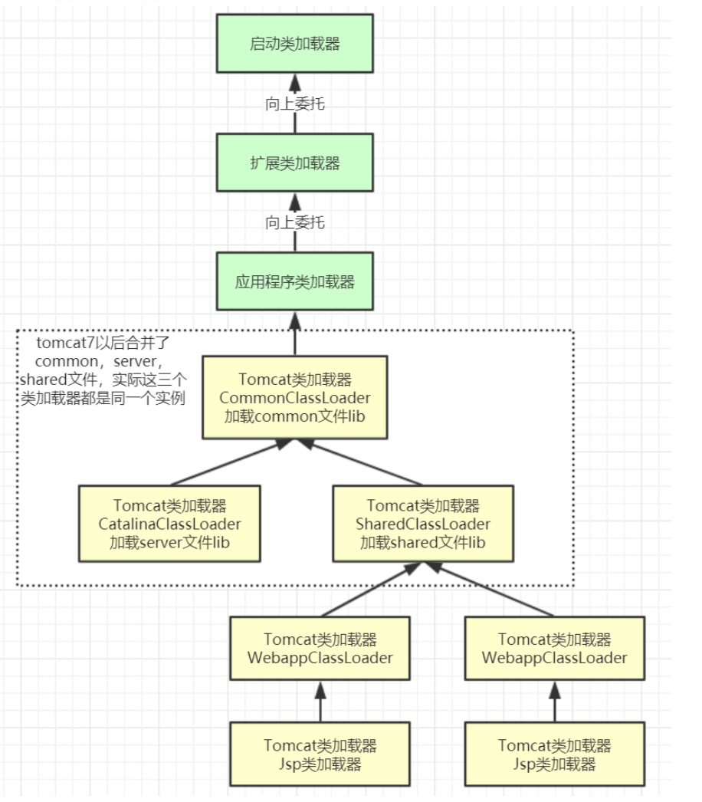

## 写在开始
我们从一个main函数来开始说明，如下
```
public class TestDynamicLoad {

    static {
        System.out.println("load TestDynamicLoad");
    }
    public static void main(String[] args) {
        A a = new A();
        System.out.println("test");
        B b = null;
    }


    static class A {

        static {
            System.out.println("load A");
        }

        public A() {
            System.out.println("initial A");
        }
    }


    static class B {

        static {
            System.out.println("load B");
        }

        public B() {
            System.out.println("initial B");
        }
    }
}
```

## 类加载运行过程
当我们运行main函数，首先需要先把主类加载进jvm，大体先后流程如下：

1 创建jvm （c++实现）

2 创建一个引导类加载器

3 然后通过c++代码发起对java代码的调用，主要是为了加载并创建jvm启动器实例（sun.misc.Launcher）

4 Launcher负责加载并创建扩展类加载器以及应用程序类加载器

5 获取运行类自己的类加载器，Launcher内部的实现是会返回应用程序类加载器，详见Launcher源码

6 应用程序类加载器完成对主类的加载(**classload.loadClass()**)，也就是我们的TestDynamicLoad

7 执行main函数

#### Launcher部分源码如下所示
 ```
 //构造方法
 public Launcher() {
         // Create the extension class loader
         ClassLoader extcl;
         try {
             extcl = ExtClassLoader.getExtClassLoader();
         } catch (IOException e) {
             throw new InternalError(
                 "Could not create extension class loader", e);
         }
 
         // Now create the class loader to use to launch the application
         try {
             loader = AppClassLoader.getAppClassLoader(extcl);
         } catch (IOException e) {
             throw new InternalError(
                 "Could not create application class loader", e);
         }
 
         // Also set the context class loader for the primordial thread.
         Thread.currentThread().setContextClassLoader(loader);
 
         // Finally, install a security manager if requested
         String s = System.getProperty("java.security.manager");
         if (s != null) {
             SecurityManager sm = null;
             if ("".equals(s) || "default".equals(s)) {
                 sm = new java.lang.SecurityManager();
             } else {
                 try {
                     sm = (SecurityManager)loader.loadClass(s).newInstance();
                 } catch (IllegalAccessException e) {
                 } catch (InstantiationException e) {
                 } catch (ClassNotFoundException e) {
                 } catch (ClassCastException e) {
                 }
             }
             if (sm != null) {
                 System.setSecurityManager(sm);
             } else {
                 throw new InternalError(
                     "Could not create SecurityManager: " + s);
             }
         }
     }
 
 /*
      * Returns the class loader used to launch the main application.
      */
     public ClassLoader getClassLoader() {
         return loader;
     }
 ```
 
 ### loadClass的大体流程
 
加载 >> 验证 >> 准备 >> 解析 >> 初始化 >> 使用 >> 卸载

- 加载：通过IO读入字节码文件，使用到类时才会加载，例如调用类的 main()方法，new对象等等，在加载阶段会在内存中生成一个代表这个类的 java.lang.Class对象，作为方法区这个类的各种数据的访问入口

- 验证：校验字节码文件的正确性

- 准备：给类的静态变量分配内存，并赋予默认值，基本数据类型为默认值，引用类型为null

- 解析：将符号引用替换为直接引用，主要是把静态方法所代表的的符号引用指向具体的内存地址的指针或句柄，即静态链接的过程，注意动态链接的过程不在这一步完成，
比如方法内部的方法调用就是动态链接来完成的

- 初始化：对类的静态变量初始化为指定的值，执行静态代码块

注意，主类在运行过程中如果使用到其它类，会逐步加载这些类。 jar包或war包里的类不是一次性全部加载的，是使用到时才加载。


类被加载到方法区中后主要包含**运行时常量池**、**类型信息**、**字段信息**、**方法信息**、**类加载器的引用**、**对应class实例的引用**等信息。

**类加载器的引用**:这个类到类加载器实例的引用
 
**对应class实例的引用**:类加载器在加载类信息放到方法区中后，会创建一个对应的Class 类型的 对象实例放到堆(Heap)中, 作为开发人员访问方法区中类定义的入口和切入点。


### 类加载器和双亲委派机制

java里面主要有以下几类类加载器
 - 引导类加载器:负责加载支撑JVM运行的位于JRE的lib目录下的核心类库
 - 扩展类加载器:负责加载支撑JVM运行的位于JRE的lib目录下的ext扩展目录中的JAR 类包
 - 应用程序类加载器:负责加载ClassPath路径下的类包，主要就是加载你自己写的那 些类
 - 自定义加载器:负责加载用户自定义路径下的类包
 
 
#### 双亲委派机制的源码实现 ：ClassLoad.loadClass
 
```
protected Class<?> loadClass(String name, boolean resolve)
        throws ClassNotFoundException
    {
        synchronized (getClassLoadingLock(name)) {
            // First, check if the class has already been loaded
            Class<?> c = findLoadedClass(name);
            if (c == null) {
                long t0 = System.nanoTime();
                try {
                    if (parent != null) {
                        c = parent.loadClass(name, false);
                    } else {
                        c = findBootstrapClassOrNull(name);
                    }
                } catch (ClassNotFoundException e) {
                    // ClassNotFoundException thrown if class not found
                    // from the non-null parent class loader
                }

                if (c == null) {
                    // If still not found, then invoke findClass in order
                    // to find the class.
                    long t1 = System.nanoTime();
                    c = findClass(name);

                    // this is the defining class loader; record the stats
                    sun.misc.PerfCounter.getParentDelegationTime().addTime(t1 - t0);
                    sun.misc.PerfCounter.getFindClassTime().addElapsedTimeFrom(t1);
                    sun.misc.PerfCounter.getFindClasses().increment();
                }
            }
            if (resolve) {
                resolveClass(c);
            }
            return c;
        }
    }

```
大体逻辑如下:
1. 首先，检查一下指定名称的类是否已经加载过，如果加载过了，就不需要再加载，直接 返回。
2. 如果此类没有加载过，那么，再判断一下是否有父加载器;如果有父加载器，则由父加 载器加载(即调用parent.loadClass(name, false);).或者是调用bootstrap类加载器来加 载。
3. 如果父加载器及bootstrap类加载器都没有找到指定的类，那么调用当前类加载器的 findClass方法来完成类加载。

#### 为什么要设计双亲委派机制?
- 沙箱安全机制:自己写的java.lang.String.class类不会被加载，这样便可以防止核心API库被随意篡改
- 避免类的重复加载:当父亲已经加载了该类时，就没有必要子ClassLoader再加载一次，保证被加载类的唯一性

#### 全盘负责委托机制
"全盘负责"是指当一个ClassLoder装载一个类时，除非显示的使用另外一个ClassLoder，该类 所依赖及引用的类也由这个ClassLoder载入。

### 自定义类加载器
自定义类加载器只需要继承 java.lang.ClassLoader 类，该类有两个核心方法，一个是loadClass(String, boolean)，它实现了双亲委派机制，还有一个方法是findClass，默认实现是空方法，所以我们自定义类加载器主要是重写findClass方法。

#### 普通实现
```
public class CustomClassLoader extends ClassLoader {
    private String classLoaderName;

    //类的扩展名
    private final String fileExtension = ".class";

    private  String path;

    public void setPath(String path){
        this.path = path;
    }

    public CustomClassLoader(String classLoaderName){
        //使用方法getSystemClassLoader（）返回的ClassLoader作为父类加载器创建新的类加载器
        super();
        this.classLoaderName = classLoaderName;
    }

    public CustomClassLoader(String classLoaderName, ClassLoader parent){
        //使用指定的父类加载器创建新的类加载器以进行委派
        super(parent);
        this.classLoaderName = classLoaderName;
    }


    @Override
    protected Class<?> findClass(String className) throws ClassNotFoundException{
        System.out.println("findClass invoked: " + className);
        System.out.println("class loader name: " + this.classLoaderName);
        byte[] data = this.loadClassDate(className);
        return this.defineClass(className, data, 0, data.length);
    }

    private byte[] loadClassDate(String name) {
        InputStream is = null;
        byte[] data = null;
        ByteArrayOutputStream baos = null;

        try {
            //转换为磁盘对应的地址
            name = name.replace(".", "/");
            is = new FileInputStream(new File(this.path + name + this.fileExtension));
            baos = new ByteArrayOutputStream();

            int ch = 0;
            while ((ch = is.read()) != -1) {
                baos.write(ch);
            }
            data = baos.toByteArray();
        } catch (Exception e) {
            e.printStackTrace();
        } finally {
            try {
                is.close();
                baos.close();
            } catch (Exception e) {
                e.printStackTrace();
            }
        }
        return data;
    }
}

```

#### 打破双亲委派机制的类加载实现

打破双亲委派主要的思路就是重写loadClass方法，不进行直接委派给父类加载，这里实现了URLClassLoader，主要是为了加载指定路径下的jar文件
```
public class MyClassLoader extends URLClassLoader {

    private ClassLoader parent;

    public MyClassLoader(URL[] urls) {
        super(urls);
    }

    public MyClassLoader(URL[] urls, ClassLoader parent) {
        super(urls, parent);
    }

    @Override
    public Class<?> loadClass(String name) throws ClassNotFoundException {
        return loadClass(name, false);
    }

    @Override
    protected Class<?> loadClass(String name, boolean resolve) throws ClassNotFoundException {
        synchronized (getClassLoadingLock(name)) {
            Class<?> c = null;
            
            //do not let plugin classloader load system classes
            if (name.startsWith("com.xinxian.myclassload.test")) {
                if (parent != null) {
                    c = parent.loadClass(name);
                } else {
                    try {
                        c = Class.forName(name);
                    } catch (Throwable ex) {
                        //ignore it
                    }
                }
            }
            
            if (c == null) {
                // First, check if the class has already been loaded
                c = findLoadedClass(name);
                try {
                    if (c == null) {
                        c = findClass(name);
                    }
                } catch (ClassNotFoundException e) {
                    // ClassNotFoundException thrown if class not found
                    // from the non-null parent class loader
                }
            }

            if (c == null) {
                if (parent != null) {
                    c = parent.loadClass(name);
                } else {
                    c = Class.forName(name);
                }
            }

            if (resolve) {
                resolveClass(c);
            }

            return c;
        }
    }

}
```

#### Tomcat自定义类加载器概览


WebappClassLoader:各个Webapp私有的类加载器，加载路径中的class只对当前Webapp可见，比如加载war包里相关的类，每个war包应用都有自己的WebappClassLoader，
实现相互隔离，比如不同war包应用引入了不同的spring版本， 这样实现就能加载各自的spring版本,每个webappClassLoader加载自己的目录下的class文件，不会传递给父类加载器，打破了双亲委 派机制。


