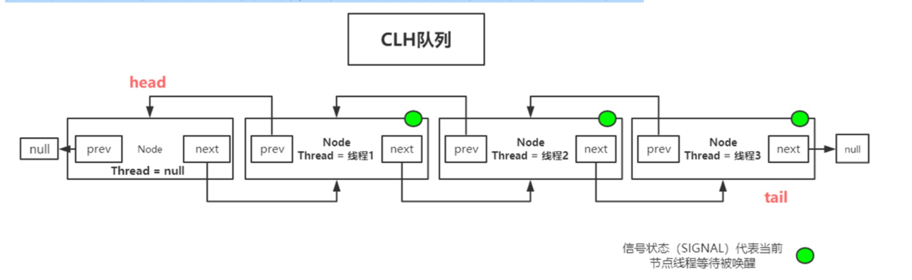
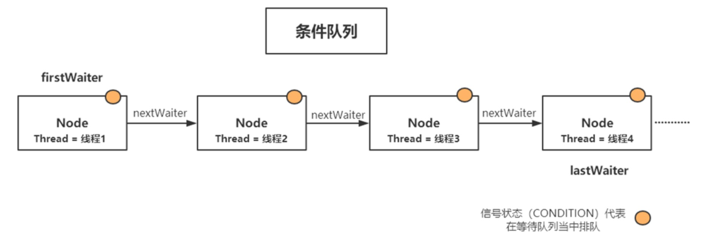
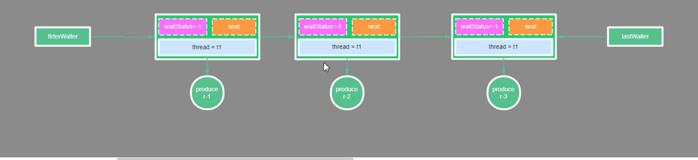

Java并发编程核心在于java.concurrent.util包而juc当中的大多数同步器实现都是围绕 着共同的基础行为，比如等待队列、条件队列、独占获取、共享获取等，
而这个行为的抽象 就是基于AbstractQueuedSynchronizer简称AQS，AQS定义了一套多线程访问共享资源 的同步器框架，是一个依赖状态(state)的同步器。

## ReentrantLock
ReentrantLock是一种基于AQS框架的应用实现，是JDK中的一种线程并发访问的同步手段，它的功能类似于synchronized是一种互斥锁，可以保证线程安全。
而且它具有比 synchronized更多的特性，比如它支持手动加锁与解锁，支持加锁的公平性。

ReentrantLock如何实现synchronized不具备的公平与非公平性呢? 在ReentrantLock内部定义了一个Sync的内部类，该类继承AbstractQueuedSynchronized，对 该抽象类的部分方法做了实现;并且还定义了两个子类:
1、FairSync 公平锁的实现

2、NonfairSync 非公平锁的实现

这两个类都继承自Sync，也就是间接继承了AbstractQueuedSynchronized，所以这一个 ReentrantLock同时具备公平与非公平特性。 

AQS主要涉及的设计模式:**模板模式**-子类根据需要做具体业务实现

## AQS具备特性
- 阻塞等待队列

- 共享/独占

- 公平/非公平

- 可重入

- 允许中断

除了Lock外，Java.concurrent.util当中同步器的实现如Latch,Barrier,BlockingQueue等， 都是基于AQS框架实现
- 一般通过定义内部类Sync继承AQS

- 将同步器所有调用都映射到Sync对应的方法

AQS内部维护属性volatile int state (32位)：state表示资源的可用状态

State三种访问方式：getState()、setState()、compareAndSetState()

AQS定义两种资源共享方式：
1 Exclusive-独占，只有一个线程能执行，如ReentrantLock

2 Share-共享，多个线程可以同时执行，如Semaphore/CountDownLatch

AQS定义两种队列
1. 同步等待队列

2.条件等待队列

不同的自定义同步器争用共享资源的方式也不同。自定义同步器在实现时只需要实现共 享资源state的获取与释放方式即可，至于具体线程等待队列的维护(如获取资源失败入队/ 唤醒出队等)，AQS已经在顶层实现好了。自定义同步器实现时主要实现以下几种方法:

- **isHeldExclusively()**:该线程是否正在独占资源。只有用到condition才需要去实现它。

- **tryAcquire(int)**:独占方式。尝试获取资源，成功则返回true，失败则返回 false。

- **tryRelease(int)**:独占方式。尝试释放资源，成功则返回true，失败则返回 false。

- **tryAcquireShared(int)**:共享方式。尝试获取资源。负数表示失败;0表示成 功，但没有剩余可用资源;正数表示成功，且有剩余资源。

- **tryReleaseShared(int)**:共享方式。尝试释放资源，如果释放后允许唤醒后续 等待结点返回true，否则返回false。

## 同步等待队列
AQS当中的同步等待队列也称CLH队列，CLH队列是Craig、Landin、Hagersten三人发明的一种基于双向链表数据结构的队列，是FIFO先入先出线程等待队列，
Java中的CLH 队列是原CLH队列的一个变种,线程由原自旋机制改为阻塞机制。

注意：头结点的thread为空的原因是因为方便回收，因为head本身就是已经获取到锁了，在aqs的锁持有里本身就有记录，那么在头节点这里就没必要记录了。

## 条件等待队列
Condition是一个多线程间协调通信的工具类，使得某个，或者某些线程一起等待某个条件(Condition),只有当该条件具备时，这些等待线程才会被唤醒，从而重新争夺锁



## AQS关键点杂记

### AQS关键点
- 自旋（入队或者加锁）

- 挂起阻塞（LockSupport）

- CAS（加锁），CAS依赖汇编指令：cmpxchg()

- 队列


### 加锁伪代码
```
lock.lock() //加锁
    while(true){
        if（cas加锁成功){//cas->比较与交换compare and swap，
            break;跳出循环
        }
       
        HashSet，LikedQueued(),
        HashSet.add(Thread)
            LikedQueued.put(Thread)
        阻塞。
        LockSupport.park();
        
    }

```

### 解锁伪代码

```
lock.unlock() //解锁
Thread  t= HashSet.get()
Thread  t = LikedQueued.take();
LockSupport.unpark(t)；
```

###  enq（）
```
 /**
     * Inserts node into queue, initializing if necessary. See picture above.
     * @param node the node to insert
     * @return node's predecessor
     */
    private Node enq(final Node node) {
        for (;;) {
            Node t = tail;
            if (t == null) { // Must initialize
                if (compareAndSetHead(new Node()))
                    tail = head;
            } else {
                node.prev = t;
                if (compareAndSetTail(t, node)) {
                    t.next = node;
                    return t;
                }
            }
        }
    }
```
1.初始化队列

2.自旋入队，保证必须要入队成功，不然如果没有成功入队，那么这个线程就永远不能被唤醒

### acquireQueued（）

```
 /**
     * Acquires in exclusive uninterruptible mode for thread already in
     * queue. Used by condition wait methods as well as acquire.
     *
     * @param node the node
     * @param arg the acquire argument
     * @return {@code true} if interrupted while waiting
     */
    final boolean acquireQueued(final Node node, int arg) {
        boolean failed = true;
        try {
            boolean interrupted = false;
            for (;;) {
                final Node p = node.predecessor();
                if (p == head && tryAcquire(arg)) {
                    setHead(node);
                    p.next = null; // help GC
                    failed = false;
                    return interrupted;
                }
                if (shouldParkAfterFailedAcquire(p, node) &&
                    parkAndCheckInterrupt())
                    interrupted = true;
            }
        } finally {
            if (failed)
                cancelAcquire(node);
        }
    }
    
    /**
         * Checks and updates status for a node that failed to acquire.
         * Returns true if thread should block. This is the main signal
         * control in all acquire loops.  Requires that pred == node.prev.
         *
         * @param pred node's predecessor holding status
         * @param node the node
         * @return {@code true} if thread should block
         */
        private static boolean shouldParkAfterFailedAcquire(Node pred, Node node) {
            int ws = pred.waitStatus;
            if (ws == Node.SIGNAL)
                /*
                 * This node has already set status asking a release
                 * to signal it, so it can safely park.
                 */
                return true;
            if (ws > 0) {
                /*
                 * Predecessor was cancelled. Skip over predecessors and
                 * indicate retry.
                 */
                do {
                    node.prev = pred = pred.prev;
                } while (pred.waitStatus > 0);
                pred.next = node;
            } else {
                /*
                 * waitStatus must be 0 or PROPAGATE.  Indicate that we
                 * need a signal, but don't park yet.  Caller will need to
                 * retry to make sure it cannot acquire before parking.
                 */
                compareAndSetWaitStatus(pred, ws, Node.SIGNAL);
            }
            return false;
        }
        
        /**
             * Convenience method to park and then check if interrupted
             *
             * @return {@code true} if interrupted
             */
            private final boolean parkAndCheckInterrupt() {
                LockSupport.park(this);
                return Thread.interrupted();
            }

```

1.如果入队是第一个，那么先尝试获取锁，减少用户态和内核态的切换（线程的山下午切换）
如果可以获取到，那么节点就不挂起阻塞，线程出队，head节点指向当前节点，thread = null，原head节点等待gc清楚，新的头节点就是当前节点。

2、不能获取到，阻塞等待被唤醒
    	1.首先第1轮循环、修改head的状态，修改成sinal=-1标记处可以被唤醒.
    	
    	2.第2轮循环，阻塞线程，并且需要判断线程是否是有中断信号唤醒的！
    	
    	shouldParkAfterFailedAcquire(p, node)
    waitestate = 0 - > -1 head节点为什么改到-1，因为持有锁的线程T0在释放锁的时候，得判断head节点的waitestate是否!=0,如果！=0成立，会再把waitstate = -1->0,要想唤醒排队的第一个线程T1，T1被唤醒再接着走循环，去抢锁，可能会再失败（在非公平锁场景下），此时可能有线程T3持有了锁！T1可能再次被阻塞，head的节点状态需要再一次经历两轮循环：waitState = 0 -> -1
    
    
3.Park阻塞线程唤醒有两种方式：
      1、中断
      
      2、release()
      
### 节点重要属性（Node）
1.pre

2.next

3.thread

4.waitstatus：节点的生命状态，信号量（signal = -1：可被唤醒，cancelled= 1：出现异常，中断引起的，需要被废弃，condition = -1:条件等待,propagate = -3：传播）

5 nextwaiter 在构建条件队列是有用

### 如何支持可中断
LockSupport.park可以支持通过thread.interrupt来唤醒，第二点是因为lock.lockinterrupt()会抛出interrupt异常

### 条件队列（单向的队列）


### aqs的共享模式
通过state的值来控制，共享模式的state的值大于1，比如semaphare内的构造函数就是传一个正整数来标识同一时间可以占用锁的线程数，即共享线程数。

## ReentrantLock中关于AbstractQueuedSynchronized的流程


