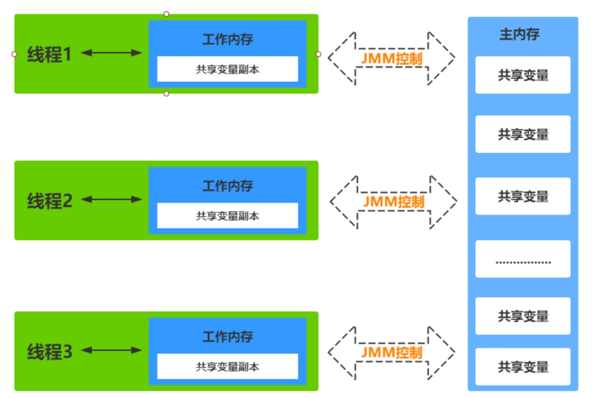
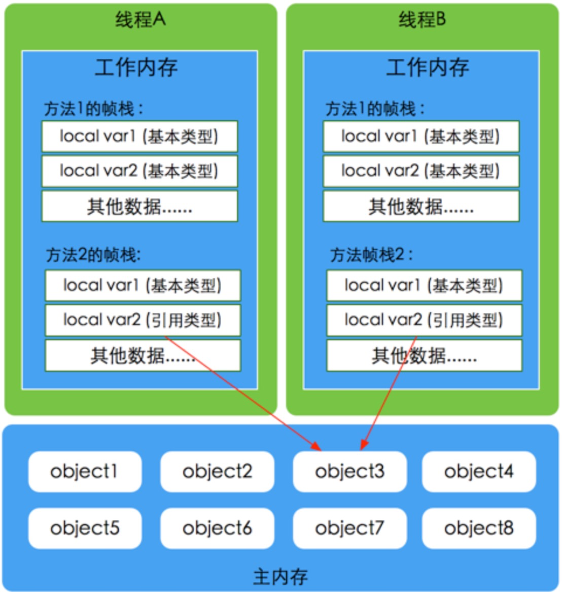
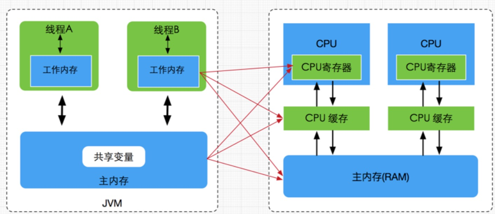
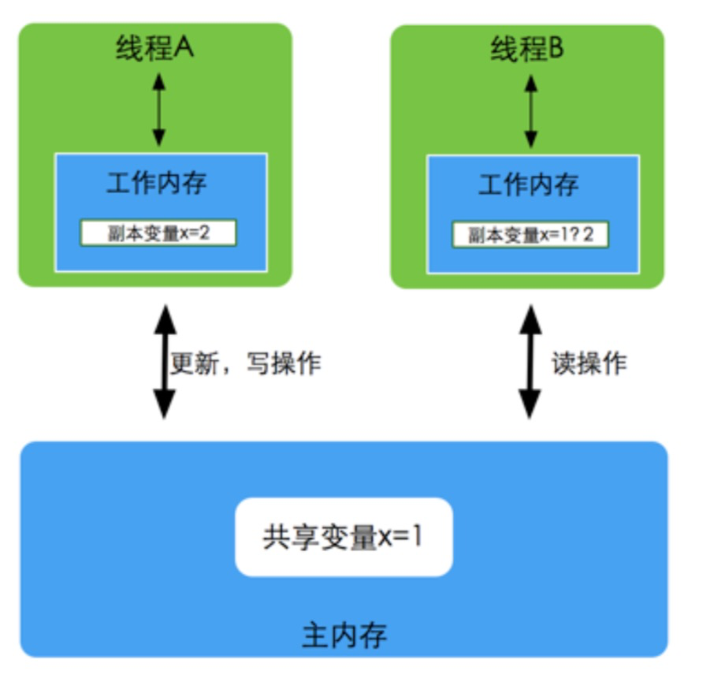
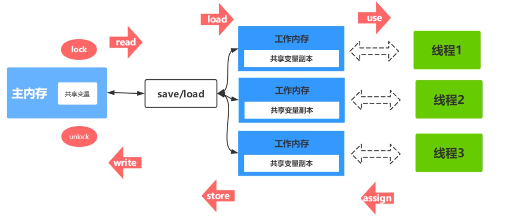

### 什么是JMM模型?
Java内存模型(Java Memory Model简称JMM)是一种抽象的概念，并不真实存在，它描述的是一组规则或规范，
通过这组规范定义了程序中各个变量(包括实例字段，静态字段 和构成数组对象的元素)的访问方式。JVM运行程序的实体是线程，
而每个线程创建时JVM都会为其创建一个工作内存(有些地方称为栈空间)，用于存储线程私有的数据，而Java 内存模型中规定所有变量都存储在主内存，
主内存是共享内存区域，所有线程都可以访问， 但线程对变量的操作(读取赋值等)必须在工作内存中进行，首先要将变量从主内存拷贝的自 己的工作内存空间，
然后对变量进行操作，操作完成后再将变量写回主内存，不能直接操作 主内存中的变量，工作内存中存储着主内存中的变量副本拷贝，前面说过，
工作内存是每个线程的私有数据区域，因此不同的线程间无法访问对方的工作内存，线程间的通信(传值)必 须通过主内存来完成。

### JMM不同于JVM内存区域模型
JMM与JVM内存区域的划分是不同的概念层次，更恰当说JMM描述的是一组规则，通过这组规则控制程序中各个变量在共享数据区域和私有数据区域的访问方式，
**JMM是围绕 原子性，有序性、可见性展开**。JMM与Java内存区域唯一相似点，都存在共享数据区域和私有数据区域，在JMM中**主内存**属于共享数据区域，
从某个程度上讲应该包括了**堆和方法区**，而**工作内存**数据线程私有数据区域，从某个程度上讲则应该包括**程序计数器、虚拟机栈 以及本地方法栈**。

### 线程，工作内存，主内存工作交互图(基于JMM规范)

#### 主内存
主要存储的是Java实例对象，所有线程创建的实例对象都存放在主内存中，不管该实例 对象是成员变量还是方法中的本地变量(也称局部变量)，当然也包括了共享的类信息、常 量、静态变量。由于是共享数据区域，多条线程对同一个变量进行访问可能会发生线程安全 问题。

#### 工作内存
主要存储当前方法的所有本地变量信息(工作内存中存储着主内存中的变量副本拷贝)，每个线程只能访问自己的工作内存，即线程中的本地变量对其它线程是不可见的，
就算是两个线程执行的是同一段代码，它们也会各自在自己的工作内存中创建属于当前线程的本地变量，当然也包括了字节码行号指示器、相关Native方法的信息。注意由于工作内存是每个线程的私有数据，线程间无法相互访问工作内存，因此存储在工作内存的数据不存在线程安 全问题。

根据JVM虚拟机规范主内存与工作内存的数据存储类型以及操作方式，对于一个实例对 象中的成员方法而言，如果方法中包含本地变量是基本数据类型 (boolean,byte,short,char,int,long,float,double)，
将直接存储在工作内存的帧栈结构中，但倘若本地变量是引用类型，那么该变量的引用会存储在功能内存的帧栈中，而对象实例将存储在主内存(共享数据区域，堆)中。
但对于实例对象的成员变量，不管它是基本数据 类型或者包装类型(Integer、Double等)还是引用类型，都会被存储到堆区。至于static变 量以及类本身相关信息将会存储在主内存中。
需要注意的是，在主内存中的实例对象可以被多线程共享，倘若两个线程同时调用了同一个对象的同一个方法，那么两条线程会将要操作的数据拷贝一份到自己的工作内存中，执行完成操作后才刷新到主内存
**模型如下图所示**

#### Java内存模型与硬件内存架构的关系
通过对前面的硬件内存架构、Java内存模型以及Java多线程的实现原理的了解，我们应该已经意识到，多线程的执行最终都会映射到硬件处理器上进行执行，
但Java内存模型和硬 件内存架构并不完全一致。对于硬件内存来说只有寄存器、缓存内存、主内存的概念，并没有工作内存(线程私有数据区域)和主内存(堆内存)之分，
也就是说Java内存模型对内存的划 分对硬件内存并没有任何影响，因为JMM只是一种抽象的概念，是一组规则，并不实际存在，不管是工作内存的数据还是主内存的数据，
对于计算机硬件来说都会存储在计算机主内 存中，当然也有可能存储到CPU缓存或者寄存器中，因此总体上来说，Java内存模型和计算 机硬件内存架构是一个相互交叉的关系，
是一种抽象概念划分与真实物理硬件的交叉。

### JMM存在的必要性
由于JVM运行程序的实体是线 程，而每个线程创建时JVM都会为其创建一个工作内存(有些地方称为栈空间)，用于存储线程私有的数据，线程与主内存中的变量操作必须通过工作内存间接完成，
主要过程是将变量 从主内存拷贝的每个线程各自的工作内存空间，然后对变量进行操作，操作完成后再将变量 写回主内存，如果存在两个线程同时对一个主内存中的实例对象的变量进行操作就有可能诱 发线程安全问题。

以上关于主内存与工作内存之间的具体交互协议，即一个变量如何从主内存拷贝到工作 内存、如何从工作内存同步到主内存之间的实现细节，Java内存模型定义了以下八种操作来完成。

### 数据同步八大原子操作

(1)**lock(锁定)**:作用于主内存的变量，把一个变量标记为一条线程独占状态

(2)**unlock(解锁)**:作用于主内存的变量，把一个处于锁定状态的变量释放出来，释放后 的变量才可以被其他线程锁定 

(3)**read(读取)**:作用于主内存的变量，把一个变量值从主内存传输到线程的工作内存中，以便随后的load动作使用
 
(4)**load(载入)**:作用于工作内存的变量，它把read操作从主内存中得到的变量值放入工 作内存的变量副本中 

(5)**use(使用)**:作用于工作内存的变量，把工作内存中的一个变量值传递给执行引擎 

(6)**assign(赋值)**:作用于工作内存的变量，它把一个从执行引擎接收到的值赋给工作内 存的变量 

(7)**store(存储)**:作用于工作内存的变量，把工作内存中的一个变量的值传送到主内存 中，以便随后的write的操作 

(8)**write(写入)**:作用于工作内存的变量，它把store操作从工作内存中的一个变量的值 传送到主内存的变量中

### 并发编程的可见性，原子性与有序性问题

#### 原子性
原子性指的是一个操作是不可中断的，即使是在多线程环境下，一个操作一旦开始就不会被其他线程影响。在java中，对基本数据类型的变量的读取和赋值操作是原子性操作有点要注意的是，对 于32位系统的来说，long类型数据和double类型数据(对于基本数据类型，byte,short,int,float,boolean,char读写是原子操作)，
它们的读写并非原子性的，也就是说 如果存在两条线程同时对long类型或者double类型的数据进行读写是存在相互干扰的，因 为对于32位虚拟机来说，每次原子读写是32位的，而long和double则是64位的存储单元， 
这样会导致一个线程在写时，操作完前32位的原子操作后，轮到B线程读取时，恰好只读取到了后32位的数据，这样可能会读取到一个既非原值又不是线程修改值的变量，它可能 是“半个变量”的数值，即64位数据被两个线程分成了两次读取。但也不必太担心，因为 读取到“半个变量”的情况比较少见，至少在目前的商用的虚拟机中，几乎都把64位的数 据的读写操作作为原子操作来执行，因此对于这个问题不必太在意，知道这么回事即可。

#### 可见性
理解了指令重排现象后，可见性容易了，可见性指的是当一个线程修改了某个共享变量的值，其他线程是否能够马上得知这个修改的值。对于串行程序来说，可见性是不存在的，
因为我们在任何一个操作中修改了某个变量的值，后续的操作中都能读取这个变量值，并且是修改过的新值。

#### 有序性
有序性是指对于单线程的执行代码，我们总是认为代码的执行是按顺序依次执行的，这样的理解并没有毛病，毕竟对于单线程而言确实如此，但对于多线程环境，
则可能出现乱序 现象，因为程序编译成机器码指令后可能会出现指令重排现象，重排后的指令与原指令的顺 序未必一致，要明白的是，在Java程序中，
倘若在本线程内，所有操作都视为有序行为，如 果是多线程环境下，一个线程中观察另外一个线程，所有操作都是无序的，前半句指的是单 线程内保证串行语义执行的一致性，
后半句则指指令重排现象和工作内存与主内存同步延迟 现象。

### JMM如何解决原子性&可见性&有序性问题

#### 原子性问题
除了JVM自身提供的对基本数据类型读写操作的原子性外，可以通过 synchronized和Lock实现原子性。

#### 可见性问题
volatile关键字保证可见性。synchronized和Lock也可以保证可见性，因为它们可以保证任一时刻只有一个 线程能访问共享资源，并在其释放锁之前将修改的变量刷新到内存中。

#### 有序性问题
在Java里面，可以通过volatile关键字来保证一定的“有序性”(具体原理在下一节讲述volatile关键字)。另外可以通过synchronized和Lock来保证有序性，很显然， synchronized和Lock保证每个时刻是有一个线程执行同步代码，相当于是让线程顺序执行 同步代码，自然就保证了有序性。

#### Java内存模型提供一定的先天有序性
每个线程都有自己的工作内存(类似于前面的高速缓存)。线程对变 量的所有操作都必须在工作内存中进行，而不能直接对主存进行操作。并且每个线程不能访 问其他线程的工作内存。Java内存模型具备一些先天的“有序性”，即不需要通过任何手段 就能够得到保证的有序性，这个通常也称为**happens-before** 原则。如果两个操作的执行次 序无法从happens-before原则推导出来，那么它们就不能保证它们的有序性，虚拟机可以 随意地对它们进行重排序。

#### 指令重排序
java语言规范规定JVM线程内部维持顺序化语义。即只要程序的最终结果 与它顺序化情况的结果相等，那么指令的执行顺序可以与代码顺序不一致，此过程叫指令的 重排序。指令重排序的意义是什么?JVM能根据处理器特性(CPU多级缓存系统、多核处 理器等)适当的对机器指令进行重排序，使机器指令能更符合CPU的执行特性，最大限度的 发挥机器性能。

从源码到最终执行的指令序列流程: 源代码 -》 编译器的优化重排序 -》 指令级的并行重排序 -》内存系统的重排序 -》 最终执行的指令序列
   
#### as-if-serial语义
as-if-serial语义的意思是:不管怎么重排序(编译器和处理器为了提高并行度)，(单线程)程序的执行结果不能被改变。编译器、runtime和处理器都必须遵守as-if-serial语义。
为了遵守as-if-serial语义，编译器和处理器不会对存在数据依赖关系的操作做重排序， 因为这种重排序会改变执行结果。但是，如果操作之间不存在数据依赖关系，
这些操作就可 能被编译器和处理器重排序。

#### happens-before 原则
只靠sychronized和volatile关键字来保证原子性、可见性以及有序性，那么编写并发 程序可能会显得十分麻烦，幸运的是，从JDK 5开始，Java使用新的JSR-133内存模型，
提供了happens-before 原则来辅助保证程序执行的原子性、可见性以及有序性的问题，它是判断数据是否存在竞争、线程是否安全的依据，happens-before 原则内容如下

1. 程序顺序原则，即在一个线程内必须保证语义串行性，也就是说按照代码顺序执 行。

2. 锁规则 解锁(unlock)操作必然发生在后续的同一个锁的加锁(lock)之前。

3. volatile规则 volatile变量的写，先发生于读。

4. 线程启动规则 线程的start()方法先于它的每一个动作。

5. 传递性 A先于B ，B先于C 那么A必然先于C

6. 线程终止规则 线程的所有操作先于线程的终结

7. 线程中断规则 对线程 interrupt()方法的调用先行发生于被中断线程的代码检测到 中断事件的发生，可以通过Thread.interrupted()方法检测线程是否中断。

8. 对象终结规则对象的构造函数执行，结束先于finalize()方法

### volatile内存语义

volatile是Java虚拟机提供的轻量级的同步机制。volatile关键字有如下两个作用

- 保证被volatile修饰的共享变量对所有线程总数可见的，也就是当一个线程修改了一个被volatile修饰共享变量的值，新值总是可以被其他线程立即得知。

- 禁止指令重排序优化。

- volatile无法保证原子性

#### volatile禁止重排优化实现
volatile关键字另一个作用就是禁止指令重排优化，从而避免多线程环境下程序出现乱序执行的现象，关于指令重排优化前面已详细分析过，这里主要简单说明一下volatile是如 何实现禁止指令重排优化的。先了解一个概念，内存屏障(Memory Barrier)。

#### 硬件层的内存屏障
Intel硬件提供了一系列的内存屏障，主要有:

1. lfence，是一种Load Barrier 读屏障

2. sfence, 是一种Store Barrier 写屏障

3. mfence, 是一种全能型的屏障，具备ifence和sfence的能力

4. Lock前缀，Lock不是一种内存屏障，但是它能完成类似内存屏障的功能。Lock会对 CPU总线和高速缓存加锁，可以理解为CPU指令级的一种锁。它后面可以跟ADD, ADC, AND, BTC, BTR, BTS, CMPXCHG, CMPXCH8B, DEC, INC, NEG, NOT, OR, SBB, SUB, XOR, XADD, and XCHG等指令。

不同硬件实现内存屏障的方式不同，Java内存模型屏蔽了这种底层硬件平台的差异，由 JVM来为不同的平台生成相应的机器码。 JVM中提供了四类内存屏障指令:

- LoadLoad （Load1; LoadLoad; Load2）：保证load1的读取操作在load2及后续读取操作之前执行

- StoreStore （Store1; StoreStore; Store2）：在store2及其后的写操作执行前，保证store1的写操作

- LoadStore （Load1; LoadStore; Store2）：

- StoreLoad（Store1; StoreLoad; Load2） ：

内存屏障，又称内存栅栏，是一个CPU指令，它的作用有两个，一是保证特定操作的执 行顺序，二是保证某些变量的内存可见性(利用该特性实现volatile的内存可见性)。
由于编译器和处理器都能执行指令重排优化。如果在指令间插入一条Memory Barrier则会告诉 编译器和CPU，不管什么指令都不能和这条Memory Barrier指令重排序，
也就是说通过插 入内存屏障禁止在内存屏障前后的指令执行重排序优化。Memory Barrier的另外一个作用 是强制刷出各种CPU的缓存数据，因此任何CPU上的线程都能读取到这些数据的最新版本。 
总之，volatile变量正是通过内存屏障实现其在内存中的语义，即可见性和禁止重排优化。

