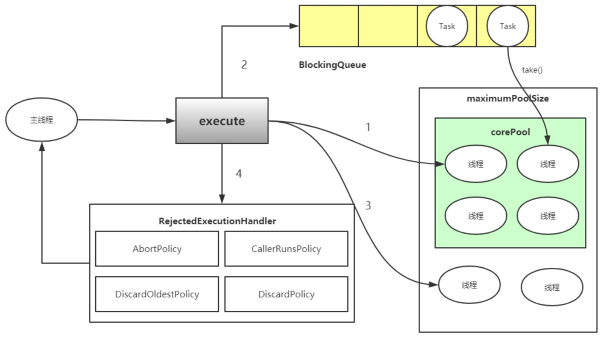

## 线程
线程是调度CPU资源的最小单位，线程模型分为KLT模型与ULT模型，JVM使用的KLT模
型，Java线程与OS线程保持1:1的映射关系，也就是说有一个java线程也会在操作系统里有
一个对应的线程。Java线程有多种生命状态

- NEW 新建

- RUNNABLE 运行

- BLOCKED 阻塞

- WAITING 等待

- TIMED_WAITING 超时等待

- TERMINATED 终结

线程状态切换如下图所示：


## 协程
协程 (纤程，用户级线程)，目的是为了追求最大力度的发挥硬件性能和提升软件的速度，协程基本原理是:在某个点挂起当前的任务，并且保存栈信息，
去执行另一个任务;等完成或达到某个条件时，再还原原来的栈信息并继续执行(整个过程线程不需要上下文切换)。
`Java原生不支持协程，在纯java代码里需要使用协程的话需要引入第三方包,如:quasar`

## 线程池
“线程池”，顾名思义就是一个线程缓存，线程是稀缺资源，如果被无限制的创建，不 仅会消耗系统资源，还会降低系统的稳定性，因此Java中提供线程池对线程进行统一分配、 调优和监控.

#### 线程池介绍
在web开发中，服务器需要接受并处理请求，所以会为一个请求来分配一个线程来进行 处理。如果每次请求都新创建一个线程的话实现起来非常简便，但是存在一个问题:

**如果并发的请求数量非常多，但每个线程执行的时间很短，这样就会频繁的创建和销毁线程，如此一来会大大降低系统的效率。可能出现服务器在为每个请求创建新线程和销毁线程上花费的时间和消耗的系统资源要比处理实际的用户请求的时间和资源更多。**

#### 什么时候使用线程池?
- 单个任务处理时间比较短
- 需要处理的任务数量很大

#### 线程池优势
- 重用存在的线程，减少线程创建，消亡的开销，提高性能
- 提高响应速度。当任务到达时，任务可以不需要的等到线程创建就能立即执行。
- 提高线程的可管理性。线程是稀缺资源，如果无限制的创建，不仅会消耗系统资源，还会降低系统的稳定性，使用线程池可以进行统一的分配，调优和监控。

## Executor框架
Executor接口是线程池框架中最基础的部分，定义了一个用于执行Runnable的execute方法。

下图为它的继承与实现


从图中可以看出Executor下有一个重要子接口ExecutorService，其中定义了线程池的具体行为.

1.execute(Runnable command):履行Ruannable类型的任务

2.submit(task):可用来提交Callable或Runnable任务，并返回代表此任务的Future对象

3.shutdown():在完成已提交的任务后封闭办事，不再接管新任务

4.shutdownNow():停止所有正在履行的任务并封闭办事

5.isTerminated():测试是否所有任务都履行完毕了

6.isShutdown():测试是否该ExecutorService已被关闭

### 线程池重点属性

private final AtomicInteger ctl = new AtomicInteger(ctlOf(RUNNING,0));

private static final int COUNT_BITS = Integer.SIZE ­ 3;

private static final int CAPACITY   = (1 << COUNT_BITS) ­ 1;

ctl 是对线程池的运行状态和线程池中有效线程的数量进行控制的一个字段， 它包含两部分的信息: 线程池的运行状态 (runState) 和线程池内有效线程的数量 (workerCount)，
这里可以看到，使用了Integer类型来保存，高3位保存runState，低29位保存 workerCount。COUNT_BITS 就是29，CAPACITY就是1左移29位减1(29个1)，这个常 量表示workerCount的上限值，大约是5亿。

#### ctl相关方法
private static int runStateOf(int c)     { return c & ~CAPACITY; }

private static int workerCountOf(int c)  { return c & CAPACITY; }

private static int ctlOf(int rs, int wc) { return rs | wc; }

- runStateOf:获取运行状态;
- workerCountOf:获取活动线程数;
- ctlOf:获取运行状态和活动线程数的值。

### 线程池存在5种状态
**1、RUNNING (高三位 111)**

(1) 状态说明:线程池处在RUNNING状态时，能够接收新任务，以及对已添加的任务进行 处理。

(02) 状态切换:线程池的初始化状态是RUNNING。换句话说，线程池被一旦被创建，就处 于RUNNING状态，并且线程池中的任务数为0!

**2、 SHUTDOWN 000**

(1) 状态说明:线程池处在SHUTDOWN状态时，不接收新任务，但能处理已添加的任务。 

(2) 状态切换:调用线程池的shutdown()接口时，线程池由RUNNING -> SHUTDOWN。
 
**3、STOP 001**

(1) 状态说明:线程池处在STOP状态时，不接收新任务，不处理已添加的任务，并且会中 断正在处理的任务。

(2) 状态切换:调用线程池的shutdownNow()接口时，线程池由(RUNNING or SHUTDOWN ) -> STOP。

**4、TIDYING 010**
(1) 状态说明:当所有的任务已终止，ctl记录的”任务数量”为0，线程池会变为TIDYING 状态。当线程池变为TIDYING状态时，会执行钩子函数terminated()。terminated()在 ThreadPoolExecutor类中是空的，若用户想在线程池变为TIDYING时，进行相应的处理; 可以通过重载terminated()函数来实现。

(2) 状态切换:当线程池在SHUTDOWN状态下，阻塞队列为空并且线程池中执行的任务也 为空时，就会由 SHUTDOWN -> TIDYING。 当线程池在STOP状态下，线程池中执行的 任务为空时，就会由STOP -> TIDYING。

**5、 TERMINATED 011**

(1) 状态说明:线程池彻底终止，就变成TERMINATED状态。

(2) 状态切换:线程池处在TIDYING状态时，执行完terminated()之后，就会由 TIDYING - > TERMINATED。

### 线程池的具体实现
ThreadPoolExecutor 默认线程池 

ScheduledThreadPoolExecutor 定时线程池

## ThreadPoolExecutor

### 线程池的创建
```
 /**
     * Creates a new {@code ThreadPoolExecutor} with the given initial
     * parameters.
     *
     * @param corePoolSize the number of threads to keep in the pool, even
     *        if they are idle, unless {@code allowCoreThreadTimeOut} is set
     * @param maximumPoolSize the maximum number of threads to allow in the
     *        pool
     * @param keepAliveTime when the number of threads is greater than
     *        the core, this is the maximum time that excess idle threads
     *        will wait for new tasks before terminating.
     * @param unit the time unit for the {@code keepAliveTime} argument
     * @param workQueue the queue to use for holding tasks before they are
     *        executed.  This queue will hold only the {@code Runnable}
     *        tasks submitted by the {@code execute} method.
     * @param threadFactory the factory to use when the executor
     *        creates a new thread
     * @param handler the handler to use when execution is blocked
     *        because the thread bounds and queue capacities are reached
     * @throws IllegalArgumentException if one of the following holds:<br>
     *         {@code corePoolSize < 0}<br>
     *         {@code keepAliveTime < 0}<br>
     *         {@code maximumPoolSize <= 0}<br>
     *         {@code maximumPoolSize < corePoolSize}
     * @throws NullPointerException if {@code workQueue}
     *         or {@code threadFactory} or {@code handler} is null
     */
    public ThreadPoolExecutor(int corePoolSize,
                              int maximumPoolSize,
                              long keepAliveTime,
                              TimeUnit unit,
                              BlockingQueue<Runnable> workQueue,
                              ThreadFactory threadFactory,
                              RejectedExecutionHandler handler) {
        if (corePoolSize < 0 ||
            maximumPoolSize <= 0 ||
            maximumPoolSize < corePoolSize ||
            keepAliveTime < 0)
            throw new IllegalArgumentException();
        if (workQueue == null || threadFactory == null || handler == null)
            throw new NullPointerException();
        this.acc = System.getSecurityManager() == null ?
                null :
                AccessController.getContext();
        this.corePoolSize = corePoolSize;
        this.maximumPoolSize = maximumPoolSize;
        this.workQueue = workQueue;
        this.keepAliveTime = unit.toNanos(keepAliveTime);
        this.threadFactory = threadFactory;
        this.handler = handler;
    }
```

### 任务提交
```
/**
     * Executes the given task sometime in the future.  The task
     * may execute in a new thread or in an existing pooled thread.
     *
     * If the task cannot be submitted for execution, either because this
     * executor has been shutdown or because its capacity has been reached,
     * the task is handled by the current {@code RejectedExecutionHandler}.
     *
     * @param command the task to execute
     * @throws RejectedExecutionException at discretion of
     *         {@code RejectedExecutionHandler}, if the task
     *         cannot be accepted for execution
     * @throws NullPointerException if {@code command} is null
     */
    public void execute(Runnable command)
    
    
    public Future<?> submit() //任务执行完成后有返回值
```

### 参数解释
#### corePoolSize
线程池中的核心线程数，当提交一个任务时，线程池创建一个新线程执行任务，直到当前线程数等于corePoolSize;如果当前线程数为corePoolSize，
继续提交的任务被保存到 阻塞队列中，等待被执行;**如果执行了线程池的prestartAllCoreThreads()方法，线程池会 提前创建并启动所有核心线程。**

#### maximumPoolSize
线程池中允许的最大线程数。如果当前阻塞队列满了，且继续提交任务，则创建新的线程执行任务，前提是当前线程数小于maximumPoolSize;

#### keepAliveTime
线程池维护线程所允许的空闲时间。当线程池中的线程数量大于corePoolSize的时 候，如果这时没有新的任务提交，核心线程外的线程不会立即销毁，
而是会等待，直到等待 的时间超过了keepAliveTime

#### unit
keepAliveTime的单位;

#### workQueue
用来保存等待被执行的任务的阻塞队列，且任务必须实现Runable接口，在JDK中提供了如下阻塞队列:

- ArrayBlockingQueue:基于数组结构的有界阻塞队列，按FIFO排序任务
- LinkedBlockingQuene:基于链表结构的阻塞队列，按FIFO排序任务，吞吐量通常要高于ArrayBlockingQuene
- SynchronousQuene:一个不存储元素的阻塞队列，每个插入操作必须等到另一个线程调用移除操作，否则插入操作一直处于阻塞状态，吞吐量通常要高于 LinkedBlockingQuene
- priorityBlockingQuene:具有优先级的无界阻塞队列

#### threadFactory
它是ThreadFactory类型的变量，用来创建新线程。默认使用 Executors.defaultThreadFactory() 来创建线程。使用默认的ThreadFactory来创建线程 时，会使新创建的线程具有相同的NORM_PRIORITY优先级并且是非守护线程，同时也设 置了线程的名称。

#### handler
线程池的饱和策略，当阻塞队列满了，且没有空闲的工作线程，如果继续提交任务，必 须采取一种策略处理该任务，线程池提供了4种策略:
- AbortPolicy:直接抛出异常，默认策略
- CallerRunsPolicy:用调用者所在的线程来执行任务
- DiscardOldestPolicy:丢弃阻塞队列中靠最前的任务，并执行当前任务
- DiscardPolicy:直接丢弃任务

上面的4种策略都是ThreadPoolExecutor的内部类。
当然也可以根据应用场景实现RejectedExecutionHandler接口，自定义饱和策略，如 记录日志或持久化存储不能处理的任务。

### 线程池监控
```
1 public long getTaskCount() //线程池已执行与未执行的任务总数 
2 public long getCompletedTaskCount() //已完成的任务数
3 public int getPoolSize() //线程池当前的线程数
4 public int getActiveCount() //线程池中正在执行任务的线程数量
```
### 线程池原理


## 源码分析
### exetute()
```
 /**
     * Executes the given task sometime in the future.  The task
     * may execute in a new thread or in an existing pooled thread.
     *
     * If the task cannot be submitted for execution, either because this
     * executor has been shutdown or because its capacity has been reached,
     * the task is handled by the current {@code RejectedExecutionHandler}.
     *
     * @param command the task to execute
     * @throws RejectedExecutionException at discretion of
     *         {@code RejectedExecutionHandler}, if the task
     *         cannot be accepted for execution
     * @throws NullPointerException if {@code command} is null
     */
    public void execute(Runnable command) {
        if (command == null)
            throw new NullPointerException();
        /*
         * Proceed in 3 steps:
         *
         * 1. If fewer than corePoolSize threads are running, try to
         * start a new thread with the given command as its first
         * task.  The call to addWorker atomically checks runState and
         * workerCount, and so prevents false alarms that would add
         * threads when it shouldn't, by returning false.
         *
         * 2. If a task can be successfully queued, then we still need
         * to double-check whether we should have added a thread
         * (because existing ones died since last checking) or that
         * the pool shut down since entry into this method. So we
         * recheck state and if necessary roll back the enqueuing if
         * stopped, or start a new thread if there are none.
         *
         * 3. If we cannot queue task, then we try to add a new
         * thread.  If it fails, we know we are shut down or saturated
         * and so reject the task.
         */
        int c = ctl.get(); //clt记录着runState和workerCount
        
        /*
        * workerCountOf方法取出低29位的值，表示当前活动的线程数;
        * 如果当前活动线程数小于corePoolSize，则新建一个线程放入线程池中;  并把任务添加到该线程中。
        */
        if (workerCountOf(c) < corePoolSize) {
            if (addWorker(command, true)) //addWorker中的第二个参数表示限制添加线程的数量是根据corePoolSize 来判断还是maximumPoolSize来判断; 如果为true，根据corePoolSize来判断;如果为false，则根据maximumPoolSize来判断
                return;
            如果添加失败，则重新获取ctl值
            c = ctl.get();
        }
        //如果当前线程池是运行状态并且任务添加到队列成功
        if (isRunning(c) && workQueue.offer(command)) {
            // 重新获取ctl值
            int recheck = ctl.get();
            // 再次判断线程池的运行状态，如果不是运行状态，由于之前已经把command添加到workQueue中了，
            //这时需要移除该command,执行过后通过handler使用拒绝策略对该任务进行处理，整个方法返回
            if (! isRunning(recheck) && remove(command))
                reject(command);
            else if (workerCountOf(recheck) == 0)
                addWorker(null, false);
        }
        else if (!addWorker(command, false))
            reject(command);
    }
```
简单来说，在执行execute()方法时如果状态一直是RUNNING时，的执行过程如下:

1. 如果workerCount < corePoolSize，则创建并启动一个线程来执行新提交的任务;

2. 如果workerCount >= corePoolSize，且线程池内的阻塞队列未满，则将任务添 加到该阻塞队列中;

3. 如 果 workerCount >= corePoolSize && workerCount < maximumPoolSize，且线程池内的阻塞队列已满，则创建并启动一个线程来执行新 提交的任务;

4. 如果workerCount >= maximumPoolSize，并且线程池内的阻塞队列已满, 则根 据拒绝策略来处理该任务, 默认的处理方式是直接抛异常。

**这里要注意一下addWorker(null, false);，也就是创建一个线程，但并没有传入任务，因为 任务已经被添加到workQueue中了，所以worker在执行的时候，会直接从workQueue中 获取任务。所以，在workerCountOf(recheck) == 0时执行addWorker(null, false);也是 为了保证线程池在RUNNING状态下必须要有一个线程来执行任务。**

execute方法执行流程如下:


## addWorker方法
ddWorker方法的主要工作是在线程池中创建一个新的线程并执行，firstTask参数 用 于指定新增的线程执行的第一个任务，
core参数为true表示在新增线程时会判断当前活动线程数是否少于corePoolSize，false表示新增线程前需要判断当前活动线程数是否少于 maximumPoolSize，代码如下:
```
 /**
     * Checks if a new worker can be added with respect to current
     * pool state and the given bound (either core or maximum). If so,
     * the worker count is adjusted accordingly, and, if possible, a
     * new worker is created and started, running firstTask as its
     * first task. This method returns false if the pool is stopped or
     * eligible to shut down. It also returns false if the thread
     * factory fails to create a thread when asked.  If the thread
     * creation fails, either due to the thread factory returning
     * null, or due to an exception (typically OutOfMemoryError in
     * Thread.start()), we roll back cleanly.
     *
     * @param firstTask the task the new thread should run first (or
     * null if none). Workers are created with an initial first task
     * (in method execute()) to bypass queuing when there are fewer
     * than corePoolSize threads (in which case we always start one),
     * or when the queue is full (in which case we must bypass queue).
     * Initially idle threads are usually created via
     * prestartCoreThread or to replace other dying workers.
     *
     * @param core if true use corePoolSize as bound, else
     * maximumPoolSize. (A boolean indicator is used here rather than a
     * value to ensure reads of fresh values after checking other pool
     * state).
     * @return true if successful
     */
    private boolean addWorker(Runnable firstTask, boolean core) {
        retry:
        for (;;) {
            int c = ctl.get();
            int rs = runStateOf(c);

            // Check if queue empty only if necessary.
            if (rs >= SHUTDOWN &&
                ! (rs == SHUTDOWN &&
                   firstTask == null &&
                   ! workQueue.isEmpty()))
                return false;

            for (;;) {
                int wc = workerCountOf(c);
                if (wc >= CAPACITY ||
                    wc >= (core ? corePoolSize : maximumPoolSize))
                    return false;
                if (compareAndIncrementWorkerCount(c))
                    break retry;
                c = ctl.get();  // Re-read ctl
                if (runStateOf(c) != rs)
                    continue retry;
                // else CAS failed due to workerCount change; retry inner loop
            }
        }

        boolean workerStarted = false;
        boolean workerAdded = false;
        Worker w = null;
        try {
            w = new Worker(firstTask);
            final Thread t = w.thread;
            if (t != null) {
                final ReentrantLock mainLock = this.mainLock;
                mainLock.lock();
                try {
                    // Recheck while holding lock.
                    // Back out on ThreadFactory failure or if
                    // shut down before lock acquired.
                    int rs = runStateOf(ctl.get());

                    if (rs < SHUTDOWN ||
                        (rs == SHUTDOWN && firstTask == null)) {
                        if (t.isAlive()) // precheck that t is startable
                            throw new IllegalThreadStateException();
                        workers.add(w);
                        int s = workers.size();
                        if (s > largestPoolSize)
                            largestPoolSize = s;
                        workerAdded = true;
                    }
                } finally {
                    mainLock.unlock();
                }
                if (workerAdded) {
                    t.start();
                    workerStarted = true;
                }
            }
        } finally {
            if (! workerStarted)
                addWorkerFailed(w);
        }
        return workerStarted;
    }
```
## Worker类
线程池中的每一个线程被封装成一个Worker对象，ThreadPool维护的其实就是一组 Worker对象，请参见JDK源码。
```
private final class Worker
        extends AbstractQueuedSynchronizer
        implements Runnable
    {
        /**
         * This class will never be serialized, but we provide a
         * serialVersionUID to suppress a javac warning.
         */
        private static final long serialVersionUID = 6138294804551838833L;

        /** Thread this worker is running in.  Null if factory fails. */
        final Thread thread;
        /** Initial task to run.  Possibly null. */
        Runnable firstTask;
        /** Per-thread task counter */
        volatile long completedTasks;

        /**
         * Creates with given first task and thread from ThreadFactory.
         * @param firstTask the first task (null if none)
         */
        Worker(Runnable firstTask) {
            setState(-1); // inhibit interrupts until runWorker
            this.firstTask = firstTask;
            this.thread = getThreadFactory().newThread(this);
        }

        /** Delegates main run loop to outer runWorker  */
        public void run() {
            runWorker(this);
        }

        // Lock methods
        //
        // The value 0 represents the unlocked state.
        // The value 1 represents the locked state.

        protected boolean isHeldExclusively() {
            return getState() != 0;
        }

        protected boolean tryAcquire(int unused) {
            if (compareAndSetState(0, 1)) {
                setExclusiveOwnerThread(Thread.currentThread());
                return true;
            }
            return false;
        }

        protected boolean tryRelease(int unused) {
            setExclusiveOwnerThread(null);
            setState(0);
            return true;
        }

        public void lock()        { acquire(1); }
        public boolean tryLock()  { return tryAcquire(1); }
        public void unlock()      { release(1); }
        public boolean isLocked() { return isHeldExclusively(); }

        void interruptIfStarted() {
            Thread t;
            if (getState() >= 0 && (t = thread) != null && !t.isInterrupted()) {
                try {
                    t.interrupt();
                } catch (SecurityException ignore) {
                }
            }
        }
    }
```

Worker类继承了AQS，并实现了Runnable接口，注意其中的firstTask和thread属性:
firstTask用它来保存传入的任务;thread是在调用构造方法时通过ThreadFactory来创建的线程，是用来处理任务的线程。

在调用构造方法时，需要把任务传入，这里通过 getThreadFactory().newThread(this); 来 新 建 一 个 线 程 ， 
newThread 方 法 传 入 的 参 数 是 this，因为Worker本身继承了Runnable接口，也就是一个线程，所以一个Worker对象在 启动的时候会调用Worker类中的run方法。

Worker继承了AQS，使用AQS来实现独占锁的功能。为什么不使用ReentrantLock来 实现呢?可以看到tryAcquire方法，它是不允许重入的，而ReentrantLock是允许重入的:

1. lock方法一旦获取了独占锁，表示当前线程正在执行任务中;

2. 如果正在执行任务，则不应该中断线程;

3. 如果该线程现在不是独占锁的状态，也就是空闲的状态，说明它没有在处理任务， 这时可以对该线程进行中断;

4. 线程池在执行shutdown方法或tryTerminate方法时会调用interruptIdleWorkers 方法来中断空闲的线程，interruptIdleWorkers方法会使用tryLock方法来判断线程池中的线程是否是空闲状态;

5. 之所以设置为不可重入，是因为我们不希望任务在调用像setCorePoolSize这样的 线程池控制方法时重新获取锁。如果使用ReentrantLock，它是可重入的，这样如果 在任务中调用了如setCorePoolSize这类线程池控制的方法，会中断正在运行的线 程。

**所以，Worker继承自AQS，用于判断线程是否空闲以及是否可以被中断。**

此外，在构造方法中执行了setState(-1);，把state变量设置为-1，为什么这么做呢? 是因为AQS中默认的state是0，如果刚创建了一个Worker对象，还没有执行任务时，这时
就不应该被中断，看一下tryAquire方法:
```
Worker(Runnable firstTask) {
    setState(-1); // inhibit interrupts until runWorker
    this.firstTask = firstTask;
    this.thread = getThreadFactory().newThread(this);
}
```
tryAcquire方法是根据state是否是0来判断的，所以，   将state设置为-1是 为了禁止在执行任务前对线程进行中断。正因为如此，在runWorker方法中会先调用Worker对象的unlock方法将state设置为 0。

## runWorker方法
在Worker类中的run方法调用了runWorker方法来执行任务，runWorker方法的代码如下:

```
final void runWorker(Worker w) {
        Thread wt = Thread.currentThread();
        Runnable task = w.firstTask;
        w.firstTask = null;
        w.unlock(); // allow interrupts
        boolean completedAbruptly = true;// 是否因为异常退出循环
        try {
        // 如果task为空，则通过getTask来获取任务
            while (task != null || (task = getTask()) != null) {
                w.lock();
                // If pool is stopping, ensure thread is interrupted;
                // if not, ensure thread is not interrupted.  This
                // requires a recheck in second case to deal with
                // shutdownNow race while clearing interrupt
                if ((runStateAtLeast(ctl.get(), STOP) ||
                     (Thread.interrupted() &&
                      runStateAtLeast(ctl.get(), STOP))) &&
                    !wt.isInterrupted())
                    wt.interrupt();
                try {
                    beforeExecute(wt, task);
                    Throwable thrown = null;
                    try {
                        task.run();
                    } catch (RuntimeException x) {
                        thrown = x; throw x;
                    } catch (Error x) {
                        thrown = x; throw x;
                    } catch (Throwable x) {
                        thrown = x; throw new Error(x);
                    } finally {
                        afterExecute(task, thrown);
                    }
                } finally {
                    task = null;
                    w.completedTasks++;
                    w.unlock();
                }
            }
            completedAbruptly = false;
        } finally {
            processWorkerExit(w, completedAbruptly);
        }
    }
```
这里说明一下第一个if判断，目的是:
    - 如果线程池正在停止，那么要保证当前线程是中断状态;
    - 如果不是的话，则要保证当前线程不是中断状态;
    
这里要考虑在执行该if语句期间可能也执行了shutdownNow方法，shutdownNow方法会 把状态设置为STOP，回顾一下STOP状态:
    不能接受新任务，也不处理队列中的任务，会中断正在处理任务的线程。在线程池处于 RUNNING 或 SHUTDOWN 状态时，调用 shutdownNow() 方法会使线程池进入到 该状态。
    
STOP状态要中断线程池中的所有线程，而这里使用Thread.interrupted()来判断是否中断是为了确保在RUNNING或者SHUTDOWN状态时线程是非中断状态的 ， 因为Thread.interrupted()方法会复位中断的状态。    

总结一下runWorker方法的执行过程:

1. while循环不断地通过getTask()方法获取任务;

2. getTask()方法从阻塞队列中取任务;

3. 如果线程池正在停止，那么要保证当前线程是中断状态，否则要保证当前线程不是 中断状态;

4. 调用task.run()执行任务;

5. 如果task为null则跳出循环，执行processWorkerExit()方法;

6. runWorker方法执行完毕，也代表着Worker中的run方法执行完毕，销毁线程。

这里的beforeExecute方法和afterExecute方法在ThreadPoolExecutor类中是空的，留给 子类来实现。

completedAbruptly 变 量 来 表 示 在 执 行 任 务 过 程 中 是 否 出 现 了 异 常 ， 在 processWorkerExit方法中会对该变量的值进行判断。

## getTask方法

getTask方法用来从阻塞队列中取任务，代码如下
```
private Runnable getTask() {
        boolean timedOut = false; // Did the last poll() time out?

        for (;;) {
            int c = ctl.get();
            int rs = runStateOf(c);

            // Check if queue empty only if necessary.
            if (rs >= SHUTDOWN && (rs >= STOP || workQueue.isEmpty())) {
                decrementWorkerCount();
                return null;
            }

            int wc = workerCountOf(c);

            // Are workers subject to culling?
            boolean timed = allowCoreThreadTimeOut || wc > corePoolSize;

            if ((wc > maximumPoolSize || (timed && timedOut))
                && (wc > 1 || workQueue.isEmpty())) {
                if (compareAndDecrementWorkerCount(c))
                    return null;
                continue;
            }

            try {
                Runnable r = timed ?
                    workQueue.poll(keepAliveTime, TimeUnit.NANOSECONDS) :
                    workQueue.take();
                if (r != null)
                    return r;
                timedOut = true;
            } catch (InterruptedException retry) {
                timedOut = false;
            }
        }
    }

```
这里重要的地方是第二个if判断，目的是控制线程池的有效线程数量。由上文中的分析 可以知道，在执行execute方法时，如果当前线程池的线程数量超过了corePoolSize且小于 maximumPoolSize，并且workQueue已满时，则可以增加工作线程，但这时如果超时没 有获取到任务，也就是timedOut为true的情况，说明workQueue已经为空了，也就说明了 当前线程池中不需要那么多线程来执行任务了，可以把多于corePoolSize数量的线程销毁 掉，保持线程数量在corePoolSize即可。

什么时候会销毁?当然是runWorker方法执行完之后，也就是Worker中的run方法执 行完，由JVM自动回收。getTask方法返回null时，在runWorker方法中会跳出while循环，然后会执行 processWorkerExit方法。

## processWorkerExit方法

```
private void processWorkerExit(Worker w, boolean completedAbruptly) {
        // 如果completedAbruptly值为true，则说明线程执行时出现了异常，需要 将workerCount减1;
        / 如果线程执行时没有出现异常，说明在getTask()方法中已经已经对worke Count进行了减1操作，这里就不必再减了。
        if (completedAbruptly) // If abrupt, then workerCount wasn't adjusted
            decrementWorkerCount();

        final ReentrantLock mainLock = this.mainLock;
        mainLock.lock();
        try {
            //统计完成的任务数
            completedTaskCount += w.completedTasks;
            // 从workers中移除，也就表示着从线程池中移除了一个工作线程
            workers.remove(w);
        } finally {
            mainLock.unlock();
        }
        // 根据线程池状态进行判断是否结束线程池
        tryTerminate();
        
        //当线程池是RUNNING或SHUTDOWN状态时，如果worker是异常结束，那么会直接addWorker;
        //如果allowCoreThreadTimeOut=true，并且等待队列有任务，至少保留一 个worker;
        //如果allowCoreThreadTimeOut=false，workerCount不少于corePoolSi e。
        int c = ctl.get();
        if (runStateLessThan(c, STOP)) {
            if (!completedAbruptly) {
                int min = allowCoreThreadTimeOut ? 0 : corePoolSize;
                if (min == 0 && ! workQueue.isEmpty())
                    min = 1;
                if (workerCountOf(c) >= min)
                    return; // replacement not needed
            }
            addWorker(null, false);
        }
    }
```

至此，processWorkerExit执行完之后，工作线程被销毁，以上就是整个工作线程的生 命周期，从execute方法开始，Worker使用ThreadFactory创建新的工作线程， runWorker通过getTask获取任务，然后执行任务，如果getTask返回null，进入 processWorkerExit方法，整个线程结束，如图所示:


