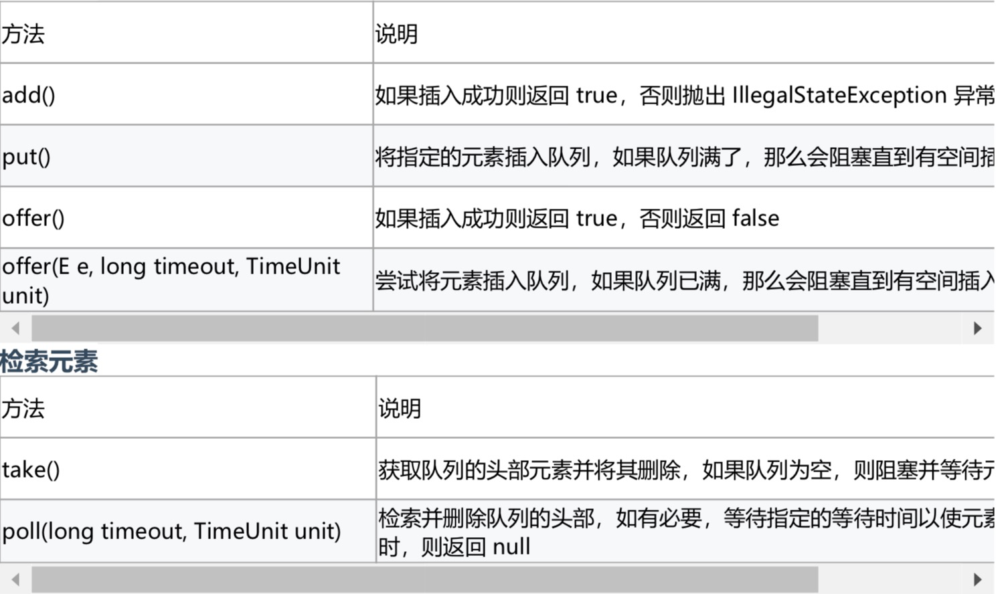

## 概要
BlockingQueue，是java.util.concurrent包提供的用于解决并发生产者 - 消费者问题 的最有用的类，它的特性是在任意时刻只有一个线程可以进行take或者put操作，
并且 BlockingQueue提供了超时return null的机制，在许多生产场景里都可以看到这个工具的身影。

## 队列数据结构
- 通常用链表或者数组实现

- 一般而言队列具备FIFO先进先出的特性，当然也有双端队列(Deque)优先级 队列

- 主要操作:入队(EnQueue)与出队(Dequeue)

### 常见的四种阻塞队列
- ArrayBlockingQueue 由数组支持的有界队列
- LinkedBlockingQueue 由链接节点支持的可选无界队列
- PriorityBlockingQueue 由优先级堆支持的无界优先级队列
- DelayQueue 由优先级堆支持的、基于时间的调度队列

### ArrayBlockingQueue
队列基于数组实现,容量大小在创建ArrayBlockingQueue对象时已定义好

应用场景，  在线程池中有比较多的应用，生产者消费者场景

工作原理：基于ReentrantLock保证线程安全，根据Condition实现队列满时的阻塞


#### take() 源码

```
public E take() throws InterruptedException {
        final ReentrantLock lock = this.lock;
        lock.lockInterruptibly();
        try {
            while (count == 0)
                notEmpty.await();
            return dequeue();
        } finally {
            lock.unlock();
        }
    }
    
     /**
         * Extracts element at current take position, advances, and signals.
         * Call only when holding lock.
         */
        private E dequeue() {
            // assert lock.getHoldCount() == 1;
            // assert items[takeIndex] != null;
            final Object[] items = this.items;
            @SuppressWarnings("unchecked")
            E x = (E) items[takeIndex];
            items[takeIndex] = null;
            if (++takeIndex == items.length)
                takeIndex = 0;
            count--;
            if (itrs != null)
                itrs.elementDequeued();
            notFull.signal();
            return x;
        }
```

### put() 源码
```
/**
     * Inserts the specified element at the tail of this queue, waiting
     * for space to become available if the queue is full.
     *
     * @throws InterruptedException {@inheritDoc}
     * @throws NullPointerException {@inheritDoc}
     */
    public void put(E e) throws InterruptedException {
        checkNotNull(e);
        final ReentrantLock lock = this.lock;
        lock.lockInterruptibly();
        try {
            while (count == items.length)
                notFull.await();
            enqueue(e);
        } finally {
            lock.unlock();
        }
    }
    
    /**
         * Inserts element at current put position, advances, and signals.
         * Call only when holding lock.
         */
        private void enqueue(E x) {
            // assert lock.getHoldCount() == 1;
            // assert items[putIndex] == null;
            final Object[] items = this.items;
            items[putIndex] = x;
            if (++putIndex == items.length)
                putIndex = 0;
            count++;
            notEmpty.signal();
        }
```


### LinkedBlockingQueue

是一个基于链表的无界队列(理论上有界)

`BlockingQueue<String> blockingQueue = new LinkedBlockingQueue<> ();`

上面这段代码中的容量将设置为Integer.MAX_VALUE。

向无限队列添加元素的所有操作都将永远不会阻塞，[注意这里不是说不会加锁保证线程安 全]，因此它可以增长到非常大的容量。

使用无限 BlockingQueue 设计生产者 - 消费者模型时最重要的是 消费者应该能够像生产 者向队列添加消息一样快地消费消息 。否则，内存可能会填满，然后就会得到一个 OutOfMemory 异常。


## BlockingQueue API
BlockingQueue 接口的所有方法可以分为两大类:负责向队列添加元素的方法和检索这些 元素的方法。在队列满/空的情况下，来自这两个组的每个方法的行为都不同。



