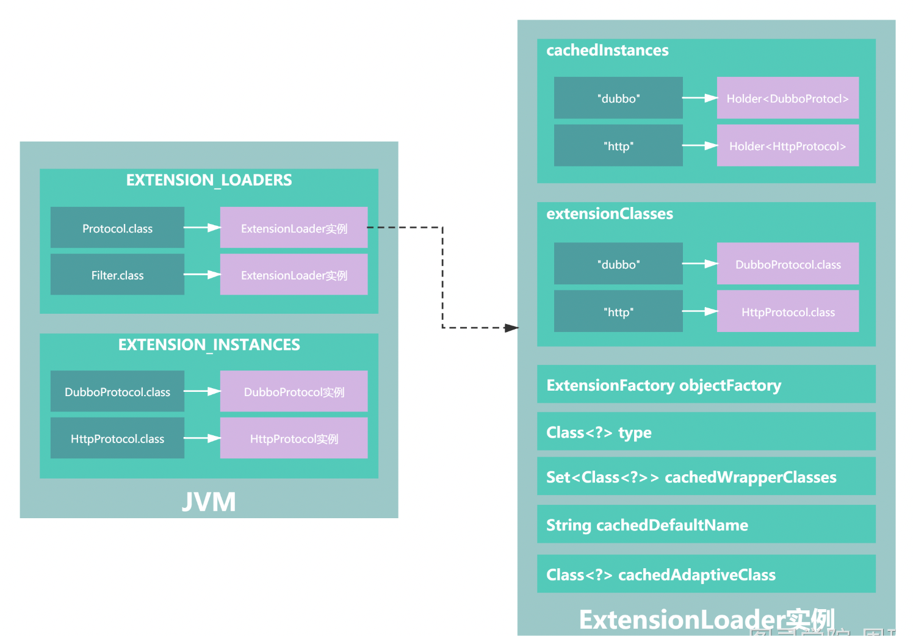

Dubbo 扩展的特性
Dubbo 中的扩展能力是从 JDK 标准的 SPI 扩展点发现机制加强而来，它改进了 JDK 标准的 SPI 以下问题：
JDK 标准的 SPI 会一次性实例化扩展点所有实现，如果有扩展实现初始化很耗时，但如果没用上也加载，会很浪费资源。
如果扩展点加载失败，连扩展点的名称都拿不到了。比如：JDK 标准的 ScriptEngine，通过 getName() 获取脚本类型的名称，但如果 RubyScriptEngine 因为所依赖的 jruby.jar 不存在，导致 RubyScriptEngine 类加载失败，这个失败原因被吃掉了，和 ruby 对应不起来，当用户执行 ruby 脚本时，会报不支持 ruby，而不是真正失败的原因。
用户能够基于 Dubbo 提供的扩展能力，很方便基于自身需求扩展其他协议、过滤器、路由等。下面介绍下 Dubbo 扩展能力的特性。
按需加载。Dubbo 的扩展能力不会一次性实例化所有实现，而是用哪个扩展类则实例化哪个扩展类，减少资源浪费。
增加扩展类的 IOC 能力。Dubbo 的扩展能力并不仅仅只是发现扩展服务实现类，而是在此基础上更进一步，如果该扩展类的属性依赖其他对象，则 Dubbo 会自动的完成该依赖对象的注入功能。
增加扩展类的 AOP 能力。Dubbo 扩展能力会自动的发现扩展类的包装类，完成包装类的构造，增强扩展类的功能。
具备动态选择扩展实现的能力。Dubbo 扩展会基于参数，在运行时动态选择对应的扩展类，提高了 Dubbo 的扩展能力。
可以对扩展实现进行排序。能够基于用户需求，指定扩展实现的执行顺序。
提供扩展点的 Adaptive 能力。该能力可以使的一些扩展类在 consumer 端生效，一些扩展类在 provider 端生效。
从 Dubbo 扩展的设计目标可以看出，Dubbo 实现的一些例如动态选择扩展实现、IOC、AOP 等特性，能够为用户提供非常灵活的扩展能力。
Dubbo SPI 架构图

核心入口
ExtensionLoader
常用用法，如获取指定的协议实现
ExtensionLoader<Protocol> extensionLoader = ExtensionLoader.getExtensionLoader(Protocol.class);
Protocol dubboProtocol = extensionLoader.getExtension("dubbo");
Dubbo 扩展加载流程
如extensionLoader.getExtension("dubbo")主要步骤为 4 个：
读取并解析配置文件
缓存所有扩展实现
基于用户执行的扩展名，实例化对应的扩展实现
进行扩展实例属性的 IOC 注入以及实例化扩展的包装类，实现 AOP 特性

Dubbo中的IOC
根据当前实例的类，找到这个类中的setter方法，进行依赖注入
先分析出setter方法的参数类型pt
在截取出setter方法所对应的属性名property
调用objectFactory.getExtension(pt, property)得到一个对象，这里就会从Spring容器或通过DubboSpi机制得到一个对象，比较特殊的是，如果是通过DubboSpi机制得到的对象，是pt这个类型的一个自适应对象(代理对象)。
再反射调用setter方法进行注入

Dubbo中的AOP
dubbo中也实现了一套非常简单的AOP，就是利用Wrapper，如果一个接口的扩展点中包含了多个Wrapper类，那么在实例化完某个扩展点后，就会利用这些Wrapper类对这个实例进行包裹，比如：现在有一个DubboProtocol的实例，同时对于Protocol这个接口还有很多的Wrapper，比如ProtocolFilterWrapper、ProtocolListenerWrapper，那么，当对DubboProtocol的实例完成了IOC之后，就会先调用new ProtocolFilterWrapper(DubboProtocol实例)生成一个新的Protocol的实例，再对此实例进行IOC，完了之后，会再调用new ProtocolListenerWrapper(ProtocolFilterWrapper实例)生成一个新的Protocol的实例，然后进行IOC，从而完成DubboProtocol实例的AOP。