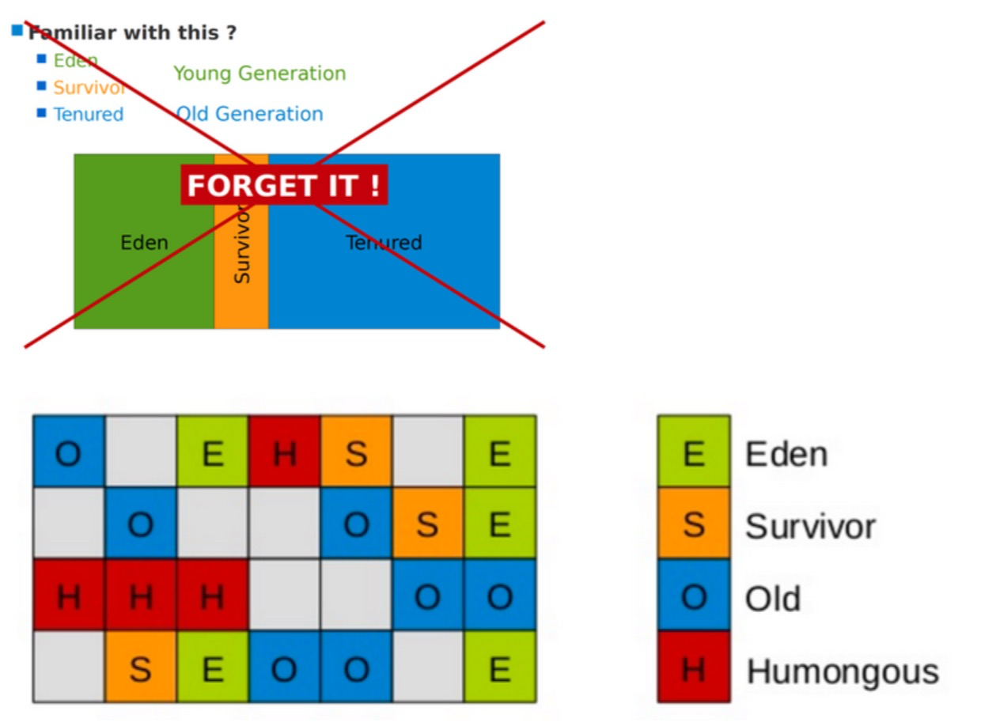
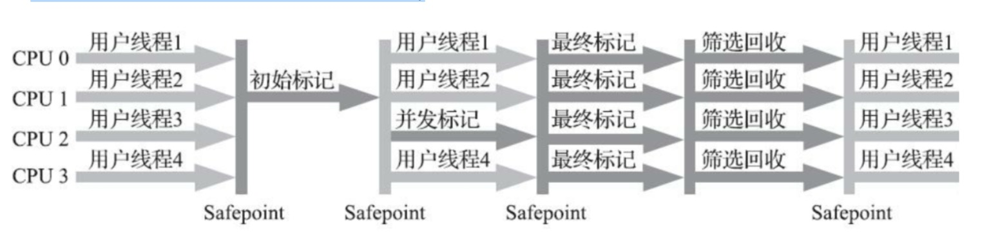
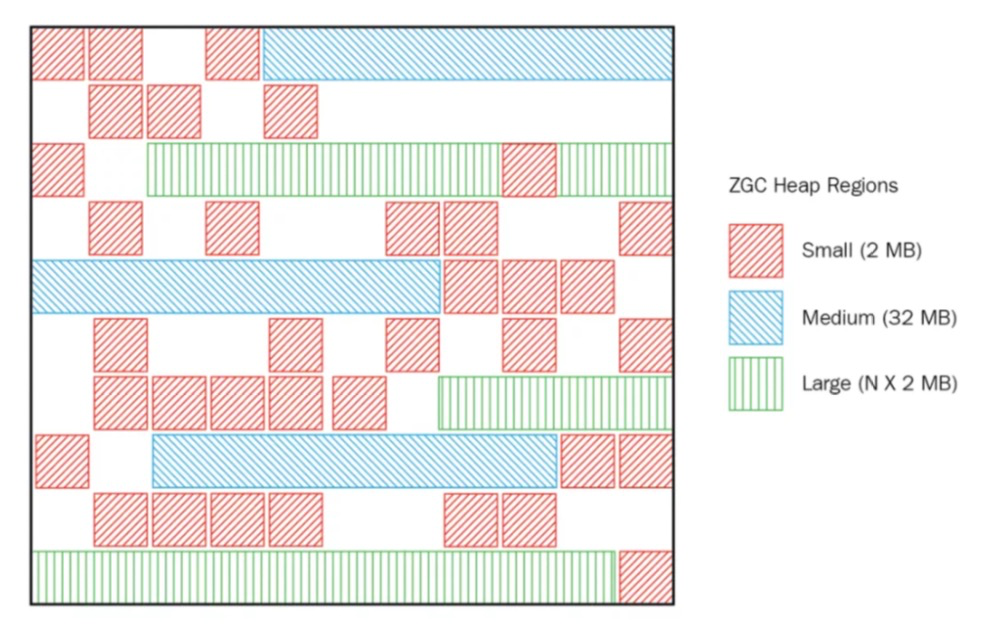
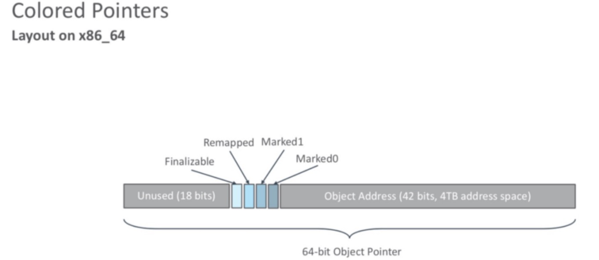

## G1收集器(-XX:+UseG1GC)
G1 (Garbage-First)是一款面向服务器的垃圾收集器,主要针对配备多颗处理器及大容量内存的机器. 以极高概率满足GC 停顿时间要求的同时,还具备高吞吐量性能特征.

G1将Java堆划分为多个大小相等的独立区域(Region)，JVM最多可以有**2048**个Region。 一般Region大小等于堆大小除以2048，比如堆大小为4096M，则Region大小为2M，当然也可以用参数"- XX:G1HeapRegionSize"手动指定Region大小，但是推荐默认的计算方式。 
G1保留了年轻代和老年代的概念，但不再是物理隔阂了，它们都是(可以不连续)Region的集合。 **默认年轻代对堆内存的占比是5%**，如果堆大小为4096M，那么年轻代占据200MB左右的内存，对应大概是100个 Region，可以通过“**-XX:G1NewSizePercent**”设置新生代初始占比，
在系统运行中，JVM会不停的给年轻代增加更多的Region，但是最多新生代的占比**不会超过60%**，可以通过“**-XX:G1MaxNewSizePercent**”调整。年轻代中的Eden和 Survivor对应的region也跟之前一样，默认8:1:1，假设年轻代现在有1000个region，eden区对应800个，s0对应100 个，s1对应100个。 
一个Region可能之前是年轻代，如果Region进行了垃圾回收，之后可能又会变成老年代，也就是说Region的区域功能 可能会动态变化。

G1垃圾收集器对于对象什么时候会转移到老年代跟之前讲过的原则一样，唯一不同的是对大对象的处理，**G1有专门分配大对象的Region叫Humongous区**，而不是让大对象直接进入老年代的Region中。
在G1中，大对象的判定规则就是**一个大对象超过了一个Region大小的50%**，比如按照上面算的，每个Region是2M，只要一个大对象超过了1M，就会被放入Humongous中，而且一个大对象如果太大，可能会横跨多个Region来存放。 
Humongous区专门存放短期巨型对象，不用直接进老年代，可以节约老年代的空间，避免因为老年代空间不够的GC开销。
Full GC的时候除了收集年轻代和老年代之外，也会将Humongous区一并回收。

G1收集器一次GC的运作过程大致分为以下几个步骤:

- 初始标记(initial mark，STW):暂停所有的其他线程，并记录下gc roots直接能引用的对象，速度很快;
- 并发标记(Concurrent Marking):同CMS的并发标记
- 最终标记(Remark，STW):同CMS的重新标记
- 筛选回收(Cleanup，STW):筛选回收阶段首先对各个Region的回收价值和成本进行排序，根据用户所期望的GC停顿时间(可以用JVM参数 -XX:MaxGCPauseMillis指定)来制定回收计划，
比如说老年代此时有1000个Region都满了，但是因为根据预期停顿时间，本次垃圾回收可能只能停顿200毫秒，那么通过之前回收成本计算得知，可能回收其中800个Region刚好需要200ms，那么就只会回收800个Region(Collection Set，要回收的集合)，
尽量把GC导致的停顿时间控制在我们指定的范围内。这个阶段其实也可以做到与用户程序一起并发执行，但是因为只回收一部分Region，时间是用户可控制的，而且停顿用户线程将大幅提高收集效率。
不管是年轻代或是老年代，回收算法主要用的是复制算法，将一个region中的存活对象复制到另一个region中，这种不会像CMS那样回收完因为有很多内存碎片还需要整理一次，G1采用复制算法回收几乎不会有太多内存碎片。
(注意:CMS回收阶段是跟用户线程一起并发执行的，G1因为内部实现太复杂暂时没实现并发回收，不过到了Shenandoah就实现了并发收集，Shenandoah可以看成是G1的升级版本)

**G1收集器在后台维护了一个优先列表，每次根据允许的收集时间，优先选择回收价值最大的Region(这也就是它的名字 Garbage-First的由来)，比如一个Region花200ms能回收10M垃圾，另外一个Region花50ms能回收20M垃圾，在回 收时间有限情况下，G1当然会优先选择后面这个Region回收。**
这种使用Region划分内存空间以及有优先级的区域回收方式，保证了G1收集器在有限时间内可以尽可能高的收集效率。

被视为JDK1.7以上版本Java虚拟机的一个重要进化特征。它具备以下特点:

- **并行与并发**:G1能充分利用CPU、多核环境下的硬件优势，使用多个CPU(CPU或者CPU核心)来缩短Stop-The-World停顿时间。部分其他收集器原本需要停顿Java线程来执行GC动作，G1收集器仍然可以通过并发的方式 让java程序继续执行。
- **分代收集**:虽然G1可以不需要其他收集器配合就能独立管理整个GC堆，但是还是保留了分代的概念。
- **空间整合**:与CMS的“标记--清理”算法不同，G1从整体来看是基于“标记整理”算法实现的收集器;从局部 上来看是基于“复制”算法实现的。
- **可预测的停顿**:这是G1相对于CMS的另一个大优势，降低停顿时间是G1 和 CMS 共同的关注点，但G1 除了 追求低停顿外，还能建立可预测的停顿时间模型，能让使用者明确指定在一个长度为M毫秒的时间片段(通过参数"- XX:MaxGCPauseMillis"指定)内完成垃圾收集。

毫无疑问， 可以由用户指定期望的停顿时间是G1收集器很强大的一个功能， 设置不同的期望停顿时间， 可使得G1在不同应用场景中取得关注吞吐量和关注延迟之间的最佳平衡。 
不过， 这里设置的“期望值”必须是符合实际的， 不能异想天开， 毕竟G1是要冻结用户线程来复制对象的，这个停顿时间再怎么低也得有个限度。 
它默认的停顿目标为两百毫秒， 一般来说， 回收阶段占到几十到一百甚至接近两百毫秒都很正常， 但如果我们把停顿时间调得非常低， 譬如设置为二十毫秒， 
很可能出现的结果就是由于停顿目标时间太短， 导致每次选出来的回收集只占堆内存很小的一部分， 收集器收集的速度逐渐跟不上分配器分配的速度， 导致垃圾慢慢堆积。
很可能一开始收集器还能从空闲的堆内存中获得一些喘息的时间， 但应用运行时间一长就不行了， 最终占满堆引发 Full GC反而降低性能， 所以通常把期望停顿时间设置为一两百毫秒或者两三百毫秒会是比较合理的。

### G1垃圾收集分类
#### YoungGC
YoungGC并不是说现有的Eden区放满了就会马上触发，G1会计算下现在Eden区回收大概要多久时间，如果回收时间远远小于参数 -XX:MaxGCPauseMills 设定的值，那么增加年轻代的region，继续给新对象存放，不会马上做Young GC，直到下一次Eden区放满，G1计算回收时间接近参数 -XX:MaxGCPauseMills设定的值，那么就会触发Young GC

#### MixedGC
不是FullGC，堆占有率达到参数(-XX:InitiatingHeapOccupancyPercent)设定的值则触发，回收所有的 Young和部分Old(根据期望的GC停顿时间确定old区垃圾收集的优先顺序)以及大对象区，正常情况G1的垃圾收集是先做 MixedGC，主要使用复制算法，需要把各个region中存活的对象拷贝到别的region里去，拷贝过程中如果发现没有足够 的空region能够承载拷贝对象就会触发一次Full GC

#### Full GC
停止系统程序，然后采用单线程进行标记、清理和压缩整理，好空闲出来一批Region来供下一次MixedGC使用，这个过程是非常耗时的。(Shenandoah优化成多线程收集了)

#### G1收集器参数设置
-XX:+UseG1GC:使用G1收集器

-XX:ParallelGCThreads:指定GC工作的线程数量 

-XX:G1HeapRegionSize:指定分区大小(1MB~32MB，且必须是2的N次幂)，默认将整堆划分为2048个分区
 
-XX:MaxGCPauseMillis:目标暂停时间(默认200ms)

-XX:G1NewSizePercent:新生代内存初始空间(默认整堆5%)

-XX:G1MaxNewSizePercent:新生代内存最大空间 

-XX:TargetSurvivorRatio:Survivor区的填充容量(默认50%)，Survivor区域里的一批对象(年龄1+年龄2+年龄n的多个年龄对象)总和超过了Survivor区域的50%，此时就会把年龄n(含)以上的对象都放入老年代 

-XX:MaxTenuringThreshold:最大年龄阈值(默认15) 

-XX:InitiatingHeapOccupancyPercent:老年代占用空间达到整堆内存阈值(默认45%)，则执行新生代和老年代的混合收集(MixedGC)，比如我们之前说的堆默认有2048个region，如果有接近1000个region都是老年代的region，则可能 就要触发MixedGC了

-XX:G1MixedGCLiveThresholdPercent(默认85%) region中的存活对象低于这个值时才会回收该region，如果超过这 个值，存活对象过多，回收的的意义不大。

-XX:G1MixedGCCountTarget:在一次回收过程中指定做几次筛选回收(默认8次)，在最后一个筛选回收阶段可以回收一 会，然后暂停回收，恢复系统运行，一会再开始回收，这样可以让系统不至于单次停顿时间过长。

-XX:G1HeapWastePercent(默认5%): gc过程中空出来的region是否充足阈值，在混合回收的时候，对Region回收都 是基于复制算法进行的，都是把要回收的Region里的存活对象放入其他Region，然后这个Region中的垃圾对象全部清 理掉，这样的话在回收过程就会不断空出来新的Region，一旦空闲出来的Region数量达到了堆内存的5%，此时就会立 即停止混合回收，意味着本次混合回收就结束了。

#### G1垃圾收集器优化建议
假设参数 -XX:MaxGCPauseMills 设置的值很大，导致系统运行很久，年轻代可能都占用了堆内存的60%了，此时才
触发年轻代gc。 那么存活下来的对象可能就会很多，此时就会导致Survivor区域放不下那么多的对象，就会进入老年代中。 或者是你年轻代gc过后，存活下来的对象过多，导致进入Survivor区域后触发了动态年龄判定规则，达到了Survivor
区域的50%，也会快速导致一些对象进入老年代中。
所以这里核心还是在于调节 -XX:MaxGCPauseMills 这个参数的值，在保证他的年轻代gc别太频繁的同时，还得考虑 每次gc过后的存活对象有多少,避免存活对象太多快速进入老年代，频繁触发mixed gc.

#### 什么场景适合使用G1
1. 50%以上的堆被存活对象占用

2. 对象分配和晋升的速度变化非常大 

3. 垃圾回收时间特别长，超过1秒

4. 8GB以上的堆内存(建议值)

5. 停顿时间是500ms以内

### ZGC收集器(-XX:+UseZGC)
ZGC是一款JDK 11中新加入的具有实验性质的低延迟垃圾收集器，ZGC可以说源自于是Azul System公司开发的 C4(Concurrent Continuously Compacting Collector) 收集器。

#### ZGC目标
- **支持TB量级的堆** 我们生产环境的硬盘还没有上TB呢，这应该可以满足未来十年内，所有JAVA应用的需求了吧。

- **最大GC停顿时间不超10ms**

- **奠定未来GC特性的基础**

- **最糟糕的情况下吞吐量会降低15%** 这都不是事，停顿时间足够优秀。至于吞吐量，通过扩容分分钟解决。 另外，Oracle官方提到了它最大的优点是:它的停顿时间不会随着堆的增大而增长!也就是说，几十G堆的停顿时间是 10ms以下，几百G甚至上T堆的停顿时间也是10ms以下。

#### 不分代(暂时)
单代，即ZGC「没有分代」。我们知道以前的垃圾回收器之所以分代，是因为源于“「大部分对象朝生夕死」”的假
设，事实上大部分系统的对象分配行为也确实符合这个假设。 那么为什么ZGC就不分代呢?因为分代实现起来麻烦，作者就先实现出一个比较简单可用的单代版本，后续会优化。

#### ZGC内存布局
ZGC收集器是一款基于Region内存布局的， 暂时不设分代的， 使用了**读屏障**、 **颜色指针**等技术来实现可并发的标记-整 理算法的， 以低延迟为首要目标的一款垃圾收集器。

ZGC的Region可以具有大、 中、 小三类容量:

- 小型Region(Small Region) : 容量固定为2MB， 用于放置小于256KB的小对象。 
- 中型Region(Medium Region) : 容量固定为32MB， 用于放置大于等于256KB但小于4MB的对象。 
- 大型Region(Large Region) : 容量不固定， 可以动态变化， 但必须为2MB的整数倍， 用于放置4MB或
以上的大对象。 每个大型Region中
- 只会存放一个大对象， 这也预示着虽然名字叫作“大型Region”， 但它的实际容量完全有可能小于中型Region， 最小容量可低至4MB。 大型Region在ZGC的实现中是不会被重分配(重分配是ZGC的一种处理动作， 用于复制对象的收集器阶段， 稍后会介绍到)的， 因为复制一个大对象的代价非常高昂。

#### NUMA-aware
NUMA对应的有UMA，UMA即Uniform Memory Access Architecture，NUMA就是Non Uniform Memory Access Architecture。UMA表示内存只有一块，所有CPU都去访问这一块内存，那么就会存在竞争问题(争夺内存总线访问 权)，有竞争就会有锁，有锁效率就会受到影响，而且CPU核心数越多，竞争就越激烈。NUMA的话每个CPU对应有一 块内存，且这块内存在主板上离这个CPU是最近的，每个CPU优先访问这块内存，那效率自然就提高了:

服务器的NUMA架构在中大型系统上一直非常盛行，也是高性能的解决方案，尤其在系统延迟方面表现都很优秀。ZGC 是能自动感知NUMA架构并充分利用NUMA架构特性的。

#### 颜色指针
Colored Pointers，即颜色指针，如下图所示，ZGC的核心设计之一。以前的垃圾回收器的GC信息都保存在对象头中， 而ZGC的GC信息保存在指针中。

每个对象有一个64位指针，这64位被分为:
- 18位:预留给以后使用; 
- 1位:Finalizable标识，此位与并发引用处理有关，它表示这个对象只能通过finalizer才能访问; 
- 1位:Remapped标识，设置此位的值后，对象未指向relocation set中(relocation set表示需要GC的
Region集合);
- 1位:Marked1标识; 
- 1位:Marked0标识，和上面的Marked1都是标记对象用于辅助GC; 
- 42位:对象的地址(所以它可以支持2^42=4T内存):