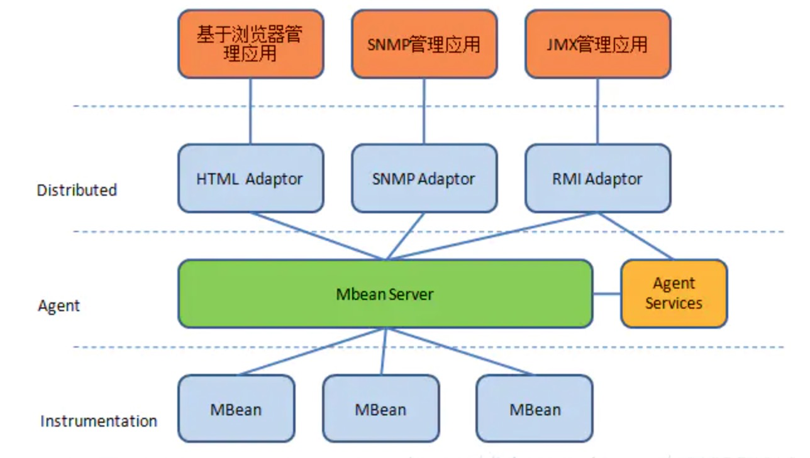
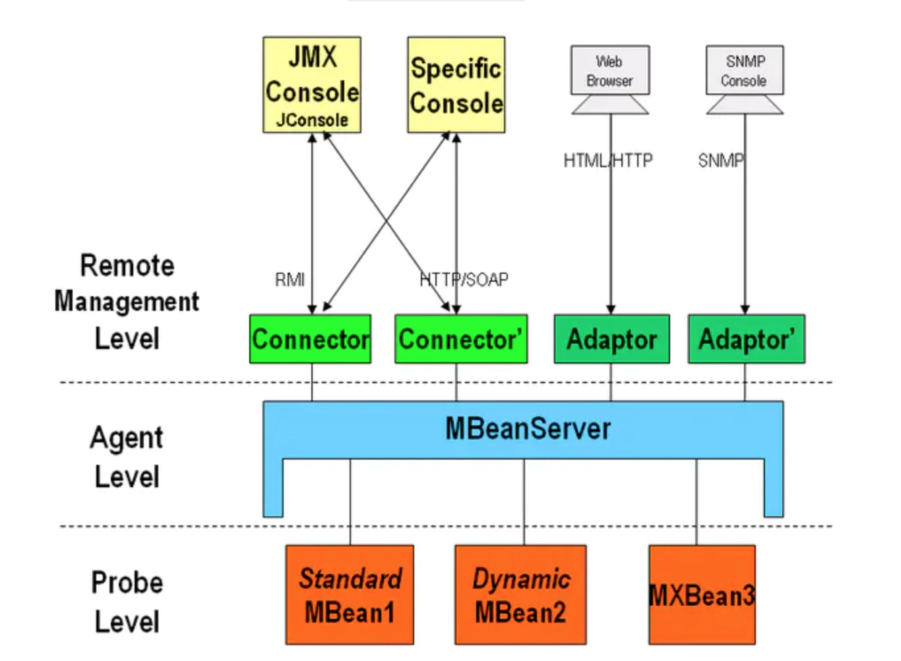

## 一 简介
全称Java Management Extensions，从Java5.0开始引入到标准Java技术平台中。JMX提供了一个标准的方法去管理资源，因为JMX是一种动态技术，你可以在被管理资源创建、实例化和实现的时候监控和管理他们。你也可以使用JMX技术去监听和管理Java虚拟机。**我个人的理解是JMX让程序有被管理的功能，例如你开发一个WEB网站，它是在24小时不间断运行，那么你肯定会对网站进行监控，如每天的UV、PV是多少；又或者在业务高峰的期间，你想对接口进行限流，就必须去修改接口并发的配置值。**

### Why JMX
**1. JMX技术使Java应用程序无需在管理方面投入大量精力**

JMX几乎可以在任何支持Java的设备上运行，而且只需要嵌入一个管理对象服务器（MBean Server），使它的一些功能作为一个或几个被管理的bean(MBean)在目标服务器上注册。然后就可以从管理基础设施中受益。

**2. JMX技术提供了一个标准的方法去管理Java应用、系统和网络**

标准Java平台都支持JMX架构，因此只要符合JMX规范都可以通过JMX管理。

**3. JMX让为Java应用提供了可伸缩、动态、分布式的管理架构**

使Java应用可以远程管理。

### JMX架构




## 基本术语
### Instrumentation
要管理的资源。使用Java Bean描述要管理的资源。这些Java Bean叫MBean（Management Bean）。MBean分为如下四种


### MBean Agent
代理层。主要定义了各种服务以及通信模型，和需要被管理的资源在同一机器上，核心模块是MBean Server，所有的MBean都要向它注册，才能被管理。注册在MBeanServer上的MBean并不直接和远程应用程序进行通信，他们通过协议适配器（Adapter）和连接器（Connector）进行通信。

### Distributed Layer
也叫Remote Management Layer. 即远程管理层。MBean Server依赖于该层的协议适配器（Adaptor）和连接器（Connector），让JMX Agent可以被该JVM外面的管理系统远程访问。支持多种协议：SNMP，HTML，RMI.

## Management API

### HotSpotDiagnosticMXBean

主要提供了两个功能

- 修改JVM的启动参数

- Dump堆信息到文件，可以猜测jmap工具是基于此功能来完成的

```
public interface HotSpotDiagnosticMXBean  
{  
    void dumpHeap(String s, boolean flag) throws IOException;  
    List getDiagnosticOptions();  
    VMOption getVMOption(String s);  
    void setVMOption(String s, String s1);  
}  
```

### 2.ClassLoadingMXBean
加载的类的总体信息，我们可以通过此MBean获取到JVM加载的类定义的总体信息，可以猜测JConsole的类功能就是通过此MBean来提供的。
```
public interface ClassLoadingMXBean {  
    public long getTotalLoadedClassCount();  
    public int getLoadedClassCount();  
    public long getUnloadedClassCount();  
    public boolean isVerbose();  
    public void setVerbose(boolean value);  
}  
```
### 3.CompilationMXBean
提供JVM的JIT(Just In Time)编译器(将bytecode编译成native code)的信息，我们可以通过java.lang.management.CompilationMXBean定义了解其提供的主要功能
```
public interface CompilationMXBean {  
    public java.lang.String    getName();  
    public boolean isCompilationTimeMonitoringSupported();  
    public long                getTotalCompilationTime();  
}  
```
### 4. GarbageCollectorMXBean
```
public interface GarbageCollectorMXBean extends MemoryManagerMXBean {  
    public long getCollectionCount();  
    public long getCollectionTime();  
}  
```

**MemoryManagerMXBean**

```
public interface MemoryManagerMXBean {  
    public String getName();  
    public boolean isValid();  
    public String[] getMemoryPoolNames();  
}  
```

** 除了如上信息，Sun JVM在实现上还提供了一个额外的信息LastGCInfo，见com.sun.management.GarbageCollectorMXBean定义 **
```
public interface GarbageCollectorMXBean  
    extends java.lang.management.GarbageCollectorMXBean  
{  
    GcInfo getLastGcInfo();  
}  
```

### 5.内存相关
可以猜测，JConsole的内存部分的功能都是通过此部分的相关Bean来完成的。
1)Memory/MemoryManager：内存块相关信息，通过这MBean我们可以获取到内存的总体信息，并可以通过提供的
```
public interface MemoryMXBean {  
    public int getObjectPendingFinalizationCount();  
    public MemoryUsage getHeapMemoryUsage();  
    public MemoryUsage getNonHeapMemoryUsage();  
    public boolean isVerbose();  
    public void setVerbose(boolean value);  
    public void gc();  
}  

public interface MemoryManagerMXBean {  
    public String getName();  
    public boolean isValid();  
    public String[] getMemoryPoolNames();  
}  
```

2)MemoryPool：通过该MBean可以了解JVM各内存块的信息，譬如对于Sun JVM，目前包括Eden Space、Suvivor Space、Tenured Gen、CodeCache、Perm Gen，可以猜测JConsole的内存监控功能就是通过此MBean来做到的。我们可以通过 java.lang.management.MemoryPoolMXBean了解其主要提供的功能。

```
public interface MemoryPoolMXBean {  
    public String getName();  
    public MemoryType getType();  
    public MemoryUsage getUsage();  
    public MemoryUsage getPeakUsage();  
    public void resetPeakUsage();  
    public boolean isValid();  
    public String[] getMemoryManagerNames();  
    public long getUsageThreshold();  
    public void setUsageThreshold(long threshold);  
    public boolean isUsageThresholdExceeded();  
    public long getUsageThresholdCount();  
    public boolean isUsageThresholdSupported();  
    public long getCollectionUsageThreshold();  
    public void setCollectionUsageThreshold(long threhsold);  
    public boolean isCollectionUsageThresholdExceeded();  
    public long getCollectionUsageThresholdCount();  
    public MemoryUsage getCollectionUsage();  
    public boolean isCollectionUsageThresholdSupported();  
}   
   
```

### 6.系统运行信息
1）OperatingSystem：通过该MBean我们可以了解到JVM所运行在的操作系统上的一些相关信息，通过java.lang.management.OperatingSystemMXBean定义我们可以了解到其主要提供的功能
```
public interface OperatingSystemMXBean {  
    public String getName();  
    public String getArch();  
    public String getVersion();  
    public int getAvailableProcessors();  
    public double getSystemLoadAverage();  
}  
```
SunJVM在此基础上提供更多的一些信息，可以通过com.sun.management.OperatingSystemMXBean了解一些额外可以获取到的信息
```
public interface OperatingSystemMXBean extends java.lang.management.OperatingSystemMXBean  
{  
    long getCommittedVirtualMemorySize();  
    long getTotalSwapSpaceSize();  
    long getFreeSwapSpaceSize();  
    long getProcessCpuTime();  
    long getFreePhysicalMemorySize();  
    long getTotalPhysicalMemorySize();  
}  
```
 2）Runtime：通过该MBean获取获取到JVM一些相关的信息，通过java.lang.management.RuntimeMXBean可以了解其主要提供的功能
```
public interface RuntimeMXBean {  
    public String getName();  
    public String getVmName();  
    public String getVmVendor();  
    public String getVmVersion();  
    public String getSpecName();  
    public String getSpecVendor();  
    public String getSpecVersion();  
    public String getManagementSpecVersion();  
    public String getClassPath();  
    public String getLibraryPath();  
    public boolean isBootClassPathSupported();  
    public String getBootClassPath();  
    public java.util.List<String> getInputArguments();  
    public long getUptime();  
    public long getStartTime();  
    public java.util.Map<String, String> getSystemProperties();  
}  

```

可以通过RuntimeMXBean.getUptime()和OperatingSystemMXBean. getProcessCpuTime()来计算JVM占用的系统CPU比例的情况，JConsole的CPU视图就是通过这种方式计算的。

### 7.Threading：
可以通过该MBean获取线程信息，包括线程状态、执行栈等。可以通过java.lang.management.ThreadMXBean了解其提供的主要功能

```
public interface ThreadMXBean {     
   public int getThreadCount();  
    public int getPeakThreadCount();  
    public long getTotalStartedThreadCount();   
    public int getDaemonThreadCount();  
    public long[] getAllThreadIds();  
    public ThreadInfo getThreadInfo(long id);  
    public ThreadInfo[] getThreadInfo(long[] ids);  
    public ThreadInfo getThreadInfo(long id, int maxDepth);  
    public ThreadInfo[] getThreadInfo(long[] ids, int maxDepth);  
    public boolean isThreadContentionMonitoringSupported();  
    public boolean isThreadContentionMonitoringEnabled();  
    public void setThreadContentionMonitoringEnabled(boolean enable);  
    public long getCurrentThreadCpuTime();  
    public long getCurrentThreadUserTime();  
    public long getThreadCpuTime(long id);  
    public long getThreadUserTime(long id);  
    public boolean isThreadCpuTimeSupported();  
    public boolean isCurrentThreadCpuTimeSupported();  
    public boolean isThreadCpuTimeEnabled();  
    public void setThreadCpuTimeEnabled(boolean enable);  
    public long[] findMonitorDeadlockedThreads();  
    public void resetPeakThreadCount();  
    public long[] findDeadlockedThreads();  
    public boolean isObjectMonitorUsageSupported();  
    public boolean isSynchronizerUsageSupported();  
    public ThreadInfo[] getThreadInfo(long[] ids, boolean lockedMonitors, boolean lockedSynchronizers);  
    public ThreadInfo[] dumpAllThreads(boolean lockedMonitors, boolean lockedSynchronizers);  
}  
```

## 二、编程获取到JVM Manage信息

我们可以通过JMX的方式读取到JVM Manage定义的MBean，如下是3种获取方法

### 1.监控应用与被监控应用位于同一JVM
```
MBeanServer server = ManagementFactory.getPlatformMBeanServer();  
RuntimeMXBean rmxb = ManagementFactory.newPlatformMXBeanProxy(server,  
                "java.lang:type=Runtime", RuntimeMXBean.class);  

或者

ManagementFactory.getRuntimeMXBean()
```

### 2.监控应用与被监控应用不位于同一JVM

**1)首先在被监控的JVM的启动参数中加入如下的启动参数以启JVM代理**

-Dcom.sun.management.jmxremote -Dcom.sun.management.jmxremote.port=127.0.0.1:8000 -Dcom.sun.management.jmxremote.authenticate=false -Dcom.sun.management.jmxremote.ssl=false

** 2)连接到代理上**
```
JMXServiceURL url = new JMXServiceURL(  
        "service:jmx:rmi:///jndi/rmi://127.0.0.1:8000/jmxrmi");  
JMXConnector connector = JMXConnectorFactory.connect(url);  
RuntimeMXBean rmxb = ManagementFactory.newPlatformMXBeanProxy(connector  
            .getMBeanServerConnection(),"java.lang:type=Runtime",  
                RuntimeMXBean.class);  
```

### 3.监控应用与被监控应用不位于同一JVM但在同一物理主机上(2的特化情况，通过进程Attach)

我们使用JDK工具，如jmap、jstack等的时候，工具所在的JVM当然与被监控的JVM不是同一个，所以不能使用方式1，被监控的JVM一般也不 会在启动参数中增加JMX的支持，所以方式2也没有办法。还好Sun JVM给我们提供了第3种非标准的方式，就是通过Attach到被监控的JVM进程，并在被监控的JVM中启动一个JMX代理，然后使用该代理通过2的方 式连接到被监控的JVM的JMX上。下面是一个使用范例，由于里面使用到的知识涉及到Java Instrutment(JVMTI的一个技术的Java实现)和Attach API，因此此处不做详细解析，在后续看完Java Instrutment和Attach API自然就会明白。（注意，仅在JDK6+中支持，另外，运行需要jdk的tools.jar包）

```
//Attach 到5656的JVM进程上，后续Attach API再讲解  
VirtualMachine virtualmachine = VirtualMachine.attach("5656");  
  
//让JVM加载jmx Agent，后续讲到Java Instrutment再讲解  
String javaHome = virtualmachine.getSystemProperties().getProperty("java.home");  
String jmxAgent = javaHome + File.separator + "lib" + File.separator + "management-agent.jar";  
virtualmachine.loadAgent(jmxAgent, "com.sun.management.jmxremote");  
  
//获得连接地址  
Properties properties = virtualmachine.getAgentProperties();  
String address = (String)properties.get("com.sun.management.jmxremote.localConnectorAddress");  
         
//Detach  
virtualmachine.detach();  
         
JMXServiceURL url = new JMXServiceURL(address);  
JMXConnector connector = JMXConnectorFactory.connect(url);  
RuntimeMXBean rmxb = ManagementFactory.newPlatformMXBeanProxy(connector  
                .getMBeanServerConnection(), "java.lang:type=Runtime",RuntimeMXBean.class); 
```


## 三 Notification

MBean之间的通信是必不可少的，Notification就起到了在MBean之间沟通桥梁的作用。JMX 的通知由四部分组成：

1、Notification这个相当于一个信息包，封装了需要传递的信息

2、Notification broadcaster这个相当于一个广播器，把消息广播出。

3、Notification listener 这是一个监听器，用于监听广播出来的通知信息。

4、Notification filiter 这个一个过滤器，过滤掉不需要的通知。这个一般很少使用。

这里我们使用日常打招呼的场景：jack与我偶遇，jack说：hi；我礼貌的回答：hello，jack。

这里我们先分别创建两个资源：

```

```


