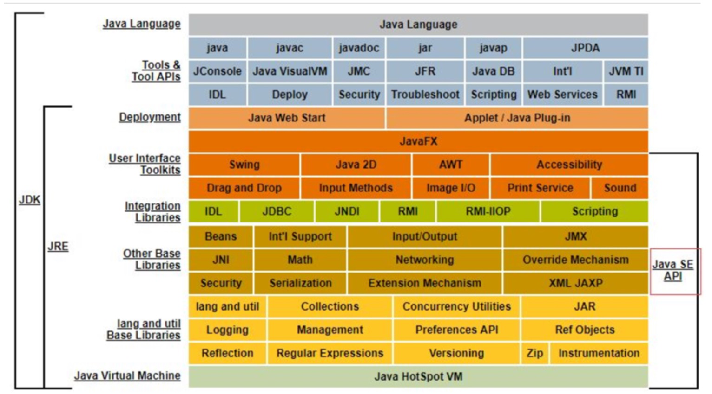
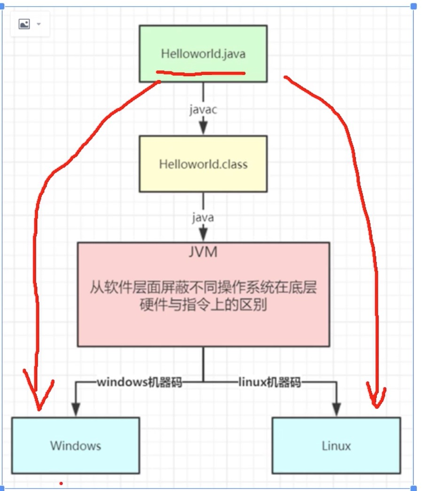
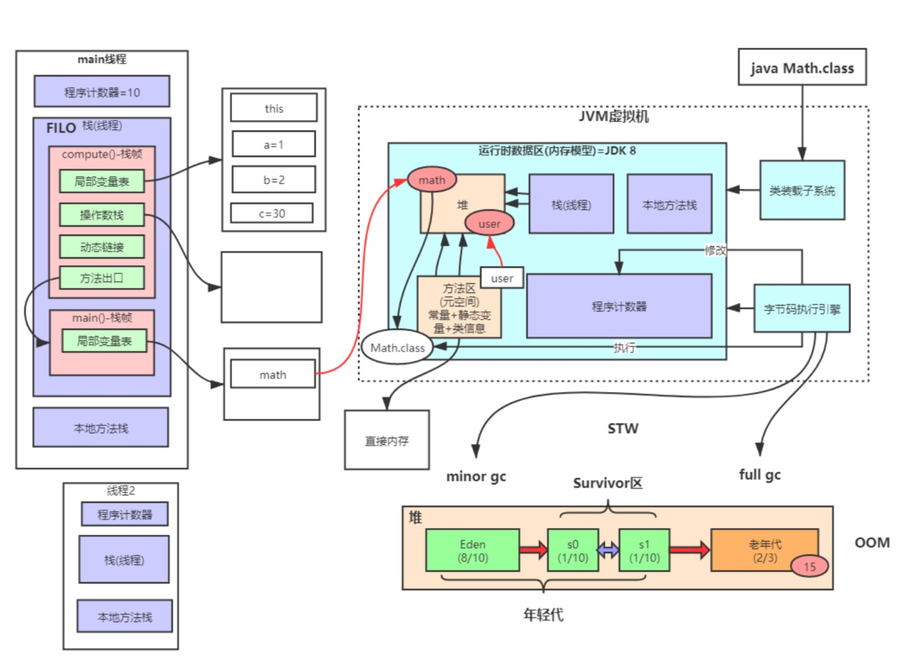
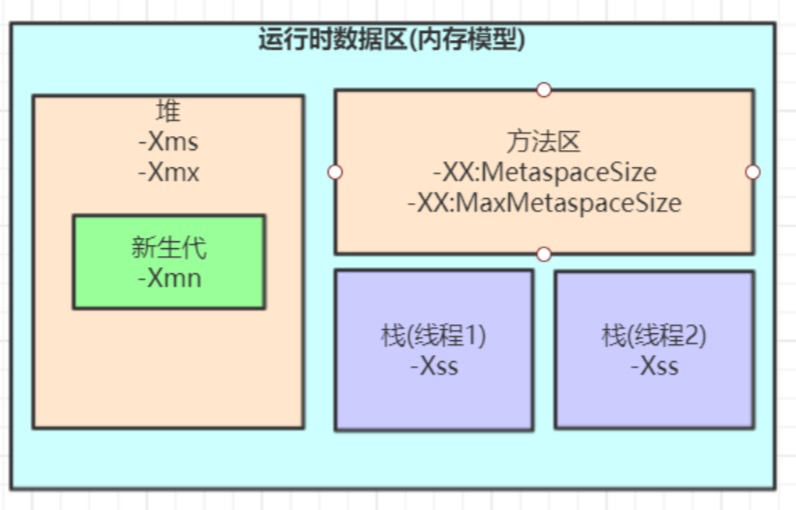

### JDK体系结构

jdk = jre + tools 

jre = jvm + libs

### java语言的跨平台性

### JVM整体结构及内存结构
jvm  = 运行时数据区 + 类装载子系统 + 字节码执行引擎

- 操作数栈：方法执行过程中，操作数的临时中转站

- 动态链接：方法内部执行方法调用是，存放这些方法具体地址的地方

- 方法出口：程序方法调用前的现场保留，确保方法正常调用返回后继续向下执行

### JVM内存参数设置

Spring Boot程序的JVM参数设置格式(Tomcat启动直接加在bin目录下catalina.sh文件里):
`java‐Xms2048M‐Xmx2048M‐Xmn1024M‐Xss512K‐XX:MetaspaceSize=256M‐XX:MaxMetaspaceSize=256M‐jarmicroservice‐eurek a‐server.jar`

关于元空间的JVM参数有两个:-XX:MetaspaceSize=N和 -XX:MaxMetaspaceSize=N

1.-XX:MaxMetaspaceSize: 设置元空间最大值， 默认是-1， 即不限制， 或者说只受限于本地内存大小。

2.-XX:MetaspaceSize: 指定元空间触发Fullgc的初始阈值(元空间无固定初始大小)，以字节为单位，默认是21M，达到该值就会触发**full gc**进行类型卸载， 
同时收集器会对该值进行调整: 如果释放了大量的空间， 就适当降低该值; 如果释放了很少的空间， 那么在不超 过-XX:MaxMetaspaceSize(如果设置了的话) 的情况下， 
适当提高该值。这个跟早期jdk版本的-XX:PermSize参数意思不一样，- XX:PermSize代表永久代的初始容量。由于调整元空间的大小需要Full GC，这是非常昂贵的操作，
如果应用在启动的时候发生大量Full GC，通常都是由于永久代或元空间发生了大小调整，基于这种情况，一般建议在JVM参数中将MetaspaceSize和MaxMetaspaceSize设置成一样的值，
并设置得比初始值要大， 对于8G物理内存的机器来说，一般会将这两个值都设置为256M。

3.默认情况下，年前代和老年代的比例是1 ：2 ，即3G的堆内存，年轻代占用1个G，老年代为2个G，当然也可以手动设置，比如-Xmn就可以自己设置年轻代的大小。

4.结论:尽可能让对象都在新生代里分配和回收，尽量别让太多对象频繁进入老年代，避免频繁对老年代进行垃圾回收，同时给系统充足的内存大小，避免新生代频繁的进行垃 圾回收。
