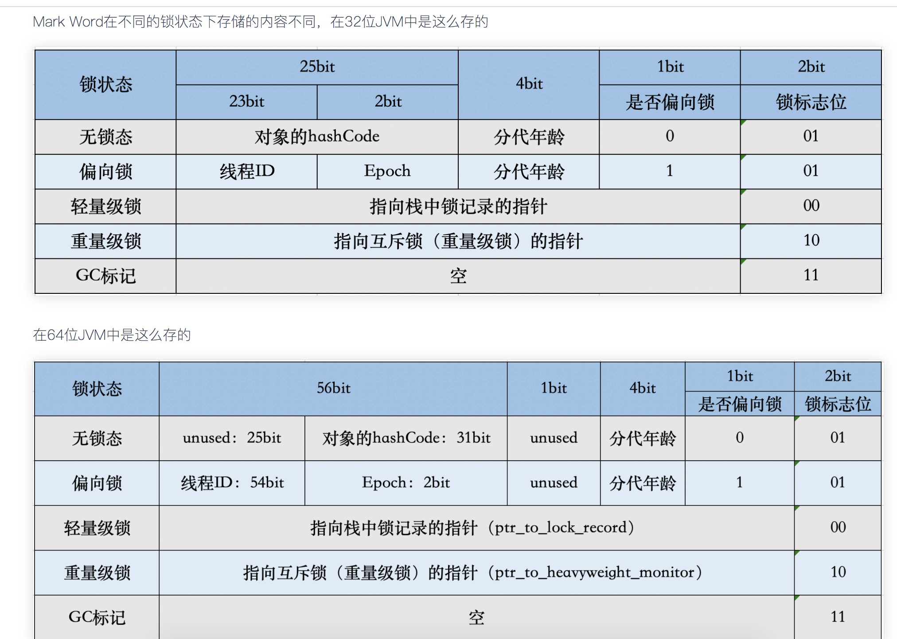

## 对象创建的主要流程
1. 进行类加载的检查 ，检验是否已经加载过

2. 分配内存

3. 初始化 

4. 设置对象头

5. 构造初始化， 执行init方法

6. 将内存地址赋值给变量

### 1 类加载的检查
虚拟机遇到一条new指令时，首先将去检查这个指令的参数是否能在常量池中定位到一个类的符号引用，并且检查这个
符号引用代表的类是否已被加载、解析和初始化过。如果没有，那必须先执行相应的类加载过程。

### 2.分配内存
在类加载检查通过后，接下来虚拟机将为新生对象分配内存。对象所需内存的大小在类 加载完成后便可完全确定，为
对象分配空间的任务等同于把 一块确定大小的内存从Java堆中划分出来。
这个步骤有两个问题:

1.如何划分内存。

2.在并发情况下， 可能出现正在给对象A分配内存，指针还没来得及修改，对象B又同时使用了原来的指针来分配内存的情况。

#### 划分内存的方法:
- 指针碰撞 （默认用指针碰撞）
  
    如果Java堆中内存是绝对规整的，所有用过的内存都放在一边，空闲的内存放在另一边，中间放着一个指针作为分界点 的指示器，那所分配内存就仅仅是把那个指针向空闲空间那边挪动一段与对象大小相等的距离。  

- 空闲列表

    如果Java堆中的内存并不是规整的，已使用的内存和空 闲的内存相互交错，那就没有办法简单地进行指针碰撞了，虚拟 机就必须维护一个列表，记 录上哪些内存块是可用的，在分配的时候从列表中找到一块足够大的空间划分给对象实例， 并更新列表上的记录
  
#### 解决并发问题的方法:

- CAS
    
    虚拟机采用CAS配上失败重试的方式保证更新操作的原子性来对分配内存空间的动作进行同步处理。

- TLAB：本地线程分配缓冲

    把内存分配的动作按照线程划分在不同的空间之中进行，即每个线程在Java堆中预先分配一小块内存。通过­XX:+/­ UseTLAB参数来设定虚拟机是否使用TLAB(JVM会默认开启­XX:+UseTLAB)，­XX:TLABSize 指定TLAB大小。
    
### 3.初始化
内存分配完成后，虚拟机需要将分配到的内存空间都初始化为零值(不包括对象头)， 如果使用TLAB，这一工作过程也 可以提前至TLAB分配时进行。这一步操作保证了对象的实例字段在Java代码中可以不赋初始值就直接使用，程序能访问 到这些字段的数据类型所对应的零值。

### 4.设置对象头
初始化零值之后，虚拟机要对对象进行必要的设置，例如这个对象是哪个类的实例、如何才能找到类的元数据信息、对 象的哈希码、对象的GC分代年龄等信息。这些信息存放在对象的对象头Object Header之中

在HotSpot虚拟机中，对象在内存中存储的布局可以分为3块区域:对象头(Header)、 实例数据(Instance Data) 和对齐填充(Padding)。 HotSpot虚拟机的对象头包括两部分信息，第一部分用于存储对象自身的运行时数据， 如哈 希码(HashCode)、GC分代年龄、锁状态标志、线程持有的锁、偏向线程ID、偏向时 间戳等。对象头的另外一部分 是类型指针，即对象指向它的类元数据的指针，虚拟机通过这个指针来确定这个对象是哪个类的实例。

### 5.执行init方法
执行init方法，即对象按照程序员的意愿进行初始化。对应到语言层面上讲，就是为属性赋值(注意，这与上面的赋
零值不同，这是由程序员赋的值)，和执行构造方法。

#### 指针压缩

**什么是java对象的指针压缩?**
1.jdk1.6 update14开始，在64bit操作系统中，JVM支持指针压缩 

2.jvm配置参数:UseCompressedOops，compressed­­压缩、oop(ordinary object pointer)­­对象指针 

3.启用指针压缩:­XX:+UseCompressedOops(默认开启)，禁止指针压缩:­XX:­UseCompressedOops

**为什么要进行指针压缩?**
1.在64位平台的HotSpot中使用32位指针，内存使用会多出1.5倍左右，使用较大指针在主内存和缓存之间移动数据， 占用较大宽带，同时GC也会承受较大压力

2.为了减少64位平台下内存的消耗，启用指针压缩功能 

3.在jvm中，32位地址最大支持4G内存(2的32次方)，可以通过对对象指针的压缩编码、解码方式进行优化，使得jvm 只用32位地址就可以支持更大的内存配置(小于等于32G) 

4.堆内存小于4G时，不需要启用指针压缩，jvm会直接去除高32位地址，即使用低虚拟地址空间 

5.堆内存大于32G时，压缩指针会失效，会强制使用64位(即8字节)来对java对象寻址，这就会出现1的问题，所以堆内 存不要大于32G为好

### 对象内存分配
#### 对象内存分配流程

#### 对象栈上分配
我们通过JVM内存分配可以知道JAVA中的对象都是在堆上进行分配，当对象没有被引用的时候，需要依靠GC进行回收内 存，如果对象数量较多的时候，会给GC带来较大压力，也间接影响了应用的性能。为了减少临时对象在堆内分配的数量，
JVM通过逃逸分析确定该对象不会被外部访问。如果不会逃逸可以将该对象在栈上分配内存，这样该对象所占用的 内存空间就可以随栈帧出栈而销毁，就减轻了垃圾回收的压力。
**对象逃逸分析**:就是分析对象动态作用域，当一个对象在方法中被定义后，它可能被外部方法所引用，例如作为调用参数传递到其他地方中。

JVM对于这种情况可以通过开启**逃逸分析参数**(-XX:+DoEscapeAnalysis)来优化对象内存分配位置，使其通过标量替换优 先分配在栈上(栈上分配)，JDK7之后默认开启逃逸分析，如果要关闭使用参数(-XX:-DoEscapeAnalysis) 

**标量替换**:通过逃逸分析确定该对象不会被外部访问，并且对象可以被进一步分解时，**JVM不会创建该对象**，而是将该 对象成员变量分解若干个被这个方法使用的成员变量所代替，
这些代替的成员变量在栈帧或寄存器上分配空间，这样就 不会因为没有一大块连续空间导致对象内存不够分配。开启标量替换参数(-XX:+EliminateAllocations)，JDK7之后默认 开启。

**结论:栈上分配依赖于逃逸分析和标量替换**

### 堆内存分配对象的情况

#### 1.对象在Eden区分配

#### 2.大对象直接进入老年代
大对象就是需要大量连续内存空间的对象(比如:字符串、数组)。JVM参数 -XX:PretenureSizeThreshold 可以设置大 对象的大小，如果对象超过设置大小会直接进入老年代，不会进入年轻代，**这个参数只在 Serial 和ParNew两个收集器下 有效**。
**为什么要这样呢?**
为了避免为大对象分配内存时的复制操作而降低效率。

#### 3.长期存活的对象将进入老年代
既然虚拟机采用了分代收集的思想来管理内存，那么内存回收时就必须能识别哪些对象应放在新生代，哪些对象应放在 老年代中。为了做到这一点，虚拟机给每个对象一个对象年龄(Age)计数器。
如果对象在 Eden 出生并经过第一次 Minor GC 后仍然能够存活，并且能被 Survivor 容纳的话，将被移动到 Survivor 空间中，并将对象年龄设为1。对象在 Survivor 中每熬过一次 MinorGC，年龄就增加1岁，当它的年龄增加到一定程度 (默认为15岁，**CMS收集器默认6岁**，不同的垃圾收集器会略微有点不同)，就会被晋升到老年代中。对象晋升到老年代 的年龄阈值，可以通过参数   来设置。

#### 4.对象动态年龄判断
当前放对象的Survivor区域里(其中一块区域，放对象的那块s区)，一批对象的总大小**大于**这块Survivor区域内存大小的 50%(-XX:TargetSurvivorRatio可以指定)，
那么此时大于等于这批对象年龄最大值的对象，就可以直接进入老年代了， 例如Survivor区域里现在有一批对象，年龄1+年龄2+年龄n的多个年龄对象总和超过了Survivor区域的50%，
此时就会 把年龄n(含)以上的对象都放入老年代。这个规则其实是希望那些可能是长期存活的对象，尽早进入老年代。
**对象动态年 龄判断机制一般是在minor gc之后触发的。**

#### 5.老年代空间分配担保机制

年轻代每次minor gc之前JVM都会计算下老年代剩余可用空间 如果这个可用空间小于年轻代里现有的所有对象大小之和(包括垃圾对象) 就会看一个“-XX:-HandlePromotionFailure”(jdk1.8默认就设置了)的参数是否设置了 如果有这个参数，
就会看看老年代的可用内存大小，是否大于之前每一次minor gc后进入老年代的对象的平均大小。 如果上一步结果是小于或者之前说的参数没有设置，那么就会触发一次Full gc，
对老年代和年轻代一起回收一次垃圾， 如果回收完还是没有足够空间存放新的对象就会发生"OOM"
当然，如果minor gc之后剩余存活的需要挪动到老年代的对象大小还是大于老年代可用空间，那么也会触发full gc，full gc完之后如果还是没有空间放minor gc之后的存活对象，则也会发生“OOM”

### 对象内存回收

堆中几乎放着所有的对象实例，对堆垃圾回收前的第一步就是要判断哪些对象已经死亡(即不能再被任何途径使用的对
象)。

#### 引用计数法

#### 可达性分析算法
将“**GC Roots**” 对象作为起点，从这些节点开始向下搜索引用的对象，找到的对象都标记为非垃圾对象，其余未标记的 对象都是垃圾对象
GC Roots根节点:**线程栈的本地变量、静态变量、本地方法栈**的变量等等

#### 如何判断一个类是无用的类
方法区主要回收的是无用的类，那么如何判断一个类是无用的类的呢? 类需要同时满足下面3个条件才能算是 “**无用的类**” :
- 该类所有的实例都已经被回收，也就是 Java 堆中不存在该类的任何实例。
- 加载该类的 ClassLoader 已经被回收。
- 该类对应的 java.lang.Class 对象没有在任何地方被引用，无法在任何地方通过反射访问该类的方法。