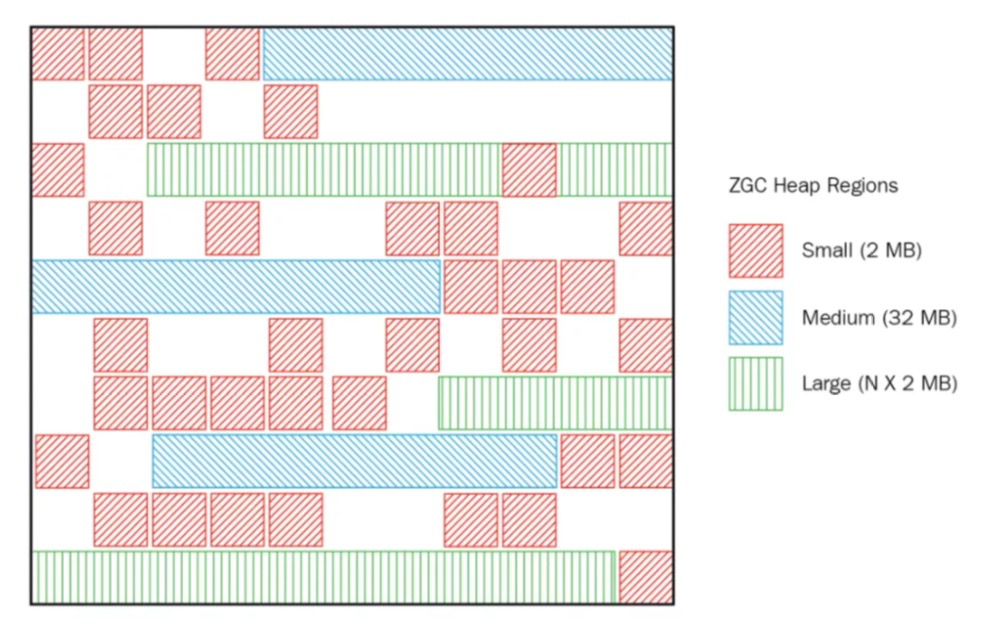
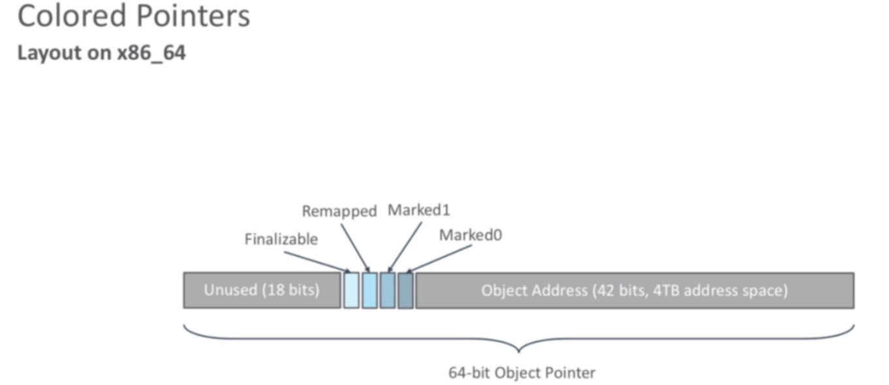

### ZGC收集器(-XX:+UseZGC)
ZGC是一款JDK 11中新加入的具有实验性质的低延迟垃圾收集器，ZGC可以说源自于是Azul System公司开发的 C4(Concurrent Continuously Compacting Collector) 收集器，
ZGC也采用基于Region的堆内存布局，但 与它们不同的是，ZGC的Region（在一些官方资料中将它称为Page或者ZPage，本章为行文一致继续称 为Region）具有动态性——动态创建和销毁，以及动态的区域容量大小。

#### ZGC目标
- **支持TB量级的堆** 我们生产环境的硬盘还没有上TB呢，这应该可以满足未来十年内，所有JAVA应用的需求了吧。

- **最大GC停顿时间不超10ms**

- **奠定未来GC特性的基础**

- **最糟糕的情况下吞吐量会降低15%** 这都不是事，停顿时间足够优秀。至于吞吐量，通过扩容分分钟解决。 另外，Oracle官方提到了它最大的优点是:它的停顿时间不会随着堆的增大而增长!也就是说，几十G堆的停顿时间是 10ms以下，几百G甚至上T堆的停顿时间也是10ms以下。

#### 不分代(暂时)
单代，即ZGC「没有分代」。我们知道以前的垃圾回收器之所以分代，是因为源于“「大部分对象朝生夕死」”的假
设，事实上大部分系统的对象分配行为也确实符合这个假设。 那么为什么ZGC就不分代呢?因为分代实现起来麻烦，作者就先实现出一个比较简单可用的单代版本，后续会优化。

#### ZGC内存布局
ZGC收集器是一款基于Region内存布局的， 暂时不设分代的， 使用了**读屏障**、 **颜色指针**等技术来实现可并发的标记-整 理算法的， 以低延迟为首要目标的一款垃圾收集器。

ZGC的Region可以具有大、 中、 小三类容量:

- 小型Region(Small Region) : 容量固定为2MB， 用于放置小于256KB的小对象。
- 中型Region(Medium Region) : 容量固定为32MB， 用于放置大于等于256KB但小于4MB的对象。
- 大型Region(Large Region) : 容量不固定， 可以动态变化， 但必须为2MB的整数倍， 用于放置4MB或
  以上的大对象。 每个大型Region中
- 只会存放一个大对象， 这也预示着虽然名字叫作“大型Region”， 但它的实际容量完全有可能小于中型Region， 最小容量可低至4MB。 大型Region在ZGC的实现中是不会被重分配(重分配是ZGC的一种处理动作， 用于复制对象的收集器阶段， 稍后会介绍到)的， 因为复制一个大对象的代价非常高昂。

#### NUMA-aware
NUMA对应的有UMA，UMA即Uniform Memory Access Architecture，NUMA就是Non Uniform Memory Access Architecture。UMA表示内存只有一块，所有CPU都去访问这一块内存，那么就会存在竞争问题(争夺内存总线访问 权)，有竞争就会有锁，有锁效率就会受到影响，而且CPU核心数越多，竞争就越激烈。NUMA的话每个CPU对应有一 块内存，且这块内存在主板上离这个CPU是最近的，每个CPU优先访问这块内存，那效率自然就提高了:

服务器的NUMA架构在中大型系统上一直非常盛行，也是高性能的解决方案，尤其在系统延迟方面表现都很优秀。ZGC 是能自动感知NUMA架构并充分利用NUMA架构特性的。

#### 颜色指针
  ZGC收集器有一个标志性的设计是它采用的染色指针技术，从前，如果我们要在对象上存储一些额外的、只供收集 器或者虚拟机本身使用的数据，通常会在对象头中增加额外的存储字段，如对象的哈希码、分代年龄、锁记录等就是这样存储的。 这种记录方式在有对象访问的场景下是很自然流 畅的，不会有什么额外负担。但如果对象存在被移动过的可能性，即不能保证对象访问能够成功呢？ 又或者有一些根本就不会去访问对象，但又希望得知该对象的某些信息的应用场景呢？ 能不能从指针 或者与对象内存无关的地方得到这些信息，譬如是否能够看出来对象被移动过？这样的要求并非不合 理的刁难，先不去说并发移动对象可能带来的可访问性问题， 此前我们就遇到过这样的要求——追踪 式收集算法的标记阶段就可能存在只跟指针打交道而不必涉及指针所引用的对象本身的场景。 例如对象标记的过程中需要给对象打上三色标记，这些标记本质上就只和对象的引用有关，而与对象本身无关——某个对象只有它的引用关系能决定它存活与否，对象上其他所有的属性都不能够影响它的存活判定结果。 HotSpot虚拟机的几种收集器有不同的标记实现方案，有的把标记直接记录在 对象头上（如Serial收集器），有的把标记记录在与对象相互独立的数据结构上（如G1、Shenandoah使 用了一种相当于堆内存的1/64大小的，称为BitMap的结构来记录标记信息）， 而ZGC的染色指针是最 直接的、最纯粹的，它直接把标记信息记在引用对象的指针上，这时，与其说可达性分析是遍历对象图来标记对象，还不如说是遍历“引用图”来标记“引用”了。
  

  染色指针是一种直接将少量额外的信息存储在指针上的技术，可是为什么指针本身也可以存储额 外信息呢？在64位系统中，理论可以访问的内存高达16EB（2的64次幂）字节。 实际上，基于需求 （用不到那么多内存）、性能（地址越宽在做地址转换时需要的页表级数越多）和成本（消耗更多晶 体管）的考虑，在AMD64架构中只支持到52位（4PB）的地址总线和48位（256TB）的虚拟地址空 间， 所以目前64位的硬件实际能够支持的最大内存只有256TB。此外，操作系统一侧也还会施加自己 的约束，64位的Linux则分别支持47位（128TB）的进程虚拟地址空间和46位（64TB）的物理地址空 间， 64位的Windows系统甚至只支持44位（16TB）的物理地址空间。
  

  尽管Linux下64位指针的高18位不能用来寻址，但剩余的46位指针所能支持的64TB内存在今天仍 然能够充分满足大型服务器的需要。鉴于此，ZGC的染色指针技术继续盯上了这剩下的46位指针宽度， 将其高4位提取出来存储四个标志信息。通过这些标志位，虚拟机可以直接从指针中看到其引用对 象的三色标记状态、是否进入了重分配集（即被移动过）、是否只能通过finalize()方法才能被访问到。 当然，由于这些标志位进一步压缩了原本就只有46位的地址空间，也直接导致 ZGC能够管理的内存不可以超过4TB，虽然染色指针有4TB的内存限制，不能支持32位平台，不能支持压缩指针（-XX： +UseCompressedOops）等诸多约束，但它带来的收益也是非常可观的。

每个对象有一个64位指针，这64位被分为:
- 18位:预留给以后使用;
- 1位:Finalizable标识，此位与并发引用处理有关，它表示这个对象只能通过finalizer才能访问;
- 1位:Remapped标识，设置此位的值后，对象未指向relocation set中(relocation set表示需要GC的
  Region集合);
- 1位:Marked1标识;
- 1位:Marked0标识，和上面的Marked1都是标记对象用于辅助GC;
- 42位:对象的地址(所以它可以支持2^42=4T内存):

#### 如何工作
ZGC的运作过程大致可划分为以下四个大的阶 段。全部四个阶段都是可以并发执行的，仅是两个阶段中间会存在短暂的停顿小阶段，这些小阶段， 譬如初始化GC Root直接关联对象的Mark Start，
与之前G1和Shenandoah的Initial Mark阶段并没有什么 差异，笔者就不再单独解释了。ZGC的运作过程具体如图所示。

**并发标记（Concurrent Mark）**
与G1、Shenandoah一样，并发标记是遍历对象图做可达性分析的 阶段，前后也要经过类似于G1、Shenandoah的初始标记、最终标记（尽管ZGC中的名字不叫这些）的 短暂停顿，
而且这些停顿阶段所做的事情在目标上也是相类似的。与G1、Shenandoah不同的是，ZGC 的标记是在指针上而不是在对象上进行的，标记阶段会更新染色指针中的Marked 0、Marked 1标志 位。

**并发预备重分配（Concurrent Prepare for Relocate）**
这个阶段需要根据特定的查询条件统计得出 本次收集过程要清理哪些Region，将这些Region组成重分配集（Relocation Set）。重分配集与G1收集器的回收集（Collection Set）还是有区别的，
ZGC划分Region的目的并非为了像G1那样做收益优先的增量回收。相反，ZGC每次回收都会扫描所有的Region，用范围更大的扫描成本换取省去G1中记忆集的 维护成本。因此，ZGC的重分配集只是决定了里面的存活对象会被重新复制到其他的Region中，
里面 的Region会被释放，而并不能说回收行为就只是针对这个集合里面的Region进行，因为标记过程是针对全堆的。此外，在JDK 12的ZGC中开始支持的类卸载以及弱引用的处理，也是在这个阶段中完成的。

**并发重分配（Concurrent Relocate）：**
重分配是ZGC执行过程中的核心阶段，这个过程要把重分 配集中的存活对象复制到新的Region上，并为重分配集中的每个Region维护一个转发表（Forward Table），
记录从旧对象到新对象的转向关系。得益于染色指针的支持，ZGC收集器能仅从引用上就明 确得知一个对象是否处于重分配集之中，如果用户线程此时并发访问了位于重分配集中的对象，
这次 访问将会被预置的内存屏障所截获，然后立即根据Region上的转发表记录将访问转发到新复制的对象 上，并同时修正更新该引用的值，使其直接指向新对象，
ZGC将这种行为称为指针的“自愈”（Self- Healing）能力。这样做的好处是只有第一次访问旧对象会陷入转发，也就是只慢一次，对比 Shenandoah的Brooks转发指针，
那是每次对象访问都必须付出的固定开销，简单地说就是每次都慢， 因此ZGC对用户程序的运行时负载要比Shenandoah来得更低一些。还有另外一个直接的好处是由于染 色指针的存在，
一旦重分配集中某个Region的存活对象都复制完毕后，这个Region就可以立即释放用于 新对象的分配（但是转发表还得留着不能释放掉），哪怕堆中还有很多指向这个对象的未更新指针也没有关系，
这些旧指针一旦被使用，它们都是可以自愈的。

**并发重映射（Concurrent Remap）**
重映射所做的就是修正整个堆中指向重分配集中旧对象的所 有引用，这一点从目标角度看是与Shenandoah并发引用更新阶段一样的，但是ZGC的并发重映射并不 是一个必须要“迫切”去完成的任务，
因为前面说过，即使是旧引用，它也是可以自愈的，最多只是第 一次使用时多一次转发和修正操作。重映射清理这些旧引用的主要目的是为了不变慢（还有清理结束 后可以释放转发表这样的附带收益），
所以说这并不是很“迫切”。因此，ZGC很巧妙地把并发重映射 阶段要做的工作，合并到了下一次垃圾收集循环中的并发标记阶段里去完成，反正它们都是要遍历所 有对象的，这样合并就节省了一次遍历对象图的开销。
一旦所有指针都被修正之后，原来记录新旧 对象关系的转发表就可以释放掉了。

ZGC的设计理念与Azul System公司的PGC和C4收集器一脉相承[10]，是迄今垃圾收集器研究的最 前沿成果，它与Shenandoah一样做到了几乎整个收集过程都全程可并发，短暂停顿也只与GCRoots大小相关而与堆内存大小无关，
因而同样实现了任何堆上停顿都小于十毫秒的目标。

相比G1、Shenandoah等先进的垃圾收集器，ZGC在实现细节上做了一些不同的权衡选择，譬如G1 需要通过写屏障来维护记忆集，才能处理跨代指针，得以实现Region的增量回收。记忆集要占用大量 的内存空间，写屏障也对正常程序运行造成额外负担，
这些都是权衡选择的代价。ZGC就完全没有使 用记忆集，它甚至连分代都没有，连像CMS中那样只记录新生代和老年代间引用的卡表也不需要，因 而完全没有用到写屏障，所以给用户线程带来的运行负担也要小得多。可是，必定要有优有劣才会称 作权衡，
ZGC的这种选择也限制了它能承受的对象分配速率不会太高，可以想象以下场景来理解 ZGC的这个劣势：ZGC准备要对一个很大的堆做一次完整的并发收集，假设其全过程要持续十分钟以 上（请读者切勿混淆并发时间与停顿时间，ZGC立的Flag是停顿时间不超过十毫秒），
在这段时间里 面，由于应用的对象分配速率很高，将创造大量的新对象，这些新对象很难进入当次收集的标记范 围，通常就只能全部当作存活对象来看待——尽管其中绝大部分对象都是朝生夕灭的，这就产生了大 量的浮动垃圾。如果这种高速分配持续维持的话，
每一次完整的并发收集周期都会很长，回收到的内 存空间持续小于期间并发产生的浮动垃圾所占的空间，堆中剩余可腾挪的空间就越来越小了。目前唯一的办法就是尽可能地增加堆容量大小，获得更多喘息的时间。但是若要从根本上提升ZGC能够应对 的对象分配速率，还是需要引入分代收集，让新生对象都在一个专门的区域中创建，
然后专门针对这 个区域进行更频繁、更快的收集。Azul的C4收集器实现了分代收集后，能够应对的对象分配速率就比 不分代的PGC收集器提升了十倍之多。

