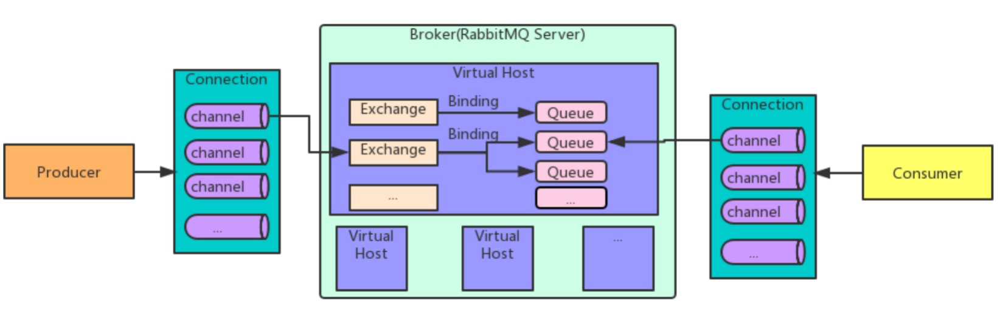
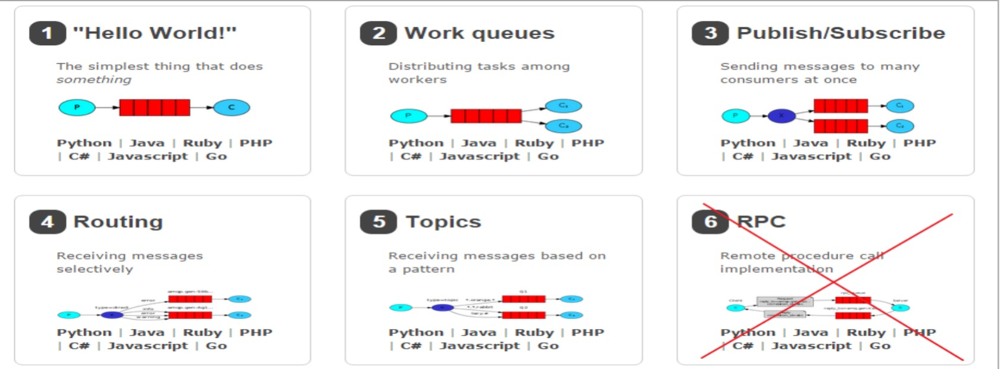
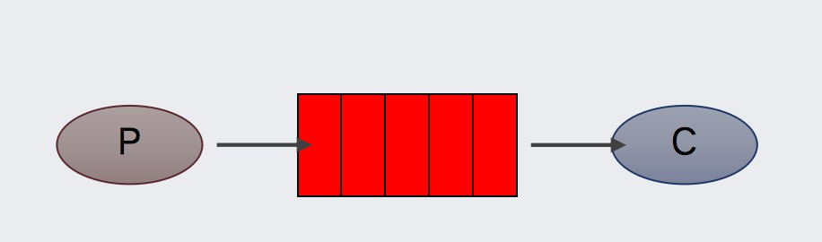
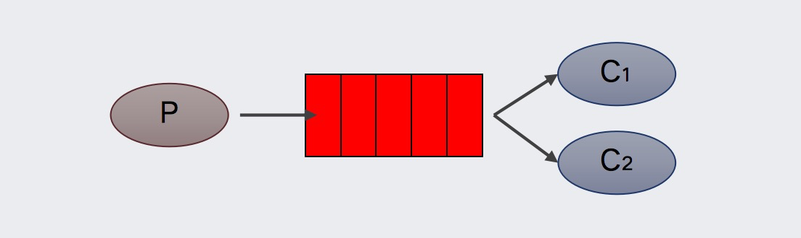
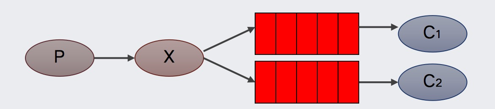
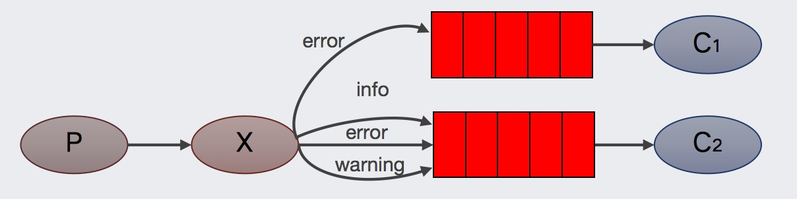
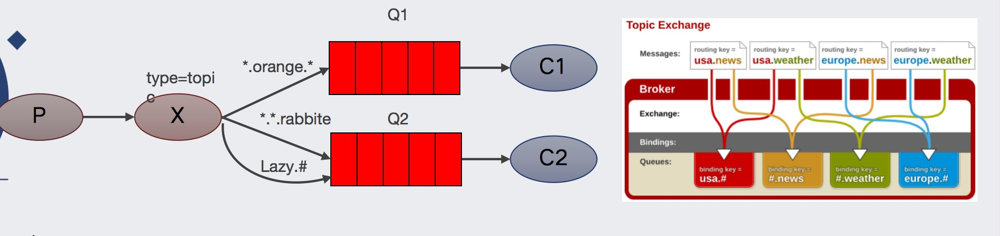

## 简介

AMQP，即 Advanced Message Queuing Protocol（高级消息队列协议），是一个网络协议，是应用层协议的一个开放标准，为面向消息的中间件设计。基于此协议的客户端与消息中间件可传递消息，并不受客户端/中间件不同产品，不同的开发语言等条件的限制。2006年，AMQP 规范发布。类比HTTP。

2007年，Rabbit 技术公司基于 AMQP 标准开发的 RabbitMQ 1.0 发布。RabbitMQ 采用 Erlang 语言开发。Erlang 语言由 Ericson 设计，专门为开发高并发和分布式系统的一种语言，在电信领域使用广泛。

**RabbitMQ 基础架构如下图**

- Broker：接收和分发消息的应用，RabbitMQ Server就是 Message Broker

- Virtual host：出于多租户和安全因素设计的，把 AMQP 的基本组件划分到一个虚拟的分组中，类似于网络中的 namespace 概念。当多个不同的用户使用同一个 RabbitMQ server 提供的服务时，可以划分出多个vhost，每个用户在自己的 vhost 创建 exchange／queue 等

- Connection：publisher／consumer 和 broker 之间的 TCP 连接

- Channel：如果每一次访问 RabbitMQ 都建立一个 Connection，在消息量大的时候建立 TCP Connection的开销将是巨大的，效率也较低。Channel 是在 connection 内部建立的逻辑连接，如果应用程序支持多线程，通常每个thread创建单独的 channel 进行通讯，AMQP method 包含了channel id 帮助客户端和message broker 识别 channel，所以 channel 之间是完全隔离的。Channel 作为轻量级的 Connection 极大减少了操作系统建立 TCP connection 的开销

- Exchange：message 到达 broker 的第一站，根据分发规则，匹配查询表中的 routing key，分发消息到queue 中去。常用的类型有：direct (point-to-point), topic (publish-subscribe) and fanout (multicast)

- Queue：消息最终被送到这里等待 consumer 取走

- exchange 和 queue 之间的虚拟连接，binding 中可以包含 routing key。Binding 信息被保存到 exchange 中的查询表中，用于 message 的分发依据

## 工作模式
RabbitMQ 提供了 6 种工作模式：简单模式、work queues、Publish/Subscribe 发布与订阅模式、Routing 路由模式、Topics 主题模式、RPC 远程调用模式，官网对应模式介绍：https://www.rabbitmq.com/getstarted.html

### 简单模式

在上图的模型中，有以下概念：

- P：生产者，也就是要发送消息的程序
- C：消费者：消息的接收者，会一直等待消息到来
- queue：消息队列，图中红色部分。类似一个邮箱，可以缓存消息；生产者向其中投递消息，消费者从其中取出消息

### Work queues 工作队列模式

- Work Queues：与入门程序的简单模式相比，多了一个或一些消费端，多个消费端共同消费同一个队列中的消息，默认mq会平均分发，也可在客户端设置消息处理完后再拉去消息。

- 应用场景：对于任务过重或任务较多情况使用工作队列可以提高任务处理的速度。

- 在一个队列中如果有多个消费者，那么消费者之间对于同一个消息的关系是竞争的关系。

### Pub/Sub 订阅模式

在订阅模型中，多了一个 Exchange 角色，而且过程略有变化：
- P：生产者，也就是要发送消息的程序，但是不再发送到队列中，而是发给X（交换机）
- C：消费者，消息的接收者，会一直等待消息到来
- Exchange：交换机（X）。一方面，接收生产者发送的消息。另一方面，知道如何处理消息，例如递交给某个特别队列、递交给所有队列、或是将消息丢弃。到底如何操作，取决于Exchange的类型。Exchange有常见以下3种类型：

    1.Fanout：广播，将消息交给所有绑定到交换机的队列
    
    2.Direct：定向，把消息交给符合指定routing key 的队列
    
    3.Topic：通配符，把消息交给符合routing pattern（路由模式） 的队列
    
   Exchange（交换机）只负责转发消息，不具备存储消息的能力，因此如果没有任何队列与 Exchange 绑定，或者没有符合路由规则的队列，那么消息会丢失！
   
使用场景 ：因为所有消费者都能收到相同的消息，所以特别适合类似诗句供应商和应用商的场景，例如天气预报。

**小结**
1. 交换机需要与队列进行绑定，绑定之后；一个消息可以被多个消费者都收到。

2. 发布订阅模式与工作队列模式的区别：
    工作队列模式不用定义交换机，而发布/订阅模式需要定义交换机
    
    发布/订阅模式的生产方是面向交换机发送消息，工作队列模式的生产方是面向队列发送消息(底层使用默认交换机)
    
    发布/订阅模式需要设置队列和交换机的绑定，工作队列模式不需要设置，实际上工作队列模式会将队列绑 定到默认的交换机

### Routing 路由模式

- 队列与交换机的绑定，不能是任意绑定了，而是要指定一个 RoutingKey（路由key）
- 消息的发送方在向 Exchange 发送消息时，也必须指定消息的 RoutingKey
- Exchange 不再把消息交给每一个绑定的队列，而是根据消息的 Routing Key 进行判断，只有队列的Routingkey 与消息的 Routing key 完全一致，才会接收到消息

P：生产者，向 Exchange 发送消息，发送消息时，会指定一个routing key

X：Exchange（交换机），接收生产者的消息，然后把消息递交给与 routing key 完全匹配的队列

C1：消费者，其所在队列指定了需要 routing key 为 error 的消息

C2：消费者，其所在队列指定了需要 routing key 为 info、error、warning 的消息

### Topics 通配符模式

- Topic 类型与 Direct 相比，都是可以根据 RoutingKey 把消息路由到不同的队列。只不过 Topic 类型Exchange 可以让队列在绑定 Routing key 的时候使用通配符！
- Routingkey 一般都是有一个或多个单词组成，多个单词之间以”.”分割，例如： item.insert 
- 通配符规则：# 匹配一个或多个词，* 匹配不多不少恰好1个词，例如：item.# 能够匹配 item.insert.abc 或者 item.insert，item.* 只能匹配 item.insert

Topic 主题模式可以实现 Pub/Sub 发布与订阅模式和 Routing 路由模式的功能，只是 Topic 在配置routing key 的时候可以使用通配符，显得更加灵活。

### 工作模式总结
**1.简单模式 HelloWorld**

一个生产者、一个消费者，不需要设置交换机（使用默认的交换机）。

**2.工作队列模式 Work Queue**

一个生产者、多个消费者（竞争关系），不需要设置交换机（使用默认的交换机）。

**3.发布订阅模式 Publish/subscribe**

需要设置类型为 fanout 的交换机，并且交换机和队列进行绑定，当发送消息到交换机后，交换机会将消息发送到绑定的队列。

**4.路由模式 Routing**

需要设置类型为 direct 的交换机，交换机和队列进行绑定，并且指定 routing key，当发送消息到交换机后，交换机会根据 routing key 将消息发送到对应的队列。

**5.通配符模式 Topic**

需要设置类型为 topic 的交换机，交换机和队列进行绑定，并且指定通配符方式的 routing key，当发送消息到交换机后，交换机会根据 routing key 将消息发送到对应的队列。

### rabbitMq的消息确认机制

rabbitmq在传递消息的时候充当了代理人的角色，那生产者是怎么知道消息被正确的投递到broker了呢

答案是rabbitmq提供了监听机制来接受消息的投递状态

消息的确认涉及两种状态，Confirm 以及 Return

Confirm：代表生产者把消息送到broker时产生的状态，后续会出现两种情况：
- ack：代表broker以及将数据接收
- nack：代表broker拒绝接收消息，原因有很多，队列满了，限流，io异常

Return：代表消息被正常接收并ack后，但是broker内没有对应的队列来接收，以至于消息被退回给生产者。