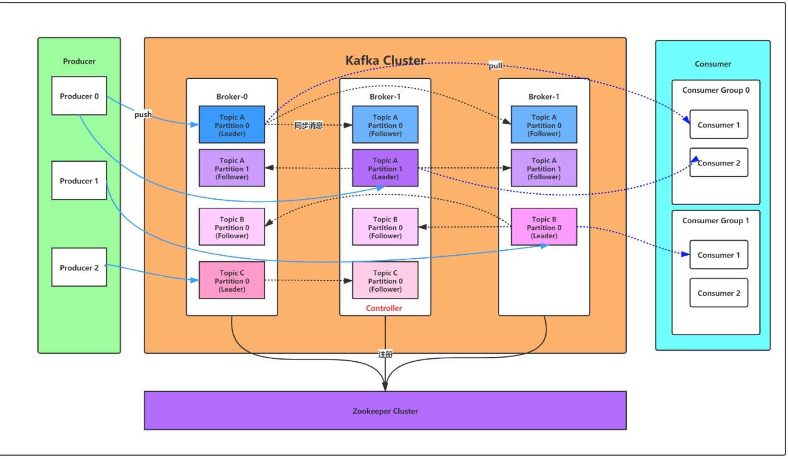
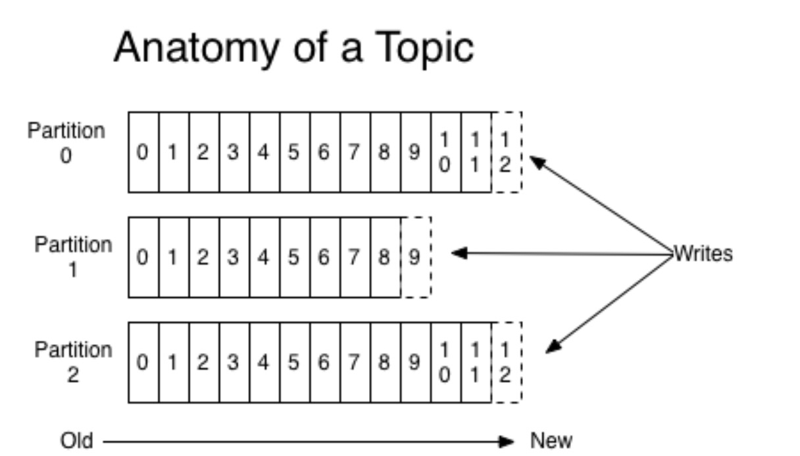

# Kafka基本概念
kafka是一个分布式的，分区的消息(官方称之为commit log)服务。它提供一个消息系统应该具备的功能，但是确有着独特的设计。可以这样来说，Kafka借鉴了JMS规范的思想，但是确并没有完全遵循JMS规范。

首先，让我们来看一下基础的消息(Message)相关术语：

### Broker
消息中间件处理节点，一个Kafka节点就是一个broker，一个或者多个Broker可以组成一个Kafka集群.

### Topic
Kafka根据topic对消息进行归类，发布到Kafka集群的每条消息都需要指定一个topic.

### Producer
消息生产者，向Broker发送消息的客户端

### Consumer
消息消费者，从Broker读取消息的客户端ConsumerGroup

### ConsumerGroup
每个Consumer属于一个特定的Consumer Group，一条消息可以被多个不同的Consumer Group消费，但是一个Consumer Group中只能有一个Consumer能够消费该消息.

### Partition
物理上的概念，一个topic可以分为多个partition，每个partition内部消息是有序的

因此，从一个较高的层面上来看，producer通过网络发送消息到Kafka集群，然后consumer来进行消费，如下图：
 

服务端(brokers)和客户端(producer、consumer)之间通信通过TCP协议来完成。

## 主题Topic和消息日志Log
可以理解Topic是一个类别的名称，同类消息发送到同一个Topic下面。对于每一个Topic，下面可以有多个分区(Partition)日志文件:

Partition是一个有序的message序列，这些message按顺序添加到一个叫做commit log的文件中。每个partition中的消息都有一个唯一的编号，称之为offset，用来唯一标示某个分区中的message。 
每个partition，都对应一个commit log文件。一个partition中的message的offset都是唯一的，但是不同的partition中的message的offset可能是相同的。

kafka一般不会删除消息，不管这些消息有没有被消费。只会根据配置的日志保留时间(log.retention.hours)确认消息多久被删除，默认保留最近一周的日志消息。kafka的性能与保留的消息数据量大小没有关系，因此保存大量的数据消息日志信息不会有什么影响。
每个consumer是基于自己在commit log中的消费进度(offset)来进行工作的。在kafka中，消费offset由consumer自己来维护；一般情况下我们按照顺序逐条消费commit log中的消息，当然我可以通过指定offset来重复消费某些消息，或者跳过某些消息。
这意味kafka中的consumer对集群的影响是非常小的，添加一个或者减少一个consumer，对于集群或者其他consumer来说，都是没有影响的，因为每个consumer维护各自的消费offset。

**可以这么来理解Topic，Partition和Broker**

一个topic，代表逻辑上的一个业务数据集，比如按数据库里不同表的数据操作消息区分放入不同topic，订单相关操作消息放入订单topic，用户相关操作消息放入用户topic，对于大型网站来说，后端数据都是海量的，订单消息很可能是非常巨量的，比如有几百个G甚至达到TB级别，如果把这么多数据都放在一台机器上可定会有容量限制问题，那么就可以在topic内部划分多个partition来分片存储数据，不同的partition可以位于不同的机器上，每台机器上都运行一个Kafka的进程Broker。
为什么要对Topic下数据进行分区存储？

1、commit log文件会受到所在机器的文件系统大小的限制，分区之后可以将不同的分区放在不同的机器上，相当于对数据做了分布式存储，理论上一个topic可以处理任意数量的数据。

2、为了提高并行度。

