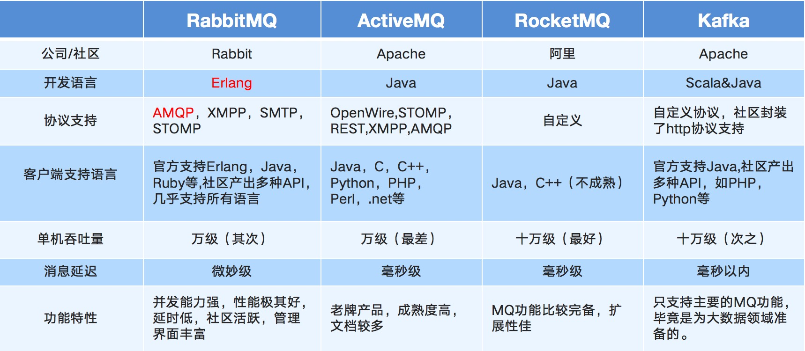

### MQ概述
MQ全称 Message Queue（消息队列），是在消息的传输过程中保存消息的容器。多用于分布式系统之间进行通信。

### MQ的优势
应用解耦：提高系统容错性和可维护性

异步提速：提升用户体验和系统吞吐量

削峰填谷：提高系统稳定性

#### 应用解耦
原应用，各个应用之间抢耦合，只要一个系统不可用，会连锁反应的导致多个系统都不可用

加入mq后，各个系统只要和mq进行交互即可，不关心业务系统之间的调用关系。

#### 异步提速
一个下单操作耗时：20 + 300 + 300 + 300 = 920ms
用户点击完下单按钮后，需要等待920ms才能得到下单响应，太慢！

加入mq后，用户点击完下单按钮后，只需等待25ms就能得到下单响应 (20 + 5 = 25ms)，提升用户体验和系统吞吐量（单位时间内处理请求的数目）。

#### 削峰填谷
压力直接打到业务系统，容易造成短时间压力剧增，系统崩溃

加入mq后，可以让请求信息先存储到mq内，业务系统通过fifo的方式消费

系统并发量对比图

使用了 MQ 之后，限制消费消息的速度为1000，这样一来，高峰期产生的数据势必会被积压在 MQ 中，高峰就被“削”掉了，但是因为消息积压，在高峰期过后的一段时间内，消费消息的速度还是会维持在1000，直到消费完积压的消息，这就叫做“填谷”。使用MQ后，可以提高系统稳定性。

### MQ的劣势
**1 系统可用性降低**

系统引入的外部依赖越多，系统稳定性越差。一旦 MQ 宕机，就会对业务造成影响。如何保证MQ的高可用？

**2 系统复杂度提高**

MQ 的加入大大增加了系统的复杂度，以前系统间是同步的远程调用，现在是通过 MQ 进行异步调用。如何保证消息不被丢失等情况？

### 常见MQ产品的对比

