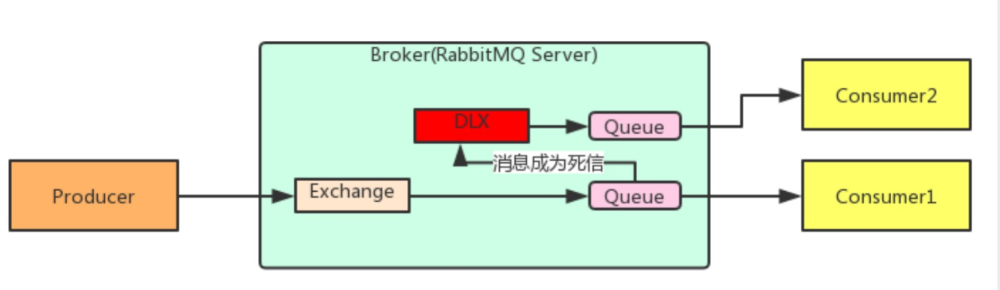
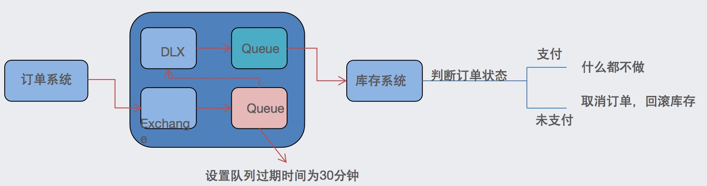

### 消息的可靠投递
在使用 RabbitMQ 的时候，作为消息发送方希望杜绝任何消息丢失或者投递失败场景。RabbitMQ 为我们提供了两种方式用来控制消息的投递可靠性模式。
- confirm 确认模式
- return  退回模式

rabbitmq 整个消息投递的路径为：
producer--->rabbitmq broker--->exchange--->queue--->consumer
- 消息从 producer 到 exchange 则会返回一个 confirmCallback 。
- 消息从 exchange-->queue 投递失败则会返回一个 returnCallback 。

我们将利用这两个 callback 控制消息的可靠性投递

**使用方式**

设置ConnectionFactory的publisher-confirms="true" 开启 确认模式。

使用rabbitTemplate.setConfirmCallback设置回调函数。当消息发送到exchange后回调confirm方法。在方法中判断ack，如果为true，则发送成功，如果为false，则发送失败，需要处理。

设置ConnectionFactory的publisher-returns="true" 开启 退回模式。

使用rabbitTemplate.setReturnCallback设置退回函数，当消息从exchange路由到queue失败后，如果设置了rabbitTemplate.setMandatory(true)参数，则会将消息退回给producer。并执行回调函数returnedMessage。

### Consumer Ack
ack指Acknowledge，确认。 表示消费端收到消息后的确认方式。
有三种确认方式：
- 自动确认：acknowledge="none"
- 手动确认：acknowledge="manual"
- 根据异常情况确认：acknowledge="auto"

其中自动确认是指，当消息一旦被Consumer接收到，则自动确认收到，并将相应 message 从 RabbitMQ 的消息缓存中移除。但是在实际业务处理中，很可能消息接收到，业务处理出现异常，那么该消息就会丢失。如果设置了手动确认方式，则需要在业务处理成功后，调用channel.basicAck()，手动签收，如果出现异常，则调用channel.basicNack()方法，让其自动重新发送消息。

### 消费端限流
- 在 rabbit:listener-container 中配置 prefetch属性设置消费端一次拉取多少消息
- 消费端的确认模式一定为手动确认。acknowledge="manual"

### TTL
TTL 全称 Time To Live（存活时间/过期时间）

当消息到达存活时间后，还没有被消费，会被自动清除。

RabbitMQ可以对消息设置过期时间，也可以对整个队列（Queue）设置过期时间。

设置队列过期时间使用参数：x-message-ttl，单位：ms(毫秒)，会对整个队列消息统一过期。

设置消息过期时间使用参数：expiration。单位：ms(毫秒)，当该消息在队列头部时（消费时），会单独判断这一消息是否过期。

如果两者都进行了设置，以时间短的为准。

### 死信队列
死信队列，英文缩写：DLX  。Dead Letter Exchange（死信交换机），当消息成为Dead message后，可以被重新发送到另一个交换机，这个交换机就是DLX。

队列绑定死信交换机：

给队列设置参数： x-dead-letter-exchange 和 x-dead-letter-routing-key

#### 消息成为死信的三种情况
1. 队列消息长度到达限制；

2. 消费者拒接消费消息，basicNack/basicReject,并且不把消息重新放入原目标队列,requeue=false；

3. 原队列存在消息过期设置，消息到达超时时间未被消费；

### 延迟队列
延迟队列，即消息进入队列后不会立即被消费，只有到达指定时间后，才会被消费。

**需求：**

1. 下单后，30分钟未支付，取消订单，回滚库存。

2. 新用户注册成功7天后，发送短信问候。

**方案：**

很可惜，在RabbitMQ中并未提供延迟队列功能。

但是可以使用：**TTL+死信队列** 组合实现延迟队列的效果。

### 消息幂等性保障
幂等性指一次和多次请求某一个资源，对于资源本身应该具有同样的结果。也就是说，其任意多次执行对资源本身所产生的影响均与一次执行的影响相同。

在MQ中指，消费多条相同的消息，得到与消费该消息一次相同的结果。

解决方案：

- 乐观锁机制

- redis

...

### 消息积压
- 消费者宕机积压
- 消费者消费能力不足积压
- 发送者发流量太大

解决方案:上线更多的消费者,进行正常消费上线专门的队列消费服务,将消息先批量取出来,记录数据库,再慢慢处理

