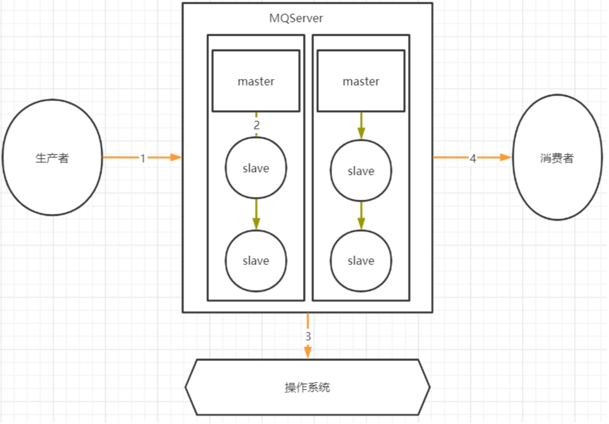
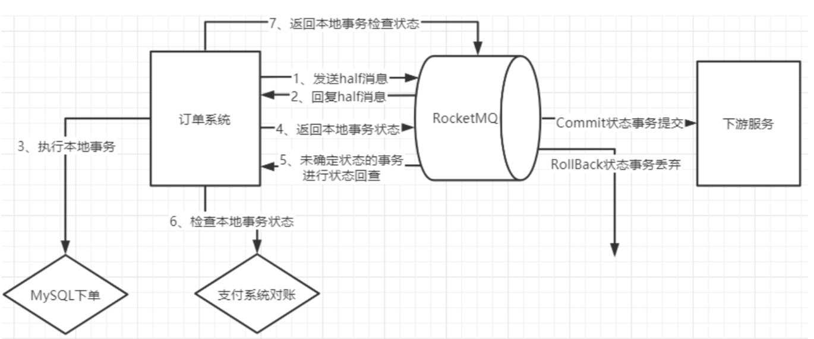

## 使用RocketMQ如何保证消息不丢失
分析这个问题要从以 下几个角度入手:
### 1、哪些环节会有丢消息的可能?

我们考虑一个通用的MQ场景:


其中，1，2，4三个场景都是跨网络的，而跨网络就肯定会有丢消息的可能。

然后关于3这个环节，通常MQ存盘时都会先写入操作系统的缓存page cache中，然后再由操作系统异 步的将消息写入硬盘。这个中间有个时间差，就可能会造成消息丢失。如果服务挂了，缓存中还没有来 得及写入硬盘的消息就会丢失。

这个是MQ场景都会面对的通用的丢消息问题。那我们看看用Rocket时要如何解决这个问题

### RocketMQ消息零丢失方案

#### 1》 生产者使用事务消息机制保证消息零丢失
这个结论比较容易理解，因为RocketMQ的事务消息机制就是为了保证零丢失来设计的，并且经过阿里的验证，肯定是非常靠谱的。

但是如果深入一点的话，我们还是要理解下这个事务消息到底是不是靠谱。我们以最常见的电商订单场景为例，来简单分析下事务消息机制如何保证消息不丢失。我们看下下面这个流程图:


**1、为什么要发送个half消息?有什么用?**

这个half消息是在订单系统进行下单操作前发送，并且对下游服务的消费者是不可见的。那这个消息的 作用更多的体现在确认RocketMQ的服务是否正常。相当于嗅探下RocketMQ服务是否正常，并且通知 RocketMQ，我马上就要发一个很重要的消息了，你做好准备。

**2.half消息如果写入失败了怎么办?**

如果没有half消息这个流程，那我们通常是会在订单系统中先完成下单，再发送消息给MQ。这时候写 入消息到MQ如果失败就会非常尴尬了。而half消息如果写入失败，我们就可以认为MQ的服务是有问题 的，这时，就不能通知下游服务了。我们可以在下单时给订单一个状态标记，然后等待MQ服务正常后 再进行补偿操作，等MQ服务正常后重新下单通知下游服务。

**3.订单系统写数据库失败了怎么办?**

这个问题我们同样比较下没有使用事务消息机制时会怎么办?如果没有使用事务消息，我们只能判断下 单失败，抛出了异常，那就不往MQ发消息了，这样至少保证不会对下游服务进行错误的通知。但是这 样的话，如果过一段时间数据库恢复过来了，这个消息就无法再次发送了。当然，也可以设计另外的补 偿机制，例如将订单数据缓存起来，再启动一个线程定时尝试往数据库写。而如果使用事务消息机制， 就可以有一种更优雅的方案。

如果下单时，写数据库失败(可能是数据库崩了，需要等一段时间才能恢复)。那我们可以另外找个地方 把订单消息先缓存起来(Redis、文本或者其他方式)，然后给RocketMQ返回一个UNKNOWN状态。这样 RocketMQ就会过一段时间来回查事务状态。我们就可以在回查事务状态时再尝试把订单数据写入数据 库，如果数据库这时候已经恢复了，那就能完整正常的下单，再继续后面的业务。这样这个订单的消息 就不会因为数据库临时崩了而丢失。

**4.half消息写入成功后RocketMQ挂了怎么办?**

我们需要注意下，在事务消息的处理机制中，未知状态的事务状态回查是由RocketMQ的Broker主动发 起的。也就是说如果出现了这种情况，那RocketMQ就不会回调到事务消息中回查事务状态的服务。这 时，我们就可以将订单一直标记为"新下单"的状态。而等RocketMQ恢复后，只要存储的消息没有丢 失，RocketMQ就会再次继续状态回查的流程。

**5.下单成功后如何优雅的等待支付成功?**

在订单场景下，通常会要求下单完成后，客户在一定时间内，例如10分钟，内完成订单支付，支付完成
后才会通知下游服务进行进一步的营销补偿。
如果不用事务消息，那通常会怎么办?
最简单的方式是启动一个定时任务，每隔一段时间扫描订单表，比对未支付的订单的下单时间，将超过
时间的订单回收。这种方式显然是有很大问题的，需要定时扫描很庞大的一个订单信息，这对系统是个
不小的压力。那更进一步的方案是什么呢?是不是就可以使用RocketMQ提供的延迟消息机制。往MQ发一个延迟1分 钟的消息，消费到这个消息后去检查订单的支付状态，如果订单已经支付，就往下游发送下单的通知。 而如果没有支付，就再发一个延迟1分钟的消息。最终在第十个消息时把订单回收。这个方案就不用对 全部的订单表进行扫描，而只需要每次处理一个单独的订单消息。
那如果使用上了事务消息呢?我们就可以用事务消息的状态回查机制来替代定时的任务。在下单时，给 Broker返回一个UNKNOWN的未知状态。而在状态回查的方法中去查询订单的支付状态。这样整个业 务逻辑就会简单很多。我们只需要配置RocketMQ中的事务消息回查次数(默认15次)和事务回查间隔时 间(messageDelayLevel)，就可以更优雅的完成这个支付状态检查的需求。

**6、事务消息机制的作用**

整体来说，在订单这个场景下，消息不丢失的问题实际上就还是转化成了下单这个业务与下游服务的业 务的分布式事务一致性问题。而事务一致性问题一直以来都是一个非常复杂的问题。而RocketMQ的事 务消息机制，实际上只保证了整个事务消息的一半，他保证的是订单系统下单和发消息这两个事件的事 务一致性，而对下游服务的事务并没有保证。但是即便如此，也是分布式事务的一个很好的降级方案。
目前来看，也是业内最好的降级方案。

#### 2》RocketMQ配置同步刷盘+Dledger主从架构保证MQ自身不会丢消息
**1、同步刷盘**

这个从我们之前的分析，就很好理解了。我们可以简单的把RocketMQ的刷盘方式 flushDiskType配置
成同步刷盘就可以保证消息在刷盘过程中不会丢失了。

**2、Dledger的文件同步**


在使用Dledger技术搭建的RocketMQ集群中，Dledger会通过两阶段提交的方式保证文件在主从之间成

简单来说，数据同步会通过两个阶段，一个是uncommitted阶段，一个是commited阶段。 Leader Broker上的Dledger收到一条数据后，会标记为uncommitted状态，然后他通过自己的
DledgerServer组件把这个uncommitted数据发给Follower Broker的DledgerServer组件。
接着Follower Broker的DledgerServer收到uncommitted消息之后，必须返回一个ack给 Leader Broker的Dledger。然后如果Leader Broker收到超过半数的Follower Broker返回的ack 之后，就会把消息标记为committed状态。
再接下来， Leader Broker上的DledgerServer就会发送committed消息给Follower Broker 上的DledgerServer，让他们把消息也标记为committed状态。这样，就基于Raft协议完成了两阶 段的数据同步。

#### 3》消费者端不要使用异步消费机制
正常情况下，消费者端都是需要先处理本地事务，然后再给MQ一个ACK响应，这时MQ就会修改 Offset，将消息标记为已消费，从而不再往其他消费者推送消息。所以在Broker的这种重新推送机制 下，消息是不会在传输过程中丢失的。但是也会有下面这种情况会造成服务端消息丢失:

```
DefaultMQPushConsumer consumer = new
DefaultMQPushConsumer("please_rename_unique_group_name_4");
{
consumer.registerMessageListener(new MessageListenerConcurrently()
            @Override
            public ConsumeConcurrentlyStatus
            consumeMessage(List<MessageExt> msgs,
                ConsumeConcurrentlyContext context) {
                new Thread(){
                    public void run(){ //处理业务逻辑
                        System.out.printf("%s Receive New Messages: %s %n",
                        Thread.currentThread().getName(), msgs);
} };
                return ConsumeConcurrentlyStatus.CONSUME_SUCCESS;
            }
});
```
这种异步消费的方式，就有可能造成消息状态返回后消费者本地业务逻辑处理失败造成消息丢失的可能。

#### 4》RocketMQ特有的问题，NameServer挂了如何保证消息不丢失?
NameServer在RocketMQ中，是扮演的一个路由中心的角色，提供到Broker的路由功能。但是其实路 由中心这样的功能，在所有的MQ中都是需要的。kafka是用zookeeper和一个作为Controller的Broker 一起来提供路由服务，整个功能是相当复杂纠结的。而RabbitMQ是由每一个Broker来提供路由服务。 而只有RocketMQ把这个路由中心单独抽取了出来，并独立部署。
这个NameServer之前都了解过，集群中任意多的节点挂掉，都不会影响他提供的路由功能。那如果集 群中所有的NameServer节点都挂了呢?
有很多人就会认为在生产者和消费者中都会有全部路由信息的缓存副本，那整个服务可以正常工作一段 时间。其实这个问题大家可以做一下实验，当NameServer全部挂了后，生产者和消费者是立即就无法 工作了的。至于为什么，可以回顾一下我们之前的源码课程去源码中找找答案。
那再回到我们的消息不丢失的问题，在这种情况下，RocketMQ相当于整个服务都不可用了，那他本身 肯定无法给我们保证消息不丢失了。我们只能自己设计一个降级方案来处理这个问题了。例如在订单系 统中，如果多次尝试发送RocketMQ不成功，那就只能另外找给地方(Redis、文件或者内存等)把订单消 息缓存下来，然后起一个线程定时的扫描这些失败的订单消息，尝试往RocketMQ发送。这样等 RocketMQ的服务恢复过来后，就能第一时间把这些消息重新发送出去。整个这套降级的机制，在大型 互联网项目中，都是必须要有的。

#### 5》RocketMQ消息零丢失方案总结
完整分析过后，整个RocketMQ消息零丢失的方案其实挺简单

- 生产者使用事务消息机制。 
- Broker配置同步刷盘+Dledger主从架构 
- 消费者不要使用异步消费。 
- 整个MQ挂了之后准备降级方案

## 使用RocketMQ如何保证消息顺序
### 如何保证消息有序?

MQ的顺序问题分为全局有序和局部有序。

- 全局有序:整个MQ系统的所有消息严格按照队列先入先出顺序进行消费。
- 局部有序:只保证一部分关键消息的消费顺序。

落地到RocketMQ。通常情况下，发送者发送消息时，会通过MessageQueue轮询的方式保证消 息尽量均匀的分布到所有的MessageQueue上，而消费者也就同样需要从多个MessageQueue上消费 消息。而MessageQueue是RocketMQ存储消息的最小单元，他们之间的消息都是互相隔离的，在这种 情况下，是无法保证消息全局有序的。

而对于局部有序的要求，只需要将有序的一组消息都存入同一个MessageQueue里，这样 MessageQueue的FIFO设计天生就可以保证这一组消息的有序。RocketMQ中，可以在发送者发送消息 时指定一个MessageSelector对象，让这个对象来决定消息发入哪一个MessageQueue。这样就可以保 证一组有序的消息能够发到同一个MessageQueue里。

另外，通常所谓的保证Topic全局消息有序的方式，就是将Topic配置成只有一个MessageQueue队列 (默认是4个)。这样天生就能保证消息全局有序了。这个说法其实就是我们将聊天室场景压缩成只有一个 聊天窗口的QQ一样的理解方式。而这种方式对整个Topic的消息吞吐影响是非常大的，如果这样用，基 本上就没有用MQ的必要了。

#### 使用RocketMQ如何快速处理积压消息?

其实我们回顾下RocketMQ的负载均衡的内容就不难想到解决方案。

如果Topic下的MessageQueue配置得是足够多的，那每个Consumer实际上会分配多个 MessageQueue来进行消费。这个时候，就可以简单的通过增加Consumer的服务节点数量来加快消息 的消费，等积压消息消费完了，再恢复成正常情况。最极限的情况是把Consumer的节点个数设置成跟 MessageQueue的个数相同。但是如果此时再继续增加Consumer的服务节点就没有用了。

而如果Topic下的MessageQueue配置得不够多的话，那就不能用上面这种增加Consumer节点个数的 方法了。这时怎么办呢? 这时如果要快速处理积压的消息，可以创建一个新的Topic，配置足够多的 MessageQueue。然后把所有消费者节点的目标Topic转向新的Topic，并紧急上线一组新的消费者，只 负责消费旧Topic中的消息，并转储到新的Topic中，这个速度是可以很快的。然后在新的Topic上，就可 以通过增加消费者个数来提高消费速度了。之后再根据情况恢复成正常情况。
