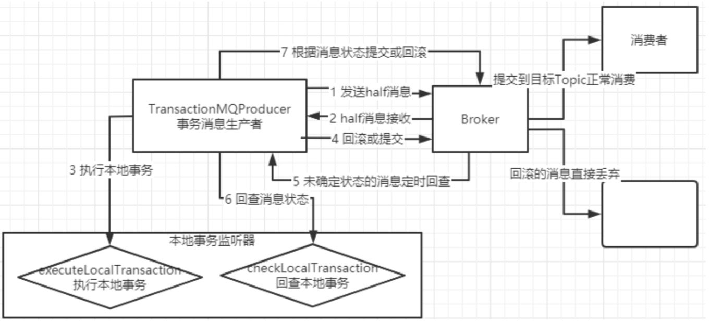

### 消息的发送方式
#### 同步发送
 等待消息返回后再继续进行下面的操作
 
#### 异步发送
不阻塞，可以注册回调

#### 单向发送
这个方法没有返回值，也没有回调。 就是只管把消息发出去就行了。

### 消费者获取消息
消费者消费消息有两种模式，一种是消费者主动去Broker上拉取消息的拉模式，另一种是消费者等待
Broker把消息推送过来的推模式。实际上RocketMQ的推模式也是由拉模式封装出来的。

### 顺序消息
RocketMQ保证的是消息的局部有序，而不是全局有序。

实际上，RocketMQ也只保证了每个OrderID（及分区）的所有消息有序(发到了同一个 queue)，而并不能保证所有消息都有序。所以这就涉及到了RocketMQ消息有序的原理。要保证 最终消费到的消息是有序的，需要从Producer、Broker、Consumer三个步骤都保证消息有序才行。

首先在发送者端:在默认情况下，消息发送者会采取Round Robin轮询方式把消息发送到不同的 MessageQueue(分区队列)，而消费者消费的时候也从多个MessageQueue上拉取消息，这种情 况下消息是不能保证顺序的。而只有当一组有序的消息发送到同一个MessageQueue上时，才能 利用MessageQueue先进先出的特性保证这一组消息有序。

而Broker中一个队列内的消息是可以保证有序的。

然后在消费者端:消费者会从多个消息队列上去拿消息。这时虽然每个消息队列上的消息是有序 的，但是多个队列之间的消息仍然是乱序的。消费者端要保证消息有序，就需要按队列一个一个 来取消息，即取完一个队列的消息后，再去取下一个队列的消息。而给consumer注入的 MessageListenerOrderly对象，在RocketMQ内部就会通过锁队列的方式保证消息是一个一个队 列来取的。MessageListenerConcurrently这个消息监听器则不会锁队列，每次都是从多个 Message中取一批数据(默认不超过32条)。因此也无法保证消息有序。

### 广播消息
广播消息的消息生产者样例见:org.apache.rocketmq.example.broadcast.PushConsumer

广播消息并没有特定的消息消费者样例，这是因为这涉及到消费者的集群消费模式。在集群状态 (MessageModel.CLUSTERING)下，每一条消息只会被同一个消费者组中的一个实例消费到(这跟 kafka和rabbitMQ的集群模式是一样的)。而广播模式则是把消息发给了所有订阅了对应主题的消 费者，而不管消费者是不是同一个消费者组。

### 延迟消息
延迟消息实现的效果就是在调用producer.send方法后，消息并不会立即发送出去，而是会等一 段时间再发送出去。这是RocketMQ特有的一个功能。

那会延迟多久呢?延迟时间的设置就是在Message消息对象上设置一个延迟级别 message.setDelayTimeLevel(3);

开源版本的RocketMQ中，对延迟消息并不支持任意时间的延迟设定(商业版本中支持)，而是只支 持18个固定的延迟级别，1到18分别对应messageDelayLevel=1s 5s 10s 30s 1m 2m 3m 4m 5m 6m 7m 8m 9m 10m 20m 30m 1h 2h。这从哪里看出来的?其实从rocketmq-console控制台就 能看出来。而这18个延迟级别也支持自行定义，不过一般情况下最好不要自定义修改。

定时消息会暂存在名为SCHEDULE_TOPIC_XXXX的topic中，并根据delayTimeLevel存入特定的queue，queueId = delayTimeLevel – 1，即一个queue只存相同延迟的消息，保证具有相同发送延迟的消息能够顺序消费。broker会调度地消费SCHEDULE_TOPIC_XXXX，将消息写入真实的topic。

### 批量消息
批量消息是指将多条消息合并成一个批量消息，一次发送出去。这样的好处是可以减少网络IO，提升吞吐量。
相信大家在官网以及测试代码中都看到了关键的注释:如果批量消息大于1MB就不要用一个批次 发送，而要拆分成多个批次消息发送。也就是说，一个批次消息的大小不要超过1MB

### 过滤消息
 
 - Tag过滤：
 TAG是RocketMQ中特有的一个消息属性。RocketMQ的最佳实践中就建议，使用RocketMQ时， 一个应用可以就用一个Topic，而应用中的不同业务就用TAG来区分。
 
 - SQL过滤：
这个模式的关键是在消费者端使用MessageSelector.bySql(String sql)返回的一个 MessageSelector。这里面的sql语句是按照SQL92标准来执行的。sql中可以使用的参数有默认的 TAGS和一个在生产者中加入的a属性。**只有推模式的消费者可以使用SQL过滤。拉模式是用不了的。**

**消息过滤目前是在Broker端实现的，优点是减少了对于Consumer无用消息的网络传输，缺点是增加了Broker的负担、而且实现相对复杂。**

### 事务消息

首先，我们了解下什么是事务消息。官网的介绍是:事务消息是在分布式系统中保证最终一致性的两 阶段提交的消息实现。他可以保证本地事务执行与消息发送两个操作的原子性，也就是这两个操作一起 成功或者一起失败。

其次，我们来理解下事务消息的编程模型。事务消息只保证消息发送者的本地事务与发消息这两个操 作的原子性，与消费端关系不大。

事务消息生产者的案例见:org.apache.rocketmq.example.transaction.TransactionProducer

事务消息的关键是在TransactionMQProducer中指定了一个TransactionListener事务监听器，这 个事务监听器就是事务消息的关键控制器。

然后，我们要了解下事务消息的使用限制:

1、事务消息不支持延迟消息和批量消息。

2、为了避免单个消息被检查太多次而导致半队列消息累积，我们默认将单个消息的检查次数限制为 15 次，但是用户可以通过 Broker 配置文件的 transactionCheckMax 参数来修改此限制。如果已经检 查某条消息超过 N 次的话( N = transactionCheckMax ) 则 Broker 将丢弃此消息，并在默认情况下 同时打印错误日志。用户可以通过重写 AbstractTransactionCheckListener 类来修改这个行为。

3、事务消息将在 Broker 配置文件中的参数 transactionMsgTimeout 这样的特定时间长度之后被检 查。当发送事务消息时，用户还可以通过设置用户属性 CHECK_IMMUNITY_TIME_IN_SECONDS 来改变 这个限制，该参数优先于 transactionMsgTimeout 参数。

4、事务性消息可能不止一次被检查或消费。

5、提交给用户的目标主题消息可能会失败，目前这依日志的记录而定。它的高可用性通过 RocketMQ 本身的高可用性机制来保证，如果希望确保事务消息不丢失、并且事务完整性得到保证，建议使用**同步的双重写入机制**。

6、事务消息的生产者 ID 不能与其他类型消息的生产者 ID 共享。与其他类型的消息不同，事务消息 允许反向查询、MQ服务器能通过它们的生产者 ID 查询到消费者。

事务消息机制的关键是在发送消息时，会将消息转为一个half半消息，并存入RocketMQ内部的一个 RMQ_SYS_TRANS_HALF_TOPIC 这个Topic，这样对消费者是不可见的。再经过一系列事务检查通过 后，再将消息转存到目标Topic，这样对消费者就可见了。

**最后，我们还需要思考下事务消息的作用。**

大家想一下这个事务消息跟分布式事务有什么关系?为什么扯到了分布式事务相关的两阶段提交上 了?事务消息只保证了发送者本地事务和发送消息这两个操作的原子性，但是并不保证消费者本地事务 的原子性，所以，事务消息只保证了分布式事务的一半。但是即使这样，对于复杂的分布式事务， RocketMQ提供的事务消息也是目前业内最佳的降级方案。

### ACL权限控制

权限控制(ACL)主要为RocketMQ提供Topic资源级别的用户访问控制。用户在使用RocketMQ权限 控制时，可以在Client客户端通过 RPCHook注入AccessKey和SecretKey签名;同时，将对应的权限控 制属性(包括Topic访问权限、IP白名单和AccessKey和SecretKey签名等)设置在 $ROCKETMQ_HOME/conf/plain_acl.yml的配置文件中。Broker端对AccessKey所拥有的权限进行校 验，校验不过，抛出异常; ACL客户端可以参考:org.apache.rocketmq.example.simple包下面的 AclClient代码。

 

 