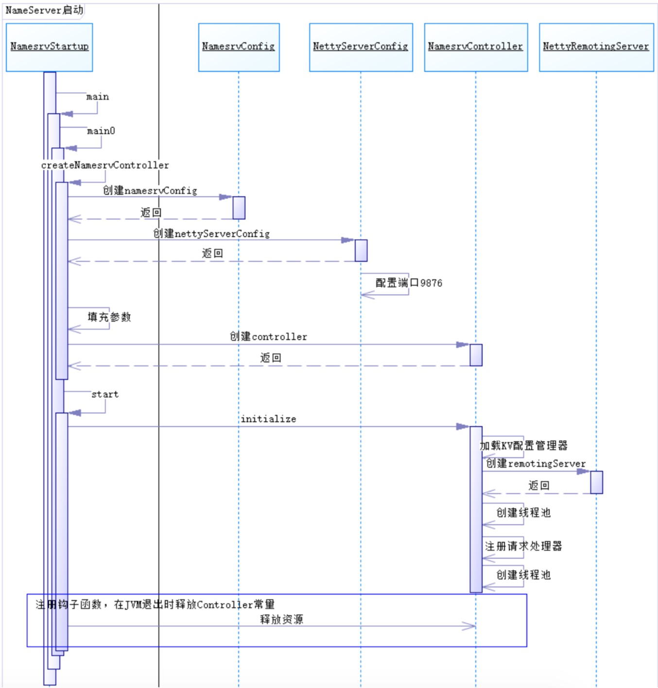
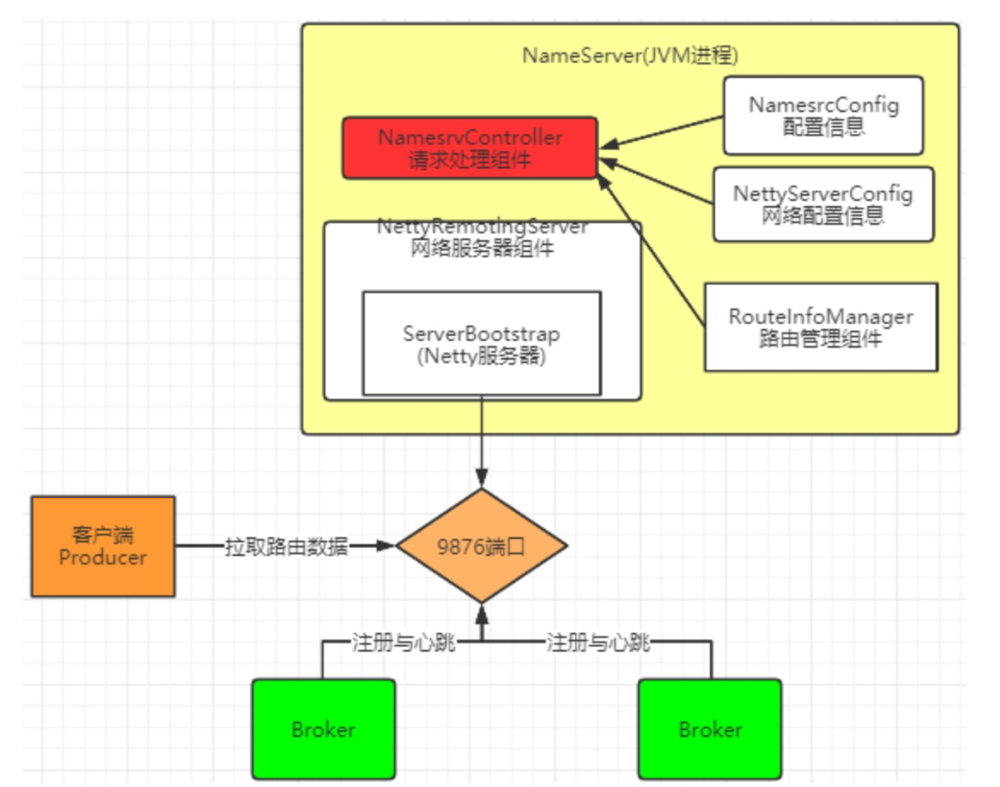
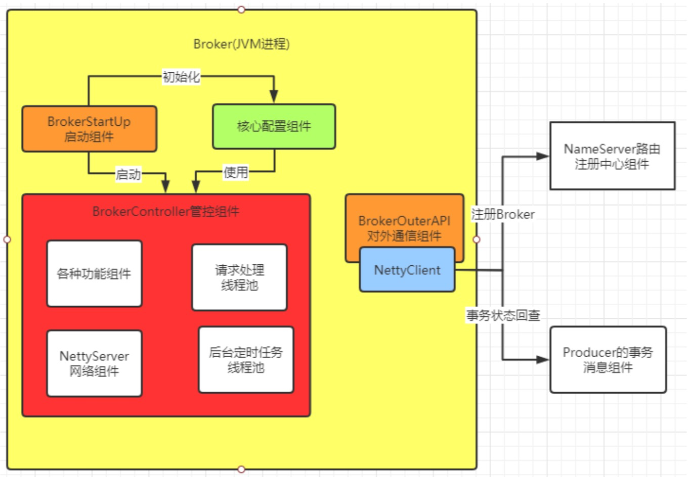
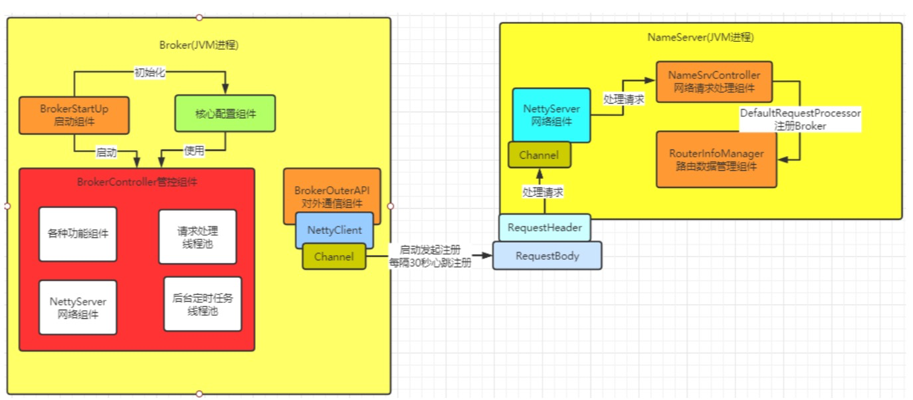
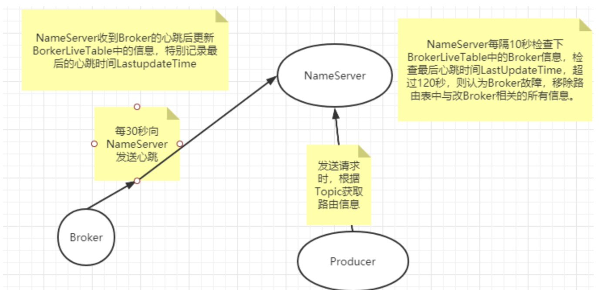
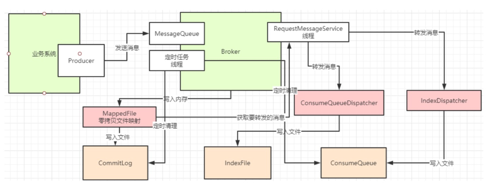
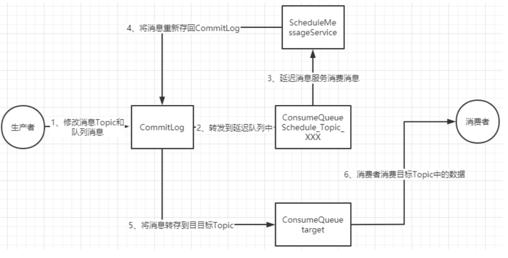

# Rocket源码粗见
源码下很多的功能模块，很容易让人迷失方向，我们只关注下几个最为重要的模块:

broker: broker 模块(broke 启动进程)

client :消息客户端，包含消息生产者、消息消费者相关类 

example: RocketMQ 例代码 

namesrv:NameServer实现相关类(NameServer启动进程) 

store:消息存储实现相关类

## NameServer启动
### 功能回顾
我们已经了解到，在RocketMQ中，实际进行消息存储、推送等核心功能的是Broker。那NameServer具体做什么用呢?NameServer的核心作用其实就只有两个

- 一是维护Broker的服务地址并进行及时的更新。
- 二是给Producer和Consumer提供服务获取Broker列表。

### 启动流程
NameServer的启动入口为NamesrvStartup类的main方法，排除细节，形成的主体流程框架如下：


#### NamesrvStartup
```
//nameServer的启动类
public class NamesrvStartup {

    private static InternalLogger log;
    private static Properties properties = null;
    private static CommandLine commandLine = null;

    //K2 看启动方法时，注意要综合下启动脚本中的JVM参数配置。
    public static void main(String[] args) {
        main0(args);
    }

    public static NamesrvController main0(String[] args) {
        //K2 NameServer启动的核心组件，NamesrvController
        //类似于Web应用里的Controller，这个组件就是用来接收网络请求的。那NameServer到底要接收哪些网络请求？
        try {
            NamesrvController controller = createNamesrvController(args);
            start(controller);
            String tip = "The Name Server boot success. serializeType=" + RemotingCommand.getSerializeTypeConfigInThisServer();
            log.info(tip);
            System.out.printf("%s%n", tip);
            return controller;
        } catch (Throwable e) {
            e.printStackTrace();
            System.exit(-1);
        }

        return null;
    }

    public static NamesrvController createNamesrvController(String[] args) throws IOException, JoranException {
        System.setProperty(RemotingCommand.REMOTING_VERSION_KEY, Integer.toString(MQVersion.CURRENT_VERSION));
        //PackageConflictDetect.detectFastjson();
        //K2 检测命令行参数。简略
        Options options = ServerUtil.buildCommandlineOptions(new Options());
        commandLine = ServerUtil.parseCmdLine("mqnamesrv", args, buildCommandlineOptions(options), new PosixParser());
        if (null == commandLine) {
            System.exit(-1);
            return null;
        }
        //K1 NameServer最核心的三个配置
        //NameSrvConfig 包含NameServer自身运行的参数
        //NettyServerConfig 包含Netty服务端的配置参数，Netty服务端口默认指定了9876。修改端口参见测试案例
        final NamesrvConfig namesrvConfig = new NamesrvConfig();
        final NettyServerConfig nettyServerConfig = new NettyServerConfig();
        nettyServerConfig.setListenPort(9876);
        //K2 解析三个配置对象
        if (commandLine.hasOption('c')) {
            String file = commandLine.getOptionValue('c');
            if (file != null) {
                InputStream in = new BufferedInputStream(new FileInputStream(file));
                properties = new Properties();
                properties.load(in);
                MixAll.properties2Object(properties, namesrvConfig);
                MixAll.properties2Object(properties, nettyServerConfig);

                namesrvConfig.setConfigStorePath(file);

                System.out.printf("load config properties file OK, %s%n", file);
                in.close();
            }
        }

        if (commandLine.hasOption('p')) {
            InternalLogger console = InternalLoggerFactory.getLogger(LoggerName.NAMESRV_CONSOLE_NAME);
            MixAll.printObjectProperties(console, namesrvConfig);
            MixAll.printObjectProperties(console, nettyServerConfig);
            System.exit(0);
        }

        MixAll.properties2Object(ServerUtil.commandLine2Properties(commandLine), namesrvConfig);
        //ROCKETMQ_HOME环境变量检测
        if (null == namesrvConfig.getRocketmqHome()) {
            System.out.printf("Please set the %s variable in your environment to match the location of the RocketMQ installation%n", MixAll.ROCKETMQ_HOME_ENV);
            System.exit(-2);
        }
        //日志相关配置
        LoggerContext lc = (LoggerContext) LoggerFactory.getILoggerFactory();
        JoranConfigurator configurator = new JoranConfigurator();
        configurator.setContext(lc);
        lc.reset();
        configurator.doConfigure(namesrvConfig.getRocketmqHome() + "/conf/logback_namesrv.xml");
        //最后会把全部配置信息打印一下。
        log = InternalLoggerFactory.getLogger(LoggerName.NAMESRV_LOGGER_NAME);

        MixAll.printObjectProperties(log, namesrvConfig);
        MixAll.printObjectProperties(log, nettyServerConfig);

        final NamesrvController controller = new NamesrvController(namesrvConfig, nettyServerConfig);

        // remember all configs to prevent discard
        controller.getConfiguration().registerConfig(properties);

        return controller;
    }

    public static NamesrvController start(final NamesrvController controller) throws Exception {

        if (null == controller) {
            throw new IllegalArgumentException("NamesrvController is null");
        }
        //初始化，主要是初始化几个定时任务
        boolean initResult = controller.initialize();
        if (!initResult) {
            controller.shutdown();
            System.exit(-3);
        }

        Runtime.getRuntime().addShutdownHook(new ShutdownHookThread(log, new Callable<Void>() {
            @Override
            public Void call() throws Exception {
                controller.shutdown();
                return null;
            }
        }));

        controller.start();

        return controller;
    }

    public static void shutdown(final NamesrvController controller) {
        controller.shutdown();
    }

    public static Options buildCommandlineOptions(final Options options) {
        Option opt = new Option("c", "configFile", true, "Name server config properties file");
        opt.setRequired(false);
        options.addOption(opt);

        opt = new Option("p", "printConfigItem", false, "Print all config item");
        opt.setRequired(false);
        options.addOption(opt);

        return options;
    }

    public static Properties getProperties() {
        return properties;
    }
}
```

### NamesrvController
```
/**
 * K1 NameServer的核心管理控制组件。是理解整个NameServer的核心。
 */
public class NamesrvController {
    private static final InternalLogger log = InternalLoggerFactory.getLogger(LoggerName.NAMESRV_LOGGER_NAME);

    private final NamesrvConfig namesrvConfig;

    private final NettyServerConfig nettyServerConfig;

    private final ScheduledExecutorService scheduledExecutorService = Executors.newSingleThreadScheduledExecutor(new ThreadFactoryImpl(
        "NSScheduledThread"));
    private final KVConfigManager kvConfigManager;
    private final RouteInfoManager routeInfoManager;

    private RemotingServer remotingServer;

    private BrokerHousekeepingService brokerHousekeepingService;

    private ExecutorService remotingExecutor;

    private Configuration configuration;
    private FileWatchService fileWatchService;

    public NamesrvController(NamesrvConfig namesrvConfig, NettyServerConfig nettyServerConfig) {
        this.namesrvConfig = namesrvConfig;
        this.nettyServerConfig = nettyServerConfig;
        this.kvConfigManager = new KVConfigManager(this);
        this.routeInfoManager = new RouteInfoManager();
        this.brokerHousekeepingService = new BrokerHousekeepingService(this);
        this.configuration = new Configuration(
            log,
            this.namesrvConfig, this.nettyServerConfig
        );
        this.configuration.setStorePathFromConfig(this.namesrvConfig, "configStorePath");
    }
    //K1 NameController初始化
    public boolean initialize() {
        //加载KV配置
        this.kvConfigManager.load();
        //创建NettyServer网络处理对象
        this.remotingServer = new NettyRemotingServer(this.nettyServerConfig, this.brokerHousekeepingService);
        //Netty服务器的工作线程池
        this.remotingExecutor =
            Executors.newFixedThreadPool(nettyServerConfig.getServerWorkerThreads(), new ThreadFactoryImpl("RemotingExecutorThread_"));
        //注册Processor，把remotingExecutor注入到remotingServer中
        this.registerProcessor();

        //开启定时任务:每隔10s扫描一次Broker,移除不活跃的Broker
        this.scheduledExecutorService.scheduleAtFixedRate(new Runnable() {

            @Override
            public void run() {
                NamesrvController.this.routeInfoManager.scanNotActiveBroker();
            }
        }, 5, 10, TimeUnit.SECONDS);
        //开启定时任务:每隔10min打印一次KV配置
        this.scheduledExecutorService.scheduleAtFixedRate(new Runnable() {

            @Override
            public void run() {
                NamesrvController.this.kvConfigManager.printAllPeriodically();
            }
        }, 1, 10, TimeUnit.MINUTES);

        if (TlsSystemConfig.tlsMode != TlsMode.DISABLED) {
            // Register a listener to reload SslContext
            try {
                fileWatchService = new FileWatchService(
                    new String[] {
                        TlsSystemConfig.tlsServerCertPath,
                        TlsSystemConfig.tlsServerKeyPath,
                        TlsSystemConfig.tlsServerTrustCertPath
                    },
                    new FileWatchService.Listener() {
                        boolean certChanged, keyChanged = false;
                        @Override
                        public void onChanged(String path) {
                            if (path.equals(TlsSystemConfig.tlsServerTrustCertPath)) {
                                log.info("The trust certificate changed, reload the ssl context");
                                reloadServerSslContext();
                            }
                            if (path.equals(TlsSystemConfig.tlsServerCertPath)) {
                                certChanged = true;
                            }
                            if (path.equals(TlsSystemConfig.tlsServerKeyPath)) {
                                keyChanged = true;
                            }
                            if (certChanged && keyChanged) {
                                log.info("The certificate and private key changed, reload the ssl context");
                                certChanged = keyChanged = false;
                                reloadServerSslContext();
                            }
                        }
                        private void reloadServerSslContext() {
                            ((NettyRemotingServer) remotingServer).loadSslContext();
                        }
                    });
            } catch (Exception e) {
                log.warn("FileWatchService created error, can't load the certificate dynamically");
            }
        }

        return true;
    }
    
}
```

### 源码重点
整个NameServer的核心就是一个NamesrvController对象。这个controller对象就跟java Web开发中的Controller功能类似，都是响应客户端请求的。 在创建**NamesrvController**对象时，有两个关键的配置。

- NamesrvConfig 这个是NameServer自己运行需要的配置信息。
- NettyServerConfig 包含Netty服务端的配置参数，默认占用了9876端口。可以在配置文件中覆 盖。

然后在启动服务时，启动几个重要组件:

- RemotingServer（NettyRemotingServer） 这个就是用来响应请求的。
- 还有一个定时任务会定时扫描不活动的Broker。这个Broker管理是通过routeInfoManager这个功 能组件。

**在关闭服务时，关闭了四个东西**

- RemotingServer
- remotingExecutor Netty服务线程池;
- scheduledExecutorService 定时任务;
- fileWatchService 这个是用来跟踪TLS配置的。这是跟权限相关的。

从启动和关闭这两个关键步骤，我们可以总结出NameServer的组件其实并不是很多，整个 NameServer的结构是这样:


## Broker启动
Broker是整个RocketMQ的业务核心，所有消息存储、转发这些最为重要的业务都是在Broker中进行处理的。而Broker的内部架构，有点类似于JavaWeb开发的MVC架构。有Controller负责响应请求，各种Service 组件负责具体业务，然后还有负责消息存盘的功能模块则类似于Dao。所以我们这一段的重点，是通过Broker的启动过程，观察总结出Broker的内部结构。

### 源码重点
Broker启动的入口在**BrokerStartup**这个类，可以从他的main方法开始调试。 启动过程关键点:
重点也是围绕一个**BrokerController**对象，先创建，然后再启动。

**首先**:在BrokerStartup.createBrokerController方法中可以看到Broker的几个核心配置:
BrokerConfig
NettyServerConfig :Netty服务端占用了10911端口。同样也可以在配置文件中覆盖。 NettyClientConfig
MessageStoreConfig

**然后**:在BrokerController.start方法可以看到启动了一大堆Broker的核心服务，我们挑一些重要的
```
this.messageStore.start();启动核心的消息存储组件 
this.remotingServer.start();
this.fastRemotingServer.start(); 启动两个Netty服务 
this.brokerOuterAPI.start();启动客户端，往外发请求 
BrokerController.this.registerBrokerAll: 向NameServer注册心跳。
this.brokerStatsManager.start(); 
this.brokerFastFailure.start();这也是一些负责具体业务的功能组件
```


BrokerStartup部分源码如下所示
```
public class BrokerStartup {
    public static Properties properties = null;
    public static CommandLine commandLine = null;
    public static String configFile = null;
    public static InternalLogger log;

    public static void main(String[] args) {
        start(createBrokerController(args));
    }

    public static BrokerController start(BrokerController controller) {
        try {
            //K1 Controller启动
            controller.start();
            return controller;
        } catch (Throwable e) {
            e.printStackTrace();
            System.exit(-1);
        }

        return null;
    }

    public static void shutdown(final BrokerController controller) {
        if (null != controller) {
            controller.shutdown();
        }
    }
    //K1 创建Broker核心配置
    public static BrokerController createBrokerController(String[] args) {
       
        try {
            
            //K1 Broker的核心配置信息

            final BrokerConfig brokerConfig = new BrokerConfig();
            final NettyServerConfig nettyServerConfig = new NettyServerConfig();
            final NettyClientConfig nettyClientConfig = new NettyClientConfig();
            //TLS加密相关
            nettyClientConfig.setUseTLS(Boolean.parseBoolean(System.getProperty(TLS_ENABLE,
                String.valueOf(TlsSystemConfig.tlsMode == TlsMode.ENFORCING))));
            //Netty服务端的监听端口10911
            nettyServerConfig.setListenPort(10911);
            //K2 这个明显是Broker用来存储消息的一些配置信息。
            final MessageStoreConfig messageStoreConfig = new MessageStoreConfig();
            
            //填充brokerConfig
            MixAll.properties2Object(ServerUtil.commandLine2Properties(commandLine), brokerConfig);

            String namesrvAddr = brokerConfig.getNamesrvAddr();
            if (null != namesrvAddr) {
                try {
                    String[] addrArray = namesrvAddr.split(";");
                    for (String addr : addrArray) {
                        RemotingUtil.string2SocketAddress(addr);
                    }
                } catch (Exception e) {
                    System.out.printf(
                        "The Name Server Address[%s] illegal, please set it as follows, \"127.0.0.1:9876;192.168.0.1:9876\"%n",
                        namesrvAddr);
                    System.exit(-3);
                }
            }
            //判断集群角色。通过BrokerId判断主从
            switch (messageStoreConfig.getBrokerRole()) {
                case ASYNC_MASTER:
                case SYNC_MASTER:
                    brokerConfig.setBrokerId(MixAll.MASTER_ID);
                    break;
                case SLAVE:
                    if (brokerConfig.getBrokerId() <= 0) {
                        System.out.printf("Slave's brokerId must be > 0");
                        System.exit(-3);
                    }

                    break;
                default:
                    break;
            }
            //K2 这里可以看到，判断是否基于Dledger技术来管理主从同步和CommitLog的条件就是brokerId设置为-1
            if (messageStoreConfig.isEnableDLegerCommitLog()) {
                brokerConfig.setBrokerId(-1);
            }

            messageStoreConfig.setHaListenPort(nettyServerConfig.getListenPort() + 1);
            //日志相关的代码。可以稍后再关注
           LoggerContext lc = (LoggerContext) LoggerFactory.getILoggerFactory();
            JoranConfigurator configurator = new JoranConfigurator();
            configurator.setContext(lc);
            lc.reset();
            //注意下这里又是个神奇的配置文件指定。
            configurator.doConfigure(brokerConfig.getRocketmqHome() + "/conf/logback_broker.xml");
            //创建Controllerg
            final BrokerController controller = new BrokerController(
                brokerConfig,
                nettyServerConfig,
                nettyClientConfig,
                messageStoreConfig);
            // remember all configs to prevent discard
            controller.getConfiguration().registerConfig(properties);
            //初始化 注意从中理清楚Broker的组件结构
            boolean initResult = controller.initialize();
            //优雅关闭。释放资源
            Runtime.getRuntime().addShutdownHook(new Thread(new Runnable() {
                private volatile boolean hasShutdown = false;
                private AtomicInteger shutdownTimes = new AtomicInteger(0);

                @Override
                public void run() {
                    synchronized (this) {
                        log.info("Shutdown hook was invoked, {}", this.shutdownTimes.incrementAndGet());
                        if (!this.hasShutdown) {
                            this.hasShutdown = true;
                            long beginTime = System.currentTimeMillis();
                            controller.shutdown();
                            long consumingTimeTotal = System.currentTimeMillis() - beginTime;
                            log.info("Shutdown hook over, consuming total time(ms): {}", consumingTimeTotal);
                        }
                    }
                }
            }, "ShutdownHook"));

            return controller;
        } catch (Throwable e) {
            e.printStackTrace();
            System.exit(-1);
        }

        return null;
    }
}
```

我们需要抽象出Broker的一个整体结构:


## Broker注册
### 功能回顾
在之前我们已经介绍到了。Broker会在启动时向NameServer注册自己的服务信息，并且会定时的往 NameServer发送心跳信息。而NameServer会维护Broker的路由列表，并对路由列表进行实时更新。

### 源码重点
BrokerController.this.registerBrokerAll方法会发起向NameServer注册心跳。启动时会立即注册，同
时也会启动一个线程池，以10秒延迟，默认30秒的间隔 持续向NameServer发送心跳。BrokerController.this.registerBrokerAll这个方法就是注册心跳的入口。然后，在NameServer中也会启动一个定时任务，扫描不活动的Broker。具体观察 NamesrvController.initialize方法。


## Producer
### 功能回顾
Producer有两种

- 一种是普通发送者:DefaultMQProducer。这个只需要构建一个Netty客户端，往Broker发送消息 就行了。注意，异步回调只是在Producer接收到Broker的响应后自行调整流程，不需要提供Netty 服务。

- 另一种是事务消息发送者: TransactionMQProducer。这个需要构建一个Netty客户端，往 Broker发送消息。同时也要构建Netty服务端，供Broker回查本地事务状态。

### 源码重点
整个Producer的流程，大致分两个步骤

- start方法，进行一大堆的准备工作
- 各种各样的send方法，进行消息发送。

那我们重点关注以下几个问题:

**首先** 我们关注下Broker的核心启动流程:

在mQClientFactory的start方法中，启动了生产者的一大堆重要服务。
然后在DefaultMQProducerImpl的start方法中，又回到了生产者的mqClientFactory的启动过程，这中 间有服务状态的管理。

**其次**:关于Borker路由信息的管理: 

Producer需要拉取Broker列表，然后跟Broker建立连接等等很多 核心的流程，其实都是在发送消息时建立的。因为在启动时，还不知道要拉取哪个Topic的Broker列表 呢。所以对于这个问题，我们关注的重点，不应该是start方法，而是send方法。

而对NameServer的地址管理，则是散布在启动和发送的多个过程当中，并且NameServer地址可以通 过一个Http服务来获取。

Send方法中，首先需要获得Topic的路由信息。这会从本地缓存中获取，如果本地缓存中没有，就从 NameServer中去申请。

核心在 org.apache.rocketmq.client.impl.producer.DefaultMQProducerImpl#tryToFindTopicPublishInfo方 法

路由信息大致的管理流程:


**然后** 关于Producer的负载均衡。

在之前介绍RocketMQ的顺序消息时，讲到了Producer的负载均衡策略，默认会把消息平均的发送到所
有MessageQueue里的。那到底是怎么进行负载均衡的呢?

获取路由信息后，会选出一个MessageQueue去发送消息。这个选MessageQueue的方法就是一个索引自增然后取模的方式。

**MQFaultStrategy**
```
//Producer选择MessageQueue的方法
    public MessageQueue selectOneMessageQueue(final TopicPublishInfo tpInfo, final String lastBrokerName) {
        //这个sendLatencyFaultEnable默认是关闭的，Broker故障延迟机制，表示一种发送消息失败后一定时间内不在往同一个Queue重复发送的机制
        if (this.sendLatencyFaultEnable) {
            try {
                //K2 这里可以看到，Producer选择MessageQueue的方法就是自增，然后取模。并且只有这一种方法。
                int index = tpInfo.getSendWhichQueue().getAndIncrement();
                for (int i = 0; i < tpInfo.getMessageQueueList().size(); i++) {
                    int pos = Math.abs(index++) % tpInfo.getMessageQueueList().size();
                    if (pos < 0)
                        pos = 0;
                    MessageQueue mq = tpInfo.getMessageQueueList().get(pos);
                    //Broker轮询。尽量将请求平均分配给不同的Broker
                    if (latencyFaultTolerance.isAvailable(mq.getBrokerName())) {
                        if (null == lastBrokerName || mq.getBrokerName().equals(lastBrokerName))
                            return mq;
                    }
                }

                final String notBestBroker = latencyFaultTolerance.pickOneAtLeast();
                int writeQueueNums = tpInfo.getQueueIdByBroker(notBestBroker);
                if (writeQueueNums > 0) {
                    //这里计算也还是自增取模
                    final MessageQueue mq = tpInfo.selectOneMessageQueue();
                    if (notBestBroker != null) {
                        mq.setBrokerName(notBestBroker);
                        mq.setQueueId(tpInfo.getSendWhichQueue().getAndIncrement() % writeQueueNums);
                    }
                    return mq;
                } else {
                    latencyFaultTolerance.remove(notBestBroker);
                }
            } catch (Exception e) {
                log.error("Error occurred when selecting message queue", e);
            }

            return tpInfo.selectOneMessageQueue();
        }

        return tpInfo.selectOneMessageQueue(lastBrokerName);
    }
```
然后 在发送Netty请求时，实际上是指定的MessageQueue，而不是Topic。Topic只是用来找 MessageQueue。
然后根据MessageQueue再找所在的Broker，往Broker发送请求。

## 消息存储
### 功能回顾
我们接着上面的流程，Producer把消息发到了Broker，接下来就关注下Broker接收到消息后是如何把
消息进行存储的。最终存储的文件有哪些?

- commitLog:消息存储目录
- config:运行期间一些配置信息
- consumerqueue:消息消费队列存储目录
- index:消息索引文件存储目录
- abort:如果存在改文件寿命Broker非正常关闭
- checkpoint:文件检查点，存储CommitLog文件最后一次刷盘时间戳、consumerquueue最后一 次刷盘时间，index索引文件最后一次刷盘时间戳。

**还记得我们之前看到的Broker的核心组件吗?其中messageStore就是负责消息存储的核心组件。**

### 源码重点
消息存储的入口在:DefaultMessageStore.putMessage

**1-commitLog写入**
CommitLog的doAppend方法就是Broker写入消息的实际入口。这个方法最终会把消息追加到MappedFile映射的一块内存里，并没有直接写入磁盘。写入消息的过程是串行的，一次只会允许一个线程写入。

**2-分发ConsumeQueue和IndexFile**
当CommitLog写入一条消息后，在DefaultMessageStore的start方法中，会启动一个后台线程 reputMessageService每隔1毫秒就会去拉取CommitLog中最新更新的一批消息，然后分别转发到 ComsumeQueue和IndexFile里去，这就是他底层的实现逻辑。

并且，如果服务异常宕机，会造成CommitLog和ConsumeQueue、IndexFile文件不一致，有消息写 入CommitLog后，没有分发到索引文件，这样消息就丢失了。DefaultMappedStore的load方法提供了 恢复索引文件的方法，入口在load方法。

**3、文件同步刷盘与异步刷盘**
入口:CommitLog.putMessage -> CommitLog.handleDiskFlush

其中主要涉及到是否开启了堆外内存。TransientStorePoolEnable。如果开启了堆外内存，会在启动 时申请一个跟CommitLog文件大小一致的堆外内存，这部分内存就可以确保不会被交换到虚拟内存中。

**4、过期文件删除**
入口: DefaultMessageStore.addScheduleTask ->
DefaultMessageStore.this.cleanFilesPeriodically()

默认情况下， Broker会启动后台线程，每60秒，检查CommitLog、ConsumeQueue文件。然后对 超过72小时的数据进行删除。也就是说，默认情况下， RocketMQ只会保存3天内的数据。这个时间可 以通过fileReservedTime来配置。注意他删除时，并不会检查消息是否被消费了。

整个文件存储的核心入口入口在DefaultMessageStore的start方法中。

**5 文件存储部分的总结:**

RocketMQ的存储文件包括消息文件(Commitlog)、消息消费队列文件(ConsumerQueue)、Hash 索引文件(IndexFile)、监测点文件(checkPoint)、abort(关闭异常文件)。单个消息存储文件、 消息消费队列文件、Hash索引文件长度固定以便使用内存映射机制进行文件的读写操作。RocketMQ组 织文件以文件的起始偏移量来命令文件，这样根据偏移量能快速定位到真实的物理文件。RocketMQ基 于内存映射文件机制提供了同步刷盘和异步刷盘两种机制，异步刷盘是指在消息存储时先追加到内存映 射文件，然后启动专门的刷盘线程定时将内存中的文件数据刷写到磁盘。

CommitLog，消息存储文件，RocketMQ为了保证消息发送的高吞吐量，采用单一文件存储所有主题消 息，保证消息存储是完全的顺序写，但这样给文件读取带来了不便，为此RocketMQ为了方便消息消费 构建了消息消费队列文件，基于主题与队列进行组织，同时RocketMQ为消息实现了Hash索引，可以为 消息设置索引键，根据所以能够快速从CommitLog文件中检索消息。

当消息达到CommitLog后，会通过ReputMessageService线程接近实时地将消息转发给消息消费队列 文件与索引文件。为了安全起见，RocketMQ引入abort文件，记录Broker的停机是否是正常关闭还是 异常关闭，在重启Broker时为了保证CommitLog文件，消息消费队列文件与Hash索引文件的正确性， 分别采用不同策略来恢复文件。

RocketMQ不会永久存储消息文件、消息消费队列文件，而是启动文件过期机制并在磁盘空间不足或者 默认凌晨4点删除过期文件，文件保存72小时并且在删除文件时并不会判断该消息文件上的消息是否被消费。

## 消费者
### 功能回顾
- 消费者也是有两种，推模式消费者和拉模式消费者。消费者的使用过程也跟生产者差不多，都是先start()然后再开始消费。
- 消费者以消费者组的模式开展。消费者组之间有集群模式和广播模式两种消费模式。我们就要了解下这两种集群模式是如何做的逻辑封装。
- 然后我们关注下消费者端的负载均衡的原理。即消费者是如何绑定消费队列的。
- 最后我们来关注下在推模式的消费者中，MessageListenerConcurrently 和 MessageListenerOrderly这两种消息监听器的处理逻辑到底有什么不同，为什么后者能保持消息 顺序。
### 源码重点
**1、启动**
DefaultMQPushConsumer.start方法

启动过程不用太过关注，有个概念就行，然后客户端启动的核心是mQClientFactory 主要是启动了一 大堆的服务。

这些服务可以结合具体场景再进行深入。例如pullMessageService主要处理拉取消息服务， rebalanceService主要处理客户端的负载均衡。

**2、消息拉取**
拉模式: PullMessageService

PullRequest里有messageQueue和processQueue，其中messageQueue负责拉取消息，拉取到后， 将消息存入processQueue，进行处理。 存入后就可以清空messageQueue，继续拉取了。

**3 客户端负载均衡策略**
在消费者示例的start方法中，启动RebalanceService，这个是客户端进行负载均衡策略的启动服务。他
只负责根据负载均衡策略获取当前客户端分配到的MessageQueue示例。

五种负载策略，可以由Consumer的allocateMessageQueueStrategy属性来选择。
最常用的是AllocateMessageQueueAveragely平均分配和AllocateMessageQueueAveragelyByCircle 平均轮询分配。
平均分配是把MessageQueue按组内的消费者个数平均分配。 而平均轮询分配就是把MessageQueue按组内的消费者一个一个轮询分配。

例如，六个队列q1,q2,q3,q4,q5,q6，分配给三个消费者c1,c2,c3 

平均分配的结果就是: c1:{q1,q2},c2:{q3,q4},c3{q5,q6} 

平均轮询分配的结果就是: c1:{q1,q4},c2:{q2,q5},c3:{q3,q6}

**4 并发消费与顺序消费的过程**

消费的过程依然是在DefaultMQPushConsumerImpl的 consumeMessageService中。他有两个子类 ConsumeMessageConcurrentlyService和ConsumeMessageOrderlyService。其中最主要的差别是 ConsumeMessageOrderlyService会在消费前把队列锁起来，优先保证拉取同一个队列里的消息。

消费过程的入口在DefaultMQPushConsumerImpl的pullMessage中定义的PullCallback中。

## 延迟消息
### 功能回顾
延迟消息的核心使用方法就是在Message中设定一个MessageDelayLevel参数，对应18个延迟级别。然 后Broker中会创建一个默认的Schedule_Topic主题，这个主题下有18个队列，对应18个延迟级别。消 息发过来之后，会先把消息存入Schedule_Topic主题中对应的队列。然后等延迟时间到了，再转发到目 标队列，推送给消费者进行消费。

整个延迟消息的实现方式是这样的:


### 源码重点
延迟消息的处理入口在scheduleMessageService这个组件中。 他会在broker启动时也一起加载。

**1、消息写入:**

代码见CommitLog.putMessage方法。
在CommitLog写入消息时，会判断消息的延迟级别，然后修改Message的Topic和Queue，达到转储 Message的目的。

**2、消息转储到目标Topic**

这个转储的核心服务是scheduleMessageService，他也是Broker启动过程中的一个功能组件、然后ScheduleMessageService会每隔1秒钟执行一个executeOnTimeup任务，将消息从延迟队列中写 入正常Topic中。 代码见ScheduleMessageService中的 DeliverDelayedMessageTimerTask.executeOnTimeup方法。

这个其中有个需要注意的点就是在ScheduleMessageService的start方法中。有一个很关键的CAS操

`if (started.compareAndSet(false, true))`
这个CAS操作保证了同一时间只会有一个**DeliverDelayedMessageTimerTask**执行。保证了消息安全的 同时也限制了消息进行回传的效率。所以，这也是很多互联网公司在使用RocketMQ时，对源码进行定制的一个重点，**可以自定义一个task来处理**。
### 消费者部分小结
RocketMQ消息消费方式分别为集群模式、广播模式。
消息队列负载由RebalanceService线程默认每隔20s进行一次消息队列负载，根据当前消费者组内消费 者个数与主题队列数量按照某一种负载算法进行队列分配，分配原则为同一个消费者可以分配多个消息 消费队列，同一个消息消费队列同一个时间只会分配给一个消费者。
消息拉取由PullMessageService线程根据RebalanceService线程创建的拉取任务进行拉取，默认每次拉 取32条消息，提交给消费者消费线程后继续下一次消息拉取。如果消息消费过慢产生消息堆积会触发消 息消费拉取流控。
并发消息消费指消费线程池中的线程可以并发对同一个消息队列的消息进行消费，消费成功后，取出消 息队列中最小的消息偏移量作为消息消费进度偏移量存储在于消息消费进度存储文件中，集群模式消息 消费进度存储在Broker(消息服务器)，广播模式消息消费进度存储在消费者端。
RocketMQ不支持任意精度的定时调度消息，只支持自定义的消息延迟级别，例如1s、2s、5s等，可通 过在broker配置文件中设置messageDelayLevel。
顺序消息一般使用集群模式，是指对消息消费者内的线程池中的线程对消息消费队列只能串行消费。与 并发消息消费最本质的区别是消息消费时必须成功锁定消息消费队列，在Broker端会存储消息消费队列 的锁占用情况。
    
  


