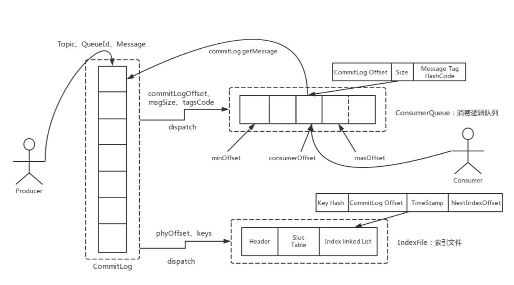
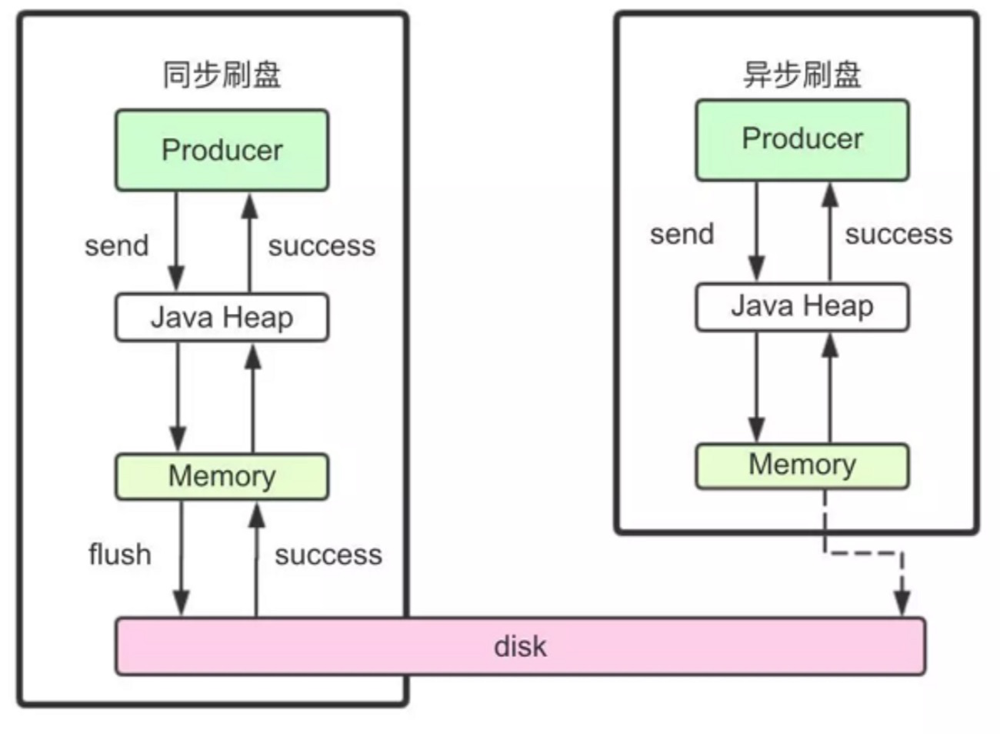

## 1.何时存储消息
分布式队列因为有高可靠性的要求，所以数据要进行持久化存储。
    
    1. MQ收到一条消息后，需要向生产者返回一个ACK响应，并将消息存储起来。
    
    2. MQ Push一条消息给消费者后，等待消费者的ACK响应，需要将消息标记为已消费。如果没有标记为消费，MQ会不断的尝试往消费者推送这条消息。
    
    3. MQ需要定期删除一些过期的消息，这样才能保证服务一直可用。
## 2.消息存储介质
RocketMQ采用的是类似于Kafka的文件存储机制，即直接用磁盘文件来保存消息，而不需要借助MySQL这一类索引工具。

### 2.1 磁盘保存文件慢吗?
磁盘如果使用得当，磁盘的速度完全可以匹配上网络 的数据传输速度。目前的高性能磁盘，顺序写速度 可以达到600MB/s， 超过了一般网卡的传输速度。但是磁盘随机写的速度只有大概100KB/s，和顺序写 的性能相差6000倍!因为有如此巨大的速度差别，好的消息队列系统会比普通的消息队列系统速度快多 个数量级。RocketMQ的消息用顺序写,保证了消息存储的速度。
### 2.2零拷贝技术加速文件读写
Linux操作系统分为【用户态】和【内核态】，文件操作、网络操作需要涉及这两种形态的切换，免不了进行数据复制。

一台服务器把本机磁盘文件的内容发送到客户端，一般分为两个步骤:

1)read;读取本地文件内容; 

2)write;将读取的内容通过网络发送出去。

**这两个看似简单的操作，实际进行了4 次数据复制，分别是:**

1. 从磁盘复制数据到内核态内存;

2. 从内核态内存复 制到用户态内存;

3. 然后从用户态 内存复制到网络驱动的内核态内存;

4. 最后是从网络驱动的内核态内存复 制到网卡中进行传输。

而通过使用mmap的方式，可以省去向用户态的内存复制，即第二步，提高速度。这种机制在Java中是通过NIO包 中的MappedByteBuffer实现的。RocketMQ充分利用了上述特性，也就是所谓的“零拷贝”技术，提高 消息存盘和网络发送的速度。

这里需要注意的是，采用MappedByteBuffer这种内存映射的方式有几个限制，其中之一是一次 只能映射1.5~2G 的文件至用户态的虚拟内存，这也是为何RocketMQ默认设置单个CommitLog 日志数据文件为1G的原因了
关于零拷贝，JAVA的NIO中提供了两种实现方式，mmap和sendfile，其中mmap适合比较小的文 件，而sendfile适合传递比较大的文件。同学们自行回顾下这部分的内容。

## 3.消息存储结构
RocketMQ消息的存储分为三个部分:
- CommitLog:存储消息的元数据。所有消息都会顺序存入到CommitLog文件当中。CommitLog 由多个文件组成，每个文件固定大小1G。以第一条消息的偏移量为文件名。
- ConsumerQueue:存储消息在CommitLog的索引。一个MessageQueue一个文件，记录当前 MessageQueue被哪些消费者组消费到了哪一条CommitLog。
- IndexFile:为了消息查询提供了一种通过key或时间区间来查询消息的方法，这种通过IndexFile来 查找消息的方法不影响发送与消费消息的主流程

整体的消息存储结构如下图:
 

另外还有几个文件可以了解下。
abort:这个文件是RocketMQ用来判断程序是否正常关闭的一个标识文件。正常情况下，会在启 动时创建，而关闭服务时删除。但是如果遇到一些服务器宕机，或者kill -9这样一些非正常关闭服 务的情况，这个abort文件就不会删除，因此RocketMQ就可以判断上一次服务是非正常关闭的， 后续就会做一些数据恢复的操作。
checkpoint:数据存盘检查点
config/*.json:这些文件是将RocketMQ的一些关键配置信息进行存盘保存。例如Topic配置、消 费者组配置、消费者组消息偏移量Offset 等等一些信息。

## 4.刷盘机制
RocketMQ需要将消息存储到磁盘上，这样才能保证断电后消息不会丢失。同时这样才可以让存储的消 息量可以超出内存的限制。RocketMQ为了提高性能，会尽量保证磁盘的顺序写。消息在写入磁盘时， 有两种写磁盘的方式，同步刷盘和异步刷盘。

 

- 同步刷盘:

在返回写成功状态时，消息已经被写入磁盘。具体流程是，消息写入内存的PAGECACHE后，立刻 通知刷盘线程刷盘， 然后等待刷盘完成，刷盘线程执行完成后唤醒等待的线程，返回消息写 成功 的状态。

- 异步刷盘

在返回写成功状态时，消息可能只是被写入了内存的PAGECACHE，写操作的返回快，吞吐量大; 当内存里的消息量积累到一定程度时，统一触发写磁盘动作，快速写入。

- 配置方式:
刷盘方式是通过Broker配置文件里的flushDiskType 参数设置的，这个参数被配置成SYNC_FLUSH、ASYNC_FLUSH中的一个。

## 5.消息主从复制
如果Broker以一个集群的方式部署，会有一个master节点和多个slave节点，消息需要从Master复制到 Slave上。而消息复制的方式分为同步复制和异步复制。

- 同步复制:

同步复制是等Master和Slave都写入消息成功后才反馈给客户端写入成功的状态。
在同步复制下，如果Master节点故障，Slave上有全部的数据备份，这样容易恢复数据。但是同步复制 会增大数据写入的延迟，降低系统的吞吐量。

- 异步复制:

异步复制是只要master写入消息成功，就反馈给客户端写入成功的状态。然后再异步的将消息复制给 Slave节点。
在异步复制下，系统拥有较低的延迟和较高的吞吐量。但是如果master节点故障，而有些数据没有完成 复制，就会造成数据丢失。

- 配置方式:

消息复制方式是通过Broker配置文件里的brokerRole参数进行设置的，这个参数可以被设置成
ASYNC_MASTER、 SYNC_MASTER、SLAVE三个值中的一个。

## 6.负载均衡
### 6.1 Producer负载均衡
Producer发送消息时，默认会轮询目标Topic下的所有MessageQueue，并采用递增取模的方式往不同 的MessageQueue上发送消息，以达到让消息平均落在不同的queue上的目的。而由于 MessageQueue是分布在不同的Broker上的，所以消息也会发送到不同的broker上。

同时生产者在发送消息时，可以指定一个MessageQueueSelector。通过这个对象来将消息发送到自己 指定的MessageQueue上。这样可以保证消息局部有序。

### 6.2 Consumer负载均衡
Consumer也是以MessageQueue为单位来进行负载均衡。分为集群模式和广播模式。

**1、集群模式**
在集群消费模式下，每条消息只需要投递到订阅这个topic的Consumer Group下的一个实例即可。 RocketMQ采用主动拉取的方式拉取并消费消息，在拉取的时候需要明确指定拉取哪一条message queue。

而每当实例的数量有变更，都会触发一次所有实例的负载均衡，这时候会按照queue的数量和实例的数 量平均分配queue给每个实例。
每次分配时，都会将MessageQueue和消费者ID进行排序后，再用不同的分配算法进行分配。内置的分 配的算法共有六种，分别对应AllocateMessageQueueStrategy下的六种实现类，可以在consumer中 直接set来指定。默认情况下使用的是最简单的平均分配策略。

**2、广播模式**

广播模式下，每一条消息都会投递给订阅了Topic的所有消费者实例，所以也就没有消息分配这一说。
而在实现上，就是在Consumer分配Queue时，所有Consumer都分到所有的Queue。

## 7.消息重试
首先对于广播模式的消息， 是不存在消息重试的机制的，即消息消费失败后，不会再重新进行发送，而 只是继续消费新的消息。
而对于普通的消息，当消费者消费消息失败后，你可以通过设置返回状态达到消息重试的结果。

### 7.1 如何让消息进行重试

集群消费方式下，消息消费失败后期望消息重试，需要在消息监听器接口的实现中明确进行配置。可以
有三种配置方式:
- 返回Action.ReconsumeLater-推荐
- 返回null
- 抛出异常

如果希望消费失败后不重试，可以直接返回Action.CommitMessage。

### 7.2 重试消息如何处理
重试的消息会进入一个 “%RETRY%”+ConsumeGroup 的队列中。

然后RocketMQ默认允许每条消息最多重试16次

这个重试时间跟延迟消息的延迟级别是对应的。不过取的是延迟级别的后16级别。 messageDelayLevel=1s 5s 10s 30s 1m 2m 3m 4m 5m 6m 7m 8m 9m 10m 20m 30m 1h 2h
这个重试时间可以将源码中的org.apache.rocketmq.example.quickstart.Consumer里的消息监 听器返回状态改为RECONSUME_LATER测试一下。

**重试次数:**

如果消息重试16次后仍然失败，消息将不再投递。转为进入死信队列。 另外一条消息无论重试多少次，这些重试消息的MessageId始终都是一样的。
然后关于这个重试次数，RocketMQ可以进行定制。例如通过 consumer.setMaxReconsumeTimes(20);将重试次数设定为20次。当定制的重试次数超过16次后，消 息的重试时间间隔均为2小时。

**关于MessageId:**

在老版本的RocketMQ中，一条消息无论重试多少次，这些重试消息的MessageId始终都是一样的。
但是在4.7.1版本中，每次重试MessageId都会重建。

**配置覆盖:**

消息最大重试次数的设置对相同GroupID下的所有Consumer实例有效。并且最后启动的Consumer会 覆盖之前启动的Consumer的配置。

## 8.死信队列
当一条消息消费失败，RocketMQ就会自动进行消息重试。而如果消息超过最大重试次数，RocketMQ 就会认为这个消息有问题。但是此时，RocketMQ不会立刻将这个有问题的消息丢弃，而会将其发送到 这个消费者组对应的一种特殊队列:死信队列。

死信队列的名称是%DLQ%+ConsumGroup

**死信队列的特征:**
一个死信队列对应一个ConsumGroup，而不是对应某个消费者实例。 如果一个ConsumeGroup没有产生死信队列，RocketMQ就不会为其创建相应的死信队列。 一个死信队列包含了这个ConsumeGroup里的所有死信消息，而不区分该消息属于哪个Topic。 死信队列中的消息不会再被消费者正常消费。 死信队列的有效期跟正常消息相同。默认3天，对应broker.conf中的fileReservedTime属性。超过 这个最长时间的消息都会被删除，而不管消息是否消费过。

通常，一条消息进入了死信队列，意味着消息在消费处理的过程中出现了比较严重的错误，并且无法自 行恢复。此时，一般需要人工去查看死信队列中的消息，对错误原因进行排查。然后对死信消息进行处 理，比如转发到正常的Topic重新进行消费，或者丢弃。

注:默认创建出来的死信队列，他里面的消息是无法读取的，在控制台和消费者中都无法读取。 这是因为这些默认的死信队列，他们的权限perm被设置成了2:禁读(这个权限有三种 2:禁读，4:禁 写,6:可读可写)。需要手动将死信队列的权限配置成6，才能被消费(可以通过mqadmin指定或者 web控制台)。

## 9 消息幂等

### 9.1 幂等的概念
在MQ系统中，对于消息幂等有三种实现语义:
- at most once 最多一次:每条消息最多只会被消费一次
- at least once 至少一次:每条消息至少会被消费一次 
- exactly once 刚刚好一次:每条消息都只会确定的消费一次

这三种语义都有他适用的业务场景。
其中，at most once是最好保证的。RocketMQ中可以直接用异步发送、sendOneWay等方式就可以保 证。
而at least once这个语义，RocketMQ也有同步发送、事务消息等很多方式能够保证。
而这个exactly once是MQ中最理想也是最难保证的一种语义，需要有非常精细的设计才行。RocketMQ 只能保证at least once，保证不了exactly once。所以，使用RocketMQ时，需要由业务系统自行保证 消息的幂等性。

### 9.2 消息幂等的必要性

- 发送时消息重复

当一条消息已被成功发送到服务端并完成持久化，此时出现了网络闪断或者客户端宕机，导致服务 端对客户端应答失败。 如果此时生产者意识到消息发送失败并尝试再次发送消息，消费者后续会 收到两条内容相同并且 Message ID 也相同的消息。

- 投递时消息重复

消息消费的场景下，消息已投递到消费者并完成业务处理，当客户端给服务端反馈应答的时候网络 闪断。 为了保证消息至少被消费一次，消息队列 RocketMQ 的服务端将在网络恢复后再次尝试投 递之前已被处理过的消息，消费者后续会收到两条内容相同并且 Message ID 也相同的消息。

- 负载均衡时消息重复(包括但不限于网络抖动、Broker 重启以及订阅方应用重启)

当消息队列 RocketMQ 的 Broker 或客户端重启、扩容或缩容时，会触发 Rebalance，此时消费
者可能会收到重复消息。

### 9.3 处理方式
从上面的分析中，我们知道，在RocketMQ中，是无法保证每个消息只被投递一次的，所以要在业务上
自行来保证消息消费的幂等性。 而要处理这个问题，RocketMQ的每条消息都有一个唯一的MessageId，这个参数在多次投递的过程中
是不会改变的，所以业务上可以用这个MessageId来作为判断幂等的关键依据。
但是，这个MessageId是无法保证全局唯一的，也会有冲突的情况。所以在一些对幂等性要求严格的场 景，最好是使用业务上唯一的一个标识比较靠谱。例如订单ID。而这个业务标识可以使用Message的 Key来进行传递。

