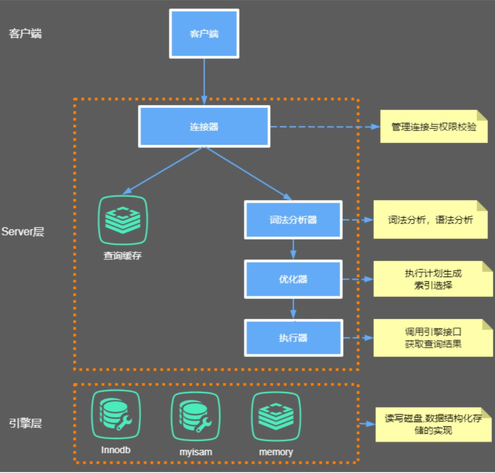
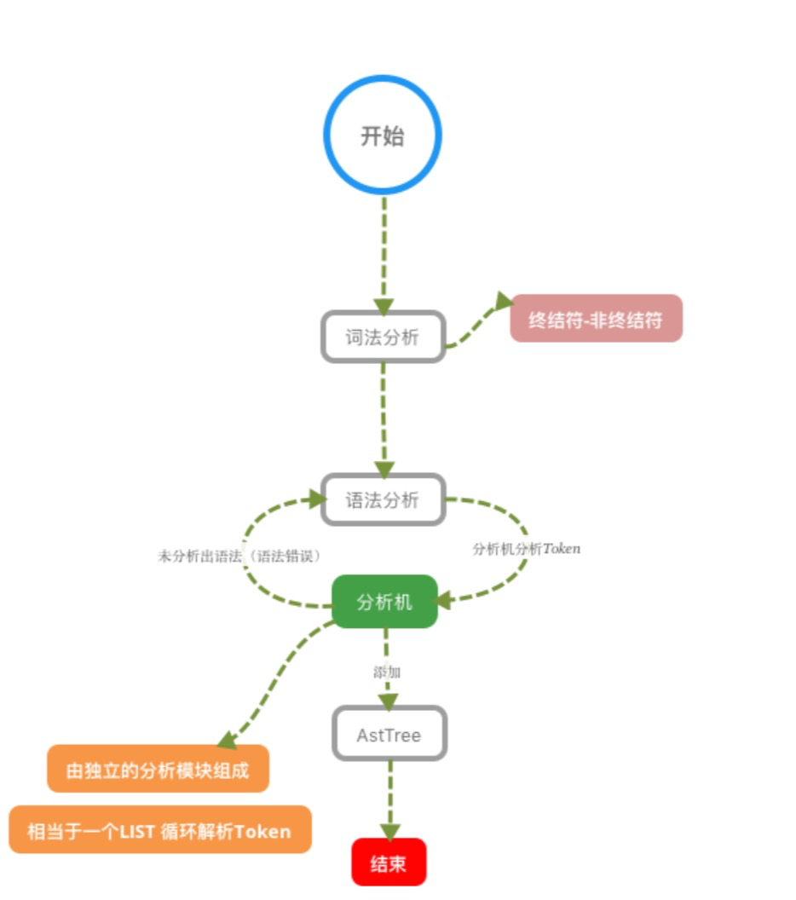

## MySQL的内部组件结构



### Server层
主要包括连接器、查询缓存、分析器、优化器、执行器等，涵盖 MySQL 的大多数核心服务功能，以及所有的内置函数 (如日期、时间、数学和加密函数等)，所有跨存储引擎的功能都在这一层实现，比如存储过程、触发器、视图等。


### 存储引擎层
存储引擎层负责数据的存储和提取。其架构模式是插件式的，支持 InnoDB、MyISAM、Memory 等多个存储引擎。现在
最常用的存储引擎是 InnoDB，它从 MySQL 5.5.5 版本开始成为了默认存储引擎。也就是说如果我们在create table时不指定 表的存储引擎类型,默认会给你设置存储引擎为InnoDB。


### 连接器
我们知道由于MySQL是开源的，他有非常多种类的客户端:navicat,mysql front,jdbc,SQLyog等非常丰富的客户端,这些 客户端要向mysql发起通信都必须先跟Server端建立通信连接，而建立连接的工作就是有连接器完成的。
第一步，你会先连接到这个数据库上，这时候接待你的就是连接器。连接器负责跟客户端建立连接、获取权限、维持和管
理连接。连接命令一般是这么写的：
`mysql ‐h host[数据库地址] ‐u root[用户] ‐p root[密码] ‐P 3306`

连接完成后，如果你没有后续的动作，这个连接就处于空闲状态，你可以在 show processlist 命令中看到它。文本中这个 图是 show processlist 的结果，其中的 Command 列显示为“Sleep”的这一行，就表示现在系统里面有一个空闲连接。


客户端如果长时间不发送command到Server端，连接器就会自动将它断开。这个时间是由参数 wait_timeout 控制的，默认值 是 8 小时。

`show global variables like "wait_timeout";`
`set global wait_timeout=28800; 设置全局服务器关闭非交互连接之前等待活动的秒数`

数据库里面，长连接是指连接成功后，如果客户端持续有请求，则一直使用同一个连接。短连接则是指每次执行完很少的几次
查询就断开连接，下次查询再重新建立一个。
开发当中我们大多数时候用的都是长连接,把连接放在Pool内进行管理，但是长连接有些时候会导致 MySQL 占用内存涨得特别
快，这是因为 MySQL 在执行过程中临时使用的内存是管理在连接对象里面的。这些资源会在连接断开的时候才释放。所以如
果长连接累积下来，可能导致内存占用太大，被系统强行杀掉(OOM)，从现象看就是 MySQL 异常重启了。
怎么解决这类问题呢?
 - 定期断开长连接。使用一段时间，或者程序里面判断执行过一个占用内存的大查询后，断开连接，之后要查询再重连.
 - 如果你用的是 MySQL 5.7 或更新版本，可以在每次执行一个比较大的操作后，通过执行 mysql_reset_connection 来重新初始化连接资 源。这个过程不需要重连和重新做权限验证，但是会将连接恢复到刚刚创建完时的状态。
 
 
### 查询缓存

连接建立完成后，你就可以执行 select 语句了。执行逻辑就会来到第二步:查询缓存。
MySQL 拿到一个查询请求后，会先到查询缓存看看，之前是不是执行过这条语句。之前执行过的语句及其结果可能会以 key-value 对的形式，被直接缓存在内存中。key 是查询的语句，value 是查询的结果。如果你的查询能够直接在这个缓存中找 到 key，那么这个 value 就会被直接返回给客户端。
如果语句不在查询缓存中，就会继续后面的执行阶段。执行完成后，执行结果会被存入查询缓存中。你可以看到，如果查 询命中缓存，MySQL 不需要执行后面的复杂操作，就可以直接返回结果，这个效率会很高。

**大多数情况查询缓存就是个鸡肋，为什么呢?**
因为查询缓存往往弊大于利。查询缓存的失效非常频繁，只要有对一个表的更新，这个表上所有的查询缓存都会被清空。
因此很可能你费劲地把结果存起来，还没使用呢，就被一个更新全清空了。对于更新压力大的数据库来说，查询缓存的命中率
会非常低。一般建议大家在静态表里使用查询缓存，什么叫静态表呢?就是一般我们极少更新的表。比如，一个系统配置表、字典 表，那这张表上的查询才适合使用查询缓存。好在 MySQL 也提供了这种“按需使用”的方式。你可以将my.cnf参数 query_cache_type 设置成 DEMAND。

```
1 my.cnf
2 #query_cache_type有3个值 0代表关闭查询缓存OFF，1代表开启ON，2(DEMAND)代表当sql语句中有SQL_CACHE
关键词时才缓存
3 query_cache_type=2
```
这样对于默认的 SQL 语句都不使用查询缓存。而对于你确定要使用查询缓存的语句，可以用 SQL_CACHE 显式指定，像下 面这个语句一样:
`select SQL_CACHE * from test where ID=5;`

查看当前mysql实例是否开启缓存机制:
`show global variables like "%query_cache_type%";`

**mysql8.0已经移除了查询缓存功能**

### 分析器
如果没有命中查询缓存，就要开始真正执行语句了。首先，MySQL 需要知道你要做什么，因此需要对 SQL 语句做解析。 分析器先会做“**词法分析**”。你输入的是由多个字符串和空格组成的一条 SQL 语句，MySQL 需要识别出里面的字符串分别是 什么，代表什么。
MySQL 从你输入的"select"这个**关键字识别**出来，这是一个查询语句。它也要把字符串“T”识别成“表名 T”，把字符 串“ID”识别成“列 ID”。 做完了这些识别以后，就要做“**语法分析**”。根据词法分析的结果，语法分析器会根据语法规则，判断你输入的这个 SQL 语句 是否满足 MySQL 语法。
如果你的语句不对，就会收到“You have an error in your SQL syntax”的错误提醒

#### 词法分析器原理
1、词法分析 2、语法分析 3、语义分析 4、构造执行树 5、生成执行计划 6、计划的执行



### 优化器
经过了分析器，MySQL 就知道你要做什么了。在开始执行之前，还要先经过优化器的处理。
优化器是在表里面有多个索引的时候，决定使用哪个索引;或者在一个语句有多表关联(join)的时候，决定各个表的连接 顺序。

### 执行器
`1 mysql> select * from test where id=1;`
开始执行的时候，要先判断一下你对这个表 T 有没有执行查询的权限，如果没有，就会返回没有权限的错误，
如果有权限，就打开表继续执行。打开表的时候，执行器就会根据表的引擎定义，去使用这个引擎提供的接口。 比如我们这个例子中的表 test 中，ID 字段没有索引，那么执行器的执行流程是这样的:
1. 调用 InnoDB 引擎接口取这个表的第一行，判断 ID 值是不是 10，如果不是则跳过，如果是则将这行存在结果集中; 
2. 调用引擎接口取“下一行”，重复相同的判断逻辑，直到取到这个表的最后一行。
3. 执行器将上述遍历过程中所有满足条件的行组成的记录集作为结果集返回给客户端。
至此，这个语句就执行完成了。对于有索引的表，执行的逻辑也差不多。第一次调用的是“取满足条件的第一行”这个接 口，之后循环取“满足条件的下一行”这个接口，这些接口都是引擎中已经定义好的。你会在数据库的慢查询日志中看到一个 rows_examined 的字段，表示这个语句执行过程中扫描了多少行。这个值就是在执行器每次调用引擎获取数据行的时候累加 的。在有些场景下，执行器调用一次，在引擎内部则扫描了多行，因此引擎扫描行数跟 rows_examined 并不是完全相同的。

### bin-log归档
删库是不需要跑路的，因为我们的SQL执行时，会将sql语句的执行逻辑记录在我们的bin-log当中，什么是bin-log呢?
binlog是Server层实现的二进制日志,他会记录我们的cud操作。Binlog有以下几个特点:
1、Binlog在MySQL的Server层实现(引擎共用) 

2、Binlog为逻辑日志,记录的是一条语句的原始逻辑 

3、Binlog不限大小,追加写入,不会覆盖以前的日志

如果，我们误删了数据库,可以使用binlog进行归档!要使用binlog归档，首先我们得记录binlog，因此需要先开启MySQL的 binlog功能。
配置my.cnf
```
1 配置开启binlog
2 log‐bin=/usr/local/mysql/data/binlog/mysql‐bin
3 注意5.7以及更高版本需要配置本项:server‐id=123454(自定义,保证唯一性);
4 #binlog格式，有3种statement,row,mixed
5 binlog‐format=ROW
6 #表示每1次执行写入就与硬盘同步，会影响性能，为0时表示，事务提交时mysql不做刷盘操作，由系统决定 7 sync‐binlog=1
```
 binlog命令
 
 `
 mysql> show variables like '%log_bin%'; 查看bin‐log是否开启 2 mysql> flush logs; 会多一个最新的bin‐log日志
 3 mysql> show master status; 查看最后一个bin‐log日志的相关信息 4 mysql> reset master; 清空所有的bin‐log日志
 `
 
 查看binlog内容
 
 `mysql> /usr/local/mysql/bin/mysqlbinlog ‐‐no‐defaults /usr/local/mysql/data/binlog/mysql‐bin. 000001 查看binlog内容`
 
 binlog里的内容不具备可读性，所以需要我们自己去判断恢复的逻辑点位，怎么观察呢?看重点信息，比如begin,commit这种 关键词信息，只要在binlog当中看到了，你就可以理解为begin-commit之间的信息是一个完整的事务逻辑,然后再根据位置 position判断恢复即可。
 
 
 
 


