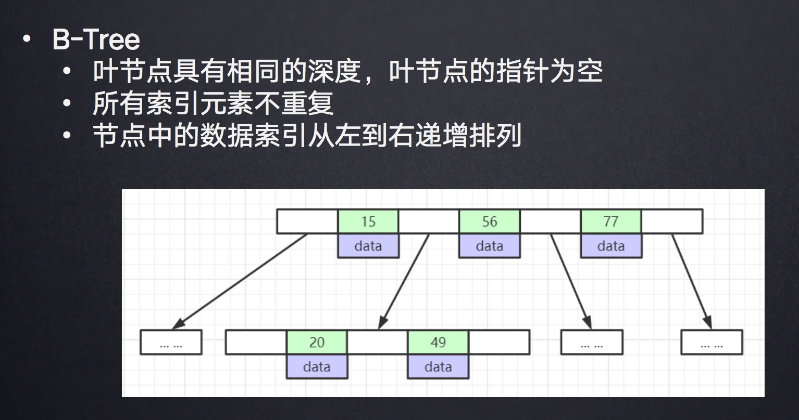
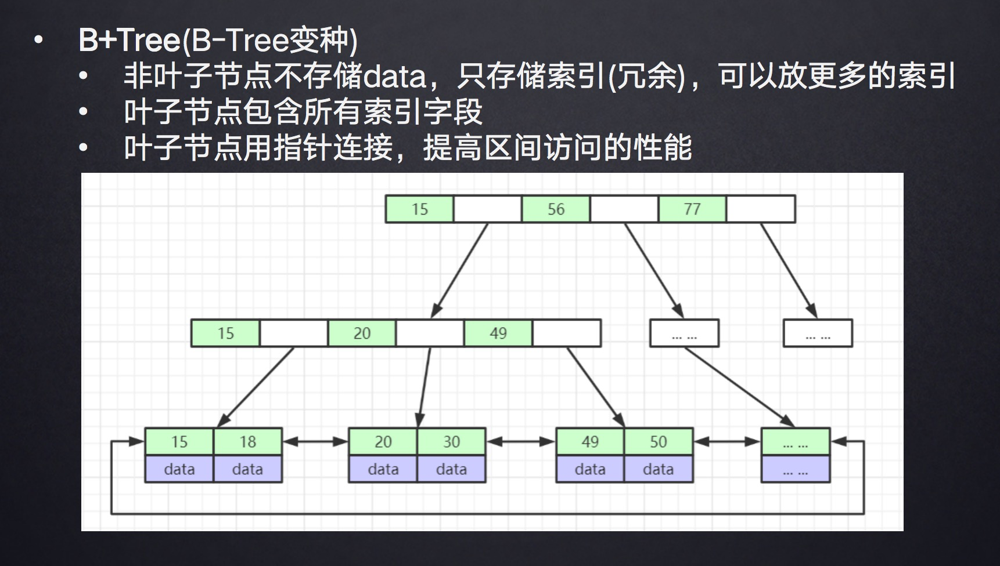
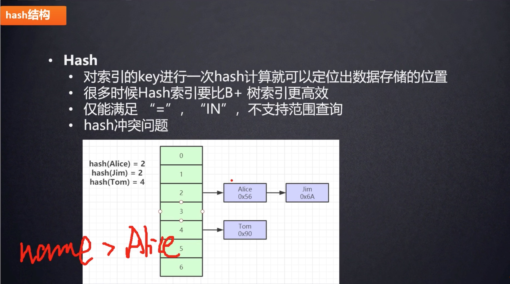
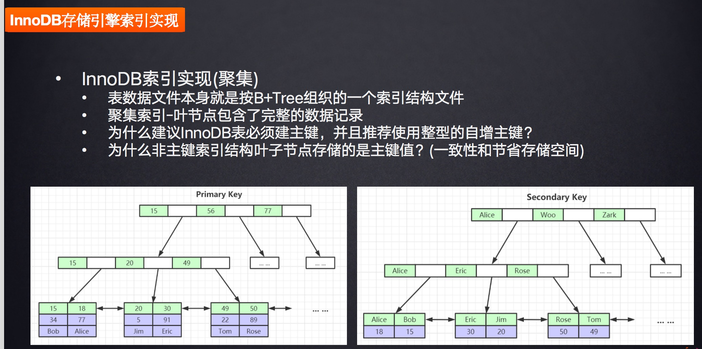
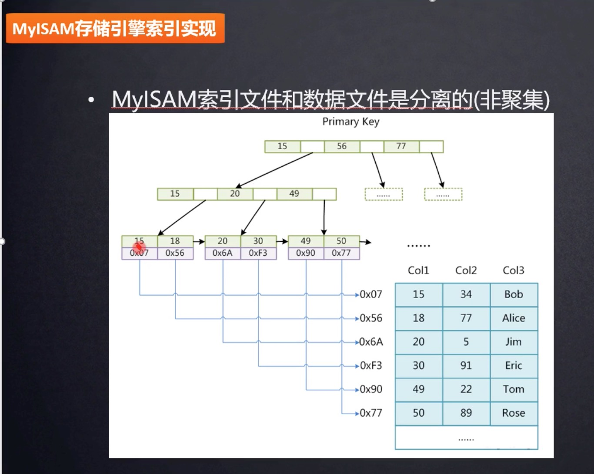

### 什么是索引
索引是帮助MySQL高效获取数据的排好序的数据结构（二叉树，红黑树，Hash表，B-Tree），mysql所用的索引是B+树。

### B-tree

### B+tree

### Hash

### Innodb存储引擎的数据结构

### MyISAM存储引擎的的存储数据结构

### 为什么mysql选择B+树而不是B树
因为数据查询的快慢依赖于树的深度，正常情况下，B树与B+树每个节点可以存放16kb的数据（这个数据可以调整），B树的节点中每个可以存放数据的结构是包含data的即（key = 索引，value = 磁盘数据的地址），这样的数据大约有1kb，而B+树每个存放数据的内容包括 索引值（8byte） +  下一个节点的磁盘文件地址（6byte） = 14byte，那么相比B树来说，B+树的每个节点可以存放大约1170个数据，而B树只能存放16个左右，所以三层B+树就可以存放下2000多万的数据，而B树的深度远远大于三层。
此外，mysql会做一些优化，把非叶子节点，放在内存里，作为常驻缓存的形式，这样更是减少的磁盘load的时间，提高了查询速度。
同时B树叶子节点之间没有双向指针，针对范围查找的时候比较麻烦。

### mysql为什么建议必须建立主键？
因为innodb存储引擎在存储数据的时候需要根据一列数据没有重复的列来生成一个B+树的数据结构，如果我们自己指定了，那么mysql就不需要自己去寻找这一个数据列，如果没有这个数据列，那么mysql还需要自己去创建一个隐藏列来维护这个唯一的数据，并且根据这一列数据来生成B+树。

### 为什么并且推荐使用整型的自增主键呢？
因为非整型的数据结构，比如String的话那么就需要将每一个都转换为Ascll码来比较，明显比较慢，其次就是占用空间较小。
自增主键主要是为了减少插入的时候的节点分裂与平衡的操作。

