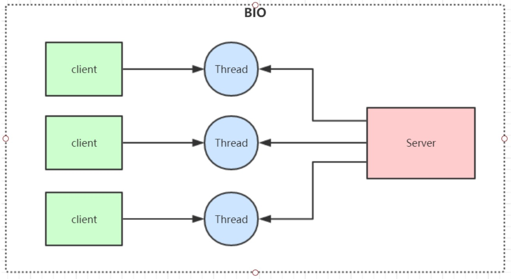
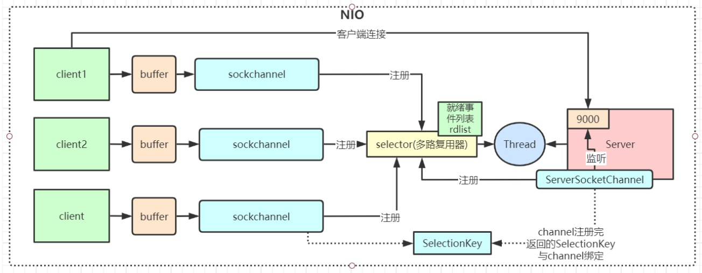
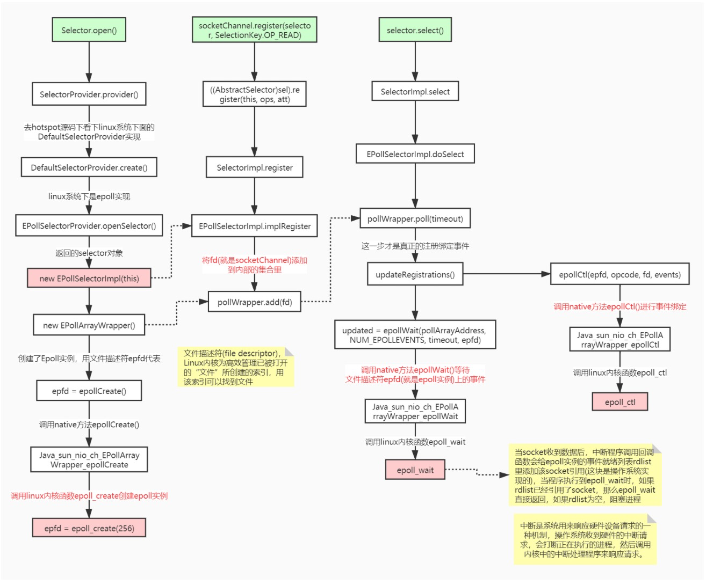
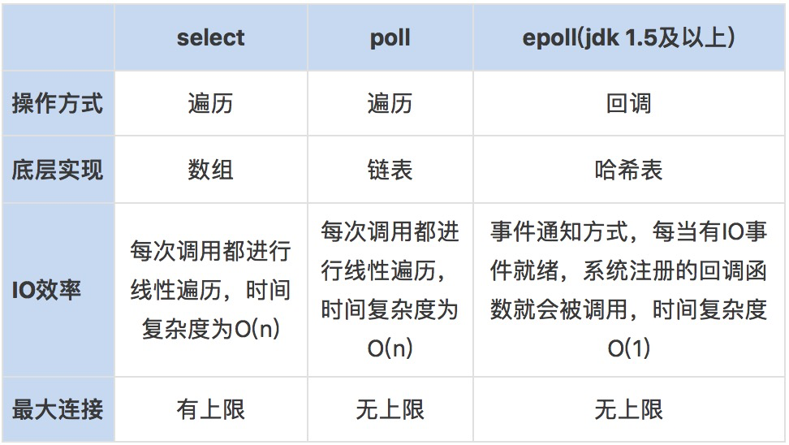
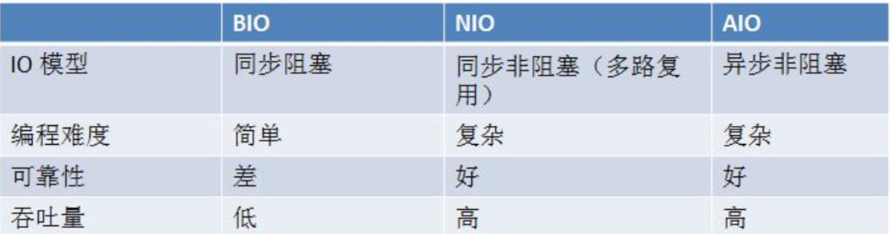

## IO模型
IO模型就是说用什么样的通道进行数据的发送和接收，Java共支持3种网络编程IO模式：BIO，NIO，AIO

## BIO(Blocking IO)
同步阻塞模型，一个客户端连接对应一个处理线程


**缺点：**
1、IO代码里read操作是阻塞操作，如果连接不做数据读写操作会导致线程阻塞，浪费资源
2、如果线程很多，会导致服务器线程太多，压力太大，比如C10K问题

**应用场景：**
BIO 方式适用于连接数目比较小且固定的架构， 这种方式对服务器资源要求比较高，  但程序简单易理解。

## NIO(Non Blocking IO)
同步非阻塞，服务器实现模式为一个线程可以处理多个请求(连接)，客户端发送的连接请求都会注册到多路复用器selector上，多路复用器轮询到连接有IO请求就进行处理，JDK1.4开始引入。

**应用场景：** NIO方式适用于连接数目多且连接比较短（轻操作） 的架构， 比如聊天服务器， 弹幕系统， 服务器间通讯，编程比较复杂

**NIO非阻塞代码示例（未引入多路复用）：**
```
public class NioServer {

    // 保存客户端连接
    static List<SocketChannel> channelList = new ArrayList<>();

    public static void main(String[] args) throws IOException, InterruptedException {

        // 创建NIO ServerSocketChannel,与BIO的serverSocket类似
        ServerSocketChannel serverSocket = ServerSocketChannel.open();
        serverSocket.socket().bind(new InetSocketAddress(9000));
        // 设置ServerSocketChannel为非阻塞
        serverSocket.configureBlocking(false);
        System.out.println("服务启动成功");

        while (true) {
            // 非阻塞模式accept方法不会阻塞，否则会阻塞
            // NIO的非阻塞是由操作系统内部实现的，底层调用了linux内核的accept函数
            SocketChannel socketChannel = serverSocket.accept();
            if (socketChannel != null) { // 如果有客户端进行连接
                System.out.println("连接成功");
                // 设置SocketChannel为非阻塞
                socketChannel.configureBlocking(false);
                // 保存客户端连接在List中
                channelList.add(socketChannel);
            }
            // 遍历连接进行数据读取
            Iterator<SocketChannel> iterator = channelList.iterator();
            while (iterator.hasNext()) {
                SocketChannel sc = iterator.next();
                ByteBuffer byteBuffer = ByteBuffer.allocate(128);
                // 非阻塞模式read方法不会阻塞，否则会阻塞
                int len = sc.read(byteBuffer);
                // 如果有数据，把数据打印出来
                if (len > 0) {
                    System.out.println("接收到消息：" + new String(byteBuffer.array()));
                } else if (len == -1) { // 如果客户端断开，把socket从集合中去掉
                    iterator.remove();
                    System.out.println("客户端断开连接");
                }
            }
        }
    }
}

```

**缺点** 如果连接数太多的话，会有大量的无效遍历，假如有10000个连接，其中只有1000个连接有写数据，但是由于其他9000个连接并没有断开，我们还是要每次轮询遍历一万次，其中有十分之九的遍历都是无效的。

**NIO引入多路复用器代码示例：**

```
public class NioSelectorServer {

    public static void main(String[] args) throws IOException, InterruptedException {

        // 创建NIO ServerSocketChannel
        ServerSocketChannel serverSocket = ServerSocketChannel.open();
        serverSocket.socket().bind(new InetSocketAddress(9000));
        // 设置ServerSocketChannel为非阻塞
        serverSocket.configureBlocking(false);
        // 打开Selector处理Channel，即创建epoll
        Selector selector = Selector.open();
        // 把ServerSocketChannel注册到selector上，并且selector对客户端accept连接操作感兴趣
        serverSocket.register(selector, SelectionKey.OP_ACCEPT);
        System.out.println("服务启动成功");

        while (true) {
            // 阻塞等待需要处理的事件发生
            selector.select();

            // 获取selector中注册的全部事件的 SelectionKey 实例
            Set<SelectionKey> selectionKeys = selector.selectedKeys();
            Iterator<SelectionKey> iterator = selectionKeys.iterator();

            // 遍历SelectionKey对事件进行处理
            while (iterator.hasNext()) {
                SelectionKey key = iterator.next();
                // 如果是OP_ACCEPT事件，则进行连接获取和事件注册
                if (key.isAcceptable()) {
                    ServerSocketChannel server = (ServerSocketChannel) key.channel();
                    SocketChannel socketChannel = server.accept();
                    socketChannel.configureBlocking(false);
                    // 这里只注册了读事件，如果需要给客户端发送数据可以注册写事件
                    socketChannel.register(selector, SelectionKey.OP_READ);
                    System.out.println("客户端连接成功");
                } else if (key.isReadable()) {  // 如果是OP_READ事件，则进行读取和打印
                    SocketChannel socketChannel = (SocketChannel) key.channel();
                    ByteBuffer byteBuffer = ByteBuffer.allocate(128);
                    int len = socketChannel.read(byteBuffer);
                    // 如果有数据，把数据打印出来
                    if (len > 0) {
                        System.out.println("接收到消息：" + new String(byteBuffer.array()));
                    } else if (len == -1) { // 如果客户端断开连接，关闭Socket
                        System.out.println("客户端断开连接");
                        socketChannel.close();
                    }
                }
                //从事件集合里删除本次处理的key，防止下次select重复处理
                iterator.remove();
            }
        }
    }
}
```

NIO 有三大核心组件： **Channel(通道)**， **Buffer(缓冲区)**，**Selector(多路复用器)**

1、channel 类似于流，每个 channel 对应一个 buffer缓冲区，buffer 底层就是个数组

2、channel 会注册到 selector 上，由 selector 根据 channel 读写事件的发生将其交由某个空闲的线程处理

3、NIO 的 Buffer 和 channel 都是既可以读也可以写



NIO底层在JDK1.4版本是用linux的内核函数select()或poll()来实现，跟上面的NioServer代码类似，selector每次都会轮询所有的sockchannel看下哪个channel有读写事件，有的话就处理，没有就继续遍历，JDK1.5开始引入了epoll基于事件响应机制来优化NIO。

NioSelectorServer 代码里如下几个方法非常重要，我们从Hotspot与Linux内核函数级别来理解下
```
Selector.open()  //创建多路复用器
 socketChannel.register(selector, SelectionKey.OP_READ)  //将channel注册到多路复用器上
selector.select()  //阻塞等待需要处理的事件发生

```

总结：NIO整个调用流程就是Java调用了操作系统的内核函数来创建Socket，获取到Socket的文件描述符，再创建一个Selector对象，对应操作系统的Epoll描述符，将获取到的Socket连接的文件描述符的事件绑定到Selector对应的Epoll文件描述符上，进行事件的异步通知，这样就实现了使用一条线程，并且不需要太多的无效的遍历，将事件处理交给了操作系统内核(操作系统中断程序实现)，大大提高了效率。

### Epoll函数详解
`int epoll_create(int size);`
创建一个epoll实例，并返回一个非负数作为文件描述符，用于对epoll接口的所有后续调用。参数size代表可能会容纳size个描述符，但size不是一个最大值，只是提示操作系统它的数量级，现在这个参数基本上已经弃用了。

`int epoll_ctl(int epfd, int op, int fd, struct epoll_event *event);`
使用文件描述符epfd引用的epoll实例，对目标文件描述符fd执行op操作。

参数epfd表示epoll对应的文件描述符，参数fd表示socket对应的文件描述符。

参数op有以下几个值：

EPOLL_CTL_ADD：注册新的fd到epfd中，并关联事件event；

EPOLL_CTL_MOD：修改已经注册的fd的监听事件；

EPOLL_CTL_DEL：从epfd中移除fd，并且忽略掉绑定的event，这时event可以为null；

events有很多可选值，这里只举例最常见的几个：

EPOLLIN ：表示对应的文件描述符是可读的；

EPOLLOUT：表示对应的文件描述符是可写的；

EPOLLERR：表示对应的文件描述符发生了错误；

成功则返回0，失败返回-1

`int epoll_wait(int epfd, struct epoll_event *events, int maxevents, int timeout);
 等待文件描述符epfd上的事件。`
 
 等待文件描述符epfd上的事件。
 epfd是Epoll对应的文件描述符，events表示调用者所有可用事件的集合，maxevents表示最多等到多少个事件就返回，timeout是超时时间。
 
 
 I/O多路复用底层主要用的Linux 内核·函数（select，poll，epoll）来实现，windows不支持epoll实现，windows底层是基于winsock2的select函数实现的(不开源)
 
 
 ### Redis线程模型
 Redis就是典型的基于epoll的NIO线程模型(nginx也是)，epoll实例收集所有事件(连接与读写事件)，由一个服务端线程连续处理所有事件命令。
 Redis底层关于epoll的源码实现在redis的src源码目录的ae_epoll.c文件里，感兴趣可以自行研究。
 
 ## AIO(NIO 2.0)
 
 异步非阻塞， 由操作系统完成后回调通知服务端程序启动线程去处理， 一般适用于连接数较多且连接时间较长的应用
 AIO方式适用于连接数目多且连接比较长(重操作)的架构，JDK7 开始支持
 
 AIO代码示例：
 ```
public class AIOServer {

    public static void main(String[] args) throws Exception {
        final AsynchronousServerSocketChannel serverChannel =
                AsynchronousServerSocketChannel.open().bind(new InetSocketAddress(9000));

        serverChannel.accept(null, new CompletionHandler<AsynchronousSocketChannel, Object>() {
            @Override
            public void completed(AsynchronousSocketChannel socketChannel, Object attachment) {
                try {
                    System.out.println("2--"+Thread.currentThread().getName());
                    // 再此接收客户端连接，如果不写这行代码后面的客户端连接连不上服务端
                    serverChannel.accept(attachment, this);
                    System.out.println(socketChannel.getRemoteAddress());
                    ByteBuffer buffer = ByteBuffer.allocate(1024);
                    socketChannel.read(buffer, buffer, new CompletionHandler<Integer, ByteBuffer>() {
                        @Override
                        public void completed(Integer result, ByteBuffer buffer) {
                            System.out.println("3--"+Thread.currentThread().getName());
                            buffer.flip();
                            System.out.println(new String(buffer.array(), 0, result));
                            socketChannel.write(ByteBuffer.wrap("HelloClient".getBytes()));
                        }

                        @Override
                        public void failed(Throwable exc, ByteBuffer buffer) {
                            exc.printStackTrace();
                        }
                    });
                } catch (IOException e) {
                    e.printStackTrace();
                }
            }

            @Override
            public void failed(Throwable exc, Object attachment) {
                exc.printStackTrace();
            }
        });

        System.out.println("1--"+Thread.currentThread().getName());
        Thread.sleep(Integer.MAX_VALUE);
    }
}
```
总体上基于回调的方式，主线程不用操心，同步的nio方式，主线程需要去管理实践的获取等操作。

### BIO、 NIO、 AIO 对比


### 为什么Netty使用NIO而不是AIO？
在Linux系统上，AIO的底层实现仍使用Epoll，没有很好实现AIO，因此在性能上没有明显的优势，而且被JDK封装了一层不容易深度优化，Linux上AIO还不够成熟。Netty是异步非阻塞框架，Netty在NIO上做了很多异步的封装。


