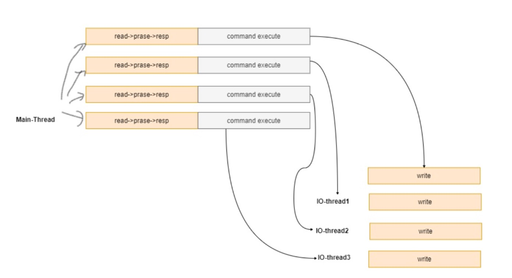
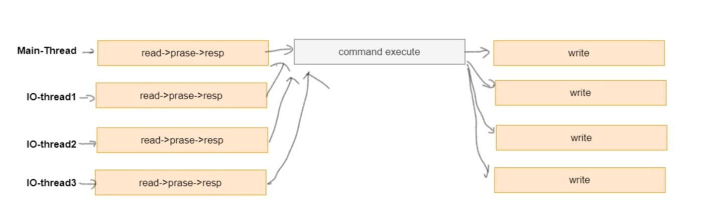

## 多线程
edis 6.0 提供了多线程的支持，redis 6 以前的版本，严格来说也是多线程，只不过执行用户 命令的请求时单线程模型，还有一些线程用来执行后台任务， 比如 unlink 删除 大key，rdb持久 化等。
redis 6.0 提供了多线程的读写IO, 但是最终执行用户命令的线程依然是单线程的，这样，就没有 多线程数据的竞争关系，依然很高效。

edis 6.0 线程执行模式: 可以通过如下参数配置多线程模型: 如:
```
io‐threads 4 // 这里说 有三个IO 线程，还有一个线程是main线程，main线程负责IO读写和 命令执行操作
```

默认情况下，如上配置，有三个IO线程， 这三个IO线程只会执行 IO中的write 操作，也就是说， read 和 命令执行 都由main线程执行。最后多线程将数据写回到客户端。


开启了如下参数:
```
io‐threads‐do‐reads yes // 将支持IO线程执行 读写任务。
```


## 客户端缓存
redis 6 提供了服务端追踪key的变化，客户端缓存数据的特性，这需要客户端实现

执行流程为， 当客户端访问某个key时，服务端将记录key 和 client ，客户端拿到数据后，进行 客户端缓存，这时，当key再次被访问时，key将被直接返回，避免了与redis 服务器的再次交 互，节省服务端资源，当数据被其他请求修改时，服务端将主动通知客户端失效的key，客户端 进行本地失效，下次请求时，重新获取最新数据。

## ACL 是对于命令的访问和执行权限的控制

ACL设置有两种方式: 
1. 命令方式

ACL SETUSER + 具体的权限规则， 通过 ACL SAVE 进行持久化 2. 对 ACL 配置文件进行编写，并且执行 ACL LOAD 进行加载

ACL存储有两种方式，但是两种方式不能同时配置，否则直接报错退出进程 1.redis 配置文件: redis.conf

2.ACL配置文件, 在redis.conf 中通过 aclfile /path 配置acl文件的路径