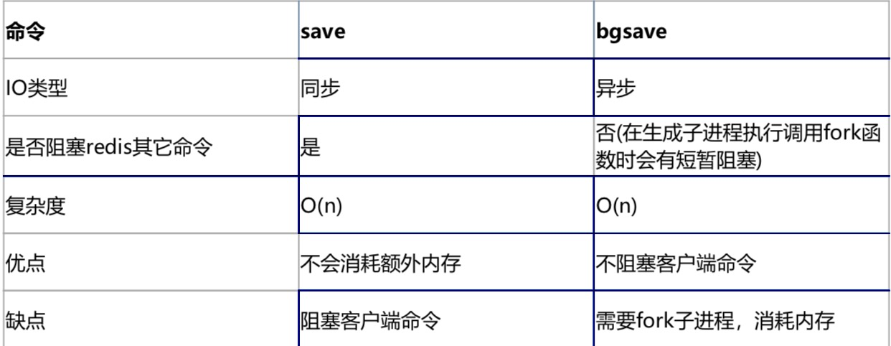
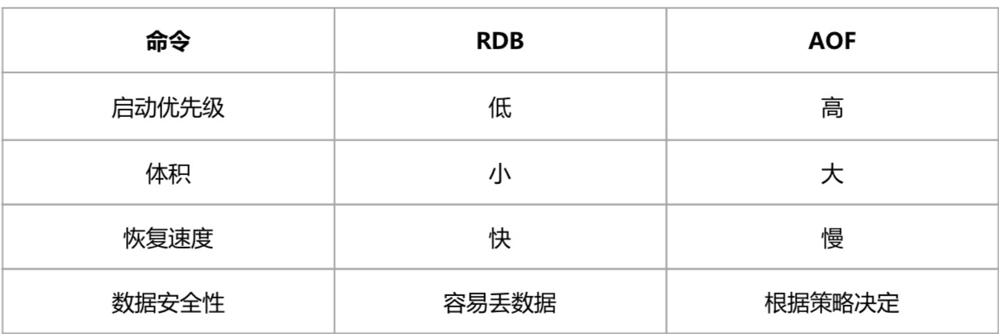
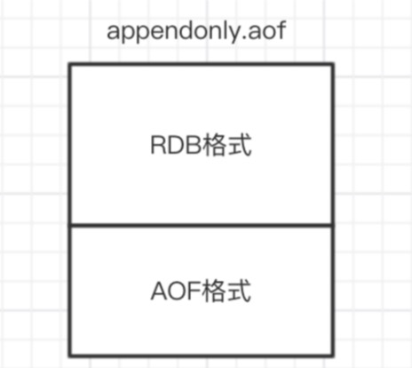
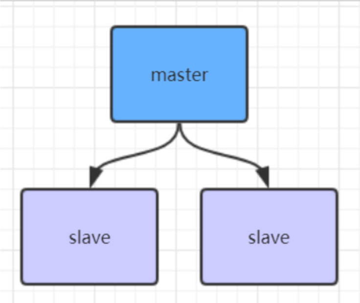
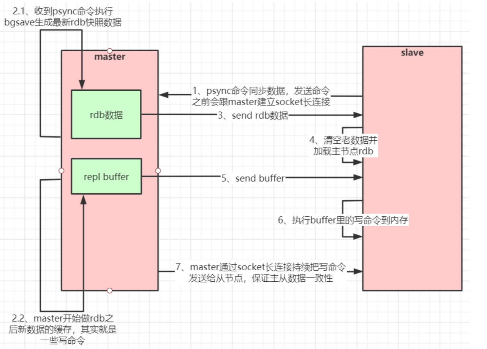
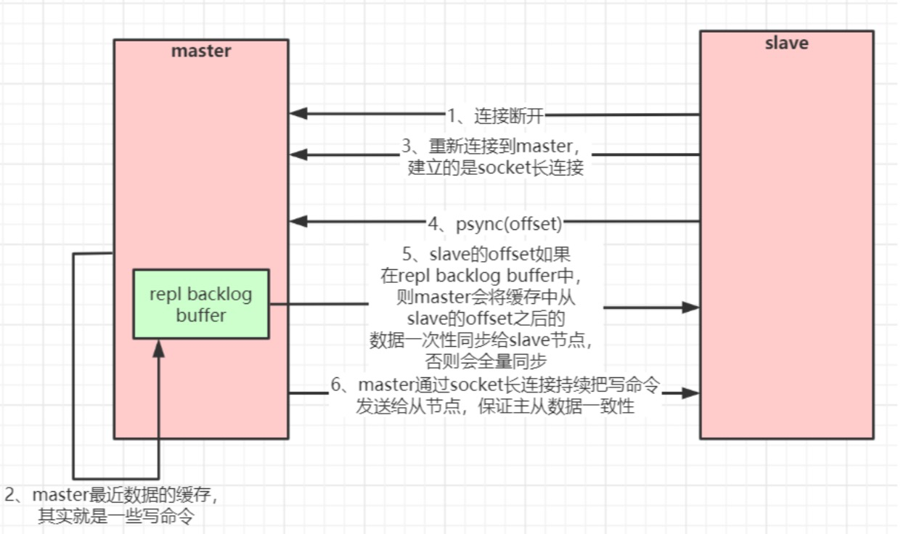
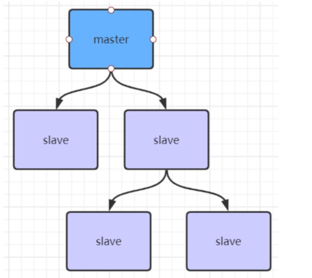
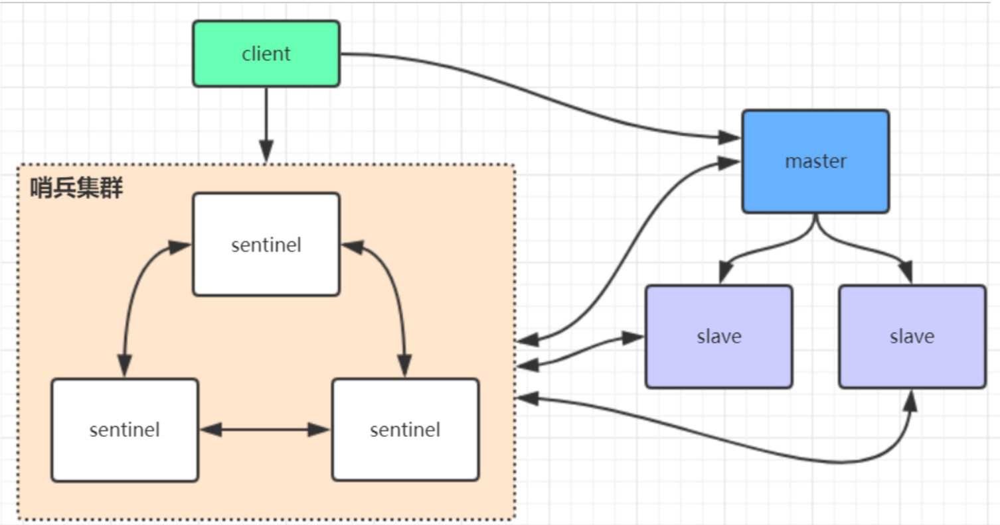

## Redis持久化
### RDB快照
在默认情况下， Redis 将内存数据库快照保存在名字为 dump.rdb 的二进制文件中。你可以对 Redis 进行设置， 让它在“ N 秒内数据集至少有 M 个改动”这一条件被满足时， 自动保存一次 数据集。
比如说， 以下设置会让 Redis 在满足“ 60 秒内有至少有 1000 个键被改动”这一条件时， 自动保存一次 数据集:
 
 **save 60 1000** //关闭RDB只需要将所有的save保存策略注释掉即可
 
 还可以手动执行命令生成RDB快照，进入redis客户端执行命令save或bgsave可以生成dump.rdb文件，每次命令执行都会将所有redis内存快照到一个新的rdb文件里，并覆盖原有rdb快照文件。
 
 #### bgsave的写时复制(COW)机制
 Redis 借助操作系统提供的写时复制技术(Copy-On-Write, COW)，在生成快照的同时，依然可以正常 处理写命令。简单来说，bgsave 子进程是由主线程 fork 生成的，可以共享主线程的所有内存数据。 bgsave 子进程运行后，开始读取主线程的内存数据，并把它们写入 RDB 文件。此时，如果主线程对这些 数据也都是读操作，那么，主线程和 bgsave 子进程相互不影响。但是，如果主线程要修改一块数据，那 么，这块数据就会被复制一份，生成该数据的副本。然后，bgsave 子进程会把这个副本数据写入 RDB 文 件，而在这个过程中，主线程仍然可以直接修改原来的数据。
 
 #### save与bgsave对比
 
 
 **配置自动生成rdb文件后台使用的是bgsave方式。**
 
 ### AOF(append-only file)
 快照功能并不是非常耐久(durable): 如果 Redis 因为某些原因而造成故障停机， 那么服务器将丢失
 最近写入、且仍未保存到快照中的那些数据。从 1.1 版本开始， Redis 增加了一种完全耐久的持久化方 式: AOF 持久化，将修改的每一条指令记录进文件appendonly.aof中(先写入os cache，每隔一段时间 fsync到磁盘)
 
比如执行命令“set xinxian 666”，aof文件里会记录如下数据 
```
*3
$3
set
$5
zhuge 6 $3
666
```
这是一种**resp**协议格式数据，星号后面的数字代表命令有多少个参数，$号后面的数字代表这个参数有几个字符

**你可以通过修改配置文件来打开 AOF 功能:**

`
1 #appendonly yes
`
从现在开始， 每当 Redis 执行一个改变数据集的命令时(比如 SET)， 这个命令就会被追加到 AOF 文件的末尾。

这样的话， 当 Redis 重新启动时， 程序就可以通过重新执行 AOF 文件中的命令来达到重建数据集的目 的。

你可以配置 Redis 多久才将数据 fsync 到磁盘一次。
```
1 appendfsync always:每次有新命令追加到 AOF 文件时就执行一次 fsync ，非常慢，也非常安全。 
2 appendfsync everysec:每秒 fsync 一次，足够快，并且在故障时只会丢失 1 秒钟的数据。
3 appendfsync no:从不 fsync ，将数据交给操作系统来处理。更快，也更不安全的选择。
```
**推荐(并且也是默认)的措施为每秒 fsync 一次， 这种 fsync 策略可以兼顾速度和安全性。**

#### AOF重写
AOF文件里可能有太多没用指令，所以AOF会定期根据**内存的最新数据**生成aof文件。
例如，执行了如下几条命令:
```
127.0.0.1:6379>incrreadcount 2 

(integer)1

127.0.0.1:6379>incrreadcount

(integer)2

```
重写后AOF文件里变成，即直接增加了2
```
1 *3
2 $3
3 SET
4 $2
5 readcount 6 $1
7 2
```

**如下两个配置可以控制AOF自动重写频率**
```
1 #auto‐aof‐rewrite‐min‐size 64mb//aof文件至少要达到64M才会自动重写，文件太小恢复速度本来就很快，重写的意义不大

2 #auto‐aof‐rewrite‐percentage 100//aof文件自上一次重写后文件大小增长了100%则再次触发重写
```
**当然AOF还可以手动重写，进入redis客户端执行命令bgrewriteaof重写AOF**

注意，**AOF重写redis会fork出一个子进程去做(与bgsave命令类似)，不会对redis正常命令处理有太多影响**

**RDB 和 AOF ，我应该用哪一个?**


生产环境可以都启用，redis启动时如果既有rdb文件又有aof文件则优先选择aof文件恢复数据，因为aof 一般来说数据更全一点。

### Redis 4.0 混合持久化
重启 Redis 时，我们很少使用 RDB来恢复内存状态，因为会丢失大量数据。我们通常使用 AOF 日志重 放，但是重放 AOF 日志性能相对 RDB来说要慢很多，这样在 Redis 实例很大的情况下，启动需要花费很 长的时间。 Redis 4.0 为了解决这个问题，带来了一个新的持久化选项——混合持久化。 通过如下配置可以开启混合持久化(**必须先开启aof**):
```
1 #aof‐use‐rdb‐preambleyes
```
如果开启了混合持久化，**AOF在重写时**，不再是单纯将内存数据转换为RESP命令写入AOF文件，而是将 重写这一刻之前的内存做RDB快照处理，并且将RDB快照内容和增量的AOF修改内存数据的命令存在一 起，都写入新的AOF文件，新的文件一开始不叫appendonly.aof，等到重写完新的AOF文件才会进行改 名，覆盖原有的AOF文件，完成新旧两个AOF文件的替换。
于是在 Redis 重启的时候，可以先加载 RDB 的内容，然后再重放增量 AOF 日志就可以完全替代之前的 AOF 全量文件重放，因此重启效率大幅得到提升。

混合持久化AOF文件结构如下


**Redis数据备份策略:**
1. 写crontab定时调度脚本，每小时都copy一份rdb或aof的备份到一个目录中去，仅仅保留最近48 小时的备份

2. 每天都保留一份当日的数据备份到一个目录中去，可以保留最近1个月的备份

3. 每次copy备份的时候，都把太旧的备份给删了

4. 每天晚上将当前机器上的备份复制一份到其他机器上，以防机器损坏

## Redis主从架构

**redis主从架构搭建，配置从节点步骤:**
```
1.复制一份redis.conf文件 
2. 将相关配置修改为如下值:
port 6380
pidfile /var/run/redis_6380.pid # 把pid进程号写入pidfile配置的文件
logfile"6380.log"
dir /usr/local/redis‐5.0.3/data/6380 # 指定数据存放目录
需要注释掉bind
#bind127.0.0.1(bind绑定的是自己机器网卡的ip，如果有多块网卡可以配多个ip，代表允许客户端通 过机器的哪些网卡ip去访问，内网一般可以不配置bind，注释掉即可)

3.配置主从复制
replicaof192.168.0.606379#从本机6379的redis实例复制数据，Redis5.0之前使用slaveof
replica‐read‐only yes # 配置从节点只读
4、启动从节点
redis‐serverredis.conf
5、连接从节点
redis‐cli‐p6380
、测试在6379实例上写数据，6380实例是否能及时同步新修改数据
```
### Redis主从工作原理
如果你为master配置了一个slave，不管这个slave是否是第一次连接上Master，它都会发送一个PSYNC
命令给master请求复制数据。 master收到PSYNC命令后，会在后台进行数据持久化通过bgsave生成最新的rdb快照文件，持久化期 间，master会继续接收客户端的请求，它会把这些可能修改数据集的请求缓存在内存中。当持久化进行完 毕以后，master会把这份rdb文件数据集发送给slave，slave会把接收到的数据进行持久化生成rdb，然后 再加载到内存中。然后，master再将之前缓存在内存中的命令发送给slave。 当master与slave之间的连接由于某些原因而断开时，slave能够自动重连Master，如果master收到了多 个slave并发连接请求，它只会进行一次持久化，而不是一个连接一次，然后再把这一份持久化的数据发送 给多个并发连接的slave。
**主从复制(全量复制)流程图:**


#### 数据部分复制
当master和slave断开重连后，一般都会对整份数据进行复制。但从redis2.8版本开始，redis改用可以支 持部分数据复制的命令PSYNC去master同步数据，slave与master能够在网络连接断开重连后只进行部分 数据复制(断点续传)。
#### 主从复制(部分复制，断点续传)流程图:


如果有很多从节点，为了缓解主从复制风暴(多个从节点同时复制主节点导致主节点压力过大)，可以做如 下架构，让部分从节点与从节点(与主节点同步)同步数据。



#### 管道(Pipeline)
客户端可以一次性发送多个请求而不用等待服务器的响应，待所有命令都发送完后再一次性读取服务的响 应，这样可以极大的降低多条命令执行的网络传输开销，管道执行多条命令的网络开销实际上只相当于一 次命令执行的网络开销。需要注意到是用pipeline方式打包命令发送，redis必须在处理完所有命令前先缓 存起所有命令的处理结果。打包的命令越多，缓存消耗内存也越多。所以并不是打包的命令越多越好。 pipeline中发送的每个command都会被server立即执行，如果执行失败，将会在此后的响应中得到信 息;也就是pipeline并不是表达“所有command都一起成功”的语义，管道中前面命令失败，后面命令 不会有影响，继续执行。

#### Redis Lua脚本
Redis在2.6推出了脚本功能，允许开发者使用Lua语言编写脚本传到Redis中执行。使用脚本的好处如下:
1、**减少网络开销**:本来5次网络请求的操作，可以用一个请求完成，原先5次请求的逻辑放在redis服务器 上完成。使用脚本，减少了网络往返时延。这点跟管道类似。

2、**原子操作**:Redis会将整个脚本作为一个整体执行，中间不会被其他命令插入。管道不是原子的，不过 redis的批量操作命令(类似mset)是原子的。

3、**替代redis的事务功能**:redis自带的事务功能很鸡肋，报错不支持回滚，而redis的lua脚本几乎实现了 常规的事务功能，支持报错回滚操作，官方推荐如果要使用redis的事务功能可以用redis lua替代。

script参数是一段Lua脚本程序，它会被运行在Redis服务器上下文中，这段脚本不必(也不应该)定义为一 个Lua函数。numkeys参数用于指定键名参数的个数。键名参数 key [key ...] 从EVAL的第三个参数开始算 起，表示在脚本中所用到的那些Redis键(key)，这些键名参数可以在 Lua中通过全局变量KEYS数组，用1 为基址的形式访问( KEYS[1] ， KEYS[2] ，以此类推)。
在命令的最后，那些不是键名参数的附加参数 arg [arg ...] ，可以在Lua中通过全局变量ARGV数组访问， 访问的形式和KEYS变量类似( ARGV[1] 、 ARGV[2] ，诸如此类)。

**注意，不要在Lua脚本中出现死循环和耗时的运算，否则redis会阻塞，将不接受其他的命令， 所以使用 时要注意不能出现死循环、耗时的运算。redis是单进程、单线程执行脚本。管道不会阻塞redis。**

## Redis哨兵高可用架构

sentinel哨兵是特殊的redis服务，不提供读写服务，主要用来监控redis实例节点。 哨兵架构下client端第一次从哨兵找出redis的主节点，后续就直接访问redis的主节点，不会每次都通过 sentinel代理访问redis的主节点，当redis的主节点发生变化，哨兵会第一时间感知到，并且将新的redis 主节点通知给client端(这里面redis的client端一般都实现了订阅功能，订阅sentinel发布的节点变动消息)。

### redis哨兵架构搭建步骤:
```
1、复制一份sentinel.conf文件
cpsentinel.confsentinel‐26379.conf
2、将相关配置修改为如下值:
port 26379

daemonize yes

pidfile"/var/run/redis‐sentinel‐26379.pid"

logfile"26379.log"

dir"/usr/local/redis‐5.0.3/data"

#sentinelmonitor<master‐redis‐name><master‐redis‐ip><master‐redis‐port><quorum>
#quorum是一个数字，指明当有多少个sentinel认为一个master失效时(值一般为:sentinel总数/2+ 1)，master才算真正失效
sentinelmonitormymaster192.168.0.6063792#mymaster这个名字随便取，客户端访问时会用到

3、启动sentinel哨兵实例
src/redis‐sentinelsentinel‐26379.conf

4、查看sentinel的info信息
src/redis‐cli‐p 26379
127.0.0.1:26379>info

可以看到Sentinel的info里已经识别出了redis的主从

```
sentinel集群都启动完毕后，会将哨兵集群的元数据信息写入所有sentinel的配置文件里去(追加在文件的 最下面)，我们查看下如下配置文件sentinel-26379.conf，如下所示:
```
1 sentinelknown‐replicamymaster192.168.0.606380#代表redis主节点的从节点信息 
2 sentinelknown‐replicamymaster192.168.0.606381#代表redis主节点的从节点信息
3 sentinelknown‐sentinelmymaster192.168.0.602638052d0a5d70c1f90475b4fc03b6ce7c3c569 35760f #代表感知到的其它哨兵节点
4 sentinelknown‐sentinelmymaster192.168.0.6026381e9f530d3882f8043f76ebb8e1686438ba8 bd5ca6 #代表感知到的其它哨兵节点
```
当redis主节点如果挂了，哨兵集群会重新选举出新的redis主节点，同时会修改所有sentinel节点配置文件 的集群元数据信息。
同时还会修改sentinel文件里之前配置的mymaster对应的6379端口，比如改为6380。
```
1 sentinel monitor mymaster 192.168.0.60 6380 2
```
当6379的redis实例再次启动时，哨兵集群根据集群元数据信息就可以将6379端口的redis节点作为从节点 加入集群。


