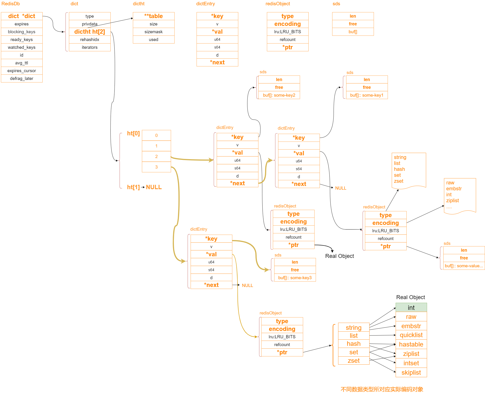

## redis应用场景
**计数器**

可以对 String 进行自增自减运算，从而实现计数器功能。Redis 这种内存型数据库的读写性能非常高，很适合存储频繁读写的计数量。 

**分布式ID生成**

利用自增特性，一次请求一个大一点的步长如 incr 2000 ,缓存在本地使用，用完再请求。

**海量数据统计**

位图（bitmap）:存储是否参过某次活动，是否已读谋篇文章，用户是否为会员， 日活统计。

**会话缓存**

可以使用 Redis 来统一存储多台应用服务器的会话信息。当应用服务器不再存储用户的会话信息，也就不再具有状态，一个用户可以请求任意一个应用服务器，从而更容易实现高可用性以及可伸缩性。

**分布式队列/阻塞队列**

List 是一个双向链表，可以通过 lpush/rpush 和 rpop/lpop 写入和读取消息。可以通过使用brpop/blpop 来实现阻塞队列。

**分布式锁实现**

在分布式场景下，无法使用基于进程的锁来对多个节点上的进程进行同步。可以使用 Redis 自带的 SETNX 命令实现分布式锁。

**热点数据存储**

最新评论，最新文章列表，使用list 存储,ltrim取出热点数据，删除老数据。

**社交类需求**

Set 可以实现交集，从而实现共同好友等功能，Set通过求差集，可以进行好友推荐，文章推荐。

**排行榜**

sorted_set可以实现有序性操作，从而实现排行榜等功能。

**延迟队列**

使用sorted_set，使用 【当前时间戳 + 需要延迟的时长】做score, 消息内容作为元素,调用zadd来生产消息，消费者使用zrangbyscore获取当前时间之前的数据做轮询处理。消费完再删除任务 rem  key  member

## 数据结构
### String
```
redis 3.2 以前
struct sdshdr {
    int len;
    int free;
    char buf[];
};

redis 3.2 以后
typedef char *sds;
/* Note: sdshdr5 is never used, we just access the flags byte directly.
 * However is here to document the layout of type 5 SDS strings. */
struct __attribute__ ((__packed__)) sdshdr5 {
    unsigned char flags; /* 3 lsb of type, and 5 msb of string length */
    char buf[];// buf[0]: z:  0101001
};
struct __attribute__ ((__packed__)) sdshdr8 {
    uint8_t len; /* used */
    uint8_t alloc; /* excluding the header and null terminator */
    unsigned char flags; /* 3 lsb of type, 5 unused bits */
    char buf[];
};
struct __attribute__ ((__packed__)) sdshdr16 {
    uint16_t len; /* used */
    uint16_t alloc; /* excluding the header and null terminator */
    unsigned char flags; /* 3 lsb of type, 5 unused bits */
    char buf[];
};
struct __attribute__ ((__packed__)) sdshdr32 {
    uint32_t len; /* used */
    uint32_t alloc; /* excluding the header and null terminator */
    unsigned char flags; /* 3 lsb of type, 5 unused bits */
    char buf[];
};
struct __attribute__ ((__packed__)) sdshdr64 {
    uint64_t len; /* used */
    uint64_t alloc; /* excluding the header and null terminator */
    unsigned char flags; /* 3 lsb of type, 5 unused bits */
    char buf[];
};

```
### RedisDB源码分析


**每一个redisServer实例，默认会创建16个DB。**

#### RedisDB
```
typedef struct redisDb {
    // 数据库键空间，保存着数据库中的所有键值对
    dict *dict;                 /* The keyspace for this DB    */
    // 键的过期时间，字典的键为键，字典的值为过期事件 UNIX 时间戳
    dict *expires;              /* Timeout of keys with a timeout set    过期时间字典 */
    dict *blocking_keys;        /* Keys with clients waiting for data (BLPOP)*/
    dict *ready_keys;           /* Blocked keys that received a PUSH */
    dict *watched_keys;         /* WATCHED keys for MULTI/EXEC CAS */
    // 数据库号码
    int id;                     /* Database ID */
    // 数据库的键的平均 TTL ，统计信息
    long long avg_ttl;          /* Average TTL, just for stats */
    unsigned long expires_cursor; /* Cursor of the active expire cycle. */
    list *defrag_later;         /* List of key names to attempt to defrag one by one, gradually. */
} redisDb;
```
Redis是一个键值对数据库服务器，服务器中的每一个数据库都是一个redis.h/redisDb结构，其中，结构中的dict字典保存了数据库中所有的键值对，我们就将这个字典成为键空间。
#### dict
edisDb结构的dict字典保存了数据库中的所有键值对，这个字典就叫做键空间，字典中的每一项，使用dictEntry ，代表KV键值；类似于HashMap中的键值对Entry。
```
typedef struct dict {
    // 特定于类型的处理函数
    dictType *type;
    // 类型处理函数的私有数据
    void *privdata;
    每个字典使用两个哈希表，用于实现渐进式 rehash，两个哈希表（ht[2]）。只有在rehash的过程中，ht[0]和ht[1]才都有效。而在平常情况下，只有ht[0]有效，ht[1]里面没有任何数据。上图表示的就是rehash进行到中间某一步时的情况。
    dictht ht[2];// ht[0] , ht[1] =null
    // 记录 rehash 进度的标志，值为 -1 表示 rehash 未进行  
    long rehashidx; /* rehashing not in progress if rehashidx == -1 */
    // 当前正在运作的安全迭代器数量
    unsigned long iterators; /* number of iterators currently running */
} dict;
```
#### dictht(dict hash table)哈希表
```
typedef struct dictht {
    // 哈希表节点指针数组（俗称桶，bucket）
    dictEntry **table;
    unsigned long size; //  hashtable 容量
    unsigned long sizemask;  // size -1 指针数组的长度掩码，用于计算索引值
    unsigned long used;  // hashtable 元素个数   used / size =1
} dictht;

/*
 * 哈希表节点
 */
typedef struct dictEntry {
    // 键
    void *key;

    // 值
    union {
        void *val;
        uint64_t u64;
        int64_t s64;
    } v;

    // 链往后继节点
    struct dictEntry *next;
} dictEntry;

//  redisObject对象 :  string , list ,set ,hash ,zset ...
typedef struct redisObject {
    unsigned type:4;        //  4 bit, sting , hash
    unsigned encoding:4;    //  4 bit 
    unsigned lru:LRU_BITS; /* LRU time (relative to global lru_clock) or
                            * LFU data (least significant 8 bits frequency
                            * and most significant 16 bits access time). 
                            *    24 bit 
                            * */
    int refcount;           // 4 byte  
    void *ptr;              // 8 byte  总空间:  4 bit + 4 bit + 24 bit + 4 byte + 8 byte = 16 byte  
} robj;
```
**dictht 定义一个哈希表的结构，包括以下部分：**

- 一个dictEntry指针数组（table）。key的哈希值最终映射到这个数组的某个位置上（对应一个bucket）。如果多个key映射到同一个位置，就发生了冲突，那么就拉出一个dictEntry链表。
- size：标识dictEntry指针数组的长度。它总是2的指数次幂。
- sizemask：用于将哈希值映射到table的位置索引。它的值等于(size-1)，比如7, 15, 31, 63，等等，也就是用二进制表示的各个bit全1的数字。每个key先经过hashFunction计算得到一个哈希值，然后计算(哈希值 & sizemask)得到在table上的位置。相当于计算取余(哈希值 % size)。
- used：记录dict中现有的数据个数。它与size的比值就是装载因子。这个比值越大，哈希值冲突概率越高。
 
## List
List是一个有序(按加入的时序排序)的数据结构，Redis采用quicklist（双端链表） 和 ziplist 作为List的底层实现。

可以通过设置每个ziplist的最大容量，quicklist的数据压缩范围，提升数据存取效率

list-max-ziplist-size  -2        //  单个ziplist节点最大能存储  8kb  ,超过则进行分裂,将数据存储在新的ziplist节点中

list-compress-depth  1        //  0 代表所有节点，都不进行压缩，1， 代表从头节点往后走一个，尾节点往前走一个不用压缩，其他的全部压缩，2，3，4 ... 以此类推

### ZipList


**ziplist是一个经过特殊编码的双向链表，它的设计目标就是为了提高存储效率**。ziplist可以用于存储字符串或整数，其中整数是按真正的二进制表示进行编码的，而不是编码成字符串序列。它能以O(1)的时间复杂度在表的两端提供push和pop操作。

实际上，ziplist充分体现了Redis对于存储效率的追求。一个普通的双向链表，链表中每一项都占用独立的一块内存，各项之间用地址指针（或引用）连接起来。这种方式会带来大量的**内存碎片**，而且地址指针也会占用额外的内存。而ziplist却是将表中每一项存放在前后连续的地址空间内，一个ziplist整体占用一大块内存。它是一个表（list），但其实不是一个链表（linked list）。

**ziplist的数据结构定义**

从宏观上看，ziplist的内存结构如下：

**<zlbytes><zltail><zllen><entry>...<entry><zlend>**

各个部分在内存上是前后相邻的，它们分别的含义如下：

- <zlbytes>: 32bit，表示ziplist占用的字节总数（也包括<zlbytes>本身占用的4个字节）。
- <zltail>: 32bit，表示ziplist表中最后一项（entry）在ziplist中的偏移字节数。<zltail>的存在，使得我们可以很方便地找到最后一项（不用遍历整个ziplist），从而可以在ziplist尾端快速地执行push或pop操作。
- <zllen>: 16bit， 表示ziplist中数据项（entry）的个数。zllen字段因为只有16bit，所以可以表达的最大值为2^16-1。这里需要特别注意的是，如果ziplist中数据项个数超过了16bit能表达的最大值，ziplist仍然可以来表示。那怎么表示呢？这里做了这样的规定：如果<zllen>小于等于2^16-2（也就是不等于2^16-1），那么<zllen>就表示ziplist中数据项的个数；否则，也就是<zllen>等于16bit全为1的情况，那么<zllen>就不表示数据项个数了，这时候要想知道ziplist中数据项总数，那么必须对ziplist从头到尾遍历各个数据项，才能计数出来。
- <entry>: 表示真正存放数据的数据项，长度不定。一个数据项（entry）也有它自己的内部结构，这个稍后再解释。
- <zlend>: ziplist最后1个字节，是一个结束标记，值固定等于255。

**我们再来看一下每一个数据项<entry>的构成：**

**<prevrawlen><len><data>**
我们看到在真正的数据（<data>）前面，还有两个字段：

- <prevrawlen>: 表示前一个数据项占用的总字节数。这个字段的用处是为了让ziplist能够从后向前遍历（从后一项的位置，只需向前偏移prevrawlen个字节，就找到了前一项）。这个字段采用变长编码。
- <len>: 表示当前数据项的数据长度（即<data>部分的长度）。也采用变长编码。


### QulckList


```
robj *createQuicklistObject(void) {
    quicklist *l = quicklistCreate();
    robj *o = createObject(OBJ_LIST,l);
    o->encoding = OBJ_ENCODING_QUICKLIST;
    return o;
}

quicklist *quicklistCreate(void) {
    struct quicklist *quicklist;

    quicklist = zmalloc(sizeof(*quicklist));
    quicklist->head = quicklist->tail = NULL;
    quicklist->len = 0;
    quicklist->count = 0;
    quicklist->compress = 0;
    quicklist->fill = -2;
    quicklist->bookmark_count = 0;
    return quicklist;
}

typedef struct quicklist {
    quicklistNode *head;
    quicklistNode *tail;
    unsigned long count;       
    unsigned long len;           
    int fill : QL_FILL_BITS;                
    unsigned int compress : QL_COMP_BITS;  
    unsigned int bookmark_count: QL_BM_BITS;
    quicklistBookmark bookmarks[];
} quicklist;

typedef struct quicklistNode {
    struct quicklistNode *prev;
    struct quicklistNode *next;
    unsigned char *zl;
    unsigned int sz;            
    unsigned int count : 16;    
    unsigned int encoding : 2;    
    unsigned int container : 2;  
    unsigned int recompress : 1; 
    unsigned int attempted_compress : 1; 
    unsigned int extra : 10;  
} quicklistNode;
```

## Hash
Hash 数据结构底层实现为一个字典( dict ),也是RedisBb用来存储K-V的数据结构,当数据量比较小，或者单个元素比较小时，底层用ziplist存储，数据大小和元素数量阈值可以通过如下参数设置。

hash-max-ziplist-entries  512    //  ziplist 元素个数超过 512 ，将改为hashtable编码 

hash-max-ziplist-value    64      //  单个元素大小超过 64 byte时，将改为hashtable编码

## Set
Set 为无序的，自动去重的集合数据类型，Set 数据结构底层实现为一个value 为 null 的 字典( dict ),当数据可以用整形表示时，Set集合将被编码为intset数据结构。两个条件任意满足时
Set将用hashtable存储数据。

1， 元素个数大于 set-max-intset-entries 
 
2 ， 元素无法用整形表示 

### IntSet
```
typedef struct intset {
    uint32_t  encoding;
    uint32_t  length;
    int8_t      contents[];
} intset; 
 
#define INTSET_ENC_INT16 (sizeof(int16_t))
#define INTSET_ENC_INT32 (sizeof(int32_t))
#define INTSET_ENC_INT64 (sizeof(int64_t))
```
整数集合是一个有序的，存储整型数据的结构。整型集合在Redis
中可以保存int16_t,int32_t,int64_t类型的整型数据，并且可以保证
集合中不会出现重复数据。

encoding: 编码类型

length: 元素个数

contents[]: 元素存储

## ZSet
ZSet为有序的，自动去重的集合数据类型，ZSet数据结构底层实现为字典(dict) + 跳表(skiplist) ,当数据比较少时，用ziplist编码结构存储。

zset-max-ziplist-entries  128    // 元素个数超过128 ，将用skiplist编码

zset-max-ziplist-value     64     //  单个元素大小超过 64 byte, 将用 skiplist编码

**源码如下所示：**
```
// 创建zset 数据结构: 字典 + 跳表
robj *createZsetObject(void) {
    zset *zs = zmalloc(sizeof(*zs));
    robj *o;
    // dict用来查询数据到分数的对应关系， 如 zscore 就可以直接根据 元素拿到分值 
    zs->dict = dictCreate(&zsetDictType,NULL);
    
    // skiplist用来根据分数查询数据（可能是范围查找）
    zs->zsl = zslCreate();
    // 设置对象类型 
    o = createObject(OBJ_ZSET,zs);
     // 设置编码类型 
    o->encoding = OBJ_ENCODING_SKIPLIST;
    return o;
}

typedef struct zset {
    dict *dict;
    zskiplist *zsl;
} zset;

typedef struct zskiplist {
    struct zskiplistNode *header, *tail;
    unsigned long length;
    int level;
} zskiplist;

typedef struct zskiplistNode {
    sds ele;
    double score;
    struct zskiplistNode *backward;
    struct zskiplistLevel {
        struct zskiplistNode *forward;
        unsigned long span;
    } level[];
} zskiplistNode;


```
skipList结构图

相当于进行了二分查找的优化分层，下一层可以是上一层的对半的元素数量，优化了数据的查找效率。

## GeoHash
GeoHash是一种地理位置编码方法。 由Gustavo Niemeyer 和 G.M. Morton于2008年发明，
它将地理位置编码为一串简短的字母和数字。它是一种分层的空间数据结构，将空间细分为网
格形状的桶，这是所谓的z顺序曲线的众多应用之一，通常是空间填充曲线。

## BitMap
### BitMap是什么
就是通过一个bit位来表示某个元素对应的值或者状态,其中的key就是对应元素本身。我们知道8个bit可以组成一个Byte，所以bitmap本身会极大的节省储存空间。
Redis从2.2.0版本开始新增了setbit,getbit,bitcount等几个bitmap相关命令。虽然是新命令，但是并没有新增新的数据类型，因为setbit等命令只不过是在set上的扩展。

### setbit命令介绍
指令 SETBIT key offset value

设置或者清空key的value(字符串)在offset处的bit值(只能只0或者1)。

### 空间占用、以及第一次分配空间需要的时间
在一台2010MacBook Pro上，offset为2^32-1（分配512MB）需要～300ms，offset为2^30-1(分配128MB)需要～80ms，offset为2^28-1（分配32MB）需要～30ms，offset为2^26-1（分配8MB）需要8ms。<来自官方文档>

### 使用场景
#### 用户签到
根据日期 offset =hash % 365  ； key = 年份#用户id
```
setbit 2021#user1 1 1
setbit 2021#user1 2 1
bitcount 2021#user1

```
#### 统计活跃用户
使用时间作为cacheKey，然后用户ID为offset，如果当日活跃过就设置为1

那么我该如果计算某几天/月/年的活跃用户呢(暂且约定，统计时间内只有有一天在线就称为活跃)，有请下一个redis的命令

命令 BITOP operation destkey key [key ...]

说明：对一个或多个保存二进制位的字符串 key 进行位元操作，并将结果保存到 destkey 上。

说明：BITOP 命令支持 AND 、 OR 、 NOT 、 XOR 这四种操作中的任意一种参数

20190216 活跃用户 【1，2】

20190217 活跃用户 【1】

统计20190216~20190217 总活跃用户数: 1
```
setbit 20210810 1 1
setbit 20210810 2 1
setbit 20210811 1 1
BITTOP and dest1 20210810 20210811
BITCOUNT dest1 
```
统计20190216~20190217 在线活跃用户数: 2
```
BITTOP or dest1 20210810 20210811
BITCOUNT dest1 
```
#### 用户在线状态
使用bitmap是一个节约空间效率又高的一种方法，只需要一个key，然后用户ID为offset，如果在线就设置为1，
不在线就设置为0，和上面的场景一样，5000W用户只需要6MB的空间。


