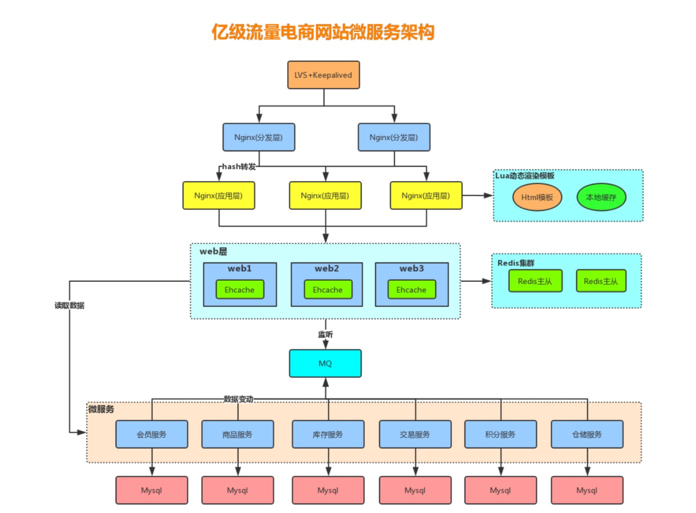
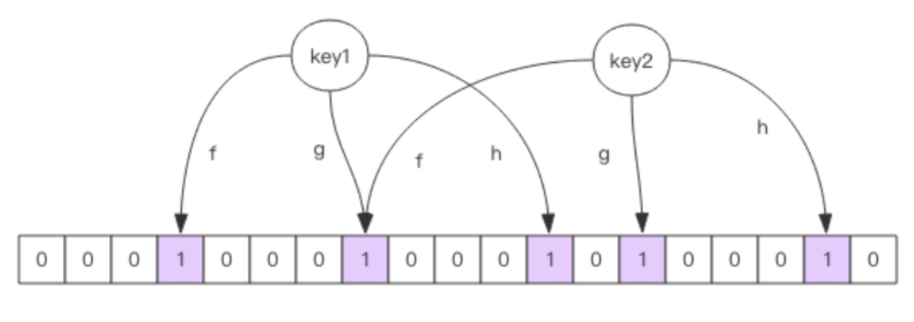

## 多级缓存架构

## 缓存设计潜在问题
### 缓存穿透
缓存穿透是指查询一个根本不存在的数据， 缓存层和存储层都不会命中， 通常出于容错的考虑， 如果从存储 层查不到数据则不写入缓存层。
缓存穿透将导致不存在的数据每次请求都要到存储层去查询， 失去了缓存保护后端存储的意义。 造成缓存穿透的基本原因有两个:

- 第一， 自身业务代码或者数据出现问题。
- 第二， 一些恶意攻击、 爬虫等造成大量空命中。

**缓存穿透问题解决方案:**
1、缓存空对象

2、布隆过滤器

对于恶意攻击，向服务器请求大量不存在的数据造成的缓存穿透，还可以用布隆过滤器先做一次过滤，对于不 存在的数据布隆过滤器一般都能够过滤掉，不让请求再往后端发送。**当布隆过滤器说某个值存在时，这个值可能不存在;当它说不存在时，那就肯定不存在。**

布隆过滤器就是一个大型的位数组和几个不一样的无偏 hash 函数。所谓无偏就是能够把元素的 hash 值算得 比较均匀。

向布隆过滤器中添加 key 时，会使用多个 hash 函数对 key 进行 hash 算得一个整数索引值然后对位数组长度 进行取模运算得到一个位置，每个 hash 函数都会算得一个不同的位置。再把位数组的这几个位置都置为 1 就 完成了 add 操作。

向布隆过滤器询问 key 是否存在时，跟 add 一样，也会把 hash 的几个位置都算出来，看看位数组中这几个位 置是否都为 1，只要有一个位为 0，那么说明布隆过滤器中这个key 不存在。如果都是 1，这并不能说明这个 key 就一定存在，只是极有可能存在，因为这些位被置为 1 可能是因为其它的 key 存在所致。如果这个位数组 比较稀疏，这个概率就会很大，如果这个位数组比较拥挤，这个概率就会降低。 这种方法适用于数据命中不高、 数据相对固定、 实时性低(通常是数据集较大) 的应用场景， 代码维护较为 复杂， 但是缓存空间占用很少。

**可以用redisson实现布隆过滤器**

**注意:布隆过滤器不能删除数据，如果要删除得重新初始化数据。**

### 缓存失效(击穿)
由于大批量缓存在同一时间失效可能导致大量请求同时穿透缓存直达数据库，可能会造成数据库瞬间压力过大 甚至挂掉，对于这种情况我们在批量增加缓存时最好将这一批数据的缓存过期时间设置为一个时间段内的不同时间。

### 缓存雪崩
缓存雪崩指的是缓存层支撑不住或宕掉后， 流量会像奔逃的野牛一样， 打向后端存储层。 由于缓存层承载着大量请求， 有效地保护了存储层， 但是如果缓存层由于某些原因不能提供服务(比如超大并 发过来，缓存层支撑不住，或者由于缓存设计不好，类似大量请求访问bigkey，导致缓存能支撑的并发急剧下 降)， 于是大量请求都会打到存储层， 存储层的调用量会暴增， 造成存储层也会级联宕机的情况。

1) 保证缓存层服务高可用性，比如使用Redis Sentinel或Redis Cluster。

2) 依赖隔离组件为后端限流熔断并降级。比如使用Sentinel或Hystrix限流降级组件。 比如服务降级，我们可以针对不同的数据采取不同的处理方式。当业务应用访问的是非核心数据(例如电商商 品属性，用户信息等)时，暂时停止从缓存中查询这些数据，而是直接返回预定义的默认降级信息、空值或是 错误提示信息;当业务应用访问的是核心数据(例如电商商品库存)时，仍然允许查询缓存，如果缓存缺失， 也可以继续通过数据库读取。

3) 提前演练。 在项目上线前， 演练缓存层宕掉后， 应用以及后端的负载情况以及可能出现的问题， 在此基 础上做一些预案设定。

### 热点缓存key重建优化
开发人员使用“缓存+过期时间”的策略既可以加速数据读写， 又保证数据的定期更新， 这种模式基本能够满 足绝大部分需求。 但是有两个问题如果同时出现， 可能就会对应用造成致命的危害:
- 当前key是一个热点key(例如一个热门的娱乐新闻)，并发量非常大。
- 重建缓存不能在短时间完成， 可能是一个复杂计算， 例如复杂的SQL、 多次IO、 多个依赖等。
在缓存失效的瞬间， 有大量线程来重建缓存， 造成后端负载加大， 甚至可能会让应用崩溃。 要解决这个问题主要就是要避免大量线程同时重建缓存。 我们可以利用互斥锁来解决，此方法只允许一个线程重建缓存， 其他线程等待重建缓存的线程执行完， 重新从 缓存获取数据即可。

### 缓存与数据库双写不一致
在大并发下，同时操作数据库与缓存会存在数据不一致性问题

1、双写不一致情况

2、读写并发不一致

解决方案:
1、对于**并发几率很小**的数据(如个人维度的订单数据、用户数据等)，这种几乎不用考虑这个问题，很少会发生 缓存不一致，可以给缓存数据**加上过期时间**，每隔一段时间触发读的主动更新即可。 

2、就算并发很高，如果业务上**能容忍短时间的缓存数据不一致**(如商品名称，商品分类菜单等)，**缓存加上过期** 时间依然可以解决大部分业务对于缓存的要求。 

3、如果不能容忍缓存数据不一致，可以通过**加读写锁**保证并发读写或写写的时候按顺序排好队，读读的时候相 当于无锁。 

4、也可以用阿里开源的**canal通过监听数据库的binlog日志**及时的去修改缓存，但是引入了新的中间件，增加 了系统的复杂度。

**总结:**
以上我们针对的都是读多写少的情况加入缓存提高性能，如果写多读多的情况又不能容忍缓存数据不一致，那就没必要加缓存了，可以直接操作数据库。放入缓存的数据应该是对实时性、一致性要求不是很高的数据。切记不要为了用缓存，同时又要保证绝对的一致性做大量的过度设计和控制，增加系统复杂性!

### Redis对于过期键有三种清除策略
1. 被动删除:当读/写一个已经过期的key时，会触发惰性删除策略，直接删除掉这个过期 key

2. 主动删除:由于惰性删除策略无法保证冷数据被及时删掉，所以Redis会定期主动淘汰一 批已过期的key

3. 当前已用内存超过maxmemory限定时，触发主动清理策略

主动清理策略在Redis 4.0 之前一共实现了 6 种内存淘汰策略，在 4.0 之后，又增加了 2 种策 略，总共8种:

**针对设置了过期时间的key做处理:**
1. volatile-ttl:在筛选时，会针对设置了过期时间的键值对，根据过期时间的先后进行删 除，越早过期的越先被删除。

2. volatile-random:就像它的名称一样，在设置了过期时间的键值对中，进行随机删除。

3. volatile-lru:会使用 LRU 算法筛选设置了过期时间的键值对删除。

4. volatile-lfu:会使用 LFU 算法筛选设置了过期时间的键值对删除。

**针对所有的key做处理:**
5. allkeys-random:从所有键值对中随机选择并删除数据。

6. allkeys-lru:使用 LRU 算法在所有数据中进行筛选删除。

7. allkeys-lfu:使用 LFU 算法在所有数据中进行筛选删除。

**不处理:**（默认）
8. noeviction:不会剔除任何数据，拒绝所有写入操作并返回客户端错误信息"(error) OOM command not allowed when used memory"，此时Redis只响应读操作。

LRU 算法(Least Recently Used，最近最少使用) 淘汰很久没被访问过的数据，以最近一次访问时间作为参考。

LFU 算法(Least Frequently Used，最不经常使用) 淘汰最近一段时间被访问次数最少的数据，以次数作为参考。

当存在热点数据时，LRU的效率很好，但偶发性的、周期性的批量操作会导致LRU命中率急剧下 降，缓存污染情况比较严重。这时使用LFU可能更好点。

