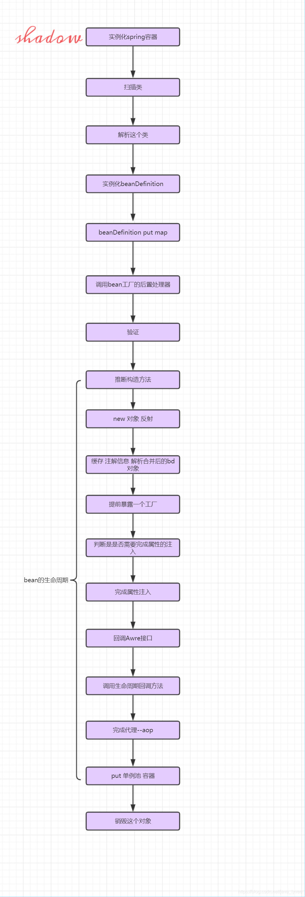

### 写在开始
我们知道在Spring中，bean在实例化之前，会先生成beanDefinition并存放在DefaultListableBeanFactory.beanDefinitionMap内部，流程如下。

`refresh -》 invokeBeanFactoryPostProcessors -》 ConfigurationClassPostProcessor.postProcessBeanDefinitionRegistry -》... -》ClassPathBeanDefinitionScanner.doScan -》 DefaultListableBeanFactory.beanDefinitionMap`

#### Spring中Bean的初始化概览图


### Bean的实例化过程

#### Spring什么时候开始创建bean实例？

直接上源码 AbstractApplicationContext.refresh()

```
public void refresh() throws BeansException, IllegalStateException {
		synchronized (this.startupShutdownMonitor) {
			// Prepare this context for refreshing.
			prepareRefresh();

			// Tell the subclass to refresh the internal bean factory.
			ConfigurableListableBeanFactory beanFactory = obtainFreshBeanFactory();

			// Prepare the bean factory for use in this context.
			//对bean工厂进行一些标准的配置，比如上下文的加载器classload和postprocessor回调等
			prepareBeanFactory(beanFactory);

			try {
				// Allows post-processing of the bean factory in context subclasses.
				postProcessBeanFactory(beanFactory);

				// Invoke factory processors registered as beans in the context.
				invokeBeanFactoryPostProcessors(beanFactory);

				// Register bean processors that intercept bean creation.
				registerBeanPostProcessors(beanFactory);

				// Initialize message source for this context.
				initMessageSource();

				// Initialize event multicaster for this context.
				initApplicationEventMulticaster();

				// Initialize other special beans in specific context subclasses.
				onRefresh();

				// Check for listener beans and register them.
				registerListeners();

				// Instantiate all remaining (non-lazy-init) singletons.
				finishBeanFactoryInitialization(beanFactory);

				// Last step: publish corresponding event.
				finishRefresh();
			}
```
根据注释我们可以初步了解到，bean的实例化发生在 **finishBeanFactoryInitialization(beanFactory)** 这一步，具体流程我们继续往下跟。

#### finishBeanFactoryInitialization(beanFactory)
```
protected void finishBeanFactoryInitialization(ConfigurableListableBeanFactory beanFactory) {
		// Initialize conversion service for this context.
		if (beanFactory.containsBean(CONVERSION_SERVICE_BEAN_NAME) &&
				beanFactory.isTypeMatch(CONVERSION_SERVICE_BEAN_NAME, ConversionService.class)) {
			beanFactory.setConversionService(
					beanFactory.getBean(CONVERSION_SERVICE_BEAN_NAME, ConversionService.class));
		}

		// Register a default embedded value resolver if no bean post-processor
		// (such as a PropertyPlaceholderConfigurer bean) registered any before:
		// at this point, primarily for resolution in annotation attribute values.
		if (!beanFactory.hasEmbeddedValueResolver()) {
			beanFactory.addEmbeddedValueResolver(strVal -> getEnvironment().resolvePlaceholders(strVal));
		}

		// Initialize LoadTimeWeaverAware beans early to allow for registering their transformers early.
		String[] weaverAwareNames = beanFactory.getBeanNamesForType(LoadTimeWeaverAware.class, false, false);
		for (String weaverAwareName : weaverAwareNames) {
			getBean(weaverAwareName);
		}

		// Stop using the temporary ClassLoader for type matching.
		beanFactory.setTempClassLoader(null);

		// Allow for caching all bean definition metadata, not expecting further changes.
		beanFactory.freezeConfiguration();

		// Instantiate all remaining (non-lazy-init) singletons.
		//实例化所有的单例对象
		beanFactory.preInstantiateSingletons();
	}
```
继续往下根据 **beanFactory.preInstantiateSingletons()**

```
public void preInstantiateSingletons() throws BeansException {
		if (logger.isDebugEnabled()) {
			logger.debug("Pre-instantiating singletons in " + this);
		}
		//所有bean的名字
		// Iterate over a copy to allow for init methods which in turn register new bean definitions.
		// While this may not be part of the regular factory bootstrap, it does otherwise work fine.
		List<String> beanNames = new ArrayList<>(this.beanDefinitionNames);

		// Trigger initialization of all non-lazy singleton beans...
		// 触发所有非延迟加载单例beans的初始化，主要步骤为调用getBean
		for (String beanName : beanNames) {
			//合并父BeanDefinition
			RootBeanDefinition bd = getMergedLocalBeanDefinition(beanName);
			if (!bd.isAbstract() && bd.isSingleton() && !bd.isLazyInit()) {
				if (isFactoryBean(beanName)) {
					//如果是FactoryBean则加上&
					Object bean = getBean(FACTORY_BEAN_PREFIX + beanName);
					if (bean instanceof FactoryBean) {
						final FactoryBean<?> factory = (FactoryBean<?>) bean;
						boolean isEagerInit;
						if (System.getSecurityManager() != null && factory instanceof SmartFactoryBean) {
							isEagerInit = AccessController.doPrivileged((PrivilegedAction<Boolean>)
											((SmartFactoryBean<?>) factory)::isEagerInit,
									getAccessControlContext());
						}
						else {
							isEagerInit = (factory instanceof SmartFactoryBean &&
									((SmartFactoryBean<?>) factory).isEagerInit());
						}
						if (isEagerInit) {
							getBean(beanName);
						}
					}
				}
				else {
					getBean(beanName);
				}
			}
		}

		// Trigger post-initialization callback for all applicable beans...
		for (String beanName : beanNames) {
			Object singletonInstance = getSingleton(beanName);
			if (singletonInstance instanceof SmartInitializingSingleton) {
				final SmartInitializingSingleton smartSingleton = (SmartInitializingSingleton) singletonInstance;
				if (System.getSecurityManager() != null) {
					AccessController.doPrivileged((PrivilegedAction<Object>) () -> {
						smartSingleton.afterSingletonsInstantiated();
						return null;
					}, getAccessControlContext());
				}
				else {
					smartSingleton.afterSingletonsInstantiated();
				}
			}
		}
	}
```

我们以正常的普通bean为切入点，可以看见，关键代码为**getBean(beanName);**

### getBean(beanName) 源码解析
忽略部分调用流程，最终我们会来到 AbstractBeanFactory.doGetBean()，直接上源码。

```
protected <T> T doGetBean(final String name, @Nullable final Class<T> requiredType,
			@Nullable final Object[] args, boolean typeCheckOnly) throws BeansException {

		/**
		 * 通过 name 获取 beanName。这里不使用 name 直接作为 beanName 有两个原因
		 * 1、name 可能会以 & 字符开头，表明调用者想获取 FactoryBean 本身，而非 FactoryBean
		 *   实现类所创建的 bean。在 BeanFactory 中，FactoryBean 的实现类和其他的 bean 存储
		 *   方式是一致的，即 <beanName, bean>，beanName 中是没有 & 这个字符的。所以我们需要
		 *   将 name 的首字符 & 移除，这样才能从缓存里取到 FactoryBean 实例。
		 * 2、还是别名的问题，转换需要
		 * &beanName
		 */
		final String beanName = transformedBeanName(name);
		Object bean;

		// Eagerly check singleton cache for manually registered singletons.
		/**
		 * 这个方法在初始化的时候会调用，在getBean的时候也会调用
		 * 为什么需要这么做呢？
		 * 也就是说spring在初始化的时候先获取这个对象
		 * 判断这个对象是否被实例化好了(普通情况下绝对为空====有一种情况可能不为空)
		 * 从spring的bean容器中获取一个bean，由于spring中bean容器是一个map（singletonObjects）
		 * 所以你可以理解getSingleton(beanName)等于beanMap.get(beanName)
		 * 由于方法会在spring环境初始化的时候（就是对象被创建的时候调用一次）调用一次
		 * 还会在getBean的时候调用一次
		 * 所以再调试的时候需要特别注意，不能直接断点在这里，
		 * 需要先进入到annotationConfigApplicationContext.getBean(IndexDao.class)
		 * 之后再来断点，这样就确保了我们是在获取这个bean的时候调用的
		 *
		 * 需要说明的是在初始化时候调用一般都是返回null
		 *
		 *
		 *
		 *
		 *
		 *
		 * lazy
		 */
		Object sharedInstance = getSingleton(beanName);
		if (sharedInstance != null && args == null) {
			//这里的代码是对于日志的记录，方便我们以后阅读应该注释，不影响spring功能
//			if (logger.isDebugEnabled()) {
//				if (isSingletonCurrentlyInCreation(beanName)) {
//					logger.debug("Returning eagerly cached instance of singleton bean '" + beanName +
//							"' that is not fully initialized yet - a consequence of a circular reference");
//				}
//				else {
//					logger.debug("Returning cached instance of singleton bean '" + beanName + "'");
//				}
//			}

			/**
			 * 如果 sharedInstance 是普通的单例 bean，下面的方法会直接返回。但如果
			 * sharedInstance 是 FactoryBean 类型的，则需调用 getObject 工厂方法获取真正的
			 * bean 实例。如果用户想获取 FactoryBean 本身，这里也不会做特别的处理，直接返回
			 * 即可。毕竟 FactoryBean 的实现类本身也是一种 bean，只不过具有一点特殊的功能而已。
			 */
			bean = getObjectForBeanInstance(sharedInstance, name, beanName, null);
		}

		else {
			// Fail if we're already creating this bean instance:
			// We're assumably within a circular reference.
			/**
			 * 原型
			 * 如果是原型不应该在初始化的时候创建
			 */
			if (isPrototypeCurrentlyInCreation(beanName)) {
				throw new BeanCurrentlyInCreationException(beanName);
			}

			// Check if bean definition exists in this factory.
			BeanFactory parentBeanFactory = getParentBeanFactory();
			if (parentBeanFactory != null && !containsBeanDefinition(beanName)) {
				// Not found -> check parent.
				String nameToLookup = originalBeanName(name);
				if (parentBeanFactory instanceof AbstractBeanFactory) {
					return ((AbstractBeanFactory) parentBeanFactory).doGetBean(
							nameToLookup, requiredType, args, typeCheckOnly);
				}
				else if (args != null) {
					// Delegation to parent with explicit args.
					return (T) parentBeanFactory.getBean(nameToLookup, args);
				}
				else {
					// No args -> delegate to standard getBean method.
					return parentBeanFactory.getBean(nameToLookup, requiredType);
				}
			}

			if (!typeCheckOnly) {
				//添加到alreadyCreated set集合当中，表示他已经创建过一场
				markBeanAsCreated(beanName);
			}

			try {
				final RootBeanDefinition mbd = getMergedLocalBeanDefinition(beanName);
				checkMergedBeanDefinition(mbd, beanName, args);

				// Guarantee initialization of beans that the current bean depends on.
				String[] dependsOn = mbd.getDependsOn();
				if (dependsOn != null) {
					for (String dep : dependsOn) {
						if (isDependent(beanName, dep)) {
							throw new BeanCreationException(mbd.getResourceDescription(), beanName,
									"Circular depends-on relationship between '" + beanName + "' and '" + dep + "'");
						}
						registerDependentBean(dep, beanName);
						try {
							getBean(dep);
						}
						catch (NoSuchBeanDefinitionException ex) {
							throw new BeanCreationException(mbd.getResourceDescription(), beanName,
									"'" + beanName + "' depends on missing bean '" + dep + "'", ex);
						}
					}
				}

				// Create bean instance.
				if (mbd.isSingleton()) {
					sharedInstance = getSingleton(beanName, () -> {
						try {
							return createBean(beanName, mbd, args);
						}
						catch (BeansException ex) {
							// Explicitly remove instance from singleton cache: It might have been put there
							// eagerly by the creation process, to allow for circular reference resolution.
							// Also remove any beans that received a temporary reference to the bean.
							destroySingleton(beanName);
							throw ex;
						}
					});
					bean = getObjectForBeanInstance(sharedInstance, name, beanName, mbd);
				}

				else if (mbd.isPrototype()) {
					// It's a prototype -> create a new instance.
					Object prototypeInstance = null;
					try {
						beforePrototypeCreation(beanName);
						prototypeInstance = createBean(beanName, mbd, args);
					}
					finally {
						afterPrototypeCreation(beanName);
					}
					bean = getObjectForBeanInstance(prototypeInstance, name, beanName, mbd);
				}

				else {
					String scopeName = mbd.getScope();
					final Scope scope = this.scopes.get(scopeName);
					if (scope == null) {
						throw new IllegalStateException("No Scope registered for scope name '" + scopeName + "'");
					}
					try {
						Object scopedInstance = scope.get(beanName, () -> {
							beforePrototypeCreation(beanName);
							try {
								return createBean(beanName, mbd, args);
							}
							finally {
								afterPrototypeCreation(beanName);
							}
						});
						bean = getObjectForBeanInstance(scopedInstance, name, beanName, mbd);
					}
					catch (IllegalStateException ex) {
						throw new BeanCreationException(beanName,
								"Scope '" + scopeName + "' is not active for the current thread; consider " +
								"defining a scoped proxy for this bean if you intend to refer to it from a singleton",
								ex);
					}
				}
			}
			catch (BeansException ex) {
				cleanupAfterBeanCreationFailure(beanName);
				throw ex;
			}
		}

		// Check if required type matches the type of the actual bean instance.
		if (requiredType != null && !requiredType.isInstance(bean)) {
			try {
				T convertedBean = getTypeConverter().convertIfNecessary(bean, requiredType);
				if (convertedBean == null) {
					throw new BeanNotOfRequiredTypeException(name, requiredType, bean.getClass());
				}
				return convertedBean;
			}
			catch (TypeMismatchException ex) {
				if (logger.isDebugEnabled()) {
					logger.debug("Failed to convert bean '" + name + "' to required type '" +
							ClassUtils.getQualifiedName(requiredType) + "'", ex);
				}
				throw new BeanNotOfRequiredTypeException(name, requiredType, bean.getClass());
			}
		}
		return (T) bean;
	}
```

#### 第一个getSingleton 
`Object sharedInstance = getSingleton(beanName);`
跟进源码，最终我们会调用到**DefaultSingletonBeanRegistry.getSingleton(String beanName, boolean allowEarlyReference)**,源码如下。
```
protected Object getSingleton(String beanName, boolean allowEarlyReference) {
		//从map中获取bean如果不为空直接返回，不再进行初始化工作
		//讲道理一个程序员提供的对象这里一般都是为空的
		Object singletonObject = this.singletonObjects.get(beanName);
		if (singletonObject == null && isSingletonCurrentlyInCreation(beanName)) {
			synchronized (this.singletonObjects) {
				singletonObject = this.earlySingletonObjects.get(beanName);
				if (singletonObject == null && allowEarlyReference) {
					ObjectFactory<?> singletonFactory = this.singletonFactories.get(beanName);
					if (singletonFactory != null) {
						singletonObject = singletonFactory.getObject();
						this.earlySingletonObjects.put(beanName, singletonObject);
						this.singletonFactories.remove(beanName);
					}
				}
			}
		}
		return singletonObject;
	}
```

注意，这里个第二个getSingleton配合使用，一起来解决了循环依赖的问题


#### 第二个getSingleton

我认为其中有几部是比较重要的，第一是将beanName添加到singletonsCurrentlyInCreation这样一个set集合中，表示beanName对应的bean正在创建中
第二是调用singletonFactory.getObject()，最终会调用到createBean方法，最终创建bean的逻辑就在其中

```
getSingleton(beanName, () -> {
            try {
                return createBean(beanName, mbd, args);
            }
            catch (BeansException ex) {
                // Explicitly remove instance from singleton cache: It might have been put there
                // eagerly by the creation process, to allow for circular reference resolution.
                // Also remove any beans that received a temporary reference to the bean.
                destroySingleton(beanName);
                throw ex;
            }
        });
        
        
public Object getSingleton(String beanName, ObjectFactory<?> singletonFactory) {
		Assert.notNull(beanName, "Bean name must not be null");
		synchronized (this.singletonObjects) {
			Object singletonObject = this.singletonObjects.get(beanName);
			if (singletonObject == null) {
				if (this.singletonsCurrentlyInDestruction) {
					throw new BeanCreationNotAllowedException(beanName,
							"Singleton bean creation not allowed while singletons of this factory are in destruction " +
							"(Do not request a bean from a BeanFactory in a destroy method implementation!)");
				}
				if (logger.isDebugEnabled()) {
					logger.debug("Creating shared instance of singleton bean '" + beanName + "'");
				}
				/**
				 * 将beanName添加到singletonsCurrentlyInCreation这样一个set集合中
				 * 表示beanName对应的bean正在创建中
				 */
				beforeSingletonCreation(beanName);
				boolean newSingleton = false;
				boolean recordSuppressedExceptions = (this.suppressedExceptions == null);
				if (recordSuppressedExceptions) {
					this.suppressedExceptions = new LinkedHashSet<>();
				}
				try {
					singletonObject = singletonFactory.getObject();
					newSingleton = true;
				}
				catch (IllegalStateException ex) {
					// Has the singleton object implicitly appeared in the meantime ->
					// if yes, proceed with it since the exception indicates that state.
					singletonObject = this.singletonObjects.get(beanName);
					if (singletonObject == null) {
						throw ex;
					}
				}
				catch (BeanCreationException ex) {
					if (recordSuppressedExceptions) {
						for (Exception suppressedException : this.suppressedExceptions) {
							ex.addRelatedCause(suppressedException);
						}
					}
					throw ex;
				}
				finally {
					if (recordSuppressedExceptions) {
						this.suppressedExceptions = null;
					}
					//把标识为正在创建的标识去掉
					afterSingletonCreation(beanName);
				}
				if (newSingleton) {
					addSingleton(beanName, singletonObject);
				}
			}
			return singletonObject;
		}
	}
```

### createBean
完成针对bean生命周期的多个处理

- aop

- 属性填充， 自动装配

- 各种后置处理器的调用（beanPostProcessor），在九个地方，调用了五种后置处理器

- 循环依赖的处理

- ...


### Bean生命周期所经历的各个后置处理器

#### 第一次：InstantiationAwareBeanPostProcessor.postProcessBeforeInstantiation
InstantiationAwareBeanPostProcessor接口继承BeanPostProcessor接口，它内部提供了3个方法，再加上BeanPostProcessor接口内部的2个方法，所以实现这个接口需要实现5个方法。InstantiationAwareBeanPostProcessor接口的主要作用在于目标对象的实例化过程中需要处理的事情，包括实例化对象的前后过程以及实例的属性设置
在org.springframework.beans.factory.support.AbstractAutowireCapableBeanFactory#createBean()方法的Object bean = resolveBeforeInstantiation(beanName, mbdToUse);方法里面执行了这个后置处理器

##### postProcessBeforeInstantiation
在目标对象实例化之前调用，方法的返回值类型是Object，我们可以返回任何类型的值。由于这个时候目标对象还未实例化，所以这个返回值可以用来代替原本该生成的目标对象的实例(一般都是代理对象)。如果该方法的返回值代替原本该生成的目标对象，后续只有postProcessAfterInitialization方法会调用，其它方法不再调用；否则按照正常的流程走

##### postProcessAfterInstantiation
方法在目标对象实例化之后调用，这个时候对象已经被实例化，但是该实例的属性还未被设置，都是null。如果该方法返回false，会忽略属性值的设置；如果返回true，会按照正常流程设置属性值。方法不管postProcessBeforeInstantiation方法的返回值是什么都会执行

##### postProcessPropertyValues
方法对属性值进行修改(这个时候属性值还未被设置，但是我们可以修改原本该设置进去的属性值)。如果postProcessAfterInstantiation方法返回false，该方法不会被调用。可以在该方法内对属性值进行修改


#### 第二次：determineConstructorsFromBeanPostProcessors -》SmartInstantiationAwareBeanPostProcessor
通过**SmartInstantiationAwareBeanPostProcessor.determineCandidateConstructors**来推断构造方法

#### 第三次：applyMergedBeanDefinitionPostProcessors -》MergedBeanDefinitionPostProcessor
缓存注解信息

#### 第四次：addSingletonFactory -》 getEarlyBeanReference -》SmartInstantiationAwareBeanPostProcessor
通过**SmartInstantiationAwareBeanPostProcessor.getEarlyBeanReference**得到一个提前暴露的对象，对象不是bean（在spring容器中，并且是spring产生，即ObjectFactory，最终会调用ObjectFactory.getObject来得到具体bean）

#### 第五次：populateBean -》InstantiationAwareBeanPostProcessor
调用**InstantiationAwareBeanPostProcessor.postProcessAfterInstantiation**来判断是否要进行数学填充

#### 第六次：populateBean -》InstantiationAwareBeanPostProcessor
调用**InstantiationAwareBeanPostProcessor.postProcessPropertyValues**来填充属性

#### 第七次：initializeBean -》applyBeanPostProcessorsBeforeInitialization
执行各种beanPostProcessor的**postProcessBeforeInitialization**方法

#### 第八次：initializeBean -》applyBeanPostProcessorsAfterInitialization
执行各种beanPostProcessor的**postProcessAfterInitialization**方法

#### 第九次：执行bean销毁的后置处理


### spring bean的生命周期大致流程总结



