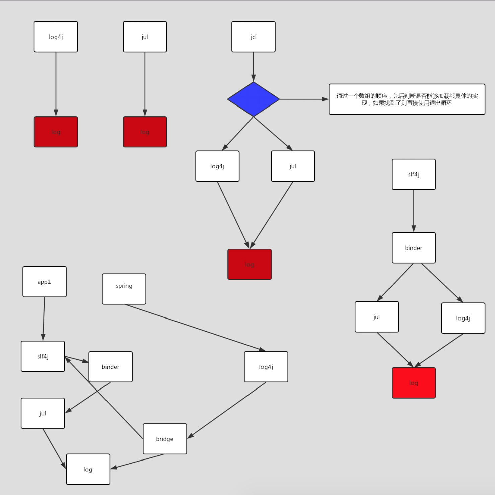
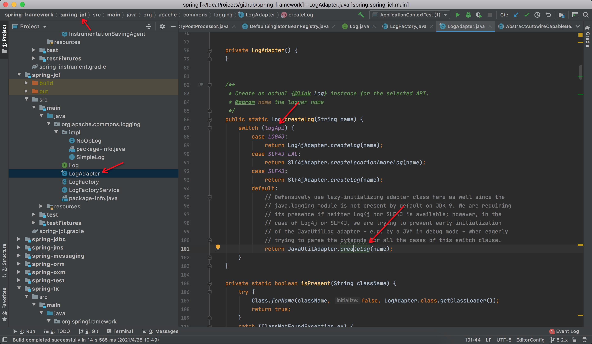

### 写在开始
通常我们在项目中使用的日志是像slf4j以及较早的jcl，可以简单的认为他们就是提供了统一的api，相当于一个门面（facade），内部真正使用的日志系统可以通过
配置依赖来灵活来变动，但是不影响业务代码。

#### jcl
根据上图可以理解到，在较早的jcl中，我们调用getLogger时，内部源码是维护了一个日志具体实现的数组，优先使用log4j，如果找到了就退出循环。

#### slf4j
可以看到，slf4j中存在绑定器以及桥接器的概念，**绑定器**是确定在调用getLogger时使用的具体日志实现，**桥接器**是在整合多个项目是，多个项目又
使用了不同的日志来维护，比如A项目使用了Slf4j并绑定到了jul，但是B项目又使用了log4j，那么为了使日志统一，就可以在项目中加入一个桥接器，把log4j的输出
桥接到slf4j上，使得最终使用的都是jul。

### spring5中日志的新特性
spring4底层使用jcl来作为日志系统，jcl内部维护一个数组，优先使用log4j，其次是jul，而spring5内部则修改了jcl的源码，作为spring-jcl，
其底层是使用一个logApi作为标识，默认是使用jul作为日志，此外还支持slf4j，log4j 2.x等，需要改变的话需要加入相应的依赖，
spring会在类加载的时候改变logAPI的标识，最后达到修改日志框架的目的。
