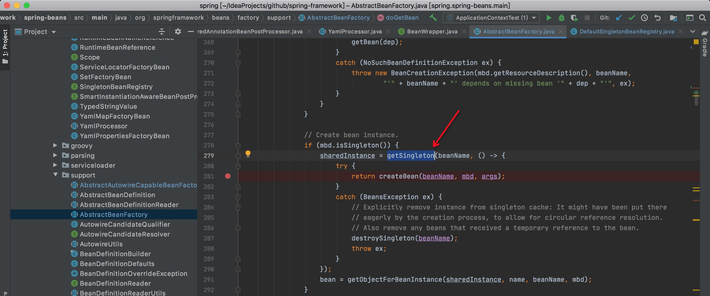
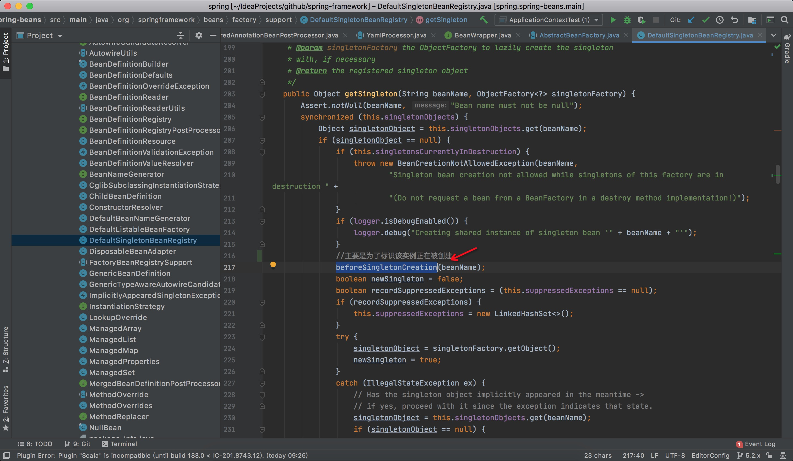
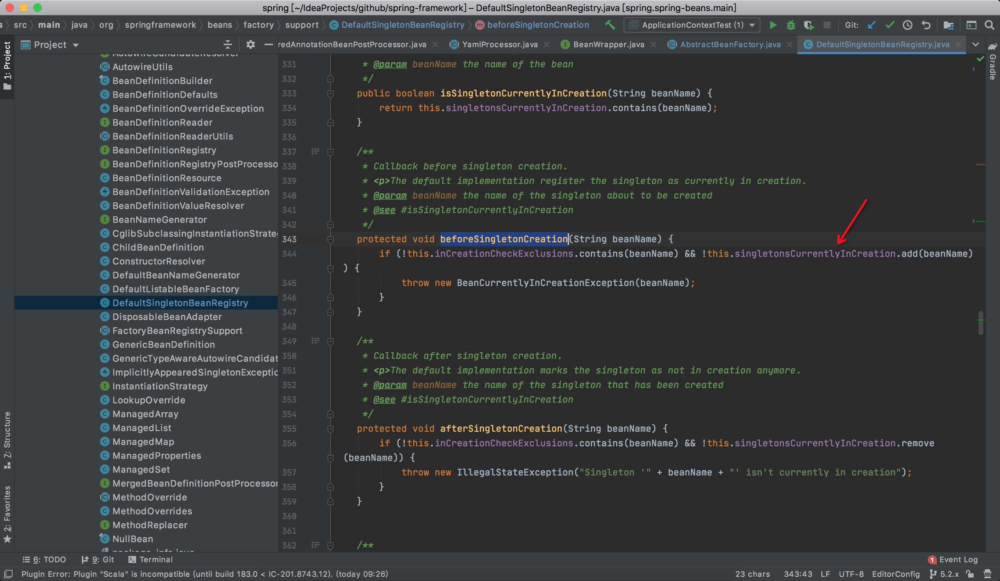
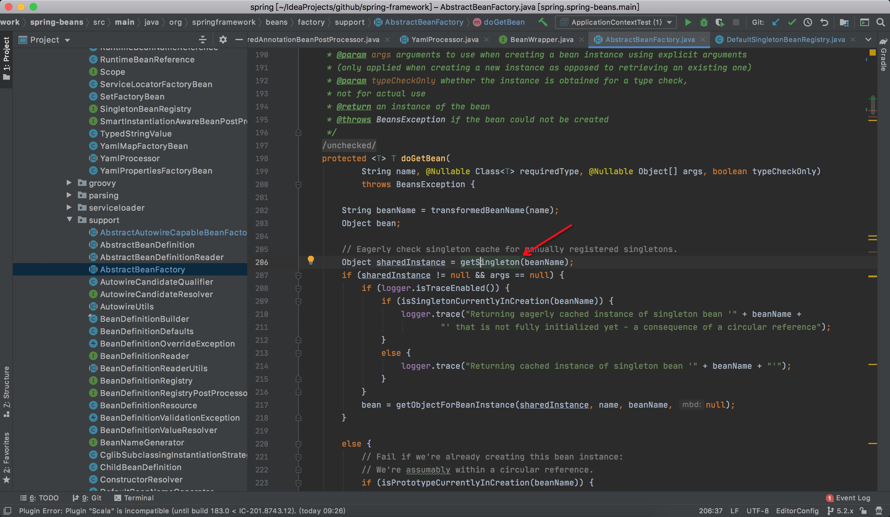
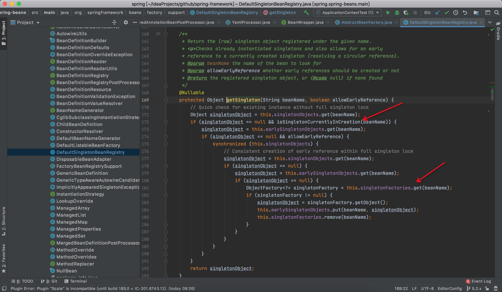

### 什么是循环依赖
简单来说就是，A 依赖 B  ，B 依赖 A。这会导致，spring在实例化A的时候，进行属性填充时，需要处理依赖项B，继而需要实例化B，然后对B进行属性填充
的时候又发现B依赖了A，所以就造成了这一比较复杂的情况，那么我们一起来看一下，Spring是怎么处理的。

### bean的创建过程概览
**创建bean的时候会经过getbean -》 AbstractBeanFactory.doCreateBean -》getSingleton**，其中AbstractBeanFactory.doCreateBean内部
存在两个getSingleton，**第一个getSingleton**主要是为了在getBean的时候从单例池内部获取已经创建过的bean以及得到半成品的bean用于解决循环依赖。
**第二个getSingleton**主要是为了创建bean，并添加一些缓存记录（singletonsCurrentlyInCreation，singletonFactories...）等，如下所示：
#### 标识bean正在创建

**其中在getSingleton的过程中，在准备开始创建bean的过程中，会先进行一步标识，来标识bean正在创建**



#### createBean
**创建bean**主要逻辑存在于**createBean(beanName, mbd, args)**，如下所示
```
 sharedInstance = getSingleton(beanName, () -> {
            try {
                return createBean(beanName, mbd, args);
            }
            catch (BeansException ex) {
                // Explicitly remove instance from singleton cache: It might have been put there
                // eagerly by the creation process, to allow for circular reference resolution.
                // Also remove any beans that received a temporary reference to the bean.
                destroySingleton(beanName);
                throw ex;
            }
        })
```

#### 将bean添加进singletonFactories和registeredSingletons
createBean创建bean的过程中，当bean创建完成后会先进行一步操作，先将bean添加进singletonFactories和registeredSingletons等，部分源码如下。
```
protected Object doCreateBean(final String beanName, final RootBeanDefinition mbd, final @Nullable Object[] args)
			throws BeanCreationException {

		// Instantiate the bean.
		BeanWrapper instanceWrapper = null;
		if (mbd.isSingleton()) {
			instanceWrapper = this.factoryBeanInstanceCache.remove(beanName);
		}
		if (instanceWrapper == null) {
			/**
			 * 创建 bean 实例，并将实例包裹在 BeanWrapper 实现类对象中返回。
			 * createBeanInstance中包含三种创建 bean 实例的方式：
			 *   1. 通过工厂方法创建 bean 实例
			 *   2. 通过构造方法自动注入（autowire by constructor）的方式创建 bean 实例
			 *   3. 通过无参构造方法方法创建 bean 实例
			 *
			 * 若 bean 的配置信息中配置了 lookup-method 和 replace-method，则会使用 CGLIB
			 * 增强 bean 实例。关于lookup-method和replace-method后面再说。
			 */
			instanceWrapper = createBeanInstance(beanName, mbd, args);
		}
		final Object bean = instanceWrapper.getWrappedInstance();
		Class<?> beanType = instanceWrapper.getWrappedClass();
		if (beanType != NullBean.class) {
			mbd.resolvedTargetType = beanType;
		}

		// Allow post-processors to modify the merged bean definition.
		synchronized (mbd.postProcessingLock) {
			if (!mbd.postProcessed) {
				try {
					applyMergedBeanDefinitionPostProcessors(mbd, beanType, beanName);
				}
				catch (Throwable ex) {
					throw new BeanCreationException(mbd.getResourceDescription(), beanName,
							"Post-processing of merged bean definition failed", ex);
				}
				mbd.postProcessed = true;
			}
		}

		// Eagerly cache singletons to be able to resolve circular references
		// even when triggered by lifecycle interfaces like BeanFactoryAware.
		boolean earlySingletonExposure = (mbd.isSingleton() && this.allowCircularReferences &&
				isSingletonCurrentlyInCreation(beanName));
		if (earlySingletonExposure) {
			if (logger.isDebugEnabled()) {
				logger.debug("Eagerly caching bean '" + beanName +
						"' to allow for resolving potential circular references");
			}
			addSingletonFactory(beanName, () -> getEarlyBeanReference(beanName, mbd, bean));
		}

		// Initialize the bean instance.
		Object exposedObject = bean;
		try {
			//设置属性，非常重要
			populateBean(beanName, mbd, instanceWrapper);
			//执行后置处理器，aop就是在这里完成的处理
			exposedObject = initializeBean(beanName, exposedObject, mbd);
		}
		catch (Throwable ex) {
			if (ex instanceof BeanCreationException && beanName.equals(((BeanCreationException) ex).getBeanName())) {
				throw (BeanCreationException) ex;
			}
			else {
				throw new BeanCreationException(
						mbd.getResourceDescription(), beanName, "Initialization of bean failed", ex);
			}
		}

		if (earlySingletonExposure) {
			Object earlySingletonReference = getSingleton(beanName, false);
			if (earlySingletonReference != null) {
				if (exposedObject == bean) {
					exposedObject = earlySingletonReference;
				}
				else if (!this.allowRawInjectionDespiteWrapping && hasDependentBean(beanName)) {
					String[] dependentBeans = getDependentBeans(beanName);
					Set<String> actualDependentBeans = new LinkedHashSet<>(dependentBeans.length);
					for (String dependentBean : dependentBeans) {
						if (!removeSingletonIfCreatedForTypeCheckOnly(dependentBean)) {
							actualDependentBeans.add(dependentBean);
						}
					}
					if (!actualDependentBeans.isEmpty()) {
						throw new BeanCurrentlyInCreationException(beanName,
								"Bean with name '" + beanName + "' has been injected into other beans [" +
								StringUtils.collectionToCommaDelimitedString(actualDependentBeans) +
								"] in its raw version as part of a circular reference, but has eventually been " +
								"wrapped. This means that said other beans do not use the final version of the " +
								"bean. This is often the result of over-eager type matching - consider using " +
								"'getBeanNamesOfType' with the 'allowEagerInit' flag turned off, for example.");
					}
				}
			}
		}

		// Register bean as disposable.
		try {
			registerDisposableBeanIfNecessary(beanName, bean, mbd);
		}
		catch (BeanDefinitionValidationException ex) {
			throw new BeanCreationException(
					mbd.getResourceDescription(), beanName, "Invalid destruction signature", ex);
		}

		return exposedObject;
	}
```
可以看见，当bean创建完成后会调用**addSingletonFactory(beanName, () -> getEarlyBeanReference(beanName, mbd, bean));**，我们继续往里看；
```
protected void addSingletonFactory(String beanName, ObjectFactory<?> singletonFactory) {
		Assert.notNull(singletonFactory, "Singleton factory must not be null");
		synchronized (this.singletonObjects) {
			if (!this.singletonObjects.containsKey(beanName)) {
				this.singletonFactories.put(beanName, singletonFactory);
				this.earlySingletonObjects.remove(beanName);
				this.registeredSingletons.add(beanName);
			}
		}
	}
```
**这里就完成了往spring内部的一个半成品缓存singletonFactories注册一个记录，用于后续使用。**
earlySingletonObjects的作用主要是为了进行类型校验，当获取依赖项的时候，不会立马进行set操作，会先进行一步类型校验，然后再进行设置。

#### 属性填充
```
//设置属性，非常重要
populateBean(beanName, mbd, instanceWrapper);
```
属性填充时会去填充或者构建依赖项，就是在这一步来完成循环依赖的处理，如果发现是引用类型，那么会通过getBean的方式去获取依赖项，getbean时会先
通过第一个getSingleton去尝试获取，如果存在已经创建好的bean，那么就直接获取，如果不存在，但是存在于正在创建的集合**singletonsCurrentlyInCreation**中，
那么就会从一个半成品缓存**singletonFactories**中得到之前存进去的记录。

### 流程总结
场景 ： 如 A 依赖 B  ，B依赖A

当出现循环依赖的时候，spring解析A的依赖项，发现依赖B，最终得到依赖项还是会进行一步getBean操作来获取B，获取B的时候，发现B又依赖A，
所以最终还会通过getBean来回去A，而这时，A已经存在于**singletonsCurrentlyInCreation**，这时就会直接从**singletonFactories**中获取A会直接返回A，
此时B就成功构建并放入bean工厂，并返回给A，此时A也能顺利完成创建。

关键流程之getSingleton(beanName); 如果此时bean存在于singletonsCurrentlyInCreation，那么就会直接从singletonFactories中获取bean并返回，如下




### bean的创建流程以及循环依赖解决总结流程图


