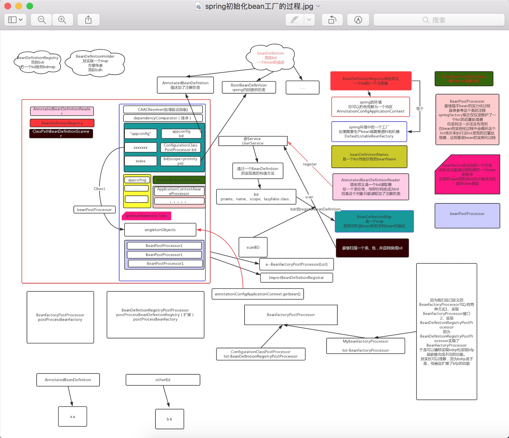
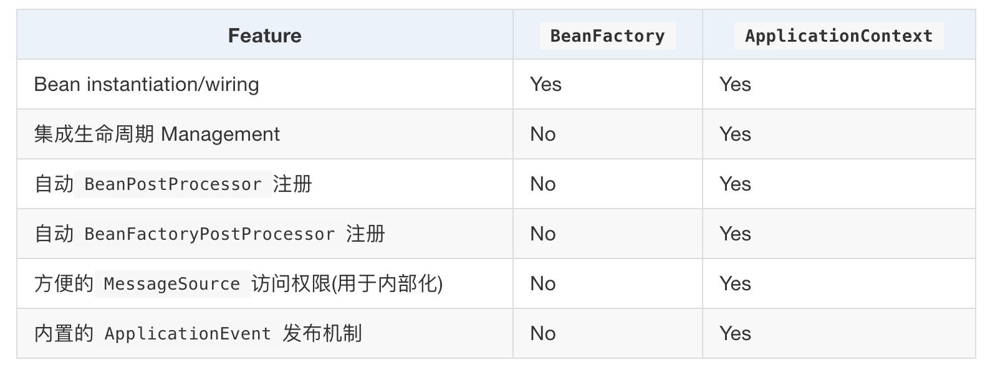
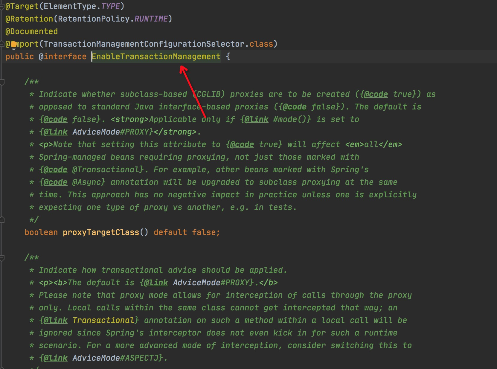
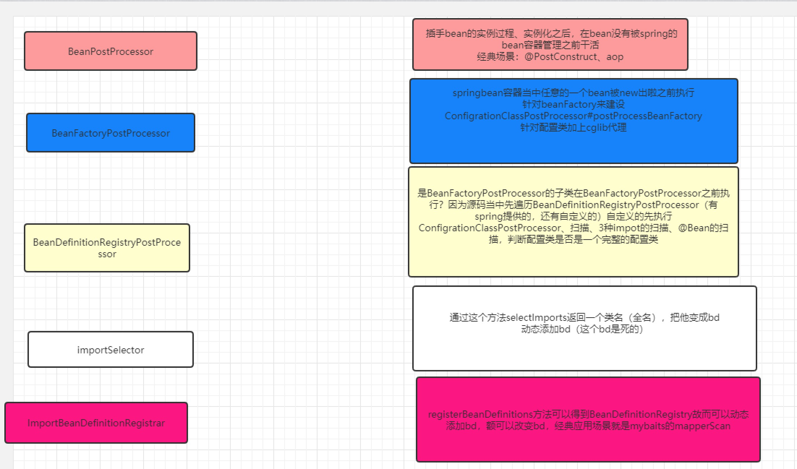

### BeanFactory 或 ApplicationContext？

除非有充分的理由，否则应使用ApplicationContext，除非GenericApplicationContext及其子类AnnotationConfigApplicationContext作为自定义引导的常见实现，否则应使用它们。对于所有常见目的，这些都是 Spring 核心容器的主要入口点：加载配置文件，触发 Classpath 扫描，以编程方式注册 Bean 定义和带注解的类，以及(从 5.0 版本开始)注册功能性 Bean 定义。

因为ApplicationContext包含BeanFactory的所有功能，所以通常建议在纯BeanFactory上使用，除非需要完全控制 Bean 处理的情况。在ApplicationContext(例如GenericApplicationContext实现)内，按惯例(即，按 Bean 名称或 Bean 类型(尤其是后处理器))检测到几种 Bean，而普通的DefaultListableBeanFactory则与任何特殊的 Bean 无关。

对于许多扩展的容器功能(例如注解处理和 AOP 代理)，BeanPostProcessor 扩展点是必不可少的。如果仅使用普通DefaultListableBeanFactory，则默认情况下不会检测到此类后处理器并将其激活。这种情况可能令人困惑，因为您的 bean 配置实际上并没有错。而是在这种情况下，需要通过其他设置完全引导容器。

下表列出了BeanFactory和ApplicationContext接口和实现提供的功能。



### BeanFactory和FactoryBean的区别
BeanFactory提供了ioc的基本功能，负责bean的实例化等功能
FactoryBean和正常的bean一样都是交给spring去管理只是如果你实现了FactoryBean那么spring中会存在两个对象，一个是getObject返回的对象一个是当前对象。
getObject返回的对象的名字是当前类指定的名字，当前对象是“&” + 当前类的名字

#### 什么时候使用factorybean？
当一个bean内部的依赖关系十分复杂，创建bean比较繁琐，比如mybatis创建sqlsessionfactory就使用了sqlsessionfactorybean来管理sqlsessionfactory的创建，
不需要应用程序关心其真实的创建细节。

### BeanDefinition
spring当中用来描述bean的一个接口，类似于Class类一样，用来描述普通的对象，承载了关于bean的多个信息，主要包括如下信息：

- 作用域标识
- BeanClassName
- ParentName
- LazyInit
- DependsOn
- Primary
- Description
- ...

#### 主要实现
根据用途不同，有多种不同实现

- RootBeanDefinition （多用于spring内部）
- AnnotatedBeanDefinition （基于注解的bean实现）
- ...

### 扩展Spring的方式
1.BeanPostProcessor:可以扩展并参与bean的定义过程

2.BeanFastoryPostProcessor：可以扩展beanFastory的定义过程

3.BeanDefinitionRegistryPostProcessor ：扩展了BeanFastoryPostProcessor，如ConfigurationClassPostProcessor就是很重要的一个例子，负责处理配置类等，并最终完成扫描等工作，在BeanFastoryPostProcessor之前调用。

4.ImportBeanDefinitionRegistar：同样可以参与beanFactory的定义过程，可以直接添加bean到beanDefinitionMap内，mybatis以及spring aop都用到了这个扩展点。


### BeanPostProcessor
BeanPostProcessor是Spring框架的提供的一个扩展类点（不止一个）
通过实现BeanPostProcessor接口，程序员就可插手bean实例化的过程,从而减轻了beanFactory的负担
值得说明的是这个接口可以设置多个，会形成一个列表，然后依次执行
(但是spring默认的怎么办？set)
比如AOP就是在bean实例后期间将切面逻辑织入bean实例中的
AOP也正是通过BeanPostProcessor和IOC容器建立起了联系
（由spring提供的默认的PostPorcessor,spring提供了很多默认的PostProcessor,下面我会一一介绍这些实现类的功能）
可以来演示一下 BeanPostProcessor 的使用方式（把动态代理和IOC、aop结合起来使用）
在演示之前先来熟悉一下这个接口，其实这个接口本身特别简单，简单到你发指
但是他的实现类特别复杂，同样复杂到发指！
可以看看spring提供哪些默认的实现（前方高能）
查看类的关系图可以知道spring提供了以下的默认实现，因为高能，故而我们只是解释几个常用的

1、ApplicationContextAwareProcessor （acap）
    acap后置处理器的作用是，当应用程序定义的Bean实现ApplicationContextAware接口时注入ApplicationContext对象
    当然这是他的第一个作业，他还有其他作用，这里不一一列举了，可以参考源码
    我们可以针对ApplicationContextAwareProcessor写一个栗子
    
2、InitDestroyAnnotationBeanPostProcessor
    用来处理自定义的初始化方法和销毁方法
    上次说过Spring中提供了3种自定义初始化和销毁方法分别是
    一、通过@Bean指定init-method和destroy-method属性
    二、Bean实现InitializingBean接口和实现DisposableBean
    三、@PostConstruct：@PreDestroy
    为什么spring通这三种方法都能完成对bean生命周期的回调呢？
    可以通过InitDestroyAnnotationBeanPostProcessor的源码来解释
    
3、InstantiationAwareBeanPostProcessor

4、CommonAnnotationBeanPostProcessor

5、AutowiredAnnotationBeanPostProcessor

6、RequiredAnnotationBeanPostProcessor

7、BeanValidationPostProcessor

8、AbstractAutoProxyCreator
   ......

### BeanFactoryPostProcessor
spring的扩展点之一，实现该接口，可以在spring的bean创建之前修改bean的定义属性。spring允许BeanFactoryPostProcessor在容器实例化任何其它bean之前读取配置元数据，
并可以根据需要进行修改，例如可以把bean的scope从singleton改为prototype，也可以把property的值给修改掉。可以同时配置多个BeanFactoryPostProcessor，并通过设置'order'属性来控制各个BeanFactoryPostProcessor的执行次序。
BeanFactoryPostProcessor是在spring容器加载了bean的定义文件之后，在bean实例化之前执行的。

### 注册类的方式
1.context.registry（），没办法参与bean的定义过程。

2.context.scan，没办法参与bean的定义过程。

3.ImportBeanDefinitionRegistrar （mybatis就用到了，实现mapperScan的时候，具体可以参考mapperScan的源码），可以完整的参与bean的定义过程

### spring中的beanDefinition的来源

1.普通的bean，通过扫描得到（refresh -》 invokeBeanFactoryPostProcessors -》 ConfigurationClassPostProcessor.postProcessBeanDefinitionRegistry -》... -》ClassPathBeanDefinitionScanner.doScan）

2.ImportSeletcor，先放在configurationClasses ，然后再注册（ConfigurationClassPostProcessor.reader.loadBeanDefinitions(configClasses)）

3.@Import，先放在configurationClasses ，然后再注册（ConfigurationClassPostProcessor.reader.loadBeanDefinitions(configClasses)）

4.ImportBeanDefinitionRegistrar，先放在ConfigurationClass.importBeanDefinitionRegistrars，再注册


### ImportSeletcor的作用

```
public interface ImportSelector {

	/**
	 * Select and return the names of which class(es) should be imported based on
	 * the {@link AnnotationMetadata} of the importing @{@link Configuration} class.
	 * @return the class names, or an empty array if none
	 */
	String[] selectImports(AnnotationMetadata importingClassMetadata);

	/**
	 * Return a predicate for excluding classes from the import candidates, to be
	 * transitively applied to all classes found through this selector's imports.
	 * <p>If this predicate returns {@code true} for a given fully-qualified
	 * class name, said class will not be considered as an imported configuration
	 * class, bypassing class file loading as well as metadata introspection.
	 * @return the filter predicate for fully-qualified candidate class names
	 * of transitively imported configuration classes, or {@code null} if none
	 * @since 5.2.4
	 */
	@Nullable
	default Predicate<String> getExclusionFilter() {
		return null;
	}

}
```

将selectImports返回的类全名加载到spring容器内，在spring内主要作用是可以动态的开启和关闭某个功能（即是否需要加载某些bean），
spring aop就有基于这一点，如是否开启事物管理的注解内部就用到了ImportSeletcor，配合@import来使用


### 扩展点总结




