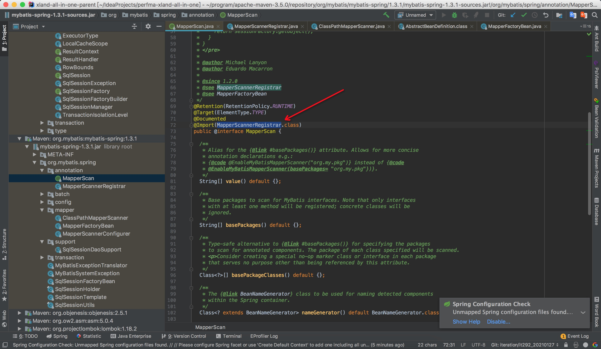
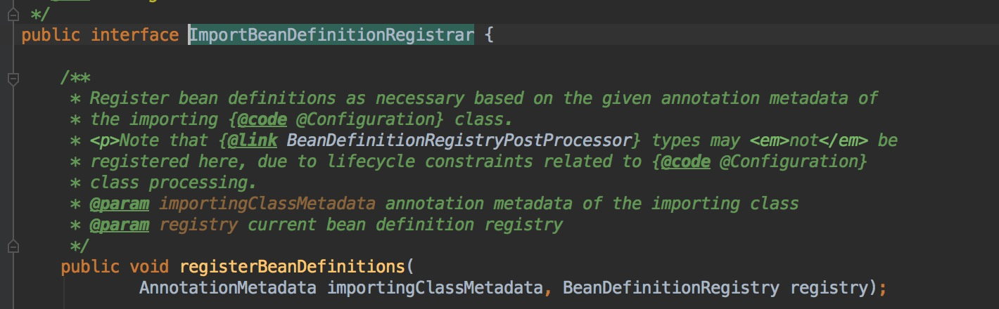
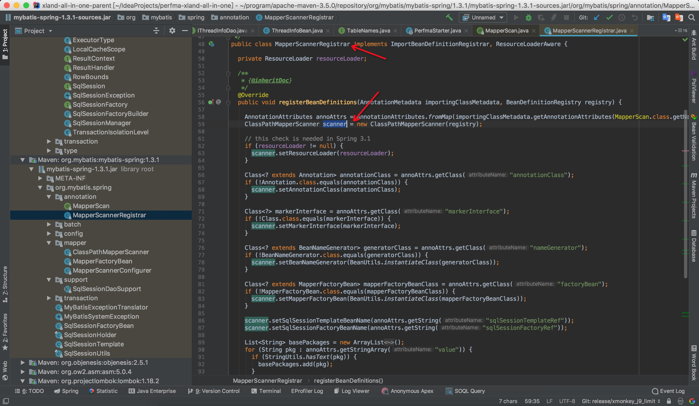
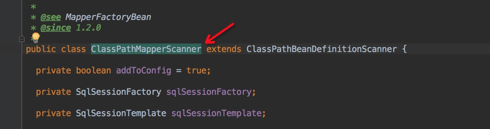
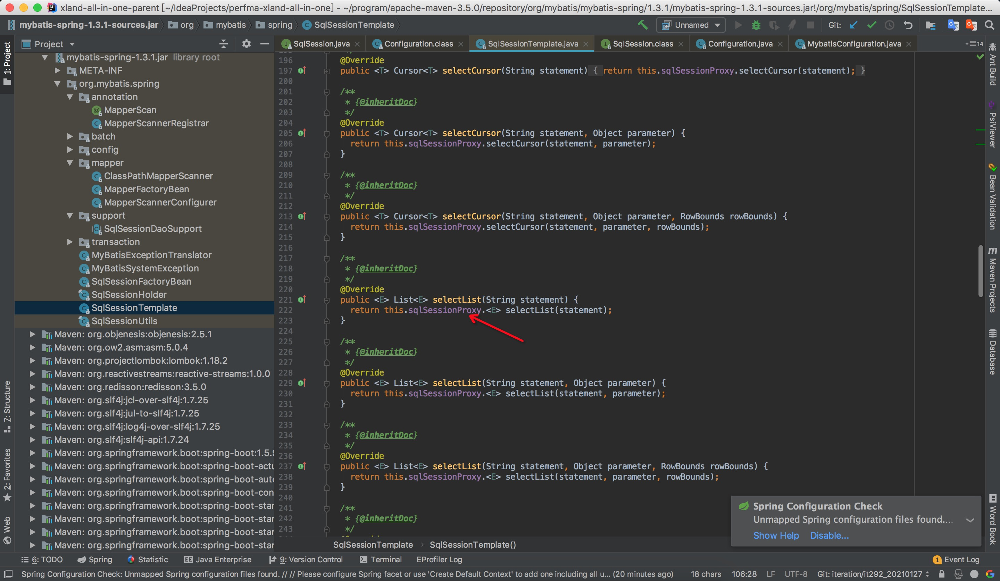
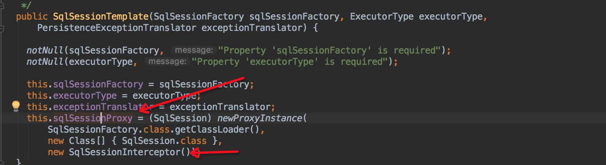
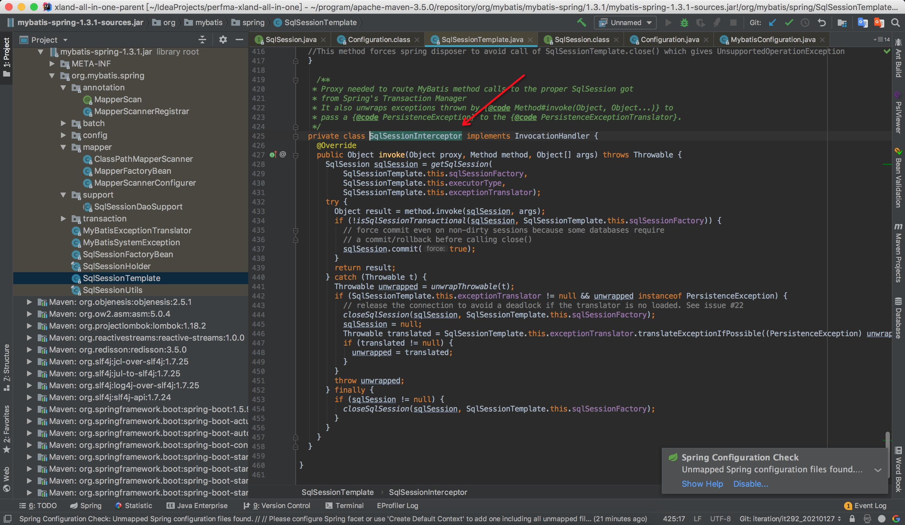

### mapperScan的具体实现
先来看一下mapperScan里面都包含了什么，如下所示。


这里可以看到，mybatis利用了spring的扩展点之一的**ImportBeanDefinitionRegistrar**,其可以参与beanFactory的构建过程，mybatis就是利用
这个特性来往容器内部注册生成的mapper对象。


### mybatis是怎么生成mapper代理对象的
mybatis扩展了ClassPathBeanDefinitionScanner来实现自己的扫描的逻辑，然后针对每个扫描出来的bean来生成代理mapper对象。





ClassPathMapperScanner.doScan扩展了ClassPathBeanDefinitionScanner的doScan，将扫描得到的dao，再进行进一步的处理 `processBeanDefinitions(beanDefinitions);`
``` 
    /**
      * Calls the parent search that will search and register all the candidates.
      * Then the registered objects are post processed to set them as
      * MapperFactoryBeans
      */
     @Override
     public Set<BeanDefinitionHolder> doScan(String... basePackages) {
       Set<BeanDefinitionHolder> beanDefinitions = super.doScan(basePackages);
   
       if (beanDefinitions.isEmpty()) {
         logger.warn("No MyBatis mapper was found in '" + Arrays.toString(basePackages) + "' package. Please check your configuration.");
       } else {
         processBeanDefinitions(beanDefinitions);
       }
   
       return beanDefinitions;
     }
```

**继续往下跟，processBeanDefinitions(beanDefinitions);**

```
private void processBeanDefinitions(Set<BeanDefinitionHolder> beanDefinitions) {
    GenericBeanDefinition definition;
    for (BeanDefinitionHolder holder : beanDefinitions) {
      definition = (GenericBeanDefinition) holder.getBeanDefinition();

      if (logger.isDebugEnabled()) {
        logger.debug("Creating MapperFactoryBean with name '" + holder.getBeanName() 
          + "' and '" + definition.getBeanClassName() + "' mapperInterface");
      }

      // the mapper interface is the original class of the bean
      // but, the actual class of the bean is MapperFactoryBean
      definition.getConstructorArgumentValues().addGenericArgumentValue(definition.getBeanClassName()); // issue #59
      definition.setBeanClass(this.mapperFactoryBean.getClass());

      definition.getPropertyValues().add("addToConfig", this.addToConfig);

      boolean explicitFactoryUsed = false;
      if (StringUtils.hasText(this.sqlSessionFactoryBeanName)) {
        definition.getPropertyValues().add("sqlSessionFactory", new RuntimeBeanReference(this.sqlSessionFactoryBeanName));
        explicitFactoryUsed = true;
      } else if (this.sqlSessionFactory != null) {
        definition.getPropertyValues().add("sqlSessionFactory", this.sqlSessionFactory);
        explicitFactoryUsed = true;
      }

      if (StringUtils.hasText(this.sqlSessionTemplateBeanName)) {
        if (explicitFactoryUsed) {
          logger.warn("Cannot use both: sqlSessionTemplate and sqlSessionFactory together. sqlSessionFactory is ignored.");
        }
        definition.getPropertyValues().add("sqlSessionTemplate", new RuntimeBeanReference(this.sqlSessionTemplateBeanName));
        explicitFactoryUsed = true;
      } else if (this.sqlSessionTemplate != null) {
        if (explicitFactoryUsed) {
          logger.warn("Cannot use both: sqlSessionTemplate and sqlSessionFactory together. sqlSessionFactory is ignored.");
        }
        definition.getPropertyValues().add("sqlSessionTemplate", this.sqlSessionTemplate);
        explicitFactoryUsed = true;
      }

      if (!explicitFactoryUsed) {
        if (logger.isDebugEnabled()) {
          logger.debug("Enabling autowire by type for MapperFactoryBean with name '" + holder.getBeanName() + "'.");
        }
        definition.setAutowireMode(AbstractBeanDefinition.AUTOWIRE_BY_TYPE);
      }
    }
  }
```

**其中重点在于针对每个扫描出来的beanDefinition对象，重置起beanclass属性，设置为一个mapperFactoryBean，并添加构造参数信息。**
`definition.getConstructorArgumentValues().addGenericArgumentValue(definition.getBeanClassName()); // issue #59
 definition.setBeanClass(this.mapperFactoryBean.getClass());`
 
 
### MapperFactoryBean

```
/**
 *    Copyright 2010-2016 the original author or authors.
 *
 *    Licensed under the Apache License, Version 2.0 (the "License");
 *    you may not use this file except in compliance with the License.
 *    You may obtain a copy of the License at
 *
 *       http://www.apache.org/licenses/LICENSE-2.0
 *
 *    Unless required by applicable law or agreed to in writing, software
 *    distributed under the License is distributed on an "AS IS" BASIS,
 *    WITHOUT WARRANTIES OR CONDITIONS OF ANY KIND, either express or implied.
 *    See the License for the specific language governing permissions and
 *    limitations under the License.
 */
package org.mybatis.spring.mapper;

import static org.springframework.util.Assert.notNull;

import org.apache.ibatis.executor.ErrorContext;
import org.apache.ibatis.session.Configuration;
import org.mybatis.spring.SqlSessionTemplate;
import org.mybatis.spring.support.SqlSessionDaoSupport;
import org.springframework.beans.factory.FactoryBean;

/**
 * BeanFactory that enables injection of MyBatis mapper interfaces. It can be set up with a
 * SqlSessionFactory or a pre-configured SqlSessionTemplate.
 * <p>
 * Sample configuration:
 *
 * <pre class="code">
 * {@code
 *   <bean id="baseMapper" class="org.mybatis.spring.mapper.MapperFactoryBean" abstract="true" lazy-init="true">
 *     <property name="sqlSessionFactory" ref="sqlSessionFactory" />
 *   </bean>
 *
 *   <bean id="oneMapper" parent="baseMapper">
 *     <property name="mapperInterface" value="my.package.MyMapperInterface" />
 *   </bean>
 *
 *   <bean id="anotherMapper" parent="baseMapper">
 *     <property name="mapperInterface" value="my.package.MyAnotherMapperInterface" />
 *   </bean>
 * }
 * </pre>
 * <p>
 * Note that this factory can only inject <em>interfaces</em>, not concrete classes.
 *
 * @author Eduardo Macarron
 *
 * @see SqlSessionTemplate
 */
public class MapperFactoryBean<T> extends SqlSessionDaoSupport implements FactoryBean<T> {

  private Class<T> mapperInterface;

  private boolean addToConfig = true;

  public MapperFactoryBean() {
    //intentionally empty 
  }
  
  public MapperFactoryBean(Class<T> mapperInterface) {
    this.mapperInterface = mapperInterface;
  }

  /**
   * {@inheritDoc}
   */
  @Override
  protected void checkDaoConfig() {
    super.checkDaoConfig();

    notNull(this.mapperInterface, "Property 'mapperInterface' is required");

    Configuration configuration = getSqlSession().getConfiguration();
    if (this.addToConfig && !configuration.hasMapper(this.mapperInterface)) {
      try {
        configuration.addMapper(this.mapperInterface);
      } catch (Exception e) {
        logger.error("Error while adding the mapper '" + this.mapperInterface + "' to configuration.", e);
        throw new IllegalArgumentException(e);
      } finally {
        ErrorContext.instance().reset();
      }
    }
  }

  /**
   * {@inheritDoc}
   */
  @Override
  public T getObject() throws Exception {
    return getSqlSession().getMapper(this.mapperInterface);
  }

  /**
   * {@inheritDoc}
   */
  @Override
  public Class<T> getObjectType() {
    return this.mapperInterface;
  }

  /**
   * {@inheritDoc}
   */
  @Override
  public boolean isSingleton() {
    return true;
  }

  //------------- mutators --------------

  /**
   * Sets the mapper interface of the MyBatis mapper
   *
   * @param mapperInterface class of the interface
   */
  public void setMapperInterface(Class<T> mapperInterface) {
    this.mapperInterface = mapperInterface;
  }

  /**
   * Return the mapper interface of the MyBatis mapper
   *
   * @return class of the interface
   */
  public Class<T> getMapperInterface() {
    return mapperInterface;
  }

  /**
   * If addToConfig is false the mapper will not be added to MyBatis. This means
   * it must have been included in mybatis-config.xml.
   * <p/>
   * If it is true, the mapper will be added to MyBatis in the case it is not already
   * registered.
   * <p/>
   * By default addToCofig is true.
   *
   * @param addToConfig
   */
  public void setAddToConfig(boolean addToConfig) {
    this.addToConfig = addToConfig;
  }

  /**
   * Return the flag for addition into MyBatis config.
   *
   * @return true if the mapper will be added to MyBatis in the case it is not already
   * registered.
   */
  public boolean isAddToConfig() {
    return addToConfig;
  }
}

```


重置了beanDefinition的beanclass属性后，spring在实例化bean的时候，就会调用MapperFactoryBean.getObject()来得到mapper对象。
#### getObject

```
/**
   * {@inheritDoc}
   */
  @Override
  public T getObject() throws Exception {
    return getSqlSession().getMapper(this.mapperInterface);
  }
```
getSqlSession()返回的是一个SqlSessionTemplate对象，该对象是针对spring实现的一个封装了jdbc以及连接等操作的对象，最终调用栈会来到
SqlSessionTemplate.getMapper() - > MapperRegistry.getMapper()来生成代理mapper对象。
```
//MapperRegistry.getMapper()

public <T> T getMapper(Class<T> type, SqlSession sqlSession) {
    final MapperProxyFactory<T> mapperProxyFactory = (MapperProxyFactory<T>) knownMappers.get(type);
    if (mapperProxyFactory == null) {
      throw new BindingException("Type " + type + " is not known to the MapperRegistry.");
    }
    try {
      return mapperProxyFactory.newInstance(sqlSession);
    } catch (Exception e) {
      throw new BindingException("Error getting mapper instance. Cause: " + e, e);
    }
  }

```

可以看到最终是通过**mapperProxyFactory.newInstance(sqlSession);**来得到代理对象，我们继续往下跟进，源码如下。
```
/**
 * @author Lasse Voss
 */
public class MapperProxyFactory<T> {

  private final Class<T> mapperInterface;
  private final Map<Method, MapperMethod> methodCache = new ConcurrentHashMap<Method, MapperMethod>();

  public MapperProxyFactory(Class<T> mapperInterface) {
    this.mapperInterface = mapperInterface;
  }

  public Class<T> getMapperInterface() {
    return mapperInterface;
  }

  public Map<Method, MapperMethod> getMethodCache() {
    return methodCache;
  }

  @SuppressWarnings("unchecked")
  protected T newInstance(MapperProxy<T> mapperProxy) {
    return (T) Proxy.newProxyInstance(mapperInterface.getClassLoader(), new Class[] { mapperInterface }, mapperProxy);
  }

  public T newInstance(SqlSession sqlSession) {
    final MapperProxy<T> mapperProxy = new MapperProxy<T>(sqlSession, mapperInterface, methodCache);
    return newInstance(mapperProxy);
  }

}
```

mapperProxy是实现了jdk动态代理的一个InvocationHandler，所以sql相关的逻辑最终会调用到MapperProxy.invoke(...)来执行sql。

```
/**
 * @author Clinton Begin
 * @author Eduardo Macarron
 */
public class MapperProxy<T> implements InvocationHandler, Serializable {

  private static final long serialVersionUID = -6424540398559729838L;
  private final SqlSession sqlSession;
  private final Class<T> mapperInterface;
  private final Map<Method, MapperMethod> methodCache;

  public MapperProxy(SqlSession sqlSession, Class<T> mapperInterface, Map<Method, MapperMethod> methodCache) {
    this.sqlSession = sqlSession;
    this.mapperInterface = mapperInterface;
    this.methodCache = methodCache;
  }

  @Override
  public Object invoke(Object proxy, Method method, Object[] args) throws Throwable {
    try {
      if (Object.class.equals(method.getDeclaringClass())) {
        return method.invoke(this, args);
      } else if (isDefaultMethod(method)) {
        return invokeDefaultMethod(proxy, method, args);
      }
    } catch (Throwable t) {
      throw ExceptionUtil.unwrapThrowable(t);
    }
    final MapperMethod mapperMethod = cachedMapperMethod(method);
    return mapperMethod.execute(sqlSession, args);
  }

  private MapperMethod cachedMapperMethod(Method method) {
    MapperMethod mapperMethod = methodCache.get(method);
    if (mapperMethod == null) {
      mapperMethod = new MapperMethod(mapperInterface, method, sqlSession.getConfiguration());
      methodCache.put(method, mapperMethod);
    }
    return mapperMethod;
  }

  @UsesJava7
  private Object invokeDefaultMethod(Object proxy, Method method, Object[] args)
      throws Throwable {
    final Constructor<MethodHandles.Lookup> constructor = MethodHandles.Lookup.class
        .getDeclaredConstructor(Class.class, int.class);
    if (!constructor.isAccessible()) {
      constructor.setAccessible(true);
    }
    final Class<?> declaringClass = method.getDeclaringClass();
    return constructor
        .newInstance(declaringClass,
            MethodHandles.Lookup.PRIVATE | MethodHandles.Lookup.PROTECTED
                | MethodHandles.Lookup.PACKAGE | MethodHandles.Lookup.PUBLIC)
        .unreflectSpecial(method, declaringClass).bindTo(proxy).invokeWithArguments(args);
  }

  /**
   * Backport of java.lang.reflect.Method#isDefault()
   */
  private boolean isDefaultMethod(Method method) {
    return ((method.getModifiers()
        & (Modifier.ABSTRACT | Modifier.PUBLIC | Modifier.STATIC)) == Modifier.PUBLIC)
        && method.getDeclaringClass().isInterface();
  }
}
```

**MapperMethod**封装了mapper接口的各种信息，类似与beanDefinition，最后调用数据库操作是基于这个sqlsession的，而其实现是SqlSessionTemplate，最后调用栈如下。
如：`SqlSessionTemplate.selectList -> sqlSessionProxy.selectList -> SqlSessionInterceptor.invoke`






 
 
 

