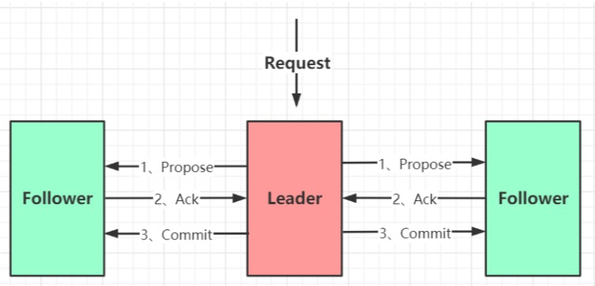

## ZAB协议介绍
ZAB 协议全称:Zookeeper Atomic Broadcast(Zookeeper 原子广播协议)。

Zookeeper 是一个为分布式应用提供高效且可靠的分布式协调服务。在解决分布式一致性方面，Zookeeper 并没有使用 Paxos ，而是采 用了 ZAB 协议，ZAB是Paxos算法的一种简化实现。

ZAB 协议定义:ZAB 协议**是为分布式协调服务 Zookeeper 专门设计的一种支持 崩溃恢复 和 原子广播 协议**。

基于该协议，Zookeeper 实现了一种 主备模式 的系统架构来保持集群中各个副本之间数据一致性。具体如下图所示:

上图显示了 Zookeeper 如何处理集群中的数据。所有客户端写入数据都是写入到 主进程(称为 Leader)中，然后，由 Leader 复制到备 份进程(称为 Follower)中。从而保证数据一致性。

那么复制过程又是如何的呢?复制过程类似 2PC，ZAB 只需要 Follower 有一半以上返回 Ack 信息就可以执行提交，大大减小了同步阻 塞。也提高了可用性。

简单介绍完，开始重点介绍 **消息广播** 和 **崩溃恢复**。整个 Zookeeper 就是在这两个模式之间切换。 简而言之，当 Leader 服务可以正常使 用，就进入消息广播模式，当 Leader 不可用时，则进入崩溃恢复模式。

### 消息广播
ZAB协议的消息广播过程使用的是一个原子广播协议，类似一个 二阶段提交过程。对于客户端发送的写请求，全部由 Leader 接收，
Leader 将请求封装成一个事务 Proposal，将其发送给所有 Follwer ，然后，根据所有 Follwer 的反馈，如果超过半数成功响应，则执行 commit 操作。
### 崩溃恢复
我们说消息广播过程中，Leader 崩溃怎么办?还能保证数据一致吗?如果 Leader 先本地提交了，然后 commit 请求没有发送出去，
怎么办?
实际上，当 Leader 崩溃，即进入我们开头所说的崩溃恢复模式(崩溃即:Leader 失去与过半 Follwer 的联系)。下面来详细讲述。 假设1:Leader 在复制数据给所有 Follwer 之后，还没来得及收到Follower的ack返回就崩溃，怎么办?
假设2:Leader 在收到 ack 并提交了自己，同时发送了部分 commit 出去之后崩溃怎么办?
针对这些问题，ZAB 定义了 2 个原则:
1. ZAB 协议确保丢弃那些只在 Leader 提出/复制，但没有提交的事务。
2. ZAB 协议确保那些已经在 Leader 提交的事务最终会被所有服务器提交。
所以，ZAB 设计了下面这样一个选举算法:
能够确保提交已经被 Leader 提交的事务，同时丢弃已经被跳过的事务。
针对这个要求，如果让 Leader 选举算法能够保证新选举出来的 Leader 服务器拥有集群中所有机器 ZXID 最大的事务，那么就能够保证这 个新选举出来的 Leader 一定具有所有已经提交的提案。
而且这么做有一个好处是:可以省去 Leader 服务器检查事务的提交和丢弃工作的这一步操作。

### 数据同步
当崩溃恢复之后，需要在正式工作之前(接收客户端请求)，Leader 服务器首先确认事务是否都已经被过半的 Follwer 提交了，即是否完
成了数据同步。目的是为了保持数据一致。
当 Follwer 服务器成功同步之后，Leader 会将这些服务器加入到可用服务器列表中。
实际上，Leader 服务器处理或丢弃事务都是依赖着 ZXID 的，那么这个 ZXID 如何生成呢?
答:在 ZAB 协议的事务编号 ZXID 设计中，ZXID 是一个 64 位的数字，其中低 32 位可以看作是一个简单的递增的计数器，针对客户端的 每一个事务请求，Leader 都会产生一个新的事务 Proposal 并对该计数器进行 + 1 操作。
而高 32 位则代表了 Leader 服务器上取出本地日志中最大事务 Proposal 的 ZXID，并从该 ZXID 中解析出对应的 epoch 值(leader选举周 期)，当一轮新的选举结束后，会对这个值加一，并且事务id又从0开始自增。

高 32 位代表了每代 Leader 的唯一性，低 32 代表了每代 Leader 中事务的唯一性。同时，也能让 Follwer 通过高 32 位识别不同的 Leader。简化了数据恢复流程。
基于这样的策略:当 Follower 连接上 Leader 之后，Leader 服务器会根据自己服务器上最后被提交的 ZXID 和 Follower 上的 ZXID 进行 比对，比对结果要么回滚，要么和 Leader 同步。

