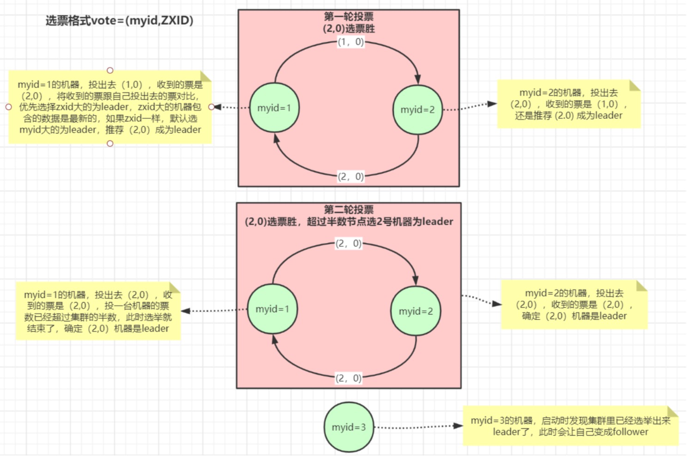
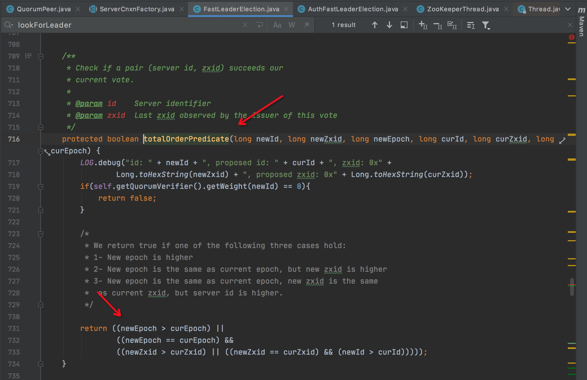
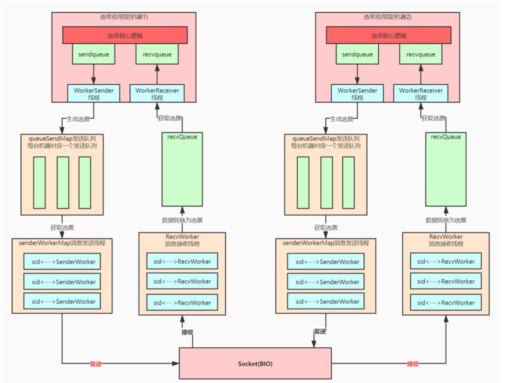

开源项目找入口类一般都是从启动脚本去找，可以从bin目录下的zkServer.sh或zkServer.cmd里找到启动主类运行即可

`org.apache.zookeeper.server.quorum.QuorumPeerMain`


启动或leader宕机选举leader流程


zk内对应的最终的选举源码如下 FastLeaderElection.lookForLeader() -> totalOrderPredicate()


**leader选举多层队列架构**
整个zookeeper选举底层可以分为选举应用层和消息传输层，应用层有自己的队列统一接收和发送选票，传输层也设计了自己的队列，但
是按发送的机器分了队列，避免给每台机器发送消息时相互影响，比如某台机器如果出问题发送不成功则不会影响对正常机器的消息发送。

```
    LinkedBlockingQueue<ToSend> sendqueue;  //对应 WorkerSender
    LinkedBlockingQueue<Notification> recvqueue; //对应 WorkerReceiver

    final ConcurrentHashMap<Long, SendWorker> senderWorkerMap;  //key 为 sid ，对应的SendWorker会从queueSendMap中的queue去取数据
    final ConcurrentHashMap<Long, ArrayBlockingQueue<ByteBuffer>> queueSendMap; //key 为 sid 
```
