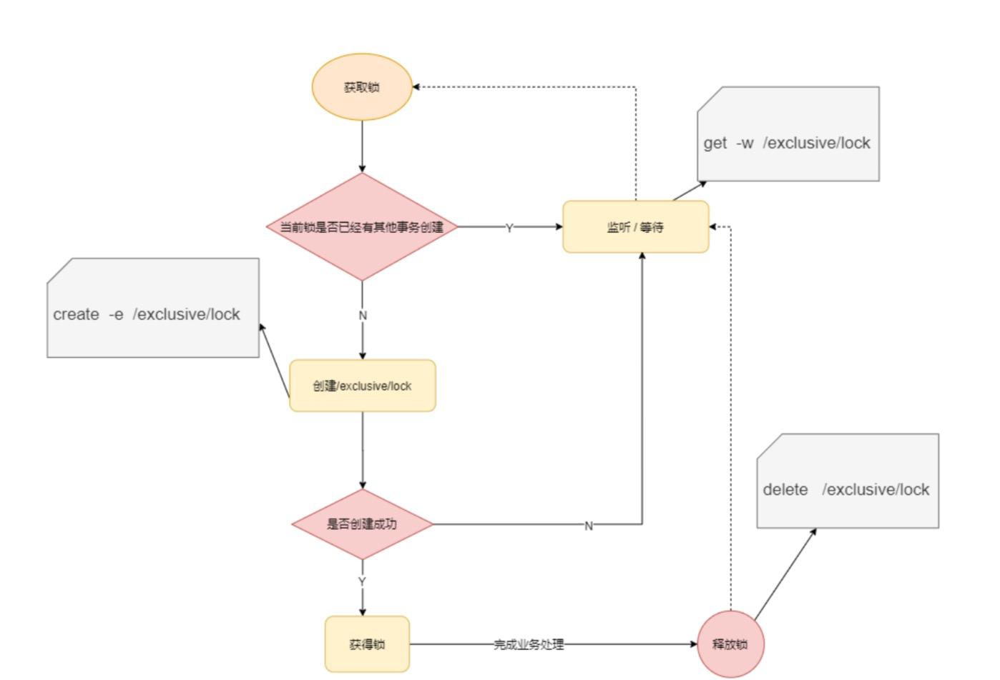
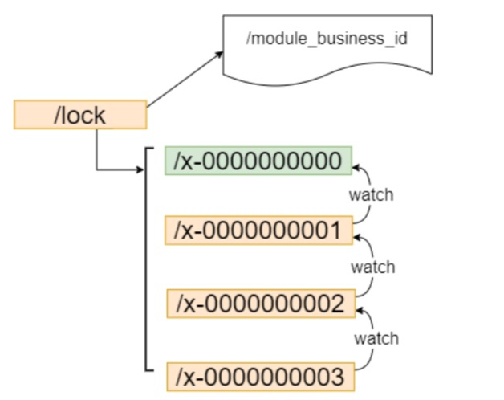
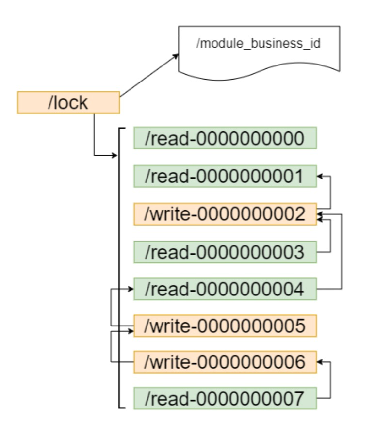
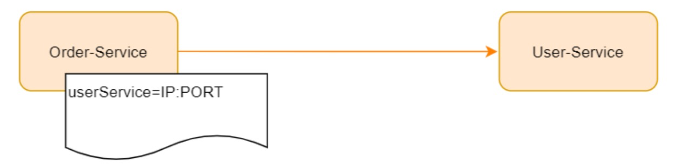
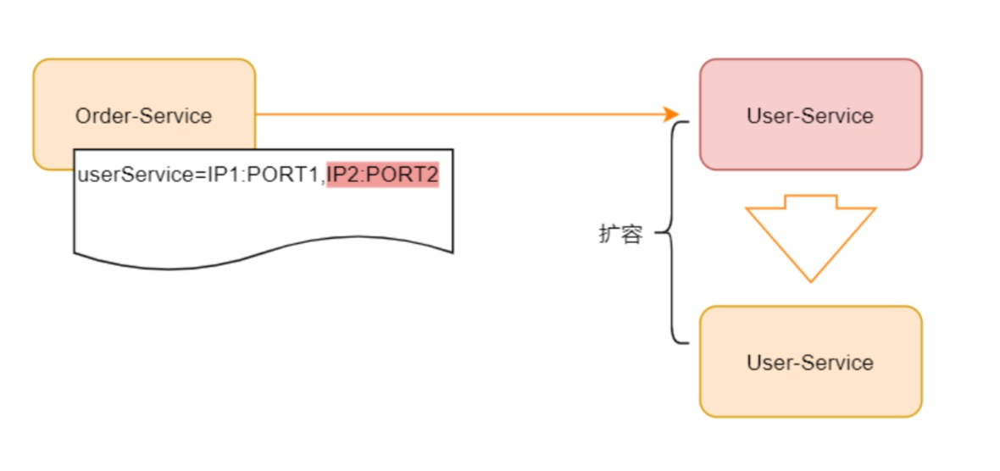
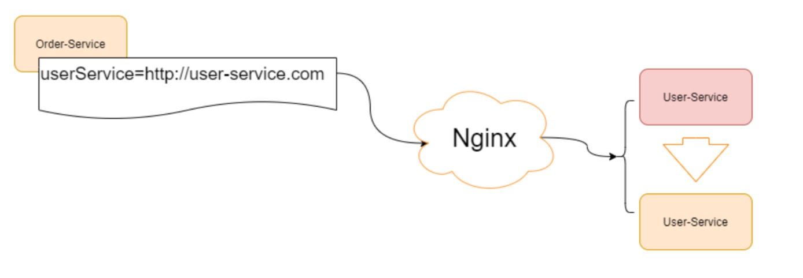
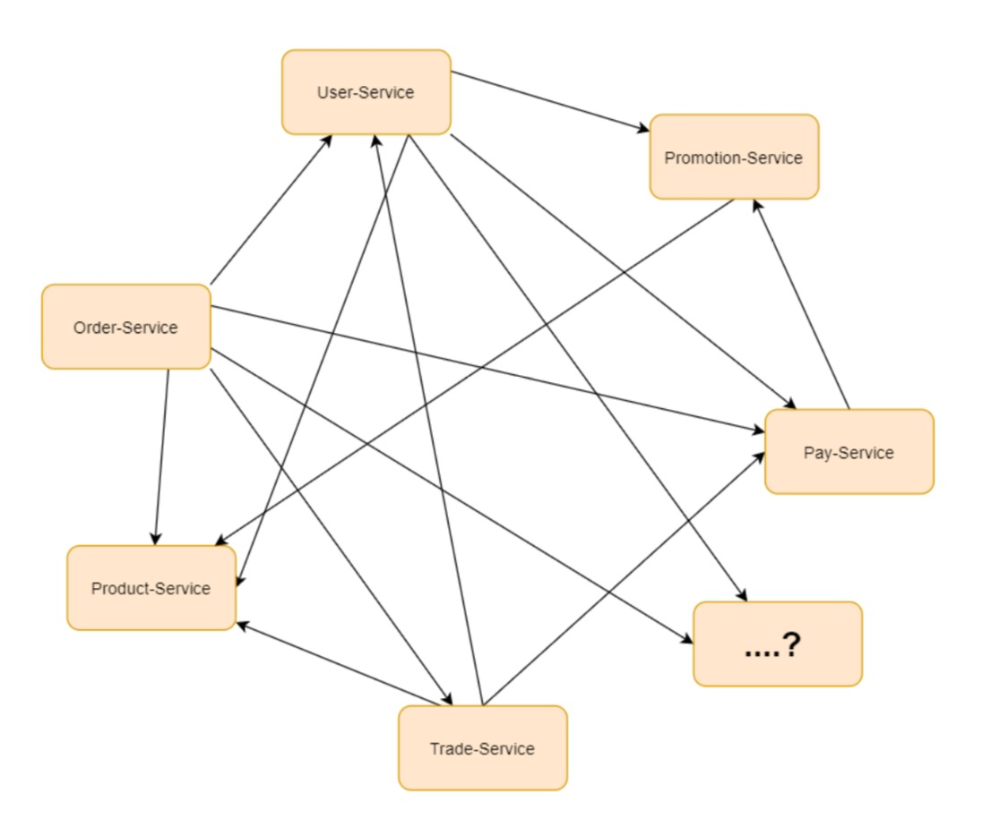
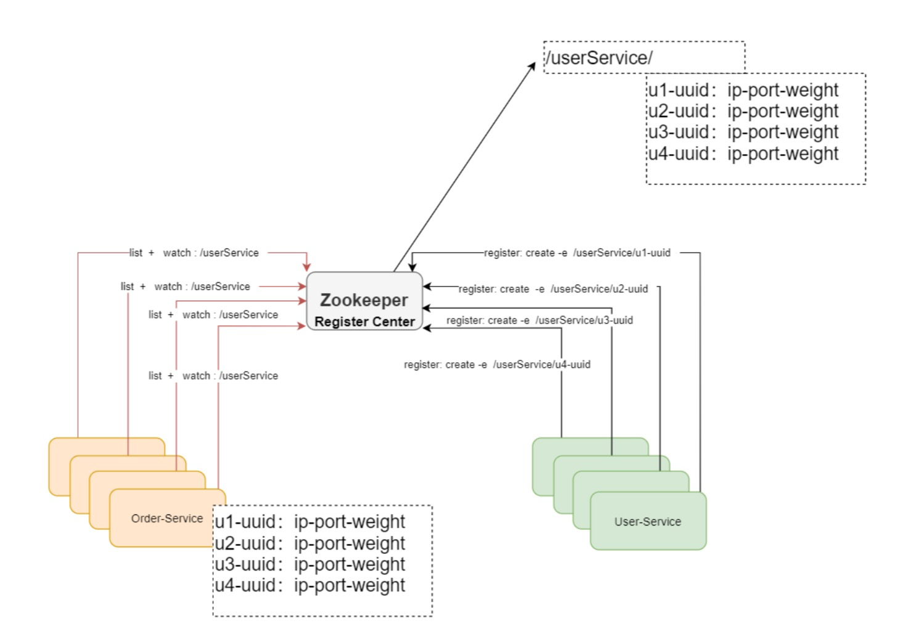

### Zookeeper分布式锁实战

非公平锁:

如上实现方式在并发问题比较严重的情况下，性能会下降的比较厉害，主要原因是，所有的连接
都在对同一个节点进行监听，当服务器检测到删除事件时，要通知所有的连接，所有的连接同时
收到事件，再次并发竞争，这就是羊群效应。如何避免呢，我们看下面这种方式。

**公平锁:**

1.请求进来，直接在/lock节点下创建一个临时顺序节点

2.判断自己是不是节点下序号最小的节点
    是： 获取锁
    不是：对前一个节点进行监听

3.获取锁的请求，处理完成后删除节点，然后后继节点会收到通知，继续重复第二步

**如上借助于临时顺序节点，可以避免同时多个节点的并发竞争锁，缓解了服务端压力。这种实
  现方式所有加锁请求都进行排队加锁，是公平锁的具体实现。**
  
前面这两种加锁方式有一个共同的特质，就是都是**互斥锁**，同一时间只能有一个请求占用，如果
是大量的并发上来，性能是会急剧下降的，所有的请求都得加锁，那是不是真的所有的请求都需
要加锁呢?答案是否定的，比如如果数据没有进行任何修改的话，是不需要加锁的，但是如果读
数据的请求还没读完，这个时候来了一个写请求，怎么办呢?有人已经在读数据了，这个时候是
不能写数据的，不然数据就不正确了。直到前面读锁全部释放掉以后，写请求才能执行，所以需
要给这个读请求加一个标识(读锁)，让写请求知道，这个时候是不能修改数据的。不然数据就
不一致了。如果已经有人在写数据了，再来一个请求写数据，也是不允许的，这样也会导致数据
的不一致，所以所有的写请求，都需要加一个写锁，是为了避免同时对共享数据进行写操作。

**Zookeeper 共享锁实现原理**

### 注册中心实战
1. 在分布式服务体系结构比较简单的场景下，我们的服务可能是这样的

现在 Order-Service 需要调用外部服务的 User-Service ,对于外部的服务依赖，我们直接配置在 我们的服务配置文件中,在服务调用关系比较简单的场景，是完全OK的。随着服务的扩张， User-Service 可能需要进行集群部署，如下:

如果系统的调用不是很复杂，可以通过配置管理，然后实现一个简单的客户端负载均衡也是OK 的，但是随着业务的发展，服务模块进行更加细粒度的划分，业务也变得更加复杂，再使用简单 的配置文件管理，将变得难以维护。当然我们可以再前面加一个服务代理，比如nginx做反向代理， 如下

**如果我们是如下场景呢?**

这个时候我们可以借助于Zookeeper的基本特性来实现一个注册中心,什么是注册中心，顾名思 义，就是让众多的服务，都在Zookeeper中进行注册，啥是注册，注册就是把自己的一些服务信 息，比如IP，端口，还有一些更加具体的服务信息，都写到 Zookeeper节点上， 这样有需要的 服务就可以直接从zookeeper上面去拿，怎么拿呢? 这时我们可以定义统一的名称，比如， User-Service, 那所有的用户服务在启动的时候，都在User-Service 这个节点下面创建一个子节 点(临时节点)，这个子节点保持唯一就好，代表了每个服务实例的唯一标识，有依赖用户服务 的比如Order-Service 就可以通过User-Service 这个父节点，就能获取所有的User-Service 子 节点，并且获取所有的子节点信息(IP，端口等信息)，拿到子节点的数据后Order-Service可 以对其进行缓存，然后实现一个客户端的负载均衡，同时还可以对这个User-Service 目录进行 监听， 这样有新的节点加入，或者退出，Order-Service都能收到通知，这样Order-Service重 新获取所有子节点，且进行数据更新。这个用户服务的子节点的类型为临时节点。Zookeeper中临时节点生命周期是和SESSION绑定的，如果SESSION超时了，对应的节 点会被删除，被删除时，Zookeeper 会通知对该节点父节点进行监听的客户端, 这样对应的客户 端又可以刷新本地缓存了。当有新服务加入时，同样也会通知对应的客户端，刷新本地缓存，要 达到这个目标需要客户端重复的注册对父节点的监听。这样就实现了服务的自动注册和自动退出。

  