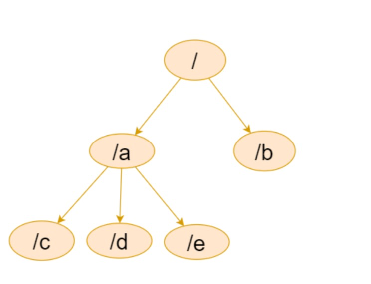
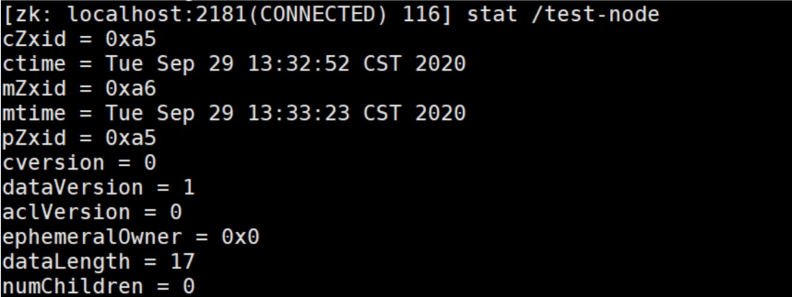
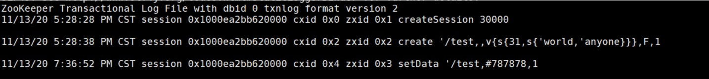

## 写在开头
在了解Zookeeper之前，需要对分布式相关知识有一定了解，什么是分布式系统呢?通常情况 下，单个物理节点很容易达到性能，计算或者容量的瓶颈，所以这个时候就需要多个物理节点来 共同完成某项任务，一个分布式系统的本质是分布在不同网络或计算机上的程序组件，彼此通过 信息传递来协同工作的系统，而Zookeeper正是一个分布式应用协调框架，在分布式系统架构中 有广泛的应用场景。

## 什么是Zookeeper
官方文档上这么解释zookeeper，它是一个分布式协调框架，是Apache Hadoop 的一个子项 目，它主要是用来解决分布式应用中经常遇到的一些数据管理问题，如:统一命名服务、状态同 步服务、集群管理、分布式应用配置项的管理等。

##  Zookeeper 核心概念
上面的解释有点抽象，暂时可以理解为 Zookeeper 是一个用于存储少量数据的基于内存 的数据库，
**主要有如下两个核心的概念:文件系统数据结构+监听通知机制。**

### 1.文件系统数据结构
Zookeeper维护一个类似文件系统的数据结构:


每个子目录项都被称作为 znode(目录节点)，和文件系统类似，我们能够自由的增加、删除 znode，在一个znode下增加、删除子znode。

有四种类型的znode:

1、PERSISTENT­持久化目录节点

客户端与zookeeper断开连接后，该节点依旧存在，只要不手动删除该节点，他将永远存在

2、PERSISTENT_SEQUENTIAL­持久化顺序编号目录节点

客户端与zookeeper断开连接后，该节点依旧存在，只是Zookeeper给该节点名称进行顺序编号

3、EPHEMERAL­临时目录节点

客户端与zookeeper断开连接后，该节点被删除

4、EPHEMERAL_SEQUENTIAL­临时顺序编号目录节点

5. Container 节点(3.5.3 版本新增，如果Container节点下面没有子节点，则Container节点 在未来会被Zookeeper自动清除,定时任务默认60s 检查一次)

6. TTL 节点( 默认禁用，只能通过系统配置 zookeeper.extendedTypesEnabled=true 开启，不稳 定)

### 2.监听通知机制
客户端注册监听它关心的任意节点，或者目录节点及递归子目录节点

1. 如果注册的是对某个节点的监听，则当这个节点被删除，或者被修改时，对应的客户端将被通知

2. 如果注册的是对某个目录的监听，则当这个目录有子节点被创建，或者有子节点被删除，对应 的客户端将被通知

3. 如果注册的是对某个目录的递归子节点进行监听，则当这个目录下面的任意子节点有目录结构 的变化(有子节点被创建，或被删除)或者根节点有数据变化时，对应的客户端将被通知。

注意:所有的通知都是一次性的，及无论是对节点还是对目录进行的监听，一旦触发，对应的监听即被移除。递归子节点，监听是对所有子节点的，所以，每个子节点下面的事件同样只会被触发一次。

### 3.Zookeeper 经典的应用场景
1. 分布式配置中心

2. 分布式注册中心 

3. 分布式锁

4. 分布式队列

5. 集群选举

6. 分布式屏障 

7. 发布/订阅

### 实战

#### zookeeper的安装
Step1:配置JAVA环境，检验环境:
`java‐version`

Step2: 下载解压 zookeeper，下载完成并解压后进入bin目录

`cd apache‐zookeeper‐*‐bin`

Step3: 重命名配置文件 zoo_sample.cfg

`cp zoo_sample.cfg zoo.cfg`

Step4: 启动zookeeper

`bin/zkServer.shstartconf/zoo.cfg`

Step5: 检测是否启动成功

Step6: 连接服务器
`bin/zkCli.sh‐serverip:port`

#### 使用命令行操作zookeeper

1.创建zookeeper 节点命令

create[‐s][‐e][‐c][‐tttl]path[data][acl]

中括号为可选项，没有则默认创建持久化节点

-s: 顺序节点

-e: 临时节点

-c: 容器节点

-t: 可以给节点添加过期时间，默认禁用，需要通过系统参数启用

如上，没有加任何可选参数，创建的就是持久化节点

例如：

**创建**

`create /test‐node some‐data`

**查看节点**

`get /test‐node`

**修改节点数据**

`set /test‐node some‐data‐changed`

**查看节点状态信息:**

`stat /test‐node`


cZxid:创建znode的事务ID(Zxid的值)。 

mZxid:最后修改znode的事务ID。 

pZxid:最后添加或删除子节点的事务ID(子节点列表发生变化才会发生改变)。 ctime:znode创建时间。

mtime:znode最近修改时间。

dataVersion:znode的当前数据版本。 

cversion:znode的子节点结果集版本(一个节点的子节点增加、删除都会影响这个版本)。

aclVersion:表示对此znode的acl版本。 

ephemeralOwner:znode是临时znode时，表示znode所有者的 session ID。 如果
znode不是临时znode，则该字段设置为零。 

dataLength:znode数据字段的长度。

numChildren:znode的子znode的数量。

**查看节点状态信息同时查看数据**

`get -s /test-node`

**根据状态数据中的版本号有并发修改数据实现乐观锁的功能**

比如: 客户端首先获取版本信息， get -s /node-test

假如 /test-node 当前的数据版本是 1 ， 这时客户端 用 set 命令修改数据的时候可以把版本号带上

如果在执行上面 set命令前， 有人修改了数据，zookeeper 会递增版本号， 这个时候，如果再用 以前的版本号去修改，将会导致修改失败


**创建子节点， 这里要注意，zookeeper是以节点组织数据的，没有相对路径这么一说，所以，所 有的节点一定是以 / 开头。**

#### 事件监听机制
针对节点的监听:一定事件触发，对应的注册立刻被移除，所以事件监听是一次性的
```
get ‐w /path//注册监听的同时获取数据

stat ‐w /path//对节点进行监听，且获取元数据信息
 
```
针对目录的监听，如下图，目录的变化，会触发事件，且一旦触发，对应的监听也会被移除，后
续对节点的创建没有触发监听事件

`ls ‐w /path`

针对递归子目录的监听

`ls ‐R ‐w /path : ‐R 区分大小写，一定用大写`


**Zookeeper事件类型:**

None: 连接建立事件

NodeCreated: 节点创建

NodeDeleted: 节点删除

NodeDataChanged:节点数据变化

NodeChildrenChanged:子节点列表变化

DataWatchRemoved:节点监听被移除

ChildWatchRemoved:子节点监听被移除

### Zookeeper 的 ACL 权限控制

###  ZooKeeper 内存数据和持久化

Zookeeper数据的组织形式为一个类似文件系统的数据结构，而这些数据都是存储在内存中的， 所以我们可以认为，Zookeeper是一个基于内存的小型数据库。

**内存中的数据**

```
public class DataTree{
private final ConcurrentHashMap<String, DataNode> nodes = new ConcurrentHashMap<String, DataNode>();
 private final WatchManager dataWatches = new WatchManager();
private final WatchManager childWatches = new WatchManager();
}
```
DataNode 是Zookeeper存储节点数据的最小单位
```
public class DataNode implements Record{ 
byte data[];
Long acl;
public StatPersisted stat;
 private Set<String> children = null;
}
```

**事务日志**

针对每一次客户端的事务操作，Zookeeper都会将他们记录到事务日志中，当然，Zookeeper也 会将数据变更应用到内存数据库中。我们可以在zookeeper的主配置文件zoo.cfg 中配置内存中 的数据持久化目录，也就是事务日志的存储路径 dataLogDir. 如果没有配置dataLogDir(非必 填), 事务日志将存储到dataDir (必填项)目录， zookeeper提供了格式化工具可以进行数据查看事务日志数据 org.apache.zookeeper.server.LogFormatter

```
java‐classpath.:slf4j‐api‐1.7.25.jar:zookeeper‐3.5.8.jar:zookeeper‐jute‐ 3.5.8.jar org.apache.zookeeper.server.LogFormatter /usr/local/zookeeper/apache‐z okeeper‐3.5.8‐bin/data/version‐2/log.1
```

本地的日志文件格式化效果



从左到右分别记录了操作时间，客户端会话ID，CXID,ZXID,操作类型，节点路径，节点数据(用 #+ascii 码表示)，节点版本。

Zookeeper进行事务日志文件操作的时候会频繁进行磁盘IO操作，事务日志的不断追加写操作会 触发底层磁盘IO为文件开辟新的磁盘块，即磁盘Seek。因此，为了提升磁盘IO的效率， Zookeeper在创建事务日志文件的时候就进行文件空间的预分配- 即在创建文件的时候，就向操 作系统申请一块大一点的磁盘块。这个预分配的磁盘大小可以通过系统参数 zookeeper.preAllocSize 进行配置。

事务日志文件名为: log.<当时最大事务ID>，应为日志文件时顺序写入的，所以这个最大事务 ID也将是整个事务日志文件中，最小的事务ID，日志满了即进行下一次事务日志文件的创建

**数据快照**

数据快照用于记录Zookeeper服务器上某一时刻的全量数据，并将其写入到指定的磁盘文件中。 可以通过配置snapCount配置每间隔事务请求个数，生成快照，数据存储在dataDir 指定的目录 中，
可以通过如下方式进行查看快照数据( 为了避免集群中所有机器在同一时间进行快照，实际的快 照生成时机为事务数达到 [snapCount/2 + 随机数(随机数范围为1 ~ snapCount/2 )] 个数时开 始快照)

快照事务日志文件名为: snapshot.<当时最大事务ID>，日志满了即进行下一次事务日志文件的创建

**有了事务日志，为啥还要快照数据。**

快照数据主要时为了快速恢复， 事务日志文件是每次事务请求都会进行追加的操作，而快照是达 到某种设定条件下的内存全量数据。所以通常快照数据是反应当时内存数据的状态。事务日志是 更全面的数据，所以恢复数据的时候，可以先恢复快照数据，再通过增量恢复事务日志中的数据即可。


