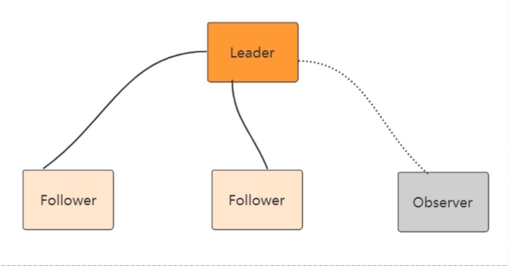

## Zookeeper 集群模式
Zookeeper 集群模式一共有三种类型的角色

**Leader**: 处理所有的事务请求(写请求)，可以处理读请求，集群中只能有一个Leader

**Follower**:只能处理读请求，同时作为 Leader的候选节点，即如果Leader宕机，Follower节点要参与到新的Leader选举中，有可能成为新的Leader节点。

**Observer**:只能处理读请求。不能参与选举



### Zookeeper集群模式安装
本例搭建的是伪集群模式，即一台机器上启动四个zookeeper实例组成集群，真正的集群模式无 非就是实例IP地址不同，搭建方法没有区别.

**Step1:配置JAVA环境，检验环境:保证是jdk7 及以上即可**

**Step2:下载并解压zookeeper，进入bin目录**

**Step3:重命名 zoo_sample.cfg文件**

`cp conf/zoo_sample.cfg conf/zoo‐1.cfg`

**Step4:修改配置文件zoo-1.cfg，原配置文件里有的，修改成下面的值，没有的则加上**

```
dataDir=/usr/local/data/zookeeper‐1
clientPort=2181
server.1=127.0.0.1:2001:3001:participant// participant 可以不用写，默认就是part icipant
server.2=127.0.0.1:2002:3002:participant
server.3=127.0.0.1:2003:3003:participant
server.4=127.0.0.1:2004:3004:observer

```
**配置说明**
- tickTime:用于配置Zookeeper中最小时间单位的长度，很多运行时的时间间隔都是 使用tickTime的倍数来表示的。
- nitLimit:该参数用于配置Leader服务器等待Follower启动，并完成数据同步的时 间。Follower服务器再启动过程中，会与Leader建立连接并完成数据的同步，从而确定自己对外提供服务的起始状态。Leader服务器允许Follower再initLimit 时间内完成这个工作。
- syncLimit:Leader 与Follower心跳检测的最大延时时间
- dataDir:顾名思义就是 Zookeeper 保存数据的目录，默认情况下，Zookeeper 将 写数据的日志文件也保存在这个目录里。
- clientPort:这个端口就是客户端连接 Zookeeper 服务器的端口，Zookeeper 会监听这个端口，接受客户端的访问请求。
- server.A=B:C:D:E 其中 A 是一个数字，表示这个是第几号服务器;B 是这个服 务器的 ip 地址;C 表示的是这个服务器与集群中的 Leader 服务器交换信息的端口;D 表示的是万一集群中的 Leader 服务器挂了，需要一个端口来重新进行选举，选出一个新 的 Leader，而这个端口就是用来执行选举时服务器相互通信的端口。如果是伪集群的配 置方式，由于 B 都是一样，所以不同的 Zookeeper 实例通信端口号不能一样，所以要给 它们分配不同的端口号。如果需要通过添加不参与集群选举以及事务请求的过半机制的 Observer节点，可以在E的位置，添加observer标识。

**Step4:再从zoo-1.cfg复制三个配置文件zoo-2.cfg，zoo-3.cfg和zoo-4.cfg，只需修改 dataDir和clientPort不同即可**

例如：
```
dataDir=/usr/local/data/zookeeper2
```

**Step5:标识Server ID**
创建四个文件夹/usr/local/data/zookeeper-1，/usr/local/data/zookeeper- 2，/usr/local/data/zookeeper-3，/usr/local/data/zookeeper-4，在每个目录中创建文件 myid 文件，写入当前实例的server id，即1，2，3，4
```
cd /usr/local/data/zookeeper‐1
vim myid
1

cd /usr/local/data/zookeeper‐2
vim myid
2

cd /usr/local/data/zookeeper‐3
vim myid
3

cd /usr/local/data/zookeeper‐4
vim myid
4
```
**Step6:启动三个zookeeper实例**

```
bin/zkServer.shstartconf/zoo1.cfg

bin/zkServer.shstartconf/zoo2.cfg

bin/zkServer.shstartconf/zoo3.cfg
```

**Step7:检测集群状态，也可以直接用命令 zkServer.sh status conf/zoo1.cfg 进行每台服务 的状态查询**

**客户端连接**
`bin/zkCli.sh ‐server ip1:port1,ip2:port2,ip3:port3`
可以通过 查看/zookeeper/config 节点数据来查看集群配置

### Zookeeper 3.5.0 新特性: 集群动态配置
Zookeeper 3.5.0 以前，Zookeeper集群角色要发生改变的话，只能通过停掉所有的 Zookeeper服务，修改集群配置，重启服务来完成，这样集群服务将有一段不可用的状态，为了 应对高可用需求，Zookeeper 3.5.0 提供了支持动态扩容/缩容的 新特性。但是通过客户端API 可以变更服务端集群状态是件很危险的事情，所以在zookeeper 3.5.3 版本要用动态配置，需要 开启超级管理员身份验证模式 ACLs。如果是在一个安全的环境也可以通过配置 系统参数 - Dzookeeper.skipACL=yes 来避免配置维护acl 权限配置。


